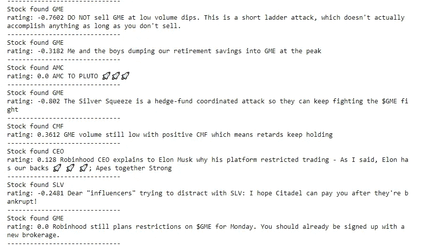

# (揭秘)金融中的情绪分析

> 原文：<https://medium.datadriveninvestor.com/sentiment-analysis-in-finance-a4b3016a9fc0?source=collection_archive---------5----------------------->

Photo by [Dimitry Anikin](https://unsplash.com/@anikinearthwalker?utm_source=medium&utm_medium=referral) on [Unsplash](https://unsplash.com?utm_source=medium&utm_medium=referral)

(2021 年 2 月 1 日更新—使用 r/Walltreetbets 添加了完整的 Reddit/nltk 示例—见底部—包括一些现实生活中的示例—但如果您只需要查看结果，请前往 [*Reddit 分析*](https://lamatuk.medium.com/reddit-analysis-b42c8cbaf4f3) )

(更新于 2021 年 1 月 29 日——在 [Reddit 用户宣布胜利后，130 亿美元的对冲基金投降了..](https://www.independent.co.uk/news/business/gamestop-share-price-reddit-hedge-fund-melvin-capital-b1793543.html))我增加了一个**假阴性**的例子——见下面最后一个合作笔记本——使用现成代码时要小心！

在这篇博客中，我解释了金融中情绪分析(另一种人工智能技术)的基础，但我也强调了它的一些问题。

和以前的帖子一样，我是用 jupyter 写的(应该可以作为 google 的合作工具)，这样任何人都可以复制它。

# 金融中的情感分析

人工智能在金融领域的一个被大肆宣传的应用来自于情绪分析的应用，它是预测证券未来价格的一个因素。

下面我将解释在金融环境中使用它的一些基本知识和注意事项。

情感分析可以定义为:

> *"* 情感分析或观点挖掘是自然语言处理领域的一个活跃研究领域，它通过文本中主观性的**计算处理**来分析人们的观点、情感、评估、态度和情绪。

*对它的简单介绍可以在[“量化交易者如何利用情绪在市场上获得优势”](https://www.forbes.com/sites/kumesharoomoogan/2015/08/06/how-quant-traders-use-sentiment-to-get-an-edge-on-the-market/#5a38018d4b5d)中找到，详细解释这一过程的典型学术论文是[“推特情绪预测股票市场。”](https://arxiv.org/pdf/1010.3003.pdf)和[“使用 Twitter 情绪分析的股票预测”](http://cs229.stanford.edu/proj2011/GoelMittal-StockMarketPredictionUsingTwitterSentimentAnalysis.pdf)。*

*(2021 年 1 月 29 日更新——情绪分析正被用于监控 Reddit 频道:[对冲基金争相抢占零售留言板](https://www.ft.com/content/04477ee8-0af2-4f0f-a331-2987444892c3)。如果你对这种特殊情况感兴趣，我推荐你阅读使用 python 的 [Scraping Reddit](https://medium.com/swlh/scraping-reddit-using-python-57e61e322486)*

*基本想法如下:*

*   *将一个管道文本来源(新闻、推特、帖子)转换成一个或多个**量化**(数值)值，*
*   *将上述值输入到一个复杂的模型(经典计量经济学或新开发的神经网络)中，作为预测证券价格的输入。*

*如果你打开其中一篇学术论文，你可能会被术语淹没，但现在像彭博这样的大公司和 RavenPack 这样的新公司已经赶上了潮流，现在提供情绪分析指数作为实用工具:[“你如何通过交易新闻情绪数据获得优势”](https://www.bloomberg.com/professional/blog/can-get-edge-trading-news-sentiment-data/)和[“异常媒体关注影响股票回报”](https://www.ravenpack.com/research/abnormal-media-attention-impacts-stock-returns/)。*

*正如在以前的帖子中，一方面我更喜欢以 jupyter 笔记本的形式制作[可重复的研究](https://en.wikipedia.org/wiki/Reproducibility#Reproducible_research)，实际运行(而不是 pdf 文件，如上面的链接)，但在这种情况下，复杂性是如此之大，我将只说明基本概念。*

*让我们从下载一个 python 现成的情感分析器开始([“VADER:一个基于规则的社交媒体文本情感分析的简约模型”](https://pdfs.semanticscholar.org/a6e4/a2532510369b8f55c68f049ff11a892fefeb.pdf))。*

*(在下面附上的合作脚本中继续)*

*(更新于 2021 年 1 月 29 日——在 130 亿美元的对冲基金投降后，Reddit 用户宣告胜利..)我增加了一个**假阴性**的例子——见下文，使用现成代码时要小心！*

*(2021 年 1 月 1 日更新——我决定在代码中添加一个 Reddit scrapper，以展示如何使用它来提取子编辑中正在讨论的股票。请注意默认的情绪分析器是多么的无用——它是为电影评论而构建的——但是令人惊讶的是命名实体识别非常有用。在写这篇文章的时候，你可以看到哪些股票是流行的，以及一些误报——例如，首席执行官 YOLO，持有——)*

**

*nltk applied to Reddit*

*找到下面几乎准备好的代码(你需要按照 [*指令*](https://medium.com/swlh/scraping-reddit-using-python-57e61e322486) 来创建你自己的 Reddit 用户名和 API 密钥)*