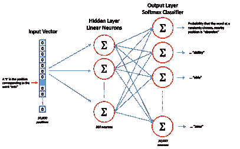
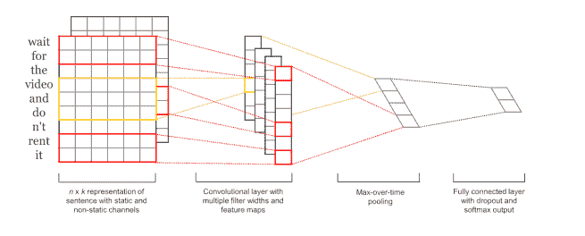
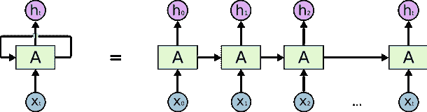
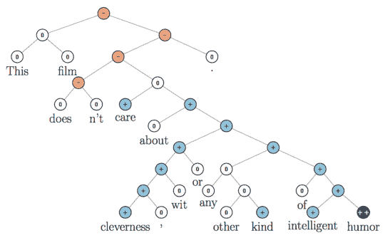

# 情感分析:机器学习方法

> 原文：<https://medium.datadriveninvestor.com/sentiment-analysis-machine-learning-approach-83e4ba38b57?source=collection_archive---------1----------------------->

## 第二篇[博文](http://tech.reputation.com/sentiment-analysis-machine-learning/)发表在我的 Reputation.com 数据科学项目上

继我之前的帖子之后，由于[基于频率的模型](https://medium.com/@samuelpilcer/sentiment-analysis-frequency-based-models-288c0accdd12)不是很准确，并且一个好的基于规则的模型很难阐述，我们实现了我们所知的对短句进行情感分析的最先进的方法，并列出这些方法的优缺点。我们在一个 10000 句的数据集上训练他们。人类专家将这些句子分为阳性、中性和阴性。我们在 500 个句子的样本上对模型进行基准测试。

# 向量空间中的单词表示

## 特征抽出

为了建立一个用于情感分析的深度学习模型，我们首先必须在向量空间中表示我们的句子。我们在之前的文章中研究了[基于频率的方法](http://tech.reputation.com/sentiment-mining-frequency-based-models)。它们或者通过一个*单词包*来表示一个句子，单词包是出现在句子中的单词及其频率的列表，或者通过一个*术语频率—逆文档频率* ( *tf-idf* )向量来表示一个句子，其中句子中的单词频率用它们在整个语料库中的频率来加权。

这些方法对于长文本非常有用。例如，我们可以用最常用的词非常精确地描述一篇报纸文章或一本书。然而，对于非常短的句子，它一点也不准确。一是因为 10 个字不够聚合。还因为句子的结构对分析情感非常重要，而 *tf-idf* 模型很难捕捉否定、扩大和让步。例如，“非常好的食物，但对服务来说是坏的…”和“对食物来说是坏的，但对服务来说是非常好的！”。

## 词向量

我们用向量来表示我们的句子，向量考虑了出现的单词和语义结构。第一种方法是用一个 *n* 特征向量来表示每个单词，用一个*n *长度*矩阵来表示我们的句子。例如，我们可以构建一个与词汇表大小相同的向量(例如 10.000)，并在第 *i* 位置用 1 表示第 *i* 个单词，在其他位置用 0 表示。

Tomas Mikolov 开发了另一种在向量空间中表示单词的方法[，具有捕捉语义组合的特征](https://arxiv.org/pdf/1310.4546.pdf)。他在一个非常大的语料库上训练以下神经网络:

Skip-gram model, used to find a relevant word embedding

他训练这个模型，用隐层的输出向量来表示“蚂蚁”这个词。我们获得的这些*单词向量*的特征捕获了大部分语义信息，因为它捕获了足够的信息来评估句子中“ants”之后的单词的统计再分配。

我们做的也差不多。我们用一个索引向量来表示每个单词。我们在深度学习模型中集成了一个隐藏的线性神经元层，可以将这些大向量转换为小得多的向量。我们将这些较小的向量作为卷积神经网络的输入。我们将模型作为一个整体来训练，因此我们使用的*单词向量*被训练成适合单词的*情感信息*，即，因此我们获得的特征捕捉了关于单词的足够信息来预测句子的情感。

# 句子表征

## Doc2vec

我们希望构建一个句子的表示，不仅要考虑出现的单词，还要考虑句子的语义结构。最简单的方法是将这些*单词向量*叠加起来，构建一个代表句子的矩阵。还有另一种方法，也是由 Tomas Mikolov 开发的，通常被称为 Doc2Vec。

他修改了我们用于 Word2Vec 的神经网络，并将之前的*单词向量*和一个取决于它们所在句子的向量作为输入。我们将把这个单词向量的特征作为我们的模型的参数，并且使用梯度下降来优化它们。这样，我们将为每一个句子建立一套代表句子结构的特征。这些特征捕获了关于单词如何彼此跟随的大部分有用信息。

***对于情绪分析的利弊***

这些*文档向量*对我们非常有用，因为可以从这些*语义特征*中非常精确地推断出一个句子的情感。事实上，用户用正面或负面的观点写评论，会有完全不同的写法。已知将这些向量输入逻辑回归并训练回归来预测情感是情感分析的最佳方法之一，对于细粒度(非常负面/负面/中性/正面/非常正面)和更一般的负面/正面分类都是如此。

我们实现了这样一种方法，并对其进行了基准测试，但我们选择不将其生产化。事实上，构建一个句子的*文档向量*并不是一个容易的操作。对于每一句话，我们必须运行梯度下降，以便找到这个向量的正确系数。与我们用于情感分析的其他方法相比，其中预处理是非常短的算法(大约几毫秒)并且评估几乎是即时的，Doc2Vec 分类需要大量的硬件投资和/或需要长得多的处理时间。在迈出这一步之前，我们决定探索用一个*单词向量*矩阵来表示我们的句子，并使用深度学习模型来对情感进行分类。

## 卷积神经网络

***卷积神经网络***

我们探索的用于情感分类的下一种方法使用多层神经网络，该多层神经网络具有卷积层、具有 sigmoid 激活函数的多个密集神经元层以及旨在防止过度拟合的附加层。我们在上一篇文章中解释了卷积层的工作原理。这是一项为 [*计算机视觉*](http://papers.nips.cc/paper/4824-imagenet-classification-with-deep-convolutional-neural-networks.pdf) 设计的技术，它提高了大多数图像分类和[对象检测模型](http://yann.lecun.com/exdb/publis/pdf/lecun-04.pdf)的准确性。

其思想是用一组滤波器对图像进行卷积，并把它产生的新图像作为下一层的输入。根据我们应用的过滤器，输出图像将捕捉边缘，或平滑它，或锐化关键模式。训练过滤器的系数将有助于我们的模型构建极其相关的特征，以便为下一层提供信息。这些功能就像学习组合性的本地补丁。在训练过程中，它会根据我们想要解决的分类问题自动学习最佳补丁。它学习的特征将是位置不变的。它将以完全相同的方式卷积位于框架底部的对象和位于框架顶部的对象。这不仅是对象检测的关键，也是情感分析的关键。

Convolution used for edge detection

***自然语言处理中的应用***

随着这些模型在计算机视觉领域越来越受欢迎，很多人试图将它们应用到其他领域。他们在 [*语音识别*](http://www.isca-speech.org/archive/interspeech_2015/papers/i15_1478.pdf) 和 [*自然语言处理*](https://arxiv.org/pdf/1408.5882.pdf) 中取得了显著的好成绩。在语音识别中，技巧是为每个时间戳建立信号的频率强度分布，并卷积这些图像。

对于像情感分析这样的自然语言处理任务，我们做一些非常相似的事情。我们构建单词向量，并对通过并置这些向量构建的图像进行卷积，以构建相关特征。

直观地说，过滤器将使我们能够突出那些非常积极或非常消极的单词。它们将使我们能够理解否定和接下来的事情之间的关系，以及诸如此类的事情。它将捕获单词如何相互跟随的相关信息。它还会学习带有情感信息的特定单词或 n-grams。然后，我们向完全连接的深度神经网络输入这些卷积的输出。它选择这些特征中的最佳特征来对句子的情感进行分类。我们的数据集上的结果非常好。

Convolutional Neural Network (CNN) for sentiment analysis

## LSTM

我们还研究，实施和基准长短期记忆递归神经网络模型。它有一个非常有趣的架构来处理自然语言。它的工作原理和我们完全一样。它从第一个单词读到最后一个单词。它试图计算出每一步之后的情绪。例如，对于句子“食物糟透了，酒更糟。”。它会读“the”，然后是“food”，然后是“sucks”，“The”和“wine”。它将记住一个表示之前内容的向量(内存)和一个部分输出。例如，它会在句子进行到一半时就认为这个句子是否定的。然后，当它处理更多数据时，它将继续更新。

Long short-term memory (LSTM) networks

这是一般的想法，但是这些网络的实现要复杂得多，因为记住最近的信息很容易，但是很难有一个模型[捕捉大多数有用的长期相关性](http://colah.github.io/posts/2015-08-Understanding-LSTMs/)同时避免与[消失梯度](https://arxiv.org/pdf/1211.5063.pdf)相关的问题。

这个 RNN 结构看起来非常适合情感分析任务。它在语音识别和翻译方面表现良好。然而，它大大降低了评估过程的速度，并且在我们的应用中并没有提高太多的精度，因此应该小心实施。

## 情感树- RNTN 模型

Richard Socher 等人在论文[*中描述了情感树库*](https://nlp.stanford.edu/~socherr/EMNLP2013_RNTN.pdf) 上语义合成的递归深度模型，这是另一种很酷的情感分析方法。他说每个词都有感情的含义。句子的结构应该使我们能够组合这些情感，以便获得句子的整体情感。

Sentiment trees

他们实现了一个叫做 RNTN 的模型。它通过向量来表示单词，并采用一类基于张量乘法的数学函数来描述复合性。斯坦福有一个非常大的电影评论库，被他们的 NLP 图书馆转化成树。每个节点由人类注释者从非常负面到非常正面分类。他们在这个语料库上训练了 RNTN 模型，得到了很好的结果。不幸的是，他们在 IMDB 电影评论数据上训练它。但它在我们的评论中表现不佳。

这种模型的一大优点是它非常具有可解释性。我们可以非常精确地理解它是如何工作的。我们可以想象它检测到哪些单词是积极的或消极的，以及它是如何理解这些成分的。然而，我们需要为每个特定的应用程序建立一个非常大的训练集(大约 10，000 个句子，每个节点上都有细粒度的注释)。随着我们继续收集越来越详细的训练数据，这只是我们正在探索的模型类型之一，以继续改进我们在生产中的情感模型！

# 来自 DDI 的相关帖子:

 [## 用 7 个步骤解释深度学习——数据驱动投资者

### 在深度学习的帮助下，自动驾驶汽车、Alexa、医学成像-小工具正在我们周围变得超级智能…

www.datadriveninvestor.com](https://www.datadriveninvestor.com/2019/01/23/deep-learning-explained-in-7-steps/)  [## 数据科学和软件工程哪个更有前途？-数据驱动型投资者

### 大约一个月前，当我坐在咖啡馆里为一个客户开发网站时，我发现了这个女人…

www.datadriveninvestor.com](https://www.datadriveninvestor.com/2019/01/23/which-is-more-promising-data-science-or-software-engineering/)