# 客户推文情感分析(NLP)

> 原文：<https://medium.datadriveninvestor.com/sentiment-analysis-on-customer-tweets-nlp-c0eeaeffd19a?source=collection_archive---------1----------------------->

pic 0 : text analysis

学习数据科学/ML 的最好方法是重做已经做过的事情。因为这是我在 NLP 的第一篇文章，我将重做我自己的工作。实际上，这是我在硕士时做的作业。

我将使用航空公司客户评论的数据集。它由一组不到 1.5 万条关于美国航空服务的推文组成。根据相应的推文对航空公司有利、不利还是都不利，数据集被手动标记为“正面”、“负面”或“中性”。([获取数据集](https://www.google.com/url?q=https://drive.google.com/uc?authuser%3D0%26id%3D12fnaUHFLv4fucEhFhLy1Br7y9ws58KUt%26export%3Ddownload&sa=D&source=hangouts&ust=1546686485131000&usg=AFQjCNF1eDXEr7JNNLWmaGVeJMSgPOpOIw))

我写作的总体目的是训练一个模型，该模型可用于将航空服务相关的推文自动分类为 3 类。

***编程语言:Python，IDE:Anaconda Navigator with Jupyter。***

*让我们了解一下我们计划要做的高级功能，*

1.  *上传数据到熊猫*
2.  *清理数据。*
3.  *从数据中构建单词的标记化列表。*
4.  删除停用词，精简词干，删除频率较低的词(异常值)
5.  特征抽出
6.  *使用特征提取算法词袋(计数矢量器)应用逻辑回归模型*
7.  *使用特征提取算法 TfidfVectorizer 应用逻辑回归模型。(稍后)*
8.  *对比上面各个模型的输出。(稍后)*
9.  将 SVM(支持向量机预测器)应用于*单词包(计数向量器),并将输出与上面的第 6 项进行比较。(后来)*
10.  将 SVM(支持向量机预测器)应用于 n-grams 模型的*包，并将输出与上面的 No7 进行比较。(稍后)*

***上传数据到熊猫***

打开 Jupyter 笔记本；找出当前的工作目录。

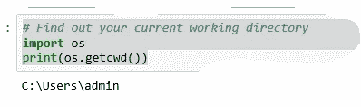

pic 1

运行该插槽，在我的机器上，输出显示为“C:\Users\admin”。现在将 Airline_tweets.csv 文件放入该位置。

让我们把 CSV 装进熊猫。如果我们还没有导入这个包，我们需要导入它。read_csv 函数用于加载数据。在这种情况下，默认情况下，第一行作为标题。

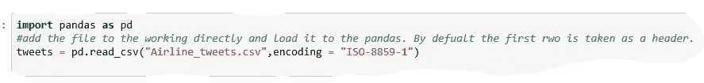

pic 2

如果到目前为止一切顺利，我们已经将 CSV 文件加载到 panda 对象中。让我们快速查看一下我们创建的 *tweets* 对象的摘要。首先，我们使用 *head* 函数来查看前几行。

情感栏将代表标签。推文栏将代表客户评论/推文。

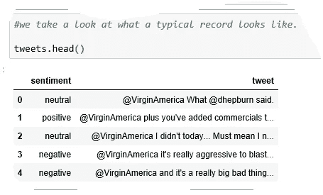

pic 3

如上所述，数据是字符串形式的。感情一栏只有一个字。这种理解对于未来的分析问题至关重要。

我们可以使用 info()函数来查看统计数据的摘要。

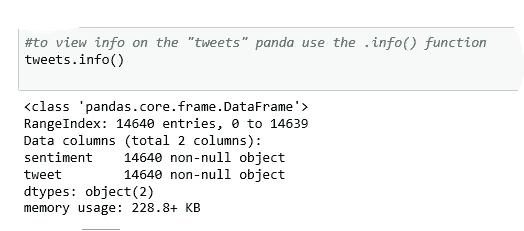

pic 4

根据输出，我们可以说工作表有 14640 行。另外，请注意， *tweets* 对象是数据帧类型*。*

我们需要知道是否真的有三种情绪。我们最初被告知如此，但值得一看。我将使用集合包中的*计数器*函数来验证这一点。

如下图，负面推文 9000+条，中性 3000+条，正面 2000+条。

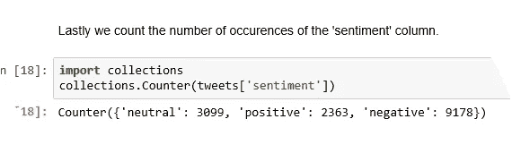

pic 5

**清理数据**

现在我们对这个数据集的完整性有了一定的信心，让我们在构建模型之前先来看看我们实际在做什么。

首先，我们需要清理 Tweets 列中的数据。清理数据分许多步骤完成；

1.  最初，我们需要分析推文，并删除所有非字符。使用非字符符号会给我们构建的模型带来无效的输入。
2.  删除停用词。停用词在任何语言中都很常见。这些词没有任何意义。根据维基，停用词被称为“在自然语言处理中，无用的**词**(数据)，被称为**停用词**。**停用词**:停用词**是一个常用的**词**(例如“the”、“A”、“an”、“in”)，搜索引擎在对搜索条目进行索引时以及在作为搜索查询的结果检索它们时，都会将其忽略**
3.  **液化和堵塞；(我稍后会解释)如果你熟悉这些概念，你会注意到句子不能被词干化或词尾化。我们需要一组标记化的单词来处理这个问题。**
4.  **删除频率较低的单词。**

**现在让我们开始从推文中删除提及、标点和网址。为此，我们需要导入 regex 包。此外，我们将使用在*字符串*类中可用的标点符号。**

**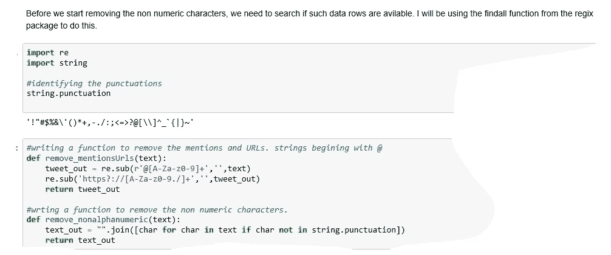**

**pic 6**

**(在图 6 中)我创建了一个名为“remove _ mentionsUrls”的函数，使用 regex 函数删除提及和 URL。接下来，创建另一个函数，使用 String 类中的标点符号删除非字母数字字符。**

**下面，我将上述两个函数的输出分配到数据框的两个新列中。通过查看输出(最右边的角落),您可以看到提及和标点符号都不见了。**

**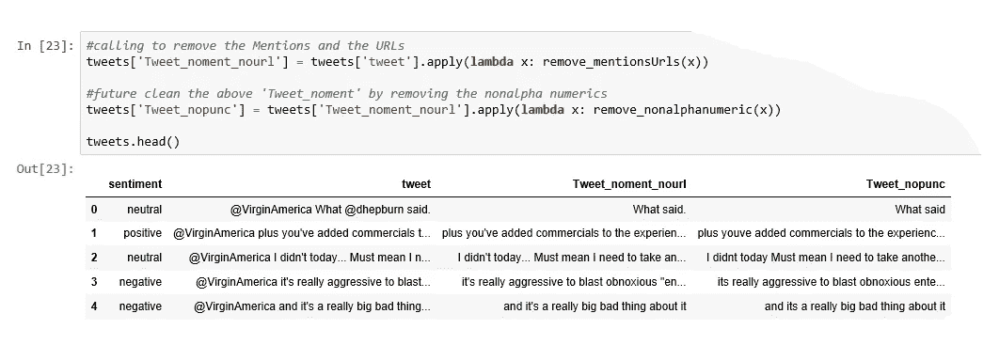**

**pic 7**

*****虚化*****

**我们还没有把句子分词。根据 wiki 的说法，**记号化是**将一系列字符串分解成单词、关键词、短语、符号和其他称为记号的元素的行为。**

**稍后，你会明白什么是记号化的重要性，基本上当我们使用 NLP 时，每个单词都需要包含一个数字表达式。我们建立的模型基本上都是数字模型，每个模型都需要一个数字输入。无论如何，请注意，标记化本身并不会将数字表示分配给单词，但这只是第一步。**

**我将计划写一个函数，使用空格分割句子，这样最终的结果将是一组单词。**

**白色棕色狐狸= '白色'，'棕色'，'狐狸'**

**下面的图 8 将显示我已经使用了正则表达式中的 split 函数来使用空格分割文本。split 方法解析一个**字符串**并返回一个令牌数组。同时，文本在传递之前被转换成小写。最后，看看 tweets DF 中的“Tweet_tokans”栏，它现在有单独的单词了。**

**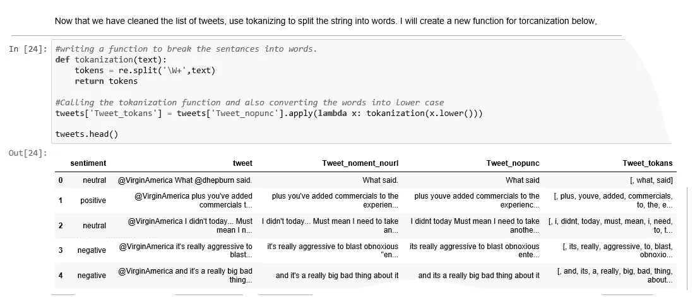**

**pic 8**

****词干****

**接下来，让我们关注词干。为什么？为了获得更准确的预测，我们需要减少唯一单词的数量。**

**词干分析基本上是一种将相似的词归为一类的算法。根据维基的词干是这样的:*“一个对 stem cat 进行英文操作的词干分析器应该将这样的* [*字符串*](https://en.wikipedia.org/wiki/String_literal) *识别为 cats、catlike 和 caty。词干算法还可以将单词 fishing、fished 和 fished 简化为词干鱼。然而，词干不一定是一个词。在波特算法中，争论，争论，争论，争论，argus 简化为 stem argu。”***

**我已经使用了波特词干分析器，如下图 9 所示。输入必须是一组单词。由于我们在上面创建了一组单词，我将把“tweets['Tweet_tokans']”传递给函数。**

**根据打印的数据，您将看到第 3 行中有一个字母为“realli”的单词。如果你与图 8 比较，它实际上是“真的”这个词被转换成了“realli”。好吧，这就是波特酒的缺点。它没有抓住这个词的意思。**

**因此，我决定尝试 lemmatizing 以及。考虑到我们这里有限的数据集，我认为无论我们选择哪种方法，模型的准确性都不会有太大的差异。无论如何，让我们稍后在比较来自两个输出的唯一字的数量之后决定。**

**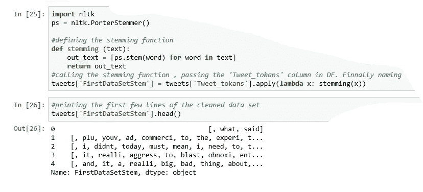**

**pic 9**

****词汇化****

**根据维基的说法，*词条释义与* [*词干*](https://en.wikipedia.org/wiki/Stemming) *密切相关。区别在于词干分析器在不知道上下文的情况下对单个单词进行操作，因此无法根据词性区分具有不同含义的单词。“better”这个词的引理是“good”。这一环节被词干遗漏了，因为它需要查字典。如果你能离线阅读这两个，那是最好的，因为我不会在这里深入细节。***

**如上所述，我将创建一个函数来使单词词条化。同上，输入将是单词集。(tweets['Tweet_tokans'])(图 10)如果你检查这个输出中的第 3 行，我们清楚地看到这个单词的含义也保持不变。**

**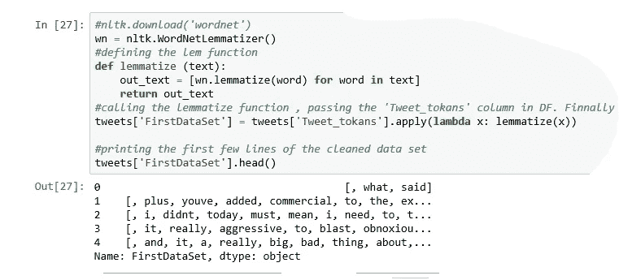**

**pic 10**

**我已经将这组单词保存为 tweets['FirstDataSet']。**

**让我们比较一下推文['FirstDataSet']和推文['FirstDataSetStem']中的独特词的数量。这将使我们知道什么是实际上最好的方法，因为唯一单词的数量越少，准确性越高。**

**如下面的图 11 所示，我将使用 list 函数创建一个简单的单词列表。然后计算每组的唯一单词。**

**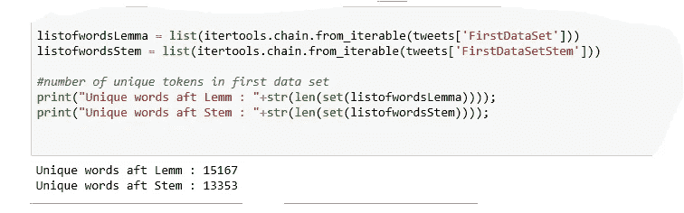**

**pic 11**

**令人惊讶的是，带词干的版本得到的单词数量更少。因此，我将不得不继续使用 tweets['FirstDataSetStem']数据集。**

****停止字****

**接下来，我们需要删除停用词。如上所述，停用词在单独使用时实际上并不包含任何意义。因为这将对唯一单词的数量产生影响，所以最好删除所有停用的单词。**

**让我们写一个函数来删除停用词。首先，我们需要导入所有的停用词，正如我在下面的图 12 中所做的那样。然后函数 *remove_Stopwords* 将检查每个单词，如果它与一个停止字匹配，它将被删除。**

**最后，我用输出创建了一个名为“SecondDataSet”的新数据集。如果您将输出与上面的图像进行比较，您会注意到像“the”、“to”这样的词被删除了。**

**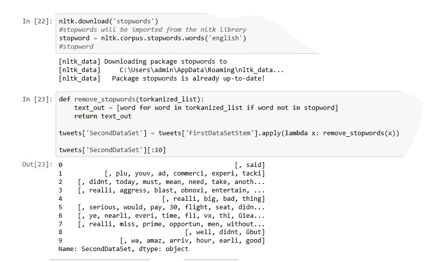**

**pic 12**

**现在，让我们检查一下唯一单词的数量是否减少了。理想情况下，必须有一些减少。看着图 13，似乎是这样的。**

**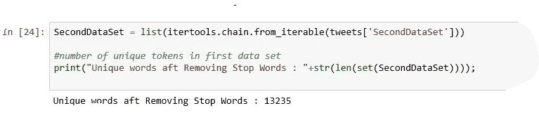**

**pic 13**

****删除频率较少的单词****

**接下来，我们将删除频率较低的单词。例如:如果列表中有一个名为“Maxmilan”的单词，并且它在所有推文中只重复了 3 次，那么这个单词不会对预测整个集合的输出产生重大影响。**

**所以让我们创建一个函数来删除不常用的单词；最初，我们需要将单词集放入一个平面列表中。(平面列表大概是这样的:' said '，' plu '，' youv '，' ad '，' commerci '，' experi '，' tacki '，''，' not '，' today '，)**

**准备好平面列表后，我使用 FreqDist 函数来计算单词的频率。然后使用过滤功能仅选择计数超过 5 且小于 2000 的单词。**

**如果这个词重复的次数不超过 5 次，我们就看不到这个词在预测模型中的价值。同样，当这个词被重复的次数比平常多的时候，它就没有主要的发言权。这基本上被称为离群值的去除。**

**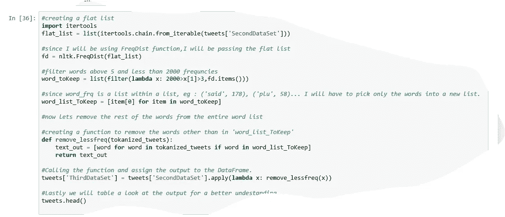**

**pic 14**

**最后，我将输出保存到数据框中作为“第三数据集”…**

**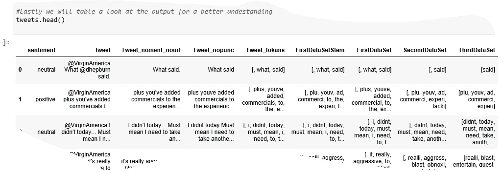**

**pic 15**

**让我们检查一下，与之前的计数相比，唯一单词的数量是否减少了。之前是 13235(图 13)。现在已经减到 2900 了。哪个数字适用于建模？**

**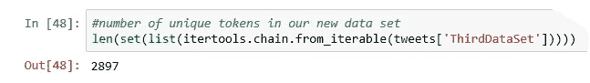**

**pic 15**

## **特征抽出**

**基本上，我们在 ML 中所做的是，输入 X 轴和 Y 轴，然后预测新的 X 数据的 Y。当将文本应用到 ML 算法中时，我们不能在文本格式中应用 X 和 Y 轴。现在你必须明白，我们所做的只是创建一个合适的 X 轴，并将其传递给算法。通常，Y 轴是目标变量，X 轴是源变量。**

**给定我们的示例，Y 轴是“情绪”列，X 轴是“第三数据集”。如前所述，ML 算法不理解文本。因此，我们需要将这组单词转换成数字形式。具体来说，数字的向量。有几种方法可以做到这一点。在这项研究中，我将使用一种叫做**单词袋的方法。**这个过程被称为特征提取。**

**理解弓的概念很重要。因此，我从网上复制了一个简单的解释。(原文可从这里查看[https://machine learning mastery . com/gentle-introduction-bag-words-model/](https://machinelearningmastery.com/gentle-introduction-bag-words-model/))**

> **下面是查尔斯·狄更斯的书《[双城记](https://www.gutenberg.org/ebooks/98)》的前几行文字片段，摘自古腾堡计划。**
> 
> ***这是最好的时代，
> 这是最坏的时代，
> 这是智慧的时代，
> 这是愚蠢的时代，***
> 
> **对于这个小例子，让我们把每一行看作一个单独的“文档”,而把这 4 行看作整个文档集。**
> 
> **这里唯一的单词(忽略大小写和标点)是:**
> 
> **“它”“是”“时代”“最坏”“时代”“智慧”“愚蠢”“最好的”**
> 
> **这是来自包含 24 个单词的语料库的 10 个单词的词汇表。**
> 
> **下一步是给每个文档中的单词打分。目标是将自由文本的每个文档转换成一个向量，我们可以使用它作为机器学习模型的输入或输出。**
> 
> **因为我们知道词汇表有 10 个单词，所以我们可以使用 10 的固定长度的文档表示，用向量中的一个位置来给每个单词打分。**
> 
> **最简单的评分方法是将单词的存在标记为布尔值，0 代表不存在，1 代表存在。使用我们的词汇表中上面列出的单词的任意顺序，我们可以遍历第一个文档(“*这是最好的时代*”)，并将其转换为二进制向量。**
> 
> **文档的评分如下所示:**
> 
> **" it " = 1 " was " = 1 " the " = 1 " best " = 1 " of " = 1 " times " = 1 " worst " = 0 " age " = 0 "智慧" = 0 "愚蠢" = 0**
> 
> **作为一个二进制向量，它看起来像这样:[1，1，1，1，1，0，0，0，0]**
> 
> **其他三个文档如下所示:**
> 
> **“这是最坏的时代”= [1，1，1，0，1，1，1，0，0，0]**
> 
> **“那是智慧的时代”= [1，1，1，0，1，0，0，1，1，0]**
> 
> **“那是愚蠢的时代”= [1，1，1，0，1，0，0，1，0，1，1]**

**从上面的摘录中你需要理解什么？现在，如果你已经明白我们在创建弓时需要传递两个数据源，这就足够了。从 1 开始的两组数据。独特的单词表 2。包含句子的语料库文档。**

**如图 16 所示，我首先使用 Set 函数创建了基于“ThirdDataSet”的唯一单词列表。接下来，我创建了一个函数，将标记化的文档转换成字符串文档列表。(我做了一些额外的事情，就是从单词列表中删除数字…理想情况下，这必须在清理阶段完成)这是因为反向量方法需要一个字符串列表，而不是令牌。**

**接下来，在创建两个输入之后，我打印了相同的内容供您参考。**

**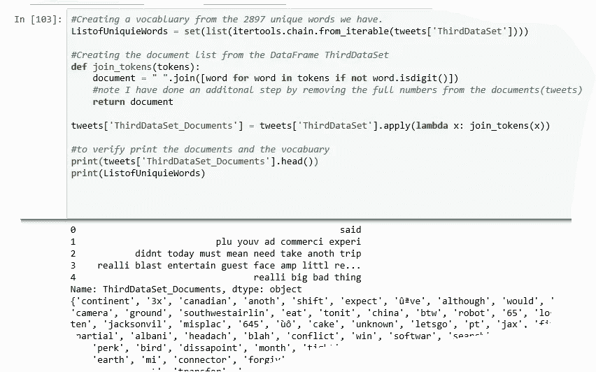**

**pic 16**

**接下来，我们将开始准备功能阵列。让我们导入反向量并使用上面创建的两个输入初始化数据帧。**

**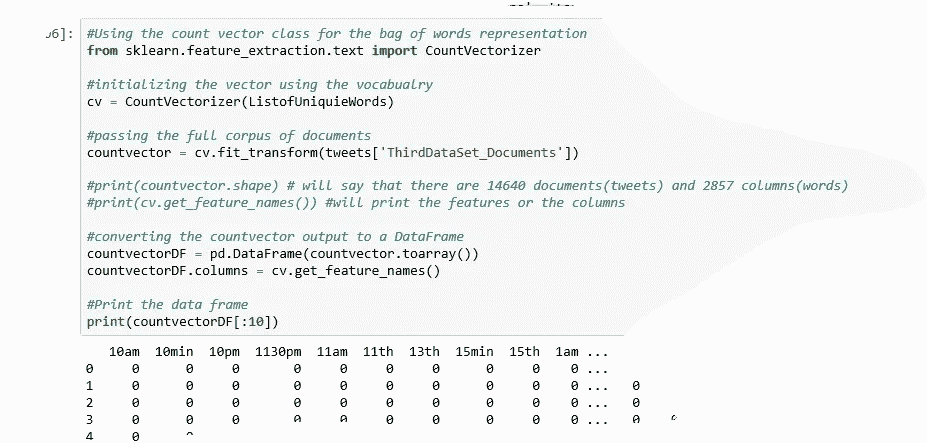**

**pic 17**

**当我使用 print(countvectorDF[:10])进行打印时，您可以看到这些特性被打印为列。(从我的角度来看，没有删除一些单词，比如 11 号、13 号等等，是一个错误..但是，我可以再次争辩说，它必须在那里…让我们继续进行，因为它是现在)行号是“文件”或句子列表，如果这个词是存在的，1 将被标记在前面。例:1 号文件只包含“赛义德”。**

## **模型结构**

**所以现在创建了特性列表。正如我上面提到的，我们正在为模型输入创建 X 轴和 Y 轴。到现在为止，我们已经创建了我们的 X；通常，自变量被认为是 X 轴。**

**我们的因变量或者 Y 轴是什么？嗯，就是前面提到的情感专栏。看看下面的 pic 18，这个就明白了。**

**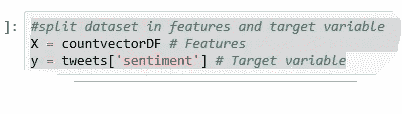**

**pic 18**

**x 和 Y 准备好了。接下来是什么？我们需要将数据分为训练数据和测试数据。要了解模型性能，将数据集分为定型集和测试集是一个好策略。让我们使用函数 train_test_split()分割数据集。您需要传递 3 个参数*特性、目标和测试集大小*。此外，您可以使用 random_state 随机选择记录。
test_set 配置为 20%**

**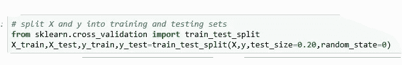**

**pic 19**

**接下来，导入逻辑回归模块，并使用 Logistic Regression()函数创建逻辑回归分类器对象。**

***逻辑回归是一种机器学习分类算法，用于预测分类因变量*的概率。在逻辑回归中，因变量是一个二元变量。换句话说，逻辑回归模型预测 P(Y=1)是 x 的函数。**

**如下所示，X 和 Y 的训练数据集被传递给模型进行训练。接下来，将特征的测试数据集传递到模型中，以获得预测的情感(y_pred)**

**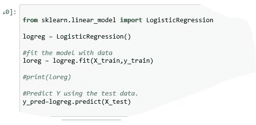**

**pic 20**

**接下来，我们将使用情绪的实际测试数据部分来查看预测的准确性。**

## **使用混淆矩阵的模型评估**

**混淆矩阵是用于评估分类模型性能的表格。您还可以使用它来可视化算法的性能。混淆矩阵的基本原理是正确和错误预测的数量按类别相加。**

**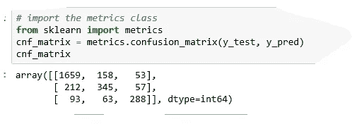**

**pic 21**

**如图所示，有 1659+345+288 个正确答案。同样有 147 + 43 + 51 + 196 + 77 + 62 的预测与实际相比是错误的。**

## **使用分类报告评估结果**

**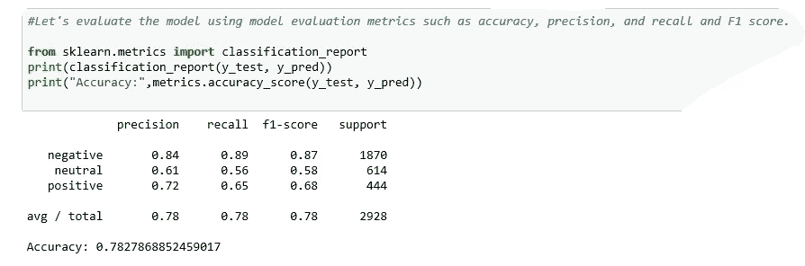**

**pic 22**

**解释:**准确性**，定义了与预测总数相比，正确的预测数。这里我们有 78%的准确率，这是公平的。
**精度**指的是实际正确的情感预测总数超过总预测情感。
**回忆**是，实际正确的情感预测总数超过正确预测的情感总数。**

**F-beta 分数可以解释为精确度和召回率的加权调和平均值，其中 F-beta 分数在 1 时达到其最佳值，在 0 时达到最差分数。**

**希望这是有用的，值得花时间…我将计划在以后的帖子中写下以下主题。**

1.  ***使用特征提取算法 TfidfVectorizer 应用逻辑回归模型。(稍后)***
2.  ***对比上面各个模型的输出。(稍后)***
3.  **将 SVM(支持向量机预测器)应用于*单词包(计数向量器),并将输出与上述第 6 项进行比较。(稍后)***
4.  **将 SVM(支持向量机预测器)应用于 n-grams 模型的*包，并将输出与上面的 No7 进行比较。(稍后)***