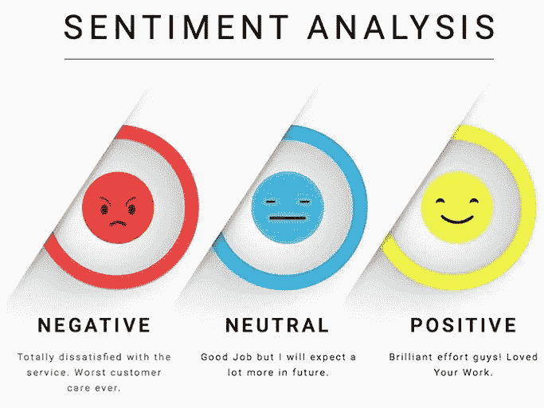
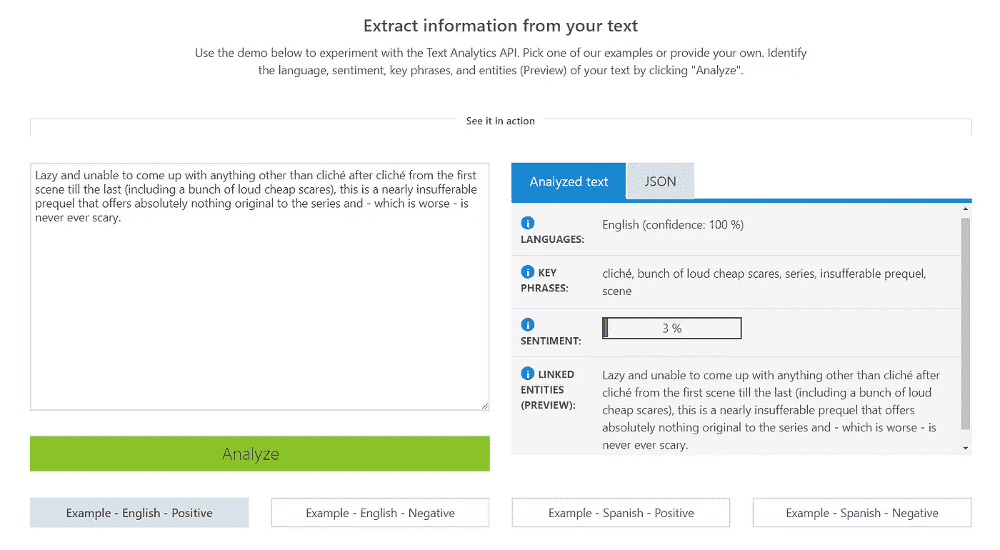
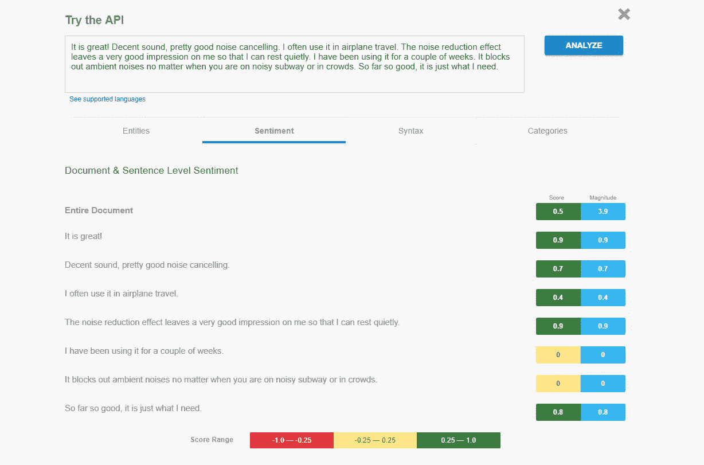

# 情感分析:类型、工具和用例

> 原文：<https://medium.datadriveninvestor.com/sentiment-analysis-types-tools-and-use-cases-f6c3fe8b7899?source=collection_archive---------3----------------------->

在购买价格超过一包口香糖的东西之前，你会怎么做？无论你是想犒劳自己，买一双新运动鞋、一台笔记本电脑，还是去海外旅游，在没有查看类似产品或报价以及阅读评论的情况下处理订单已经没有多大意义了。由于电子商务网站、社交网络、评论平台或专门论坛上的评论区，你可以了解大量关于产品或服务的信息，并评估它是否物有所值。其他客户，包括你的潜在客户，会做以上所有的事情。

人们与企业交往的愿望和整体品牌认知在很大程度上取决于公众舆论。根据讲台的[调查，93%的消费者说在线评论影响了他们的购买决定。用户一旦看了几个差评，可能就不会给你机会了。他们不会研究反馈是否是假的。他们会选择另一个选项。在这种情况下，不断监控其声誉的组织可以根据反馈及时解决问题并改进运营。情感分析允许在信息时代有效地测量人们对组织的态度。](http://learn.podium.com/rs/841-BRM-380/images/2017-SOOR-Infographic.jpg)

# 什么是情感分析

情感分析是一种文本研究，也称为挖掘。它应用统计学、自然语言处理(NLP)和[机器学习](https://www.altexsoft.com/machine-learning/?utm_source=MediumCom&utm_medium=referral)的组合来从文本文件中识别和提取主观信息，例如，评论者对特定主题、事件或公司及其活动的感觉、想法、判断或评估，如上所述。这种分析类型也被称为*意见挖掘*(侧重于提取)或情感评级。一些专家也使用术语 *情感分类*和*提取*。不管名称如何，情感分析的目标是相同的:通过分析来自各种来源的大量文本来了解用户或观众对目标对象的看法。

您可以在不同的细节层次上分析文本，细节层次取决于您的目标。例如，您可以定义一组评论的平均情绪基调，以了解喜欢您的新服装系列的客户比例。如果你需要知道访客喜欢或不喜欢某件衣服的什么，为什么，或者他们是否将它与其他品牌的类似产品进行比较，你需要分析每个评论句子，重点关注特定方面和用途或特定关键词。

根据规模，可以使用两种分析类型:粗粒度和细粒度。粗粒度分析允许在文档或句子级别上定义情感。通过精细的分析，你可以在每个句子部分提取一种情感。

## 粗粒度情感分析:分析整个帖子/评论或句子

这种分析类型是在文档和句子级别上完成的。事实上，大多数专家用它来分析句子，而不是整个文档。粗粒度 SA 需要两个连贯的任务:主观性分类和情感检测和分类。

**1。**主观性**分类。首先，需要确定一个句子是客观的还是主观的。一个客观句包含一些关于一个物体或话题的事实:*三个陌生人在出生时是同卵三胞胎，出生时被分开，并被三个不同的家庭收养后，因惊人的巧合而重聚。***

主观句，顾名思义，表达某人对某个主题的态度:*这个公寓太棒了。我享受在这里度过的每一分钟。*

**2。情感检测和分类。该操作的目标是定义一个句子是否有情感，如果有，则确定该情感是积极的、消极的还是中性的。**

*Sentiment by polarity. Source:* [*KDnuggets*](https://www.kdnuggets.com/2018/03/5-things-sentiment-analysis-classification.html)

有时人们不带感情地分享他们的观点。例如，句子的作者*我认为每个人都应该有第二次机会*表达他们的主观意见。然而，很难理解作者对每个人的真实感受。所以，这个句子不表达感情，是中性的。**中性的**句子——缺乏情感的句子——属于一个独立的类别，不应该被认为是介于两者之间的。

我们来看看这个评论:*年度最惊喜最满意的电影之一。*根据片语，影评人喜欢这部电影，所以这句话包含了一种**积极的**情绪。

下面的评论是一个带有负面情绪的主观句子的明显例子:*事实上，它也是笨拙地制作的，充斥着平庸的表演，这似乎与这件事首先是多么毫无意义的背景无关。*

然而，客观句也可以表达一种情绪:*我买了这个防水相机套，因为它比标准相机套更可靠。从上下文中可以清楚地看出，这个案例不是这个人所期望的。这句话带有否定的情绪，但它含蓄地表达了**。***

**情绪不依赖于主观或客观，这会使分析变得复杂。但是我们仍然需要区分表达情绪、评价或态度的句子和不包含它们的句子，以从反馈数据中获得有价值的见解。**

## **细粒度情感分析:按部分分析句子**

**俗话说，细节决定成败。如果需要更精确的结果，可以使用细粒度分析。**

**您在子句子级别上应用细粒度分析，这意味着识别情感的目标(主题)。一个句子被分解成短语或从句，每个部分都要联系其他部分来分析。简单地说，你可以确定谁在谈论一个产品，以及一个人在他们的反馈中到底谈论了什么。此外，它有助于理解为什么作家以某种方式评价它。**

**这种精细的分析非常有用，例如，处理比较性的表达(例如，*三星比 iPhone* 好得多)或简短的社交媒体帖子。**

**它不仅可以让你了解人们如何评价你的产品或服务，还可以确定他们讨论的是哪个功能或方面:*我的笔记本电脑上的一个* ***触摸板*** *在使用 4 个月后停止工作。通过这种方式，你可以确切地知道哪些地方需要改进或重新考虑。***

**定义情感强度的能力是细粒度分析的另一个优势。除了三种情绪得分(负面、中性和正面)，您还可以使用*非常正面*和*非常负面*类别。**

# **如何进行情感分析:方法和工具**

**情绪分析允许你从客户的角度来看待你的经营。但是，如何从用户生成的数据中提取这些知识呢？**

****资料收集和准备。**首先，你需要在一份文件中收集所有相关的品牌提及。考虑选择标准——这些提及是否应该有时间限制，只使用一种语言，来自一个特定的地方，等等。然后，必须为分析准备数据:必须阅读数据，删除所有非文本内容，纠正语法错误或打字错误，排除所有不相关的内容，如关于评论者的信息等。一旦我们准备好数据，我们就可以分析它并从中提取情感。你可以在我们的故事中了解更多关于[数据准备](https://www.altexsoft.com/blog/datascience/preparing-your-dataset-for-machine-learning-8-basic-techniques-that-make-your-data-better/?utm_source=MediumCom&utm_medium=referral)的信息。**

** [## 为机器学习准备数据集:让数据更好的 8 个基本技巧

### 阅读时间:10 分钟数据科学顾问马丁·古德森讲了一个关于坏数据的好故事。一个…

www.altexsoft.com](https://www.altexsoft.com/blog/datascience/preparing-your-dataset-for-machine-learning-8-basic-techniques-that-make-your-data-better/?utm_source=MediumCom&utm_medium=referral) 

由于几十次甚至几十万次的提及可能需要分析，最佳实践是用软件自动完成这项繁琐的工作。

**使用现成的工具和 API。**各种客户体验软件(如 InMoment、Clarabridge)从众多来源收集反馈，对提及进行实时提醒，分析文本，并可视化结果。文本分析平台(例如 DiscoverText、IBM Watson 自然语言理解、谷歌云自然语言或微软文本分析 API)在其功能集中具有情感分析。

[InMoment](https://www.inmoment.com/) 提供五种产品，共同构成一个客户体验优化平台。其中之一，顾客之声，允许企业以文本、视频和声音的形式收集和分析顾客的反馈。数据源数量充足，包括调查、社交媒体、CRM 等。开发人员为用户提供实时通知、自定义仪表板和各种报告选项。

[Clarabridge](https://www.clarabridge.com/) 是一个客户体验管理(CEM)平台。它从聊天、调查平台、博客、论坛和评论网站中提取并分析文本。用户还可以从电子邮件、员工和代理笔记、电话录音和交互式语音应答(IVR)调查中获得洞察力:系统可以将它们转换为文本。他们还提供社交媒体监听。该系统考虑行业和来源，理解每个评论的含义和上下文。情感分析结果以 11 分制显示。如果需要的话，用户可以修改情感分数，使其更加针对具体的业务。

DiscoverText 是一个基于云的协作文本分析系统，面向研究人员、企业家和政府。Capterra 用户指出，该解决方案非常适合导入/检索、过滤和分析来自各种来源的数据，包括 Twitter、SurveyMonkey、电子邮件和电子表格。情感分析是 DiscoverText 众多文本分析技术之一。

[IBM Watson 自然语言理解](https://www.ibm.com/watson/services/natural-language-understanding/)是一套先进的文本分析系统。使用该服务分析文本，用户可以提取元数据，如概念、实体、关键字以及类别和关系。它还允许定义文本所属的行业和领域、句子部分的语义角色、作者的情感和情绪沿着文档的变化。IBM Watson 自然语言理解目前支持 13 种语言的分析。还为开发人员提供了工具，因此他们可以使用 IBM Watson 服务构建他们的解决方案(例如聊天机器人)。

[微软文本分析 API](https://azure.microsoft.com/en-us/services/cognitive-services/text-analytics/) 用户可以提取关键短语、实体(例如，人、公司或地点)、情感，以及定义他们的文本用 120 种支持的语言中的哪一种编写。[情感分析 API](https://docs.microsoft.com/en-us/azure/cognitive-services/text-analytics/how-tos/text-analytics-how-to-sentiment-analysis) 使用从 0(负)到 1(正)的情感分数返回结果。截至目前，该软件可以检测英语、西班牙语、德语和法语文本中的情感。开发人员指定对整个文档进行分析，并建议使用由一两个句子组成的文档来实现更高的准确性。

这就是微软文本分析 API 如何分析一部*修女*电影的[评论](https://www.rottentomatoes.com/m/the_nun_2018)。它以 100%的置信度检测到了英语，并且情感是以百分比来衡量的。分析结果也以 JSON 格式返回。

*Sentiment analysis results by Microsoft Text Analytics API*

[Google Cloud 自然语言 API](https://cloud.google.com/natural-language/) 将从电子邮件、文本文档、新闻文章、社交媒体和博客帖子中提取情感。它的用途包括在与其他云服务结合使用时，从音频文件、扫描文档和其他语言的文档中提取见解。

在我们的专门文章中了解更多关于[云机器学习平台](https://www.altexsoft.com/blog/datascience/comparing-machine-learning-as-a-service-amazon-microsoft-azure-google-cloud-ai-ibm-watson/?utm_source=MediumCom&utm_medium=referral)的信息。

开发者为用户提供了立即试用服务的机会，看看它能做什么。这里有一个亚马逊耳机的[顾客评论](https://www.amazon.com/gp/product/B019U00D7K/ref=s9_acsd_zwish_hd_bw_b2Y4ZnX_cr_x__w?pf_rd_m=ATVPDKIKX0DER&pf_rd_s=merchandised-search-12&pf_rd_r=P0WD8NF034K1A0AYZFHP&pf_rd_r=P0WD8NF034K1A0AYZFHP&pf_rd_t=101&pf_rd_p=2cfa5a04-f79e-5f38-a7fb-e8f18ce855ff&pf_rd_p=2cfa5a04-f79e-5f38-a7fb-e8f18ce855ff&pf_rd_i=2335752011)的例子。

*Sentiment analysis results by Google Cloud Natural Language API*

该工具为每一句话指定一个情感分数和大小，从而很容易看出客户最喜欢或最不喜欢什么，以及区分情感句子和非情感句子。

**雇佣数据科学团队完成特定领域的任务。**在分析来自医疗保健或金融等领域的文本时，商业软件可能不太准确。2011 年，研究人员 [Loughran 和 McDonald](https://blogs.sas.com/content/sgf/2017/03/01/how-to-extract-domain-specific-sentiment-lexicons/) 发现，如果在金融环境中使用，四分之三的负面词汇并不是负面的。对于这些情况，您可以与[数据科学团队](https://www.altexsoft.com/data-science/?utm_source=MediumCom&utm_medium=referral)合作，开发适合您所在行业的解决方案。

# 情感分析的用例

各行各业都用情感分析。虽然情感分析应用的领域是相互关联的，但它们都是通过分析公众意见的变化来提高性能。

## 品牌监控

如果互联网是一条高山河流，那么分析社交媒体和其他平台上的用户生成内容就像在鳟鱼产卵季节钓鱼一样。人们喜欢分享他们对最新新闻、本地和全球事件的观点，以及他们作为客户的经验。Twitter 和脸书是每日评论大战和激烈(说得好听点！)对话。关于名人、企业家和全球公司的新闻在 Reddit 上发布后几个小时内就吸引了成千上万的用户。媒体巨头如*时代*、*经济学家*、美国消费者新闻与商业频道以及数百万博客、论坛和评论平台充斥着各种主题的内容。

为什么不使用这些数据源来监测人们对你的组织的想法和看法，以及他们为什么会这样看待你？对品牌提及的情感分析使您能够及时了解自己在行业内的信誉，识别新出现的或潜在的信誉危机，并快速做出反应。例如，你可以将本月的结果与上一季度的结果进行比较，找出你的品牌形象在这段时间里发生了怎样的变化。

不仅要知道社会对你的组织的看法，还要确定谁在谈论你。衡量提及语气也有助于确定行业影响者是否提及你的品牌，以及在何种背景下提及。更令人兴奋的是，情感分析软件可以实时地跨所有渠道完成上述所有工作。

## 竞争研究

有一点是肯定的，那就是你和你的竞争对手有一个共同的目标受众。你可以跟踪和研究社会如何评价竞争对手，就像你分析他们对你的企业的态度一样。客户最看重其他行业参与者的什么？竞争对手有什么欠缺或者做错的地方吗？客户通过哪些渠道与其他公司合作？利用这些知识来改进您的沟通和营销策略、整体服务，并提供客户会喜欢的服务和产品。

涉及情绪分析的竞争分析也可以帮助你了解自己的弱点和优势，也许还能找到脱颖而出的方法。

## 火焰探测和客户服务优先化

酒店品牌、金融机构、零售商、运输公司和其他企业使用情感分类来优化客户服务部门的工作。使用像 IBM Watson 自然语言理解或 [MonkeyLearn](https://monkeylearn.com/customer-service/) 这样的文本分析平台，用户可以按照极性、主题、方面和优先级自动对收到的客户支持消息进行分类。然后，问题会被发送给专门的团队和专家。因为最好在火花变成火焰之前扑灭它，所以首先处理来自最不高兴和最愤怒的客户的新消息。[例如，Satalytics](https://www.satalytics.com/feature-highlights/sentiment-analysis/) 根据设备、客户旅程阶段以及新客户或回头客对反馈进行分组。

## 产品分析

每个企业家都渴望看到粉丝排队等待商店开门，这样他们就可以跑进去，抓住新产品，成为世界上第一批自豪的店主之一。如何将想要的产品推向市场？唯一的方法是问人们他们想要什么。成功的公司[建立一个最小可行产品(MVP)](https://www.altexsoft.com/blog/business/minimum-viable-product-types-methods-and-building-stages/?utm_source=MediumCom&utm_medium=referral) ，收集早期反馈，甚至在产品发布后持续改进产品。反馈数据来自调查、社交媒体和论坛，以及与客户支持的互动。出现了一些问题，比如如何定义要询问哪些客户群，如何分析海量数据，以及如何对评论进行分类。

这时候情绪分析就派上用场了。它允许了解产品的优点和缺点。例如，俄克拉荷马州立大学的一名学生[分析了](http://www.scsug.org/wp-content/uploads/2017/10/rn13.pdf)亚马逊关于两款三星手机(Galaxy S6 & Galaxy S7)和两款苹果设备(iPhone 6 & iPhone 7)的评论，以找出为什么消费者更喜欢一个品牌而不是另一个。他发现，优先考虑可靠电池和良好屏幕的用户会选择三星手机。而对设计和相机更感兴趣的客户购买 iPhones。

按话题和情绪过滤评论，还可以发现哪些特征是必须的，哪些是必须剔除的。有了情感分析的结果，产品开发团队将确切地知道如何提供顾客会购买并喜欢的产品。

## 市场研究和对行业趋势的洞察

正如我们之前所说，社交媒体网站和论坛是任何话题的信息来源。人们讨论新闻和产品，写下他们的价值观、梦想、日常需求和事件。他们每周 7 天、每天 24 小时都自愿这样做。

情感分析解决了处理大量非结构化数据的问题。使用这种类型的文本分析，营销人员实时跟踪和研究消费者的行为模式，以预测未来的趋势，并帮助管理层做出明智的决策。情感分析的另一个好处是，它不需要大量投资，并允许收集可靠和有效的数据，因为它是由用户生成的。

## 劳动力分析/员工参与度监控

一些组织不仅仅将情感分析用于市场研究或客户体验评估，还在内部将它应用于人力资源相关流程。这些公司衡量员工满意度，发现阻碍团队成员的因素，并最终降低公司绩效。专家使用 SA 软件自动分析员工调查，这使他们能够更快地解决问题和顾虑。人力资源经理可以检测和跟踪回复的总体基调，按部门和关键字对结果进行分组，并检查员工的情绪是否随着时间的推移而发生了变化。

情绪分析通过实时监控功能将员工情绪监控提升到一个新的水平。例如，团队成员可以填写调查表，每月只需填写一次，就可以对他们的工作环境进行评估。他们还可以分析他们在社交媒体上的帖子，以找到他们的精神状态和工作生活之间的可能联系。

# 最后的话

情感分析允许企业利用大量的免费数据来了解客户的需求和对其品牌的态度。组织监控在线对话，以改进产品和服务并维护其声誉。该分析将客户关怀提升到了一个新的高度。集成了 SA 的客户支持系统根据紧急程度对收到的查询进行分类，允许员工首先帮助要求最苛刻的客户。情绪分析也是劳动力分析的强大工具。

如果您决定在运营中利用情绪分析，请考虑以下步骤:

1.  收集反馈数据
2.  确保数据质量足以进行分析
3.  寻找现成的软件和 API
4.  如果你在医疗保健、金融或运输等特定行业工作，请雇佣一个数据科学团队。** 

***原载于 AltexSoft Tech 博客**[***情感分析:类型、工具和用例***](https://www.altexsoft.com/blog/business/sentiment-analysis-types-tools-and-use-cases/?utm_source=MediumCom&utm_medium=referral)***