# 使用嵌入的情感分析

> 原文：<https://medium.datadriveninvestor.com/sentiment-analysis-using-embeddings-f3dd99aeaade?source=collection_archive---------1----------------------->

[](http://www.track.datadriveninvestor.com/1B9E)

在这篇文章中，我们将了解什么是情感分析，什么是嵌入，然后我们将使用 keras 在 IMDB 数据集上使用嵌入来执行情感分析。


## ***什么是情绪分析？***

情感分析是理解用一种语言写的或说的关于一个主题的观点的过程。

又称**意见挖掘**或**情感 AI** 。

我们去约塞米蒂度假，在大自然中度过了一段美好的时光。我们在社交媒体上发布评论，提及我们难以置信的经历。

如果其他人计划去约塞米蒂。他们需要从其他人那里了解他们在约塞米蒂的正面或负面经历。他们在社交媒体上查看大多数人的经历是积极的还是消极的。这可以通过情感分析来实现。

*情感分析从不同用户发布的所有评论中提取关于约塞米蒂的非结构化文本评论，以执行情感分析。*

*情感分析将评论分类为* ***正面、负面或中性*** *意见。这也被称为* ***极性分类。***

为了执行情感分析，我们可以使用**自然语言处理、文本分析、计算语言学。**

## **情感分析是如何进行的？**

假设我们想对一部电影进行情感分析。

*   为这部电影编辑影评集。
*   将每个评论分成句子。
*   将每个句子标记或分解成单词
*   将单词转换成向量(Word2Vec)

对于任何机器学习或深度学习算法，我们都需要输入是标量值或标量值的矩阵。

我们把单词转化成向量。每个单词被分配一个唯一的值，使得该单词的每个向量代表其上下文、含义和语义。

这样，具有相似含义和上下文的单词就在同一个向量空间中。

像好、更好、最好、棒极了、棒极了这样的词意思相似，需要同等对待。它们需要在同一个向量空间中。

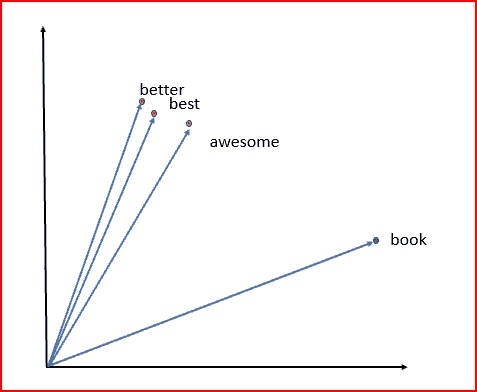

**单词的这些矢量表示被称为嵌入**

Word2Vec(单词到向量)模型通过根据单词在句子中的出现方式查看上下文来创建单词向量。

如上所示，在向量空间中，具有相似上下文的单词将被放在一起。没有相似性的单词以 90 度角表示。完全相似的单词放在 0 度角附近。

当试图确定单词的意思时，单词的上下文很重要，如下所示。单词的上下文帮助我们理解从消极到积极的情绪

生活是 ***精彩的***

这部电影将会取得 ***巨大*** 的成功

食物被 ***不爽***

他们度过了一个非常棒的假期

**word 2 vec 的输出是一个嵌入矩阵**。

嵌入捕捉语言中的关系。嵌入是字符的密集向量表示。

让我们来看一个句子，看看嵌入是如何工作的

```
sentence =['Life is ***wonderful***. ***Love*** the Job. Life is ***awesome*** ']
```

我们现在使用一个热编码器创建嵌入式矩阵

```
from  keras.preprocessing.text import one_hotencode_text =[one_hot(i, 15) for i in sentence]print(encode_text)
```

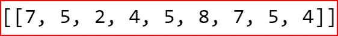

Embedded matrix

我们看到美好(2)、爱(4)和棒极了(4)被分配了相近的数字，因为它们是相似的词。

现在我们已经理解了基本概念，我们将使用 Keras 的 IMDB 数据集，并使用嵌入进行情感分析。

导入基本 python 库

```
import numpy as np
import pandas as pd
import matplotlib.pyplot as plt
%matplotlib inline
```

从 Keras 库中导入 IMDB 数据集。IMDB 数据集包含来自互联网电影数据库的 50000 条电影评论。一半的评论是正面的(1)，一半是负面的(0)。

数据集已经过预处理，每个单词都被替换为整数索引。评论因此被表示为可变长度的整数序列。

```
import keras
from keras.datasets import imdb
```

我们将把数据集分成 25000 条评论用于训练数据集，25000 条评论用于测试数据集

```
(X_train, y_train), (X_test, y_test)= imdb.load_data(num_words=number_of_most_frequent_words) 
```

让我们找出训练数据集的评论评论中的平均字数和标准差。我们使用箱线图绘制训练数据集审查的长度，以分析数据。

```
 import mathtext_len = [len(X_train[i]) for i in range(len(X_train))]
print(" Average length of review in training dataset", np.mean(text_len))print(" Std Deviation  of review in training dataset", np.std(text_len))
plt.boxplot(text_len)
plt.show()
```

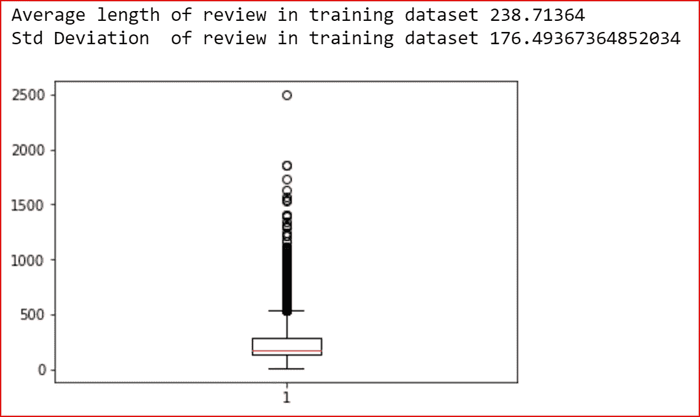

Box plot for length of the review comments in IMDB dataset for

为了检查数据的外观，我们使用 get_word_index()返回单词索引字典

```
data_id= imdb.get_word_index()
print(data_id) 
```

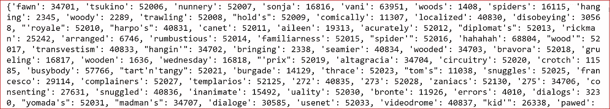

我们打印来自训练数据集的第三个评论，它是分配给不同单词的索引

```
print(X_train[2])
```

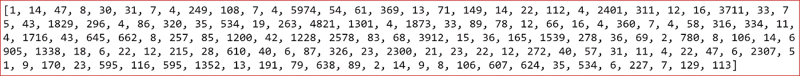

我们来看看三评评论里有什么话

```
 word_and_index={i: word for word, i in data_id.items()}
review_words= [word_and_index.get(i, ' ') for i in X_train[2]]
print(review_words)
```

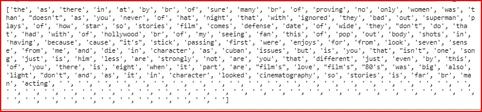

我们将使用评论中最常用的 10000 个单词。

如上图所示，评论的长度各不相同。99.3%的评论长度不超过 500 字，因此我们将保持评论的最大长度为 500 字。

```
number_of_most_frequent_words=10000
max_len=500 
```

由于评论的长度不同，我们需要将所有的序列填充到相同的长度。我们希望所有评论的长度为 500。我们对训练数据和测试数据都这样做

```
from keras.preprocessing.sequence import pad_sequencesX_train = pad_sequences(X_train,maxlen=max_len,padding='post' )
X_test = pad_sequences(X_test, maxlen=max_len, padding='post')
```

从 keras 导入构建模型所需的库。

```
from keras import Sequential
from keras.layers import Embedding, Dense, LSTM, Dropout
```

使用嵌入和 LSTM 建立模型。

我们首先添加具有以下参数的嵌入层。*嵌入*层将整数索引转换为长度为 128 的密集向量。

**input_dim** :词汇量的大小，也就是最频繁出现的单词数。

**output_dim** :密集嵌入的维度。这是单词将被嵌入的向量空间

**输入长度**:输入序列的长度，即 max_len

接下来我们添加 LSTM 层，一种类型的[递归神经网络(RNN)](https://medium.com/datadriveninvestor/recurrent-neural-network-rnn-52dd4f01b7e8) 。LSTM 维护状态，并且能够学习输入序列中元素之间的关系。

LSTM 有助于克服递归神经网络中梯度消失的问题

我们最后添加输出层。输出情绪是积极的还是消极的，所以我们使用 sigmoid 激活函数

```
model = Sequential()
model.add(**Embedding**(input_dim=number_of_most_frequent_words, output_dim=128, input_length=max_len))
model.add(**LSTM**(units=128, dropout=0.2, recurrent_dropout=0.2))
model.add(**Dense**(1, activation='**sigmoid**'))
```

让我们来看看我们创建的模型

```
model.summary()
```

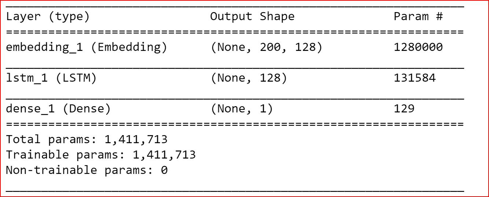

我们用 adam 优化器和 binary _ crossentrpy 损失函数和准确性作为模型的度量来编译模型

```
model.compile(optimizer='adam', loss='binary_crossentropy', metrics=['accuracy'])
```

使用 32 和 5 个时期的 batch_size 将训练数据拟合到模型

```
result= model.fit(X_train, y_train, batch_size=32, epochs=5, validation_data=(X_test, y_test))
```

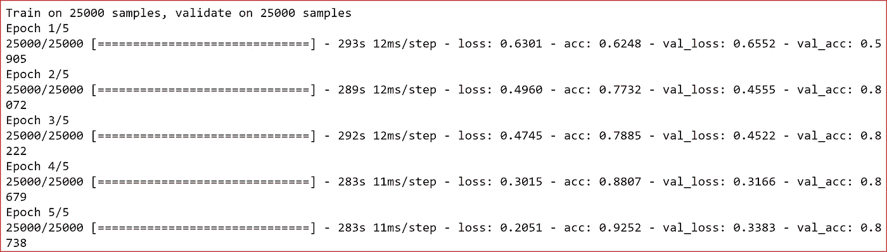

在测试集上评估模型并打印精度。

```
score, accu= model.evaluate(X_test, y_test, batch_size=32)
print(accu)
```

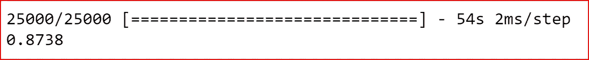

我们在测试数据上获得了 87%的准确率

绘制训练数据和测试数据的丢失

```
plt.figure(figsize=(5,3))
plt.plot(result.epoch,result.history['loss'], label='training', color='red')
plt.plot(result.epoch,result.history['val_loss'], label='validation', color='green')
```

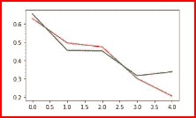

现在绘制训练数据和测试数据的准确性

```
plt.figure(figsize=(5,3))
plt.plot(result.epoch,result.history['acc'], label='training', color='red')
plt.plot(result.epoch,result.history['val_acc'], label='validation', color='green')
```

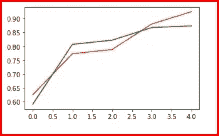

**概要** : ***嵌入通过使用字符的密集向量表示来捕获语言中的关系，以执行情感分析***

# 如果你喜欢这篇文章，请鼓掌！