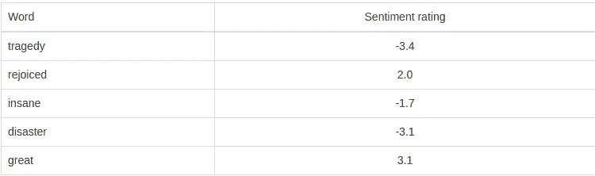

# 用 PHP 实现社交媒体文本的情感分析

> 原文：<https://medium.datadriveninvestor.com/sentiment-analysis-with-a-social-media-text-in-php-a8f3d5f71c42?source=collection_archive---------0----------------------->


你了解人类的情感吗？我也没有。但是机器可以！我们将进入一个非常棘手的领域，叫做“情绪分析”当你想一想——计算机学习不仅仅是为了理解我们说的话，而且是为了理解我们 T2 的意思！

# 首先，什么是情感分析？

[情感分析](https://en.wikipedia.org/wiki/Sentiment_analysis)是简单地计算出(统计上)一段文字是正面的、负面的还是中性的过程。大多数情感分析方法采取两种形式中的一种:**基于极性的**，其中文本片段被分类为正面或负面，或者**基于化合价的**，其中考虑了情感的强度。例如，单词“good”和“excellent”在基于极性的方法中会被视为相同，而在基于化合价的方法中，“excellent”会被视为比“good”更积极。

所以，几天前回到工作岗位，我有幸看到了 Experian 的一组数据科学家关于他们所做的分析工作的精彩演示，这使我开发了利用 VADER(价感知词典和情感推理机)的 PHP 情感分析器包。

在这篇文章中，让我告诉你它是如何工作的，以及你如何使用它！

# PHP 情感分析器软件包是如何工作的？

[PHP 情感分析器](https://github.com/davmixcool/php-sentiment-analyzer)利用了 VADER，它属于一种基于情感相关词汇的情感分析。在这种方法中，词典中的每个单词都被评定为是正面的还是负面的，并且在许多情况下，**如何**正面或负面。



当 [PHP 情感分析器](https://github.com/davmixcool/php-sentiment-analyzer)分析一段文本时，它检查文本中的任何单词是否出现在 VADER 词典中。比如“*食物很好，氛围很好*”这句话在 VADER 词典中有两个词(*好*和*好*)的评分分别为 1.9 和 1.8。

现在，让我们来看好的部分，我们如何利用 [PHP 情感分析器](https://github.com/davmixcool/php-sentiment-analyzer)包。这非常简单明了，

首先，我们通过 composer 包含软件包:

```
composer require davmixcool/php-sentiment-analyzer
```

# 使用

我们初始化这个包。

```
Use Sentiment\Analyzer;
$analyzer = new Analyzer();
```

最后，我们将使用`getSentiment()`方法来获取一段文本的情感指标。

```
$sentence = "I just got a call from David - does he realize it's Sunday?";
$result = $analyzer->getSentiment($sentence);print_r($result);
```

# #输出

```
['neg'=> 0, 'neu'=> 1, 'pos'=> 0, 'compound'=> 0]
```

你可以看到 [PHP 情感分析器](https://github.com/davmixcool/php-sentiment-analyzer)将这句话评为中性。如果我们改变句子的最后一部分呢？

```
$sentence = "I just got a call from David - i don't like it when he calls on Sundays.";
$result = $analyzer->getSentiment($sentence);print_r($result);
```

# #输出

```
['neg'=> 0.116, 'neu'=> 0.884, 'pos'=> 0, 'compound'=> -0.1128]
```

现在 [PHP 情感分析器](https://github.com/davmixcool/php-sentiment-analyzer)将其评为负面，挑选出“不要”作为有用的情感相关信息。

# 情感分析的应用

情感分析在许多行业都有应用——它非常适合任何可以获得关于服务或产品的非结构化意见数据的领域。情绪分析的一个应用是让拥有 Twitter 或其他社交媒体账户的公司接收反馈。很明显，对这些公司来说，让负面反馈得不到回应太久是不好的，情绪分析可以给他们一个快速找到这些不开心的客户并对其进行优先排序的方法。

# 结束语

我希望这是对 PHP 中一个非常强大且易于使用的情感分析包的有用介绍——正如你所看到的，它的实现非常简单，并且可以应用于相当广泛的环境。