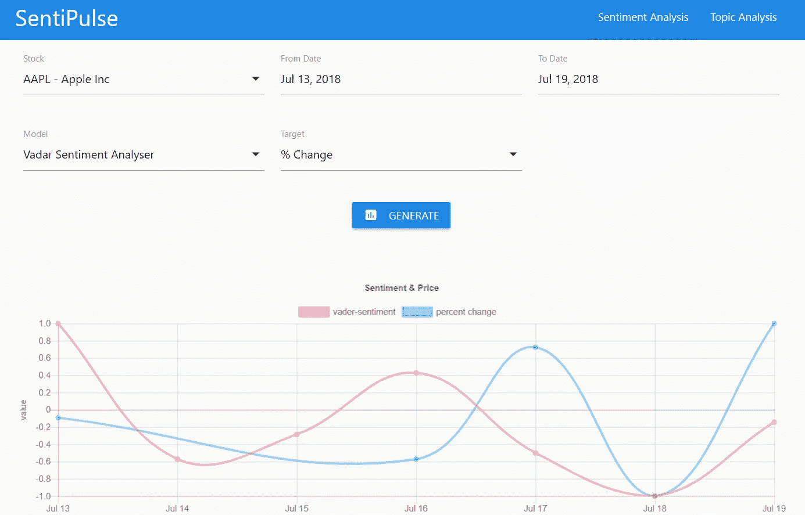
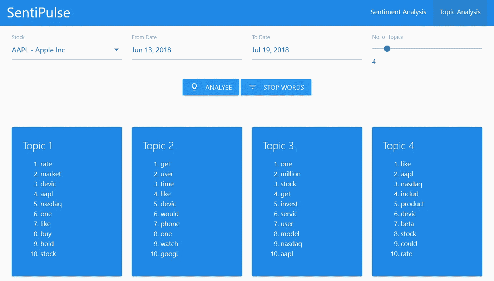

# 感觉脉搏——从新闻到数字

> 原文：<https://medium.datadriveninvestor.com/sentipulse-from-news-to-numbers-24aaa7e9f5b5?source=collection_archive---------30----------------------->

有效市场的金融经济学理论假设*股票市场价格将反映在“所有可获得的信息”*上。这些信息可以以各种形式出现——新闻、推文、帖子、视频、股票报价。每天都有前所未有的网上内容在 T2 产生。可以毫不夸张地说，世界是靠信息运转的。世界上的彭博靠在正确的时间以正确的速度向正确的人提供信息(股票、商品价格、新闻)而繁荣起来。

已经有大量的研究试图基于从公共来源(如社交媒体平台、传统新闻媒体、公司报告等)获得的信息对股票价格预测进行建模。探讨的常见模型包括时间序列模型，该模型使用时间序列回归模型分析历史表现，如 ARIMA 模型，其基本前提是股票价格在时间上相关。

但是，对于一些新闻在市场上引起膝跳反应的情况，该怎么办呢？为什么 [APPL 股票](https://www.investors.com/news/technology/click/apple-stock-record-high-wwdc/)比 WWDC 前一个月上涨超过 4%？原本基本面良好的萨蒂扬计算机服务公司的股票被一桩会计丑闻所震惊，市值损失超过 90%。

显然，情绪在预测股票价格中扮演着重要的角色。我们可以扩展早先的假设，认为新闻情绪会反映在股票价格上。

## 利用情绪预测股票价格变化

SentiPulse 项目的重点是谷歌、苹果、脸书、微软、思科、英特尔公司、三星电子、腾讯控股、阿里巴巴、亚马逊、英伟达、IBM、SAP、百度和 Adobe 等科技公司。他们之所以被选中，是因为他们经常召开的会议(如谷歌 I/O 和苹果 WWDC)和产品发布会上有大量的在线新闻材料。使用 NLP 技术分析了来自 newsapi.org、每家公司每天的事件注册表等来源的新闻文章(2018 年 6 月 13 日至 2018 年 7 月 19 日)。因为标题的真实情感是未知的，所以使用 VADER(效价感知词典和情感推理器)情感分析器来分配情感分数(-1 到 1)。它是 NLTK python 包的一部分。这是一个基于词典和规则的情绪分析器，专门针对社交媒体的情绪进行了调整。每个新闻标题在 VADER 情感分析器中用作输入，分析器返回 4 个分数(正面、负面、中性和复合)作为输出。复合分数用于识别新闻标题的整体情绪。分数以天为单位进行汇总。

从 alphavantage.co 中提取了股票表现的四个参数——开盘价、收盘价、股价变化率和成交量

然后，以股票价格的%变化作为目标变量，回归情绪得分。

Predicting % Change in Stock Price using Sentiment Score

该模型在 2018 年 6 月 13 日至 2018 年 7 月 12 日的新闻文章上进行训练，并在 2018 年 7 月 13 日至 2018 年 7 月 19 日进行测试。达到 0.0081 的 MSE 和 50%的极性准确度(负分导致股票价格的负%变化)。

随着更大的数据集和使用像 LSTM 这样的神经网络，我们有望获得更高的预测精度。

## 主题建模

使用潜在狄利克雷分配(LDA)对新闻语料库进行单独分析以识别新闻主题。

LDA 是一个三级分层贝叶斯模型，其中集合中的每个项目都被建模为一组底层主题的有限混合。反过来，每个主题都被建模为一组潜在主题概率的无限混合物。在文本建模的上下文中，主题概率提供了文档的显式表示。基本方法将语料库中的每个文档简化为一个实数向量，每个向量代表计数的比率。在流行的 TF-IDF 方案中，选择“单词”或“术语”的基本词汇表，并且对于语料库中的每个文档，由每个单词的出现次数形成计数。在适当的归一化之后，将该术语频率计数与逆文档频率计数进行比较，逆文档频率计数测量一个单词在整个语料库中的出现次数(通常以对数标度，并且再次适当地归一化)。最终结果是一个逐个文档的矩阵 X，它的列包含语料库中每个文档的 TF-IDF 值。主题建模试图直接找到主题，其中每个主题是一组频繁共同出现的单词。

SentiPulse 应用程序允许用户查看和评估从主题建模中生成的主题关键字之间的相关性，并定制停用词表以将领域理解合并到 LDA 模型中。

Visualizing Underlying Topics of News Articles

## 后续步骤

尽管用例很复杂，但是第一代模型确实产生了一个不错的结果。但是可以做更多的事情来提高预测精度。

第一步是通过扩大新闻资源和时间范围来获得更大的数据集。更大的数据集将允许我们更好地概化模型，并将产生更好的预测准确性。

第二步是使用人类标记的数据集来训练模型，以预测情感得分。自动标注(基于 VADER)不能达到与人工标注数据集一样高的准确度。人类标记的数据集肯定会提高模型的准确性和性能。

如果你有兴趣了解更多关于这个项目，请联系我。

项目合作者: *Apoorva Joshi，Eric Tan Chin Cheong，Chia Yong Qing，Choo Mei Xuan，王晓晗，Foo Celong Raymond*