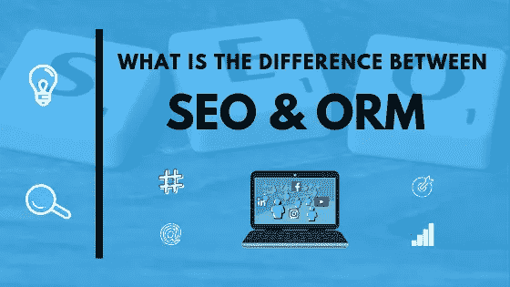
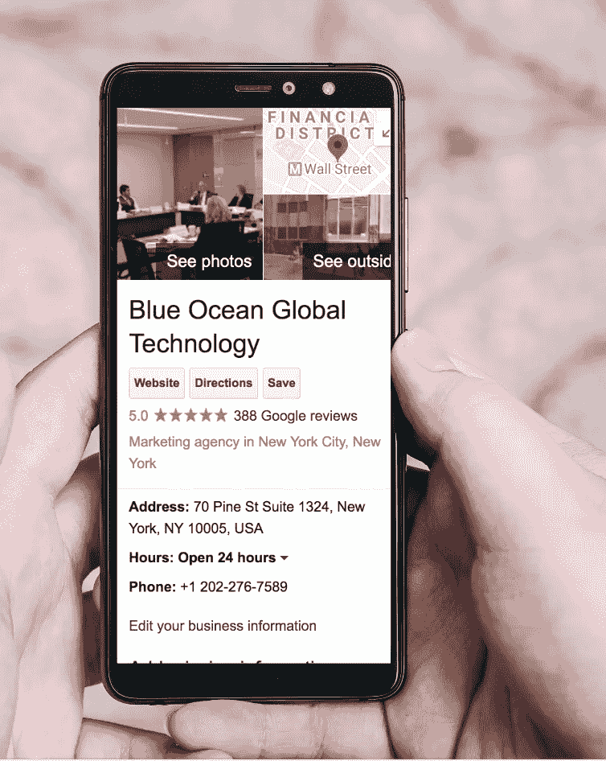
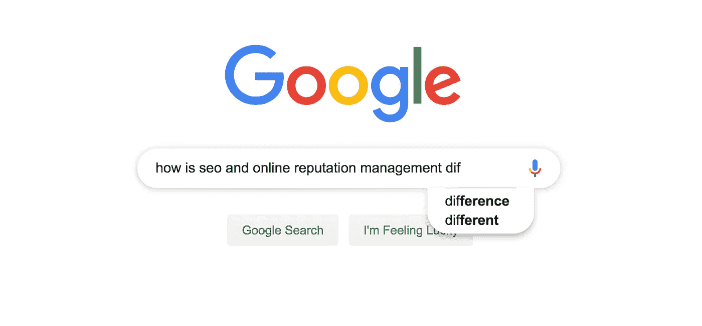

# SEO 和 ORM——有什么区别？蓝海环球科技

> 原文：<https://medium.datadriveninvestor.com/seo-vs-orm-what-is-the-difference-blue-ocean-global-tech-5eaacb401de4?source=collection_archive---------1----------------------->

当你需要一些信息时，你会怎么做？你用谷歌搜索——每一秒钟都有 67921 人在做同样的事情。事实上，我们的下一个故事是从网上开始的:就像 [93%](https://www.imforza.com/blog/8-seo-stats-that-are-hard-to-ignore/) 的网上体验一样，它始于打开一个搜索引擎，键入一些单词。

# 珍妮的旅程

想象一下珍妮。她是公关总监，认识到她的公司需要社交媒体广告方面的帮助。她上网搜索“数字营销顾问”，无意中发现了一篇针对在线受众的有趣文章。珍妮很感兴趣，花了一个小时阅读他的博客。

珍妮故事的第一部分说明了[搜索引擎优化(SEO)](https://blueoceanglobaltech.com/search-engine-optimization/) 能为企业做些什么。SEO 是一种在线营销技术，用于改善内容，使其能够被搜索引擎发现。如果不是为了“数字营销顾问”这个短语而写的有趣的博客文章和优化，珍妮不会知道这家公司的存在。

但是，她还不准备申请公司培训。在购买之前，珍妮需要更多地了解这位专家。她在他的名字上快速搜索了几次。大多数结果是积极的，但他的 LinkedIn 个人资料看起来相当模糊。然后，Jenny 找到了一个三星级评论，强调了与社交媒体专业人员的混合体验。

珍妮很困惑。她在为公司申请培训的愿望和对专家的犹豫之间左右为难。因此，她转向自己的 LinkedIn 账户，搜索她所在的社交网络对自由职业社交媒体顾问的推荐。她还在推特上向一些营销伙伴询问他们是否认识这个人。

Jenny 的决策过程是在线声誉管理(ORM)发挥作用的地方。与 SEO 不同，ORM 包含了一个企业或一个实体可以做的一切事情来改善它的形象并在网上建立一个正面的声誉。ORM 服务增强了企业或实体 [**的整个在线形象**，它们对销售越来越重要——最近的数据显示，大约 80%—90%的人在购买前会查看在线评论](https://blueoceanglobaltech.com/why-your-online-reputation-management-orm-is-everything/)。成功的 ORM 是 Jenny 决定雇用顾问的原因。

# 设置正确的术语

ORM 比 SEO 更广泛，更通用。它涉及方方面面，从建立一个有相关内容的 SEO 友好网站到在社交媒体、在线评论网站、论坛、博客等上保持积极的形象。虽然 SEO 是一种帮助网站在搜索引擎结果页面(SERPs)上出现得更高的技术，但 ORM 结合了不同的学科-在线公关、内容营销、[社交媒体营销](https://www.socialmediaexaminer.com/online-reputation-management-guide-for-social-media-marketers/)和监控、SEO、社区管理、网络分析和心理学-来主动建立和控制品牌的在线声誉。这种**多学科和多渠道的** **方法**是 ORM 与 SEO 的不同之处。

另一方面，SEO 是所有成功 ORM 活动的基础。毕竟每个品牌都需要一个伟大的网站！SEO 通过**现场优化**提高网站的可见性，或者管理页面的技术方面，例如创建 HTML 代码、元描述和标签。作为内容营销策略的一部分，SEO 策略通过使用特定的关键字来帮助优化网站的内容。SEO 的另一个方面，**站外优化**，处理构建高质量的入站链接，这些链接可以在谷歌的蜘蛛面前为网站“担保”。离页 SEO 利用社交媒体营销和外部网站来创造流量。

# ORM 和 SEO 的六大区别

下面是 ORM 和 SEO 的主要区别。

# 整体目标与具体目标

ORM 解决了一个非常难以捉摸和难以捉摸的概念——声誉。因此，它使用整体方法来建立品牌的声誉，并确保人们在网上找到关于该品牌的大多数正面信息。相比之下，SEO 更具体，更容易定义:它帮助网站出现在搜索的第一页，因为 [95%的人只会看那个页面](https://www.brafton.com/news/95-percent-of-web-traffic-goes-to-sites-on-page-1-of-google-serps-study/)。在谷歌搜索算法改变之前，SEO 使用特定的策略来提高网站的排名，这种改变每年发生大约[500–600 次](https://moz.com/google-algorithm-change)。

# 许多网站与一个网站

SEO 的努力只集中在一个网站上，公司自己的网站，而 ORM 跟踪品牌在互联网上所有可能的地方是如何被提及的，包括公司自己的网站。ORM 还包括在博客、评论和排名网站、社交媒体和论坛上的提及，并试图让最好的观点和文章更容易被发现。

# 定制与统一方法

无论市场利基或细分，搜索引擎优化将使用类似的技术来促进一个公司的网站。ORM 活动会因公司、行业和目标市场的不同而有很大差异。一些 ORM 活动将更加积极，以确保更快的积极成果和更广泛的社区外展。

# 品牌认知与销售

ORM 面向的是一般的品牌感知，而 SEO 更多的是销售导向。尽管在线声誉管理的最终目标不是影响购买，而是[改变品牌认知](https://blueoceanglobaltech.com/build/)，一个成功的 ORM 活动最终会带来更多的销售，因为积极的声誉会将潜在客户转化为付费客户。

# 购买决策与信息搜寻

记得珍妮吗？她的故事是消费者购买之旅的一个例子。所有消费者旅程都会经历以下几个阶段:

1) **问题识别**(此人有问题，需要解决方案)

2) **信息搜索**(该人在线搜索解决方案)

3) **备选方案评估**(此人发现许多品牌和服务提供各种解决方案——这是所有企业争夺客户注意力的阶段)

4) **购买决策**(该人选择购买特定产品)以及

5) **购后评价**(该人收到产品，对其进行评价，高兴与否，并决定在社交媒体上留下关于该公司的评论或帖子)。

搜索引擎优化出现在消费者旅程的第二阶段——一个[搜索引擎优化网站保证潜在客户将在信息搜索阶段找到](https://blueoceanglobaltech.com/maintenance/)业务。然而，与 SEO 不同，ORM 在所有阶段都发挥作用，尤其是第三、第四和第五阶段。积极的品牌声誉会影响客户对品牌的评价，比竞争对手更积极。

# “被喜欢”和“被发现”的态度

基本上，SEO 希望一个网站被找到，而 ORM 只希望找到关于该公司的最佳内容。

# 使用反向搜索引擎优化建立一个积极的声誉

反向搜索引擎优化展示了搜索引擎优化和 ORM 如何为品牌的利益而合作。

一个负面的提及，特别是如果它在谷歌上排名很高，可以推翻任何品牌来之不易的声誉，并灌输潜在客户的不信任。心理学称之为[“消极偏见”](https://www.psychologytoday.com/us/articles/200306/our-brains-negative-bias)——我们只是天生会记住坏消息。我们的 Jenny 在发现一个模糊的 LinkedIn 个人资料和可疑的评论后，花了很多时间在论坛和社交媒体平台上搜寻。

因为没有一个品牌能幸免于负面意见，反向搜索引擎优化拯救了 ORM。其目的是抑制搜索结果页面中的负面内容，并将正面内容放在更高的位置。反向搜索引擎优化使用各种方法，并侧重于站外优化，博客和社交媒体，以改变给定文章的排名。一些技术可能包括以下内容:

创建博客和新的社交媒体档案；

更频繁地创建和发布积极的内容；

定义关于品牌的正面关键词，并战略性地使用它们；

在网站上回答评论和排名；

创建搜索提醒，跟踪品牌的最新提及；和

在社交媒体上与用户互动。

总之，搜索引擎优化可以帮助 ORM，对于建立一个积极的声誉是必不可少的。每一个 ORM 活动都必须包括一个 SEO 策略，否则它将无法实现对你的业务最有利的目标。今天就在蓝海全球技术公司聘请专家来建立、监控或修复您的在线状态。

*原载于 2019 年 5 月 18 日*[*https://blueoceanglobaltech.com*](https://blueoceanglobaltech.com/seo-vs-orm-what-is-the-difference/)*。*