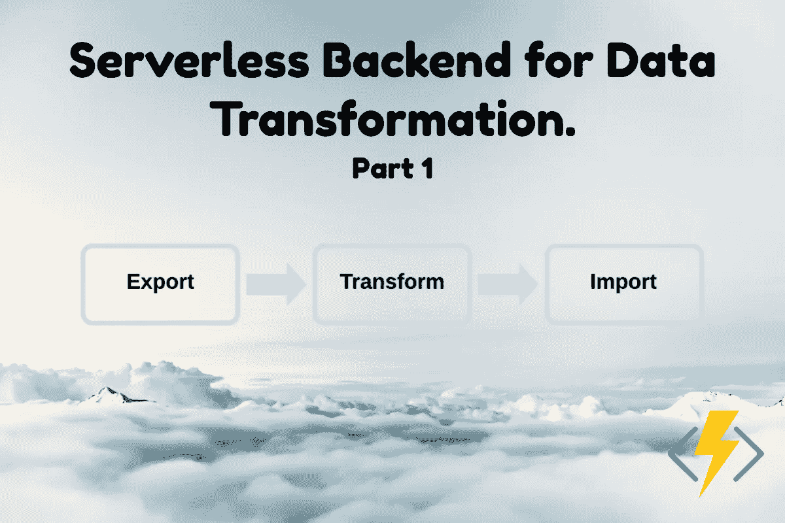
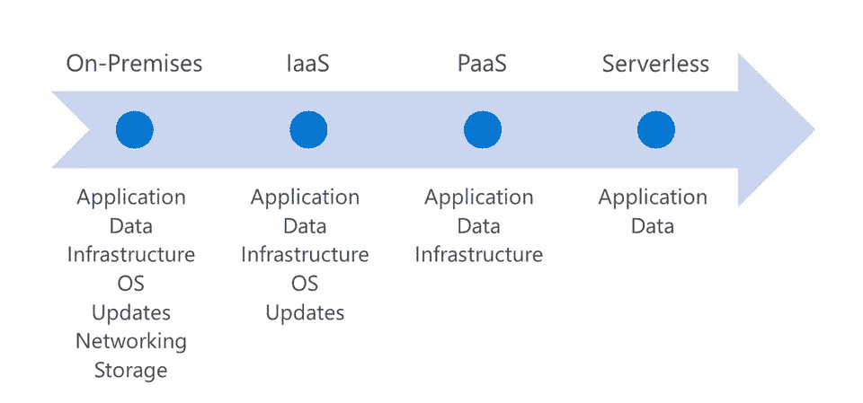
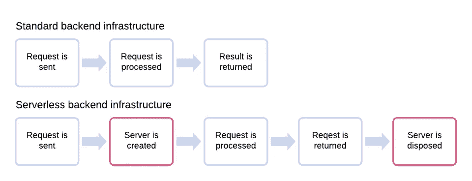
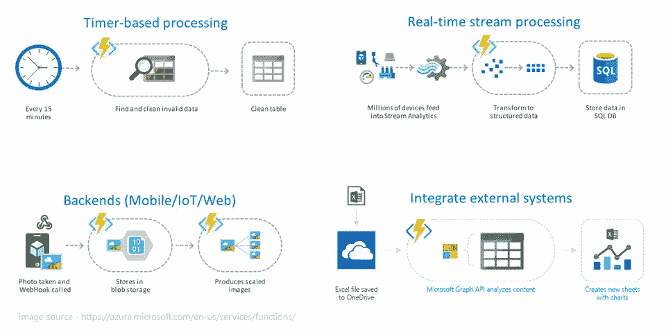
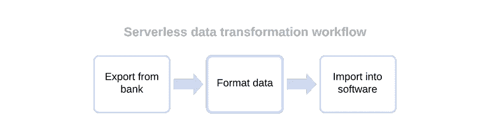
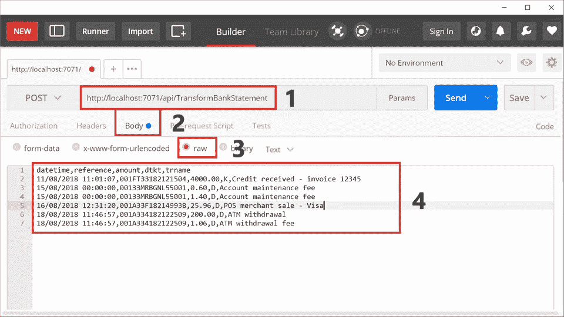
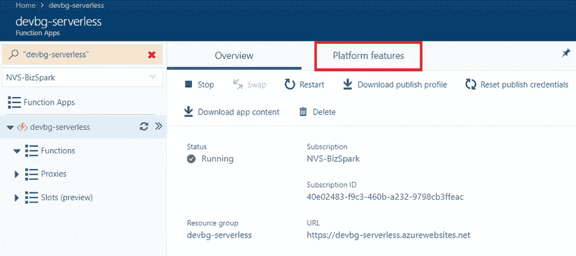
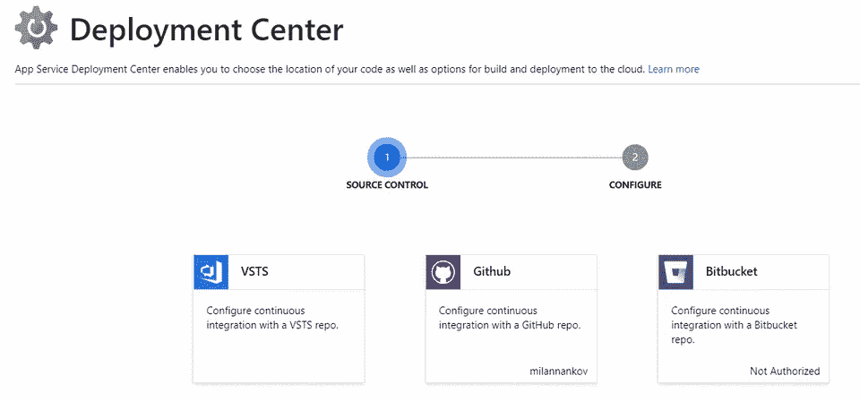
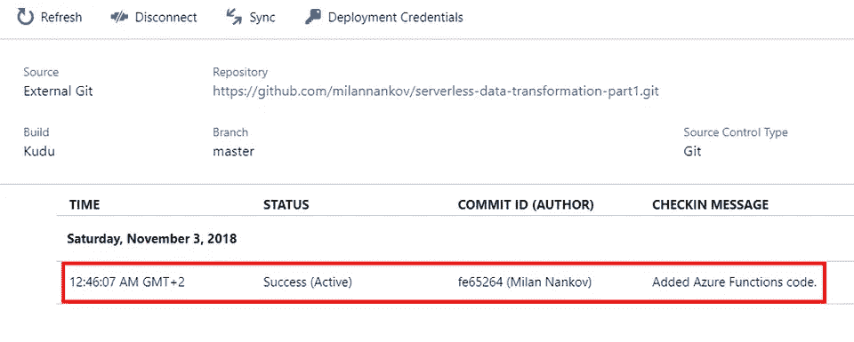
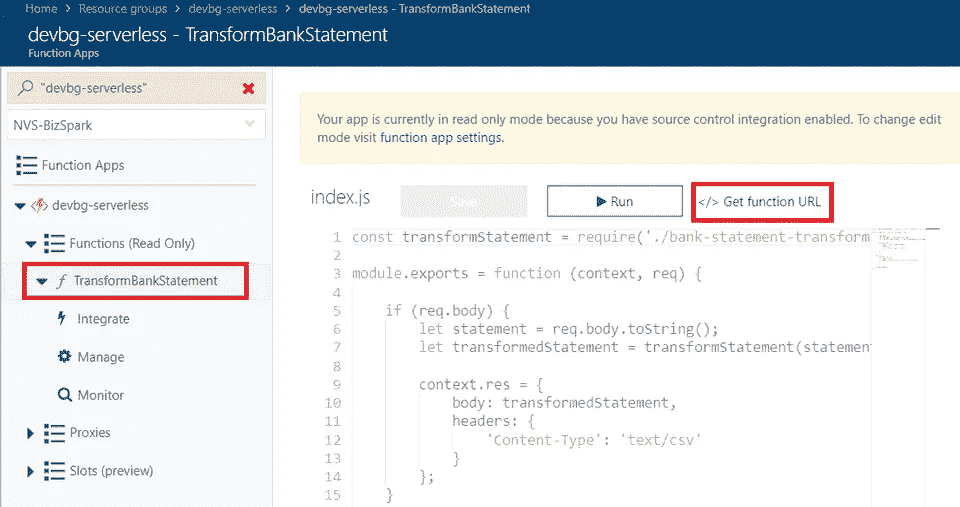

# 用于数据转换的无服务器后端(第 1 部分)

> 原文：<https://medium.datadriveninvestor.com/serverless-backend-for-data-transformation-part-1-15132a1a4d1a?source=collection_archive---------52----------------------->



这是我的无服务器系列的第一部分。在这第一篇文章中，我将介绍无服务器的基本概念和特性。一旦涵盖了基础知识，我们将继续实现一个使用 Azure 函数转换银行对账单的无服务器后端。在下面的文章中，我们将把我们的解决方案升级为一个完整的流程，用于处理银行对账单并将它们上传到一个在线会计软件中。

如果您已经熟悉无服务器，请随意[跳到文章的主要部分](#b9e7)。

# 无服务器计算简介

> *它是无服务器的，因为你很少考虑服务器。*
> 
> *——Chris Anderson，微软高级项目经理*

什么是无服务器？简单来说，无服务器就是在云中执行代码。这个术语本身可能有点误导，因为无服务器涉及大量的服务器，但主要的价值主张之一是您不必考虑这些服务器。使用无服务器，您应该专注于您的代码和数据，而将其他事情留给云环境，如扩展、更新，操作系统会为您处理。

按时间顺序，无服务器是云的最新发展。



# 那么，什么是无服务器？

让我们试着想出一个定义，而不去纠缠不必要的细节。通常，当我们谈到无服务器时，我们会想到以下特性:

*   服务器的抽象
*   快速/自动缩放
*   亚秒计费

服务器的抽象意味着其他人负责基础设施——创建、维护和处理服务器。这包括设置网络、操作系统更新、修补框架等。我们不关心我们的代码是如何安装在一个特定的服务器上的，也不关心这个服务器是如何工作的。

自动扩展意味着平台将决定何时以及需要多少额外资源来处理负载。

亚秒计费可能是采用无服务器的主要原因之一。有了无服务器，云提供商将只对无服务器代码运行的时间收费。例如，假设我们有一个无服务器的后端来调整图像的大小。如果我们的后端被调用了 10 次，每次调用花费了 1 秒钟，云提供商将只对代码运行的 10 秒钟收费。

为了客观地看待这一点，让我们将其与一种更传统的方法进行比较，在这种方法中，我们有一个虚拟机来托管我们的图像大小调整代码。如果调用 10 次，每次 1 秒，提供商将向我们收取更多的费用，因为在这种情况下，我们将因虚拟机 24 小时运行而被收费。对于提供商来说，代码运行 100 亿次或 100 亿次并不重要。

总而言之，无服务器提供了以下优势:

*   简化 DevOps
*   成本节约
*   通过专注于业务来提高生产力

# 无服务器平台如何工作

我已经提到了调整图像大小的无服务器后端。让我们将这样的后端与运行在常规虚拟机上的传统后端进行比较。



正如我们从图中看到的，使用无服务器时，我们并不拥有服务器——它是在需要时创建的，并在不再接收请求时被处理掉。当然，关于服务器的创建和终止有很多细节，我将在另一篇文章中讨论。

# 无服务器的使用案例

现在，让我们来看一下无服务器是最佳选择的场景。根据经验，无服务器可以很好地适应任何地方，但不限于，我们需要响应事件。以下是一些常见的例子:



# 商业问题

这篇文章的核心是我遇到的一个业务需求，开发一个无服务器的解决方案非常合适。

公司通常使用某种财务报告软件来监控销售、收入、成本和其他重要指标。为此，企业通常将他们的银行账户连接到一个现成的在线会计解决方案。不过，也有软件无法与特定银行集成的情况。

当缺乏集成时，您有两个选择—手动输入数据，或者在银行和软件之间架起一座桥梁。选项二是首选，通常看起来像这样:

1.  将银行帐户中的对帐单导出到文件(Excel 或其他格式)。
2.  格式化数据以匹配会计软件预期的格式。
3.  将数据导入软件。

这些步骤并不多，但是它们确实很耗时并且容易出错。我们的任务是自动化这一手动过程，以节省时间，并消除任何机会或人为错误。

# 解决方案

显然，这里有许多可行的解决方案，其中之一是一个无服务器管道来处理银行对账单的导出、格式化和导入。



Serverless 在这里特别合适，因为管道只需要偶尔运行——每当导出一个新语句时，这通常发生在每个月的月末或月初。

我们在本文剩余部分的重点将是最重要的中间过程。正如我在开始时提到的，我们将利用 Azure 函数来运行我们的无服务器代码。让我们开始吧。

# Azure 函数简介


简而言之，Azure Functions 是一个在云中执行代码的平台。

Azure 功能的替代品可以从所有其他主要的云提供商那里获得——谷歌的谷歌云功能和亚马逊的 AWS Lambda。好消息是，我们在本文中讨论的许多概念适用于不同的供应商。

Azure Functions 提供了以下功能:

*   语言选择(C#、JavaScript、F#、Java 等。)
*   柔性开发
*   自动缩放
*   按使用付费定价模式
*   开放源码
*   基于 Azure App 服务

当使用 Azure 函数时，我们经常谈论所谓的**函数应用**。功能应用是代码、部署、配置以及构建、部署和运行无服务器代码所需的任何内容的逻辑分组。

由于我们刚刚开始使用 Azure 函数，我们将限制自己在本地工作。一旦我们准备好代码，我们将把它转移到云中。

# 创建本地函数应用程序项目

我们需要做的第一件事是安装 Azure functions 核心工具——支持创建、测试、调试和部署 Azure 功能的 CLI。CLI 有两个版本，我们将使用新版本 v2。让我们使用 npm 安装 CLI。

```
npm i -g azure-functions-core-tools@core –unsafe-perm true
```

在 [Github](https://github.com/Azure/azure-functions-core-tools) 上列出了安装 CLI 的替代方法。

安装完成后，我们可以使用 CLI 创建一个项目来托管我们的无服务器代码。以下是方法:

```
func init DataTransform
```

您将被提示选择语言/框架——请选择节点，因为我们将在本文的剩余部分使用 JavaSript。这将创建一个文件夹 *DataTransform* 来存放这个项目。接下来要做的是创建一个*函数*。

```
cd DataTransform
func new –-template "Http Trigger" --name TransformBankStatement
```

该命令将创建一个名为 TransformBankStatement 的函数，该函数使用 Http 触发器。触发器是 Azure 函数中的一个基本概念，因为它们决定了如何调用函数。通过选择“Http trigger ”,我们可以通过 Http 请求调用我们的函数。[以下是其他可用触发器的列表](https://docs.microsoft.com/en-us/azure/azure-functions/functions-overview#what-can-i-do-with-functions)。仅举一个例子，有一个“计时器触发器”,用于创建一个按计划运行的功能，例如每小时运行一次。

现在我们有了一个函数，让我们运行它。

```
# In folder DataTransform
func start
```

*Func start* 启动所谓的函数主机，它允许我们在本地运行我们的代码，就像它运行在云中一样。一旦您运行 *func start* ，您应该会看到与此非常相似的内容:

```
Listening on http://0.0.0.0:7071/
Hit CTRL-C to exit…

Http Functions:

TransformBankStatement: http://localhost:7071/api/TransformBankStatement

[8/2/2018 2:38:45 PM] Host started (29487ms)
[8/2/2018 2:38:45 PM] Job host started
```

为了测试我们的第一个无服务器功能，只需打开一个浏览器并向[发送一个请求。name=World](http://localhost:7071/api/TransformBankStatement?name=World) 。

# 项目结构

刚刚创建的项目应该如下所示:

```
DataTransform
 | - host.json
 | - local.settings.json
 | - TransformBankStatement
 | | - function.json
 | | - index.js
```

文件 **host.json** 包含影响 Function App 项目中所有无服务器代码的全局配置选项。您可以在这里找到所有选项[的详细信息。](https://docs.microsoft.com/en-us/azure/azure-functions/functions-host-json)

文件 **local.settings.json** 存放连接字符串和其他设置，这些设置仅用于本地开发，一旦代码被部署到云，它们将不会有任何影响。

每个函数应用程序项目可以包含许多*函数*中的一个——在我们的例子中，我们有 **TransformBankStatement** 函数。每个函数至少由 **function.json** 和 **index.js** 组成。

当 **functions.json** 文件包含相应函数的配置元数据时， **index.js** 文件托管每当调用无服务器函数时将执行的代码——例如，这是指定函数触发器的地方。

现在让我们来看看代码本身。

# 索引. js

正如我们已经知道的，这个文件是我们的无服务器代码的入口点。

让我们了解一下这段代码最重要的方面。

为了具有工作功能，必须使用**模块导出。导出**。

每个函数都有一个必需的参数**上下文**。这就是所谓的上下文对象，充当运行时环境的网关。使用上下文，我们可以访问函数的输入和输出参数。

上下文对象上有两个重要的方法——**context . done()**和 **context.log()** 。第一个用来告诉运行时我们的方法已经完成了它的执行。我们想在每一个*函数*中使用这个方法。第二种方法不言自明。

除了第一个必需的*上下文*参数之外，我们的函数还可以有其他表示输入数据的参数。在我们的例子中，我们有一个名为 **req** 的请求，它表示调用我们函数的 HTTP 请求。如代码所示，我们可以使用 **req** 来检查请求是否包含一个名为 *name* 的参数，如果包含，我们可以得到它的值。

最后一个重要方面是无服务器函数如何返回数据。因为我们处理的是 HTTP，所以我们的函数应该返回一个 HTTP 响应。使用 **context.res** 我们可以创建一个*响应对象*，它表示具有主体、头、状态和 isRaw 字段的 HTTP 响应。最常用的是**主体**(我们正在返回的有效载荷)和**状态**(HTTP 状态代码)。

我想我们现在已经准备好开始实现我们的无服务器后端来转换银行对账单了。关于使用 Azure 函数和 JavaScript 的深入信息，请随意查看 Azure 函数 JavaScript 开发者指南。

# 为数据转换创建后端

让我们快速回顾一下在文章开始时我们要做的事情。目标是创建一个服务，可以将银行对账单转换成特定的格式，然后导入到会计软件中。

以下是一份银行对账单样本(为简洁起见，删除了一些字段):

我们在顶部看到的格式是我们从银行获得的原始数据。必须转换成的格式非常相似，但有以下显著的区别。

*   **日期时间**字段必须为“年-月-日”格式
*   如果条目代表借方，则**金额**字段必须有负号。在原始格式中，借方与贷方由 **dtkt** 字段决定。

我们的目标是转型后的以下格式:

现在让我们来看看代码。

# 使用 NPM 软件包

在我们的无服务器代码中使用 NPM 软件包没有任何问题。目前我们将只使用一个这样的包来帮助我们处理日期。

```
npm init npm install moment --save
```

# 用于转换银行对账单的模块

这是实际上可以完成我们需要的转换的代码。让我们通过在文件夹“ **TransformBankStatement** ”中创建一个名为“**bank-statement-transform . js**”的文件，将这段代码放在一个模块中。

这段代码不以任何方式依赖于 Azure 函数，可以在任何其他服务中使用——它是我们的业务逻辑。主函数 *transformStatement* 接受银行对账单作为字符串，并将转换后的对账单作为字符串输出。这里利用*时刻*将日期转换成需要的格式。

# 在我们的无服务器功能中使用业务逻辑

如果您还记得的话， **index.js** 是您的 serverles 代码的入口点。下面是我们如何将业务逻辑集成到功能中。

首先，我们必须导入执行数据转换的代码——这是来自**bank-statement-transform . js**的 **transformStatement()** 函数。

```
const transformStatement = require('./bank-statement-transform');
```

其次，我们的无服务器代码必须检查 HTTP 请求是否包含一个*主体*。如果有，我们期望必须转换的银行对账单在那里，我们将它传递给 **transformStatement()** 。

最后，我们使用*响应对象*生成一个输出，其中包含转换后的银行对账单。

```
context.res = { body: transformedStatement, headers: { 'Content-Type': 'text/csv' } };
```

在 HTTP 请求没有*主体*的情况下，我们返回一个错误响应。就是这样！无服务器代码已经准备好进行测试并部署到云中。

# 运行代码

我们可以通过执行 *func sart* 在本地运行代码。和以前一样，代码可以在[http://localhost:7071/API/transform bank statement](http://localhost:7071/api/TransformBankStatement)获得，但是这次我们需要更复杂的请求。我们可以使用各种工具，比如 *curl* 、 [Postman](https://www.getpostman.com/apps) ，或者其他的。我将使用 Postman 来模拟一个带有示例银行对账单的 HTTP POST 请求。



以下是一些测试数据:

```
datetime,reference,amount,dtkt,trname 11/08/2018 11:01:07,001FTЗЗ182121504,4000.00,K,Credit received - invoice 12345 15/08/2018 00:00:00,001ЗЗMRBGNL55001,0.60,D,Account maintenance fee 15/08/2018 00:00:00,001ЗЗMRBGNL55001,1.40,D,Account maintenance fee 16/08/2018 12:31:20,001AЗЗF182149938,25.96,D,POS merchant sale - Visa 18/08/2018 11:46:57,001AЗЗ4182122509,200.00,D,ATM withdrawal 18/08/2018 11:46:57,001AЗЗ4182122509,1.06,D,ATM withdrawal fee
```

如果一切正常，结果应该如下所示:

```
date,amount_signed,reference,details 2018-08-11,4000,001FTЗЗ182121504,Credit received - invoice 12345 2018-08-15,-0.6,001ЗЗMRBGNL55001,Account maintenance fee 2018-08-15,-1.4,001ЗЗMRBGNL55001,Account maintenance fee 2018-08-16,-25.96,001AЗЗF182149938,POS merchant sale - Visa 2018-08-18,-200,001AЗЗ4182122509,ATM withdrawal 2018-08-18,-1.06,001AЗЗ4182122509,ATM withdrawal fee
```

看起来这个函数正在按预期运行——让我们把它发布到云上。

# 部署

为了将代码发布到 Microsoft Azure，我们需要访问该平台。

# 正在创建 Microsoft Azure 帐户

要继续超过这一点，需要一个活跃的帐户。幸运的是，有试用账户可以做到这一点，而不花你一分钱。你可以选择[学生](https://azure.microsoft.com/en-us/free/students/)或[标准免费账户](https://azure.microsoft.com/en-us/free/)。

# 创建功能应用程序

一旦我们获得访问权限，我们需要一个功能应用程序资源来托管和执行代码。如果你刚刚开始使用 Azure Functions，我建议你看看这篇文章[，它解释了创建一个函数应用](https://docs.microsoft.com/en-us/azure/azure-functions/functions-create-first-azure-function)的整个过程。

下一步是发布代码。这里有许多选项，但是我将展示最简单的一个——使用一个 *Git* 库。我已经在 https://github . com/milannankov/server less-data-transformation-part 1 上发布了我们代码的最新版本。

# 发布代码

让我们导航到上一步中创建的功能应用程序。您的屏幕应该是这样的:



为了将功能应用程序连接到 git 存储库，请导航到*平台特性*。在那里你会找到一个**部署中心**的链接。有很多选择——VSTS、Github、Bitbucket 等等。向下滚动并选择*外部*。继续输入[**https://github . com/milannankov/server less-data-transformation-part 1 . git**](https://github.com/milannankov/serverless-data-transformation-part1.git)作为存储库，输入 **master** 作为分支



一旦部署配置完成，Azure 将尝试获取并构建您的代码。不久之后，应该会有一个带有成功状态的条目，确认代码已部署。



我们的数据转换代码现在应该正在云中运行。如果我们返回到我们的函数应用程序的主屏幕，从左边的树形结构可以明显看出我们的 *TransformBankStatement* 函数已经部署。

要测试该功能，只需选择该功能的 URL，然后激活*获取功能 URL* 即可。将云 URL 粘贴到 Postman 中，以验证一切正常。



# 总结和后续步骤

下面简单总结一下我们取得的成果。我们创建了一个无服务器的后端，它处理包含银行对账单的 HTTP 请求，并将它们转换成特定会计软件可以使用的格式。

当然，我们要做的是将数据传输到会计软件的整个过程自动化。我们不应该期望负责记账的人知道如何调用我们的无服务器 API。在后续文章中，我们将在今天的基础上继续努力，使对数据转换 API 的调用对业务用户透明。

需要记住的非常重要的一点是，围绕无服务器架构构建的软件解决方案更倾向于创建小的(自包含的)功能，这些功能随后被组合以创建模拟业务流程的更复杂的工作流。我们的目标是通过正在建设的管道实现同样的目标。

感谢您的关注。一如既往，我可以回答任何问题或评论。

*原载于*[](https://www.nankov.com/posts/serverless-backend-for-data-tranformation-part-1)**。**