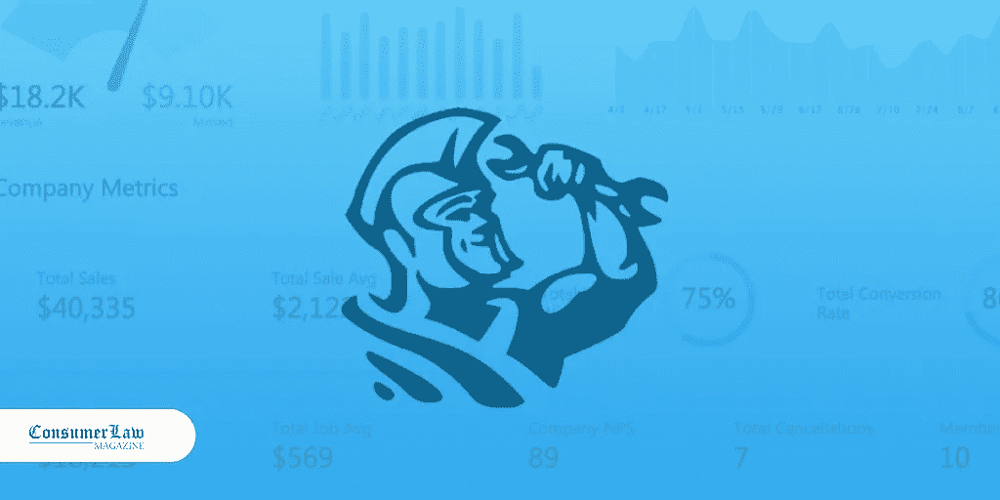

# ServiceTitan 为其家庭服务软件筹集了 1 . 65 亿美元

> 原文：<https://medium.datadriveninvestor.com/servicetitan-raises-165m-for-its-home-service-software-a3ec7852b466?source=collection_archive---------57----------------------->

总部位于格伦代尔的初创公司 ServiceTitan 筹集了 1.65 亿美元，为空调、管道和电气维修等家庭服务业务建立了一个软件平台。据该公司消息人士称，该合资企业目前的估值为 16.5 亿美元。该公司设法在一个潜在的巨大市场中获得了发言权。在美国，每年约有 4000 亿美元用于家庭服务维修

# 服务泰坦的故事

《服务巨人》的故事是一个美国梦故事，讲述的是人们白手起家，通过努力工作和奉献获得数十亿美元的故事。

该公司由 Ara Mahdessian 和 Vahe Kuzoyan 共同创立。两人在亚美尼亚学生协会组织的一次滑雪旅行中相遇。大学毕业后，Ara 和 Vahe 开发了软件来帮助他们的父亲经营空调业务。

但联合创始人说，故事开始于很久以前，当时他们的家庭移民到美国，没有钱也没有工作。他们甚至不会说这种语言。他们努力工作为他们的孩子提供食物和教育。也许这种奉献是 Ara 和 Vahe 渴望的源泉，他们想在他们所做的事情上出类拔萃，以向他们的父母致敬。

六年后，Vahe 和 Ara 加入他们的家庭，帮助空调业务，他们建立了一个[软件平台](http://consumerlawmagazine.com/apps-for-attorneys/)，这已经成为美国和加拿大公司最需要的工具之一。

“今天，我们很自豪地宣布 ServiceTitan 的另一个里程碑，也是垂直软件和 SoCal 的一个里程碑:由 Index Ventures 的[尼娜·阿查德坚](https://www.linkedin.com/in/nina-achadjian-00aa1812/)领导的 1.65 亿美元的 D 轮融资，以及现有投资者 Iconiq、Battery 和 Bessemer，她加入了我们的董事会。Ara Mahdessian 说:“这是纵向 SaaS 公司有史以来最大的一次融资，也是南加州历史上最大的一轮 SaaS 融资。

# 联合创始人渴望得到更多

现在，该公司为美国和加拿大近 20%的家庭提供健身服务。

Mahdessian 认为这只是一个新的开始。“这项新投资意味着我们可以壮大我们的产品和工程团队，努力使 ServiceTitan 成为面向家庭服务企业的更全面的操作系统，并更好地改善我们客户的生活。”

移民家庭英雄的真实感人的故事让你相信，通过努力工作和奉献，你可以取得比你期望的更多的成就。不仅如此……父母的奉献精神让他们的孩子渴望新的开始和更好的成就。

要阅读 D 系列新闻稿，[点击这里](https://www.servicetitan.com/press/servicetitan-secures-165m-series-funding)。

来源:[http://consumerlawmagazine . com/service titan-software-investment/](http://consumerlawmagazine.com/servicetitan-software-investment/)