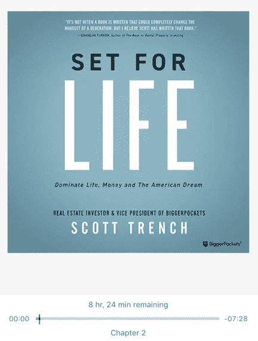

# 为生活做准备

> 原文：<https://medium.datadriveninvestor.com/set-for-life-e99cf2ddc61e?source=collection_archive---------14----------------------->

我把他的书列在我的阅读清单上有一段时间了。虽然这是一本我认为很有见地的书——尤其是在非常喜欢约翰·科廷斯的《上帝与金钱》这本书之后，但它与我预期的略有不同。我确实喜欢书中的一些内容，也喜欢其中的一些目标和观点，但觉得它们与我想要做的事情不太一致。

这本书以谈论工作和典型的朝九晚五的工作以及这对人们意味着什么开始。长途通勤通常是人们工作的结果。我忘记了平均通勤时间是多少，但我认为它接近 30 分钟。以下是作者根据最近的一些数据对通勤时间的看法:

## 通勤时间长的人往往有:

> 高血压
> 
> 不太可能快乐
> 
> 更高水平的压力和焦虑
> 
> 往往更穷、更胖、更不快乐、压力更大、效率更低

这本书是以一种自然的方式组织的，首先关注的是赚钱，然后管理钱，成为上帝赐予我们的东西的好管家。在我看来，所有的事情都很重要，但我认为一般人对第四件事不够重视。如果我们停留在琐碎的事情上，并在这些事情上花费更多的时间，我们将会从本可以更好地利用这些精力的地方“窃取”精力。虽然一开始这肯定不是件容易的事，但通过练习，我相信它会变得很自然。

# 赚更多钱的 5 个策略:

1.  把自己放在一个高成就的环境中
2.  永远阅读和自我教育
3.  注重持续改进
4.  立即做出琐碎的决定——我们只需要快速做出琐碎的决定，选择合理快速的事情，然后把这个决定抛在脑后，因为没有重大影响。
5.  把自己放在幸运的位置上

Photo by [Fabian Blank](https://unsplash.com/@blankerwahnsinn?utm_source=medium&utm_medium=referral) on [Unsplash](https://unsplash.com?utm_source=medium&utm_medium=referral)

这本书，当然，都是关于为生活*财务*做准备。正因为如此，作者想确定为我们定义它。至于方程式，我相信那只是财政学 101。赚的比花的多。我没有看到很多人做的一件非常重要的事情是确定一种理想的生活方式，并将其量化。为了更深入地理解我们的目标，我们必须知道要花多少钱——不仅仅是经济上的。

财务自由是一种状态，一个人从资产回报中获得足够的收入，不再需要带薪工作来永久维持他们的生活方式。

**财务自由方程式:资产乘以回报必须大于生活方式**

作者花了一点时间来分享财务的 4 个层次。它们足够普遍，应该包括我们所有人。诚实地对待我们的水平并随着时间的推移真实地分析它们是很重要的。我现在保留并创建了一个月支出计划，它允许我做两件事。首先，我知道每一美元去了哪里，每一美元从哪里来。第二，如果有机会，或者我想了解像豪华旅行这样的事情对我来说是否是个好主意，我可以迅速做出调整。当然，目标是财务自由。罗伯特·清崎的《富爸爸穷爸爸，现金流象限》是一本很好的补充书籍。被动收入是以负责任的方式获得财务自由的唯一途径。当然，你可以赢得彩票，但最终，如果你所做的只是像马太福音中耶稣的比喻中的第三个仆人那样埋葬它…那有什么好处呢？这不是你成为上帝所有资源的好管家的方法。

# 4 级财务:

## 1.现金流为负—自由级别，最低

> 失去对时间使用方式的控制

## 2.现金流中性——适度的自由水平

> 依靠薪水或小客户，增加净资产，但没有真正的财富，重复这句话会让他们有动力，“如果我继续我目前的职业生涯，我生命中最好的可能结果是有一天我会在我老板的办公室或者一个非常类似的办公室，每天朝九晚五地工作。”

## 3.现金流为正—自由度高

> 生活在他们的标准之下，当机会出现时，他们可以利用机会，导致对他人的依赖不断减少。积极想改善自己的生活，并寻求他人的忠告。帮助他们的最佳方式是向他们介绍资源、教育和机会，让他们能够利用自己的储蓄获得良好的投资回报。他们的周期是——赚。保存。投资。

## 4.财务自由——最高的自由级别

> 现金流需要少量工作或不需要工作。可以控制自己如何支配时间。

这是我没有深入思考过的问题。我希望保持对宏观经济层面的价格变化和趋势的了解，但这个数据对我来说尤其重要。如果人们在 60 岁退休并活到 85 岁，那么在此期间生活成本可能会翻倍。如果你不为此做计划，你的退休气球会蒸发得更快，你可能需要减少你的生活方式。

消费者价格指数显示，年平均通货膨胀率为 3.2%，价格大约每 20 年翻一番。

任何长期投资并获得巨大成功的投资者都会强调第一批核心租户。你投资这笔钱是有原因的，为什么要花呢？简单。不要。关于努力的第四个核心要素是我在生活的各个领域中已经意识到的。作者强调，除非我们是华尔街的金融经纪人，否则我们为什么要关注股市？

Photo by [Chris Liverani](https://unsplash.com/@chrisliverani?utm_source=medium&utm_medium=referral) on [Unsplash](https://unsplash.com?utm_source=medium&utm_medium=referral)

除非我们有数百万的投资组合，否则我们赚不了多少钱，让别人来管理你的投资在经济上更明智。我想很多人都忘了这个第 7 房客。如果许多人谈论房地产有多棒，许多人可能会寻求乘风破浪，但如果没有激情和知识，他们不太可能获得成功。

# 投资的 7 个核心要素:

1.  永远不要花原则
2.  将大部分投资回报进行再投资
3.  要投资，必须有资本
4.  只有在你控制投资的情况下，努力才与回报相关
5.  投资回报受到知识的影响
6.  不要混淆波动性和风险
7.  最佳投资取决于投资者的个人情况

Photo by [Helloquence](https://unsplash.com/@helloquence?utm_source=medium&utm_medium=referral) on [Unsplash](https://unsplash.com?utm_source=medium&utm_medium=referral)

我很高兴我通过自己的方式完成了这本书，但它并没有给我留下很大的影响。我研究了许多其他关于财务独立、投资和资金管理的话题，也许这就是原因。尽管如此，我还是很喜欢这本书，并会推荐给那些努力追求财务自由、需要一个完善计划的人。

**我给这本书打了 2/5**

[要阅读这本书，请点击这里](https://amzn.to/32IH11O)