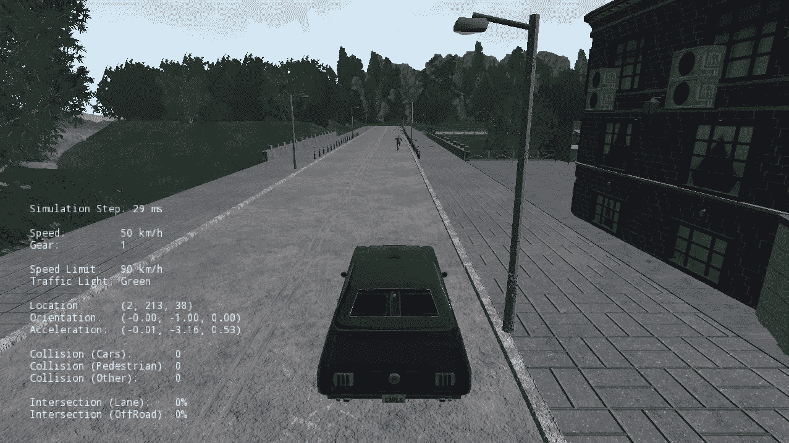
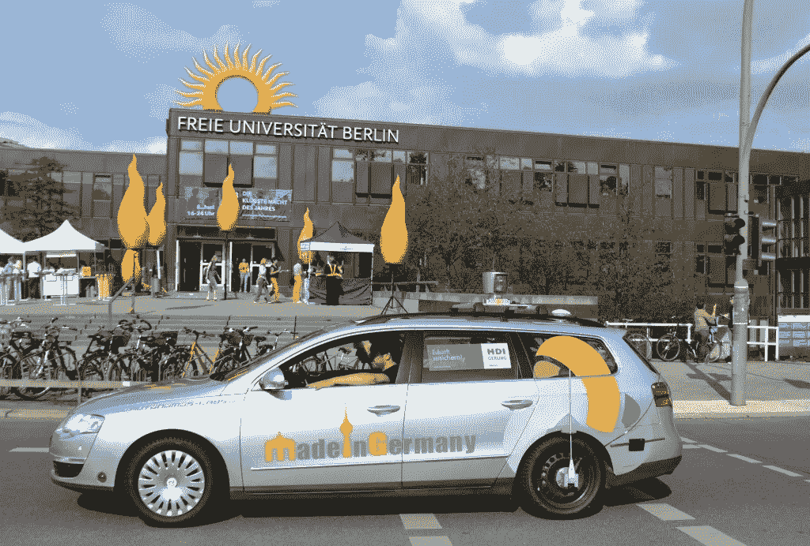
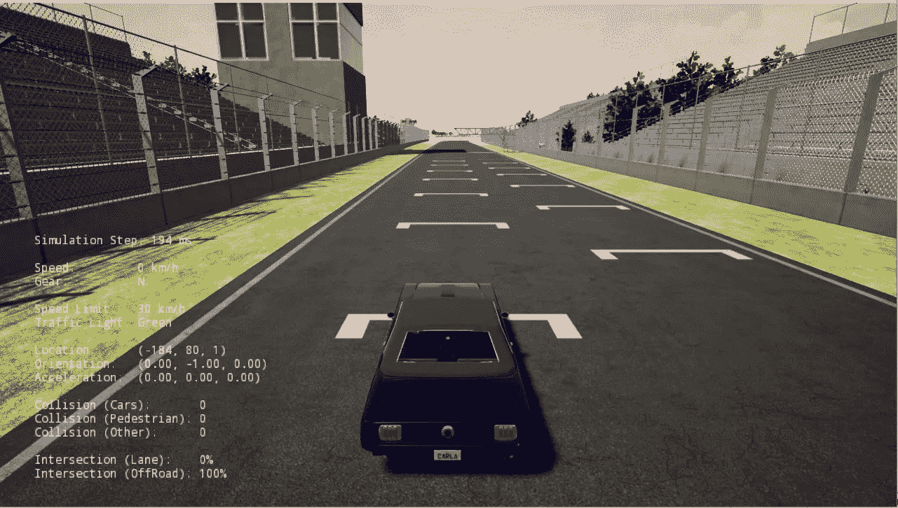
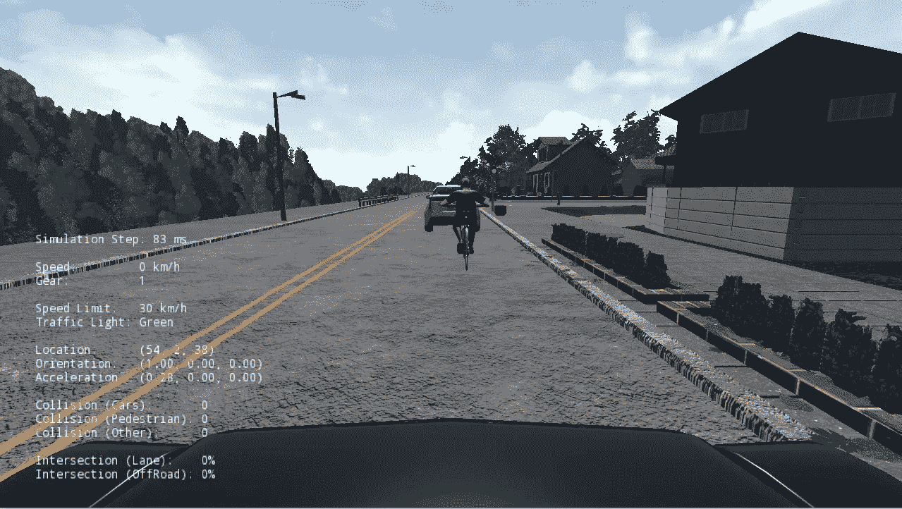
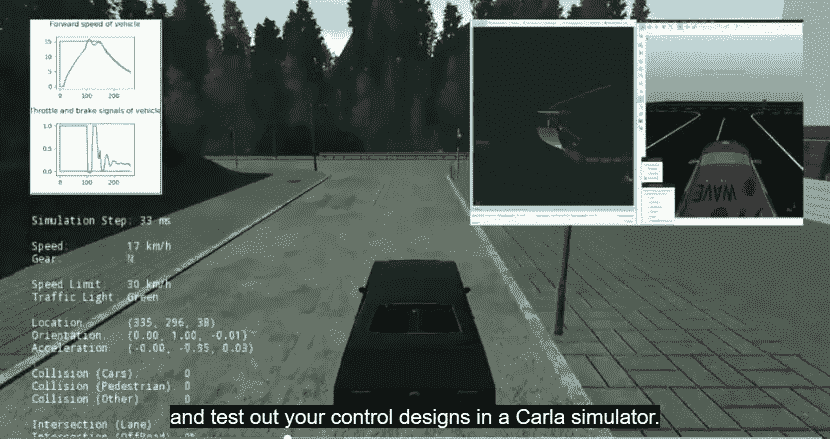
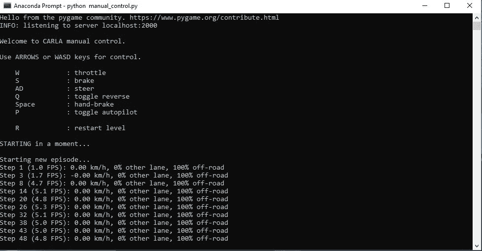

# 为自动驾驶汽车专业化建立卡拉模拟器

> 原文：<https://medium.datadriveninvestor.com/setting-up-carla-simulator-for-the-self-driving-cars-specialization-d38d4f6a0486?source=collection_archive---------0----------------------->

[](http://www.track.datadriveninvestor.com/1B9E)

根据*汽车技术新闻*出版物，由内华达大学雷诺分校教授 Raul Rojas 领导的一个研究小组乘坐一辆名为 Autonomos 的特殊高科技 2010 款帕萨特大众旅行车完成了从诺加利斯到墨西哥城的 1500 英里旅程。自动驾驶汽车从柏林发出，自 2011 年以来，它已经批准在公共道路上进行测试。

“MadeInGermany”是墨西哥第一辆自动驾驶汽车。这辆车首先被空运到休斯顿，然后从那里开到圣安东尼奥，在西南研究所进行一系列测试。“MadeInGermany”被展示为以自主方式在街道和高速公路上导航。一名安全驾驶员始终在方向盘后面，随时准备干预，而一名副驾驶坐在他身边检查控制计算机的状态。两个乘客可以坐在后座。



# 无人驾驶汽车的好处

我来自墨西哥，可以完美地描绘出墨西哥城、蒙特雷和瓜达拉哈拉等大城市的自动驾驶汽车。

无人驾驶汽车将有助于智能城市的发展。我首先想到的是让环境变得更好。自动驾驶汽车由软件和车轮组成，可以优化油耗。

[](http://go.datadriveninvestor.com/4AI1) [## 挑战你对人工智能和社会的看法的 4 本书——数据驱动的投资者

### 深度学习、像人类一样思考的机器人、人工智能、神经网络——这些技术引发了…

go.datadriveninvestor.com](http://go.datadriveninvestor.com/4AI1) 

这也将有助于更安全的街道，减少因司机失误造成的事故。不再有酒后驾驶或司机分心造成的事故。

忘记通勤中浪费的时间。人们不会为痛苦的通勤而挣扎，因为交通将会减少。自动驾驶系统将检查可用数据，以确定可能的最快和最有效的路线。

同样重要的是，它将有助于节省城市空间。忘了停了很久的车。如果我们在汽车租赁场景中看到自动驾驶汽车，那么自动驾驶汽车将在大部分时间内处于活跃状态。

# 多伦多大学 Coursera 分校的自动驾驶汽车专业

两周前，我开始介绍多伦多大学 Coursera 分校的**自动驾驶汽车专业。我一直在学习自动驾驶汽车软件堆栈的架构和组件，车辆开发的安全框架和当前行业实践，以及自动驾驶汽车常用的硬件。**

期末专题包括为卡拉模拟器编写和实现一个控制器。主要目标是通过导航预设的路点来控制车辆沿着赛道行驶。车辆需要以一定的期望速度到达这些航路点，因此需要纵向和横向控制。

时间飞逝，所以，我决定测试我的笔记本电脑，安装需求和平台，以便尽快开始最后的项目。

让我们从卡拉模拟器开始:

# 卡拉模拟器是什么？



**CARLA** 是一个用于自动驾驶研究的开源模拟器。CARLA 是为了支持自动驾驶系统的开发、培训和验证而从头开始开发的。除了开源代码和协议，CARLA 还提供为此目的而创建的开放数字资产(城市布局、建筑、车辆),可以免费使用。仿真平台支持传感器套件和环境条件的灵活规格。

您可以在这里找到 CARLA 开源代码:

[](https://github.com/carla-simulator/carla) [## 卡拉-模拟器/卡拉

### 用于自动驾驶研究的开源模拟器。-卡拉模拟器/卡拉

github.com](https://github.com/carla-simulator/carla) 

# 硬件要求

根据 Coursera，CARLA 模拟器的硬件推荐如下:

*   四核英特尔或 AMD 处理器，2.5 GHz 或更快
*   NVIDIA GeForce 470 GTX 或 AMD 镭龙 6870 高清系列卡或更高
*   8 GB 内存
*   10GB 硬盘空间用于模拟器设置

我的笔记本电脑是英特尔酷睿 i3-7130 u 2.70 GHz，高清显卡 620，8 GB 内存，我可以毫无问题地运行 CARLA。

# 软件要求

您需要安装以下软件:

*   运行 Windows 7 64 位或更高版本。
*   CARLA 要求启用网络，防火墙允许访问 CARLA 加载程序，默认情况下，网络上的端口 2000、2001 和 2002 (TCP 和 UDP)可用。当您第一次在服务器模式下运行 CARLA 时，如果您的系统还不能访问这些端口，Windows 将提示您允许应用程序访问这些端口
*   打开 GL 3.3 或以上版本和 DirectX 10

# 下载并解压缩 CARLA 模拟器

一旦我们下载了卡拉模拟器，我们提取文件在一个新的文件夹中。进入文件夹后，我们在终端中运行以下命令:

```
**CarlaUE4.exe -windowed -carla-no-networking**
```

您可能需要允许 CARLA 通过 Windows 防火墙进行访问。点击**允许访问**后，你会看到卡拉模拟器正在工作！



在这里，我用模拟器在自动驾驶模式下录制了一段视频。要激活自动驾驶，使用 **P** 键(但它只在带有预定义道路的地图中有效，例如 CARLA 提供的 Town01 和 Town02 地图)。

您可以使用 **A、S、D** 和 **W** 键在地图上手动驾驶车辆。使用 **Q** 键切换反向和正向驱动模式。

# 服务器-客户端模式下的 CARLA

如果我们想传递命令并从 CARLA 模拟器接收数据，我们需要在服务器-客户端模式下运行 CARLA，这对于专业的最终项目非常重要。

为此，我们需要通过在终端中运行以下命令来启用 CARLA 模拟器的服务器模式(只需记住允许 CARLA 通过 Windows 防火墙访问网络，就像我们之前所做的那样) :

```
**cd \Coursera\CarlaSimulator\> CarlaUE4.exe /Game/Maps/RaceTrack -windowed -carla-server -benchmark-fps=20**
```

在另一个终端中，我运行了示例 Python 客户端(manual_control.py):

```
**cd \Coursera\CarlaSimulator\PythonClient\
python manual_control.py**
```

如果您能够正确运行代码，并且 Python 客户端成功连接，将会出现一个新的 pygame 窗口，如下所示:



您会注意到，在服务器-客户端模式下，CARLA 模拟器窗口不会接收键盘输入)，但它会在 pygame 窗口上工作，并手动驾驶车辆，然后尝试对模拟器进行同样的操作。

Python 客户端(manual_control.py，加载 pygame 窗口)主动监听键盘命令，并将控制命令传递给 CARLA simulator 服务器。它还接收 CARLA 服务器信息并转发信息(例如左下角的深度图和右下角的语义分段)。你可以在下面看到:



要关闭 Python 客户端，在运行 Python 客户端的终端上按下 **Ctrl-C** 。

拿到卡拉后，希望尽快开始最后的项目！

# 参考

**卡拉模拟器网站:**

[](http://carla.org/) [## 卡拉

### 用于自动驾驶研究的开源模拟器。

carla.org](http://carla.org/) 

**观看关于卡拉的视频:**

## **自动驾驶汽车(2006–2015)**

[](http://dcis.inf.fu-berlin.de/rojas/autonomous-cars-2006-2015/) [## 自动驾驶汽车(2006-2015 年)

### 自 2006 年以来，我们一直在开发自动驾驶汽车。柏林大学是柏林地区唯一的一所大学(并且…

DCIS . INF . fu-柏林. de](http://dcis.inf.fu-berlin.de/rojas/autonomous-cars-2006-2015/) [](http://autotechnews.net/2016/05/30/a-researcher-team-from-university-of-nevada-completed-1500-miles-mexican-trek-hand-free-using-a-special-high-technology-volkswagen/) [## 内华达大学的一个研究小组使用一种…

### 由内华达大学雷诺分校教授劳尔·罗哈斯带领的研究小组完成了 1500 英里的旅程…

autotechnews.net](http://autotechnews.net/2016/05/30/a-researcher-team-from-university-of-nevada-completed-1500-miles-mexican-trek-hand-free-using-a-special-high-technology-volkswagen/)