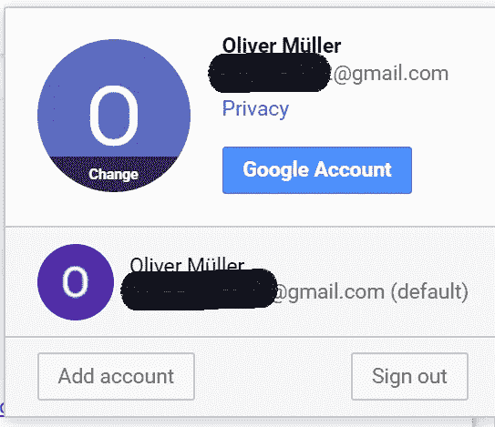
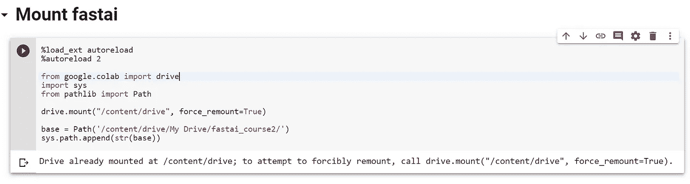
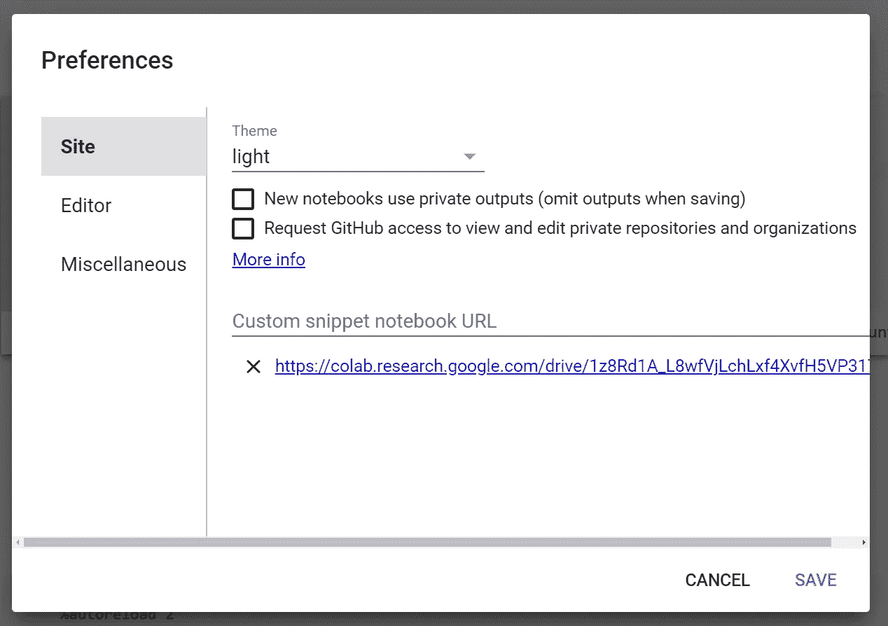
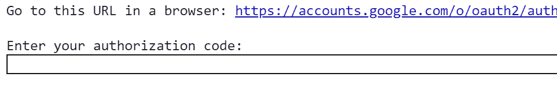
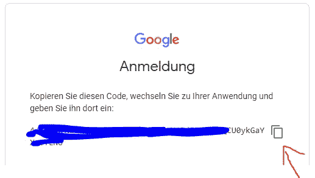

# 为深度学习实验设置 Google Colab

> 原文：<https://medium.datadriveninvestor.com/setting-up-google-colab-for-deeplearning-experiments-53de394ae688?source=collection_archive---------1----------------------->

不是每个人都有带 GPU 的本地机。幸运的是，你可以免费得到一个。


Yes, this is the best I could do.

2019 年 6 月， [fast.ai](https://www.fast.ai/) 发布了其[第二门课程](https://course.fast.ai/part2)“从基础开始的深度学习”(又名“不切实际的深度学习”)。在这些新课程中，杰瑞米·霍华德展示了如何建立深度学习库，以实现最先进的结果。

如果你不仅观看课程，而且自己编写代码，你会从这门课程中获得最大收益。问题是，你需要一些地方来存放你的脚本。否则，您必须将想要重用的每一行代码复制并粘贴到使用它的每一台笔记本上。对文件系统具有完全访问权限的本地机器将是解决方案…

嗯，我没有带 GPU 的机器可以用来做这个。我仍然非常非常想上这门课。因此，我花了一天时间，试图找到一个免费的、适合我的目的的设置。

[](https://www.datadriveninvestor.com/2019/01/23/deep-learning-explained-in-7-steps/) [## 深度学习用 7 个步骤解释-更新|数据驱动的投资者

### 在深度学习的帮助下，自动驾驶汽车、Alexa、医学成像-小工具正在我们周围变得超级智能…

www.datadriveninvestor.com](https://www.datadriveninvestor.com/2019/01/23/deep-learning-explained-in-7-steps/) 

好消息:我成功了！原来你可以配置[Google Colab](https://colab.research.google.com/)+[Google drive](https://drive.google.com/drive/u/1/my-drive)，这样你就可以在本地拥有你的脚本，并且(几乎)在 colab 环境中流畅地使用它们。以下是您的操作方法:

# (可选)步骤 1:创建一个新的 Google 帐户

将你的深度学习实验(数据和脚本)与你的日常主账户分开是一个好主意。所以创建一个新账户就好了，毕竟是免费的。为了更加方便，可以使用主帐户的电子邮件作为新帐户的恢复邮件。

您可以一次登录多个帐户。为此，请打开任何与谷歌相关的页面，如 Gmail、search 等。在右上角，单击您的个人资料图标。在打开的窗口底部，点击**添加账户**。

这两个账户现在都可以使用谷歌的任何服务。在遵循其余说明时，请确保选择了正确的帐户。您可以在同一个菜单上执行此操作:



# 步骤 2:创建一个专用的开发文件夹

接下来，您需要在 Google Drive 中建立一个文件夹，您将在其中进行开发。此文件夹将是您的本地开发和联机笔记本之间的连接。有两种方法可以做到这一点。最方便的方法是使用谷歌的 windows 客户端，名为[**BackupAndSync**](https://www.google.com/intl/de_ALL/drive/download/backup-and-sync/)**(谷歌只给我德语链接…自己搜索)。**

**我不会重复设置 backup 和 Sync 的细节。如果你需要帮助，可以看看这个教程。**

**设置完成后，您可以在本地计算机上创建一个文件夹并操作其内容。任何更改都将自动与您的 GoogleDrive 同步。同步可能需要几秒钟的时间，但对我来说，它几乎可以立即生效。**

**如果你在一个不允许**备份和同步**的环境中，例如，因为你在防火墙后面，有另一种方法。不过这一个就不太方便了。**

**打开[驱动 web 界面](https://drive.google.com/drive/u/1/)并导航至您的开发文件夹。你会在这里看到它的内容。现在，每当您想要同步文件时，请将其拖放到该文件夹中。有关这方面的一些提示，请参见故障排除部分。**

# **步骤 3:创建片段笔记本**

**你现在有一个开发文件夹，它(半)自动同步到你的驱动器。但是怎么用在笔记本上呢？**

**首先，安装它。这样就可以在笔记本中访问您的驱动器。**

```
from google.colab import drive
from pathlib import Pathdrive.mount("/content/drive", force_remount=True)
```

**然后告诉您的 python 环境在哪里可以找到您的脚本:**

```
base = Path('/content/drive/My Drive/fastai_course2/')
sys.path.append(str(base))
```

**仅此而已。您现在可以调用类似**

```
from preprocessing import *
```

**其中*预处理*是 *fastai_course2* 内部的文件/模块。**

## **(可选)片段**

**记住或复制+粘贴安装驱动器的步骤是乏味的。幸运的是，Colab 拥有*片段*特性:**

****创建一个片段****

**创建一个新的笔记本，我把我的叫做*片段*。在笔记本中，创建一个使用# title 描述代码片段的 markdown 单元格。在单元格下方，粘贴上面的行:**

```
%load_ext autoreload
%autoreload 2

from google.colab import drive
import sys
from pathlib import Pathdrive.mount("/content/drive", force_remount=True)base = Path('/content/drive/My Drive/fastai_course2/')
sys.path.append(str(base))
```

**它应该是这样的:**

****

****登记片段笔记本****

**注册您的 snippet 笔记本会使其内容对您的 google 帐户中的所有笔记本可用。**

1.  **复制摘录笔记本 URL**
2.  **在任一笔记本的菜单中，进入**工具- >首选项****
3.  **将 URL 粘贴到显示**自定义代码片段笔记本 URL** 的位置**

****

****使用片段****

**在任何笔记本中，您现在都可以:**

1.  **通过单击屏幕左上角的箭头打开左侧边栏**
2.  **将选项卡更改为**代码片段****
3.  **搜索您的片段。标题是您之前在减价单元格中输入的内容**
4.  **点击**插入**。这会将代码段复制到笔记本中的一个单元格中**
5.  **运行手机。**

**通常，这将启动身份验证过程。这意味着您将看到类似这样的内容:**

****

**点击链接，选择合适的 Google 帐户并确认。该页面现在将显示授权码。使用右边的图标将其复制到剪贴板，然后粘贴到笔记本的文本字段中，并按 enter 键。**

****

# **工作流程**

**您的本地机器和 colab 笔记本电脑之间的同步将不会完美。尤其是当你通过网络界面来做的时候。因此，最大限度地减少所需的同步量是明智之举。对我来说，这个工作流程很好:**

1.  **创建新笔记本。在菜单中启用 GPU:**编辑- >笔记本设置- >硬件加速器- > GPU****
2.  **通过代码片段挂载开发文件夹**
3.  **开发/测试/重构。确保您的代码按预期运行。**
4.  **将所有想要重用的代码复制到本地文件夹中的文件中。我建立了一种项目结构，将所有的方法和类放入相应的文件中(例如，所有回调的 callbacks.py)。如果您需要创建新的文件夹/文件，请这样做。**
5.  **同步。自动或通过网络界面。有关提示，请参见故障排除。**
6.  **现在，您可以在任何运行 mount-snippet 的笔记本中使用您的文件**

# **解决纷争**

**事情并不总是一帆风顺。到目前为止，我能解决任何问题。以下是我目前遇到的事情:**

*   ****同步时不会更新现有文件，而是制作一份副本(文件名(1))。py)** 。要解决这个问题，请删除文件的两个版本，然后重新上传。然后看一下下面的点。**
*   ****web 界面没有意识到我要更新一个文件，而不是新建一个**(同名，导致上面的问题)。我发现上传单个文件并把它们放在网上可以解决这个问题。或者，当同步大量文件时，在上传新文件之前删除在线版本。你可以删除整个 dev 文件夹，然后重新上传你的本地文件夹(如果不是太大的话)**
*   ****我同步了我的文件，但 python 仍然使用旧版本。**当你更新一个源文件时，python 不会自动重新加载它。您必须激活 *autoreload 扩展*(挂载代码片段会为您做这件事),然后为更改的文件重新运行 import 语句。**
*   **我同步了我的文件，但 colab 仍然使用旧版本。如果以上没有解决您的问题，您可以尝试再次运行该代码片段。有时这可以解决问题。如果不是，可能是 colab 真的仍然使用旧版本的文件。在这种情况下，你必须进入菜单:**运行时间- >重置所有运行时间**。现在，您必须从上到下再次运行您的脚本，包括 mounting-snippet-cell。**
*   ****我的脚本可以在我的本地机器上运行，但不能在 colab 上运行。**这可能有很多原因，其中大部分都是一般性的事情。我不能一一列举，但有一个是常见的:Colab 运行 Linux 的一些发行版。当您使用路径时，您可能已经以一种只在本地 windows 机器上工作的方式完成了它。Python 提供了所有工具来编写与操作系统无关的程序。例如，要解决路径问题，不要手动添加路径，而是使用 *os.path.join* 来代替。所以**..\..\data** 变成了 **os.path.join(' .. ', '..'，'数据)**。**

# **结论**

**所有这些设置和使用起来是否比拥有一台可以运行您的代码的本地机器更复杂？绝对的。还能用它来开发或者跟随 fastai2019 part2 课程吗？绝对的。使用上面的工作流程，我几乎完成了整个课程，我已经学到了很多。**

**如果你有问题，让我知道，我会看看我能做什么。**