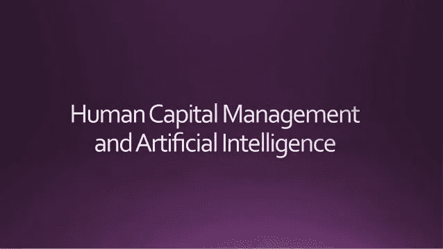

# 在改变人工智能的应用中建立你的企业。

> 原文：<https://medium.datadriveninvestor.com/setting-up-your-business-in-changing-the-utilization-of-artificial-intelligence-195a61b78d36?source=collection_archive---------43----------------------->

计算机化推理或人工智能是处理的最终命运，也是未来十年未来发展的最佳驱动力之一。人工智能出现在自动协调的车辆、声控的高级同事，以及带有独特标记和面部识别的多功能和不同的小工具中。

这只是开始！ [***人工智能帮助人类学习和创造的能力***](https://www.forbes.com/sites/joemckendrick/2018/10/12/creative-types-say-artificial-intelligence-will-help-not-hurt-their-jobs/) 在改变我们对商业挑战的看法方面，当我们看看它如何通过整个关联与形式联系起来时，这是一个明显的优势。

# 人工智能能以何种方式增强我们的业务流程管理？

截至目前，AI 是供应链业务流程管理和 [***在线人力资本管理***](http://simplelogix.com/human-capital-management.html) 的特色帮凶。基于计算机的智能可以帮助日常工作电脑化，增强用户界面和检查大量的信息。有了 Simplelogix 人工智能模块，你可以将任何活动的 45%或更多的部分计算机化。这使您的代表能够专注于更多的基本任务。

# 人工智能驱动通用方言配合各种应用吗？

人工智能驱动的标准方言界面使与应用程序的合作变得清晰和方便。通过理解所讲的话及其独特的情况，它加快了在一个过程中委托单个步骤的大量时间。这是一个模型…常规的方言准备可以允许将数据对应到一个小工具中，然后在这一点上填充合适的表单、订单等等。它同样可以通过识别关键的起源和表达来浓缩巨大的方块信息或内容。

# 调查和识别大量信息测量中的设计。

机器学习是人工智能的一部分。机器学习将通过识别信息之间的关系并最终从信息中得出所有选择结果，通过重复信息来调查和区分巨大信息度量中的设计。随着每一个周期的进行，系统获得了一个更深刻的理解，即为什么在一个商业协会内部做出选择，并要求进行可测量的检查，以围绕这些选择建立控制。在商业活动的复杂区域，例如，**生产网络管理**，机器学习可以预测库存何时会减少或用完。它甚至可以给你一个建议，哪些事情是在溢出。听起来非同寻常，对吗？然而，它可以走得更远，自然地减少一个项目或东西脱销的成本。

现在的 [***人工智能***](https://en.wikipedia.org/wiki/Artificial_intelligence) 在过程机械化中承担了巨大的工作，并且预计在未来相当长的时间内在过程机器人化中承担值得注意的工作。

正如你所知道的，人工智能在许多商业协会或潜在企业的过程自动化和增强中承担着重要的工作。最重要的是，随着我们继续选择 AI 进步，它们将更容易执行，并在业务流程管理中提供新的和包含的应用程序。Simplelogix 人工智能模块将与您和您的团队合作，以确保您在用不断涌现的创新改变您的现有系统和让您在您的行业内保持领先方面达到最佳平衡。