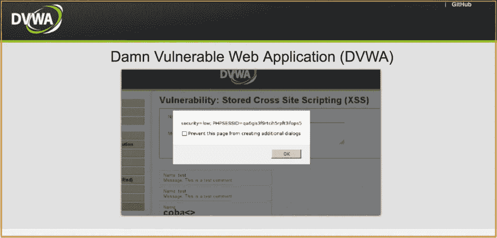
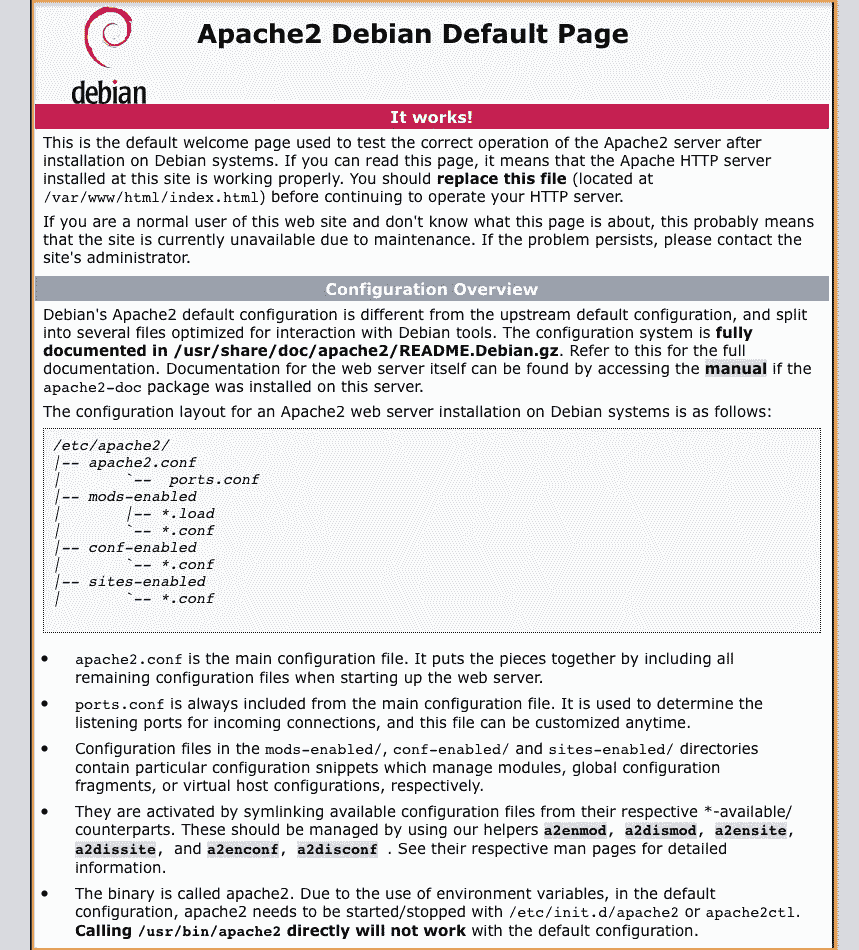
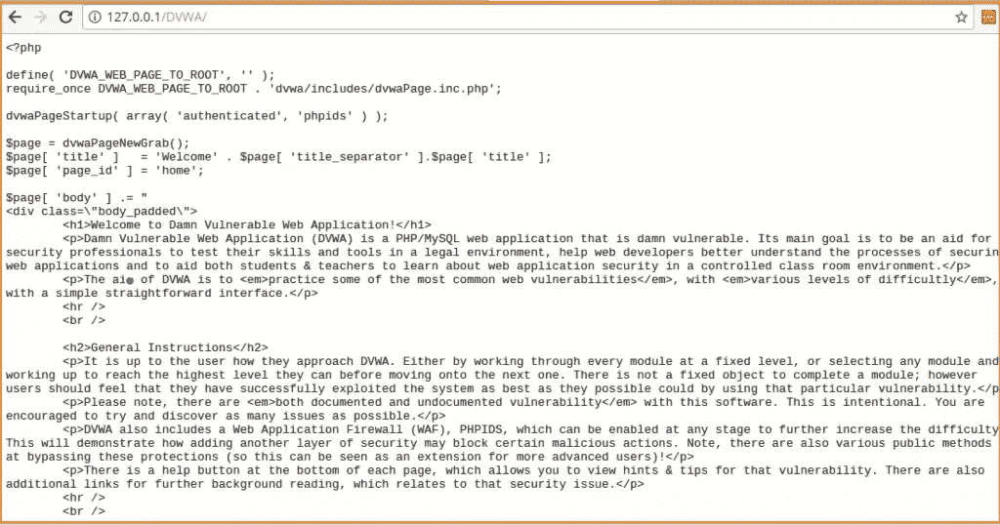
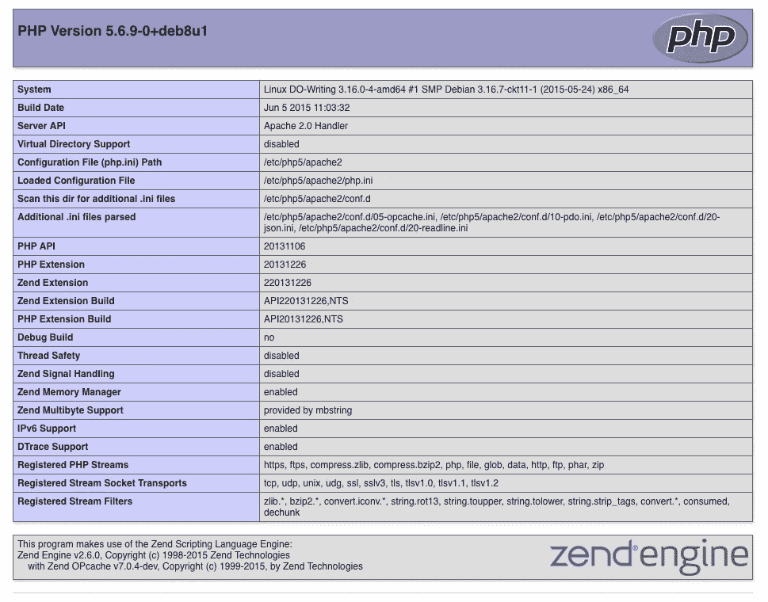
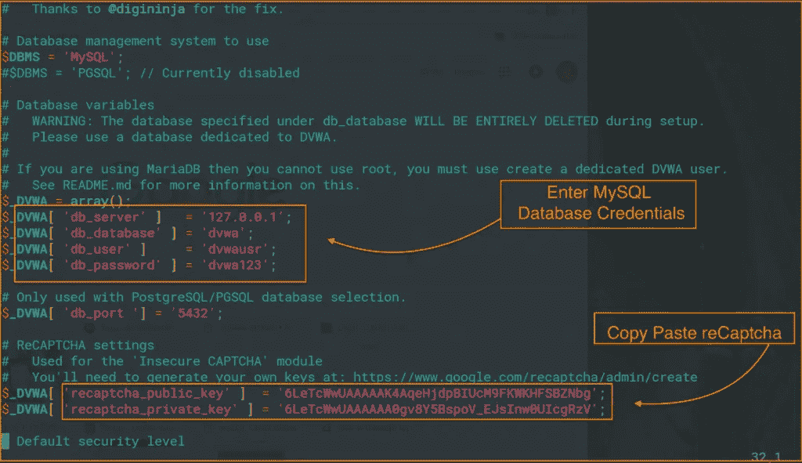
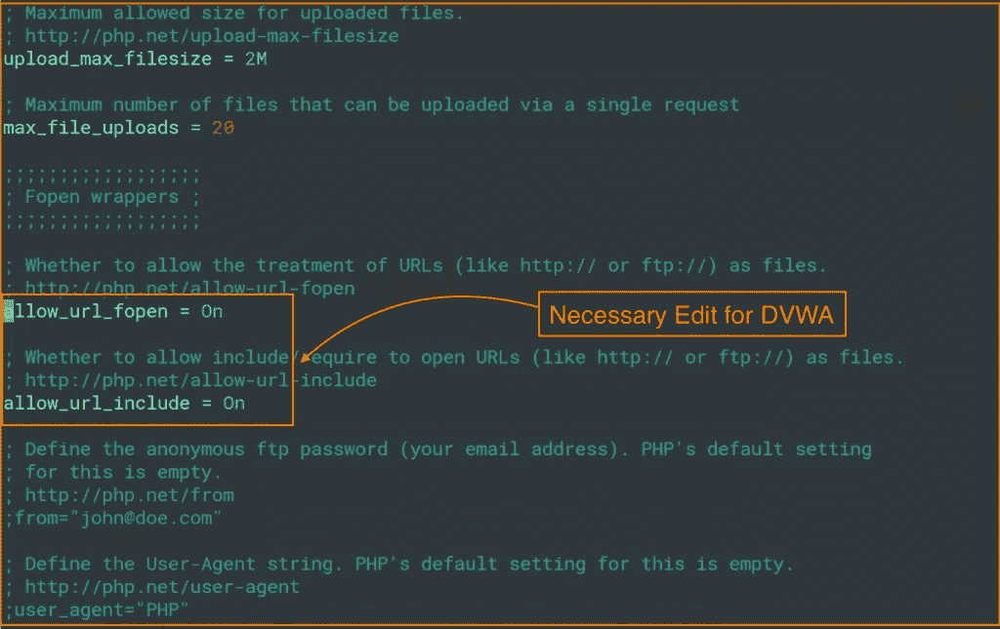
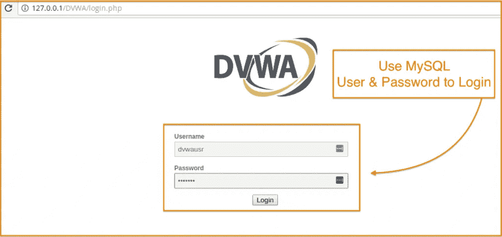

# 如何将 DVWA 安装到您的 Linux 发行版中

> 原文：<https://medium.datadriveninvestor.com/setup-install-dvwa-into-your-linux-distribution-d76dc3b80357?source=collection_archive---------0----------------------->

Install DVWA in 5 Easy Steps

在本教程中，我将向您展示如何在本地主机上安装易受攻击的 Web 应用程序(DVWA)以及 Apache、MySQL 和 PHP。新手总是关心他们应该在哪里练习和探索漏洞。如果你是其中的一员，DVWA 会让你自己去发现。我将帮助你在你的 Linux 发行版中创建一个黑客环境来练习和测试你的技能。

如果你是一个 web 安全初学者，你将会从这个[**棋子**](https://sinxloud.com/beginner-web-security-researcher/) **中获益匪浅。**

[https://sinxloud.com/beginner-web-security-researcher/](https://sinxloud.com/beginner-web-security-researcher/)

DVWA 是用 PHP 和 MySQL 制作的，用于安全专业人士或有志于安全专业人士发现尽可能多的问题，并利用一些 web 平台最常见的漏洞，如 **SQL 注入**、**跨站脚本** ( *XSS* )、**跨站请求伪造** ( *CSRF* )等等。

Image Source: [www.dvwa.co.uk](http://www.dvwa.co.uk)

注意:这个指南是给初学者的。如果您无法完成任何步骤或在安装过程中遇到任何错误信息。我鼓励你用 [StackOverflow](http://stackoverflow.com/) 来回答或者在下面留下评论。

# 以下是如何安装 DVWA 的 5 个简单步骤

**先决条件:**

**Hypervisor:**[VirtualBox](https://www.virtualbox.org/wiki/Downloads%29)

**Linux 发行版:** [Kali Linux](https://www.kali.org/downloads/%29) *或* [elementaryOS](https://elementary.io/) (或任何 Linux 发行版)

我总是更喜欢使用 **elementaryOS** ，它是基于轻量级 Linux 的发行版，但是你可以遵循同样的指令使用 **Kali Linux** ，它旨在进行高级渗透测试和安全审计。**记住**，我们需要使用一个虚拟机，而不是一个连接的服务器，因为 **DVWA** 真的很容易受到攻击，应该只安装在有 NAT 的虚拟机上。

## 第一步。安装 Web 服务器(安装 Apache)

*   要安装 Apache，请打开您的终端并键入以下内容:

> *sudo apt 安装* ***apache2***

完成后，在浏览器中键入 **127.0.0.1** ,您将看到默认的 Apache 2 网页，如下所示:

If you see this page, then congratulations — you have successfully installed Apache.

查看完该测试页面后，您可以通过键入以下命令来删除它:

> *sudo RM/var/*[www/html/info . html](http://www/html/info.html)

# 第二步。下载 DVWA

我们需要从 Github 下载 DVWA 的档案。

*   要安装 Git，请键入以下命令:

> *sudo apt-get 安装 git*

*   转到 **apache2** 文件夹。

> *CD/var/*[*www/html/*](http://www/html/)

*   从 **Github** 克隆 **DVWA** ，键入以下命令:

> *须藤吉克隆*[*https://github.com/ethicalhack3r/DVWA.git*](https://github.com/ethicalhack3r/DVWA.git)

完成后，在浏览器中键入 **127.0.0.1/DVWA/** ，您将看到 DVWA 页面，如下所示:

Test DVWA Apache Page

*   更改 DVWA 的权限

> *须藤 chmod-R 777/var/*[*www/html/DVWA/*](http://www/html/DVWA/)

## 第三步。安装 MySQL

设置 DVWA 的下一步是安装 MySQL。

*   要安装 **MySQL，**请键入以下内容:

> *sudo 安装 mysql-server*

请注意，安装程序可能会要求您为 **root** MySQL 用户创建一个新密码。一旦您完成了所有必需的步骤，您的 MySQL 安装就应该完成了。让我们仔细检查一下我们新的 MySQL 服务器是否正在运行。键入以下命令:

> *mysql -u root -p*

输入您在安装软件包时为 MySQL 创建的 root 密码。进入后，通过下面的内容可以获得服务器状态、版本信息和更多信息:

> *状态*

这是确保您已经安装了 MySQL 并准备好进一步配置的好方法。

*   重启 **Apache** 服务器

> *sudo 服务 apache2 重启*

*   **创建数据库和用户**

要创建 MySQL **数据库**和用户，请遵循以下步骤:

在命令行中，键入以下内容:

> *mysql -u root -p*

*   键入 MySQL root 密码，然后按 Enter 键。
*   要创建数据库，请键入以下命令:

> *创建数据库****dvwadb****；*

*   要创建数据库用户，请键入以下命令。将 ***dvwausr*** 替换为您想要创建的用户，将 **dvwa@123** 替换为该用户的密码:

> *创建由“dvwar@123”标识的用户“dvwausr”@“127 . 0 . 0 . 1”；*

*   授予权限，请键入以下命令:

> *授予 dvwadb 上的所有权限。* TO '****' dvwausr ' @ ' localhost****' IDENTIFIED BY '****dvwa @ 123****'；*

*   完成后，通过键入以下命令之一退出应用程序:

> *\q*
> 
> ***(或)***
> 
> *退出*

## 第四步。安装 PHP5

对于我们在 **DVWA** 安装中的最后一个组件，我们将设置并安装 PHP。在你的虚拟机上安装这个很容易。

*   要安装 PHP，只需输入以下命令:

> sudo 安装 php5

或者

> *sudo apt 安装 php5.6*

同意安装，PHP 5 将被安装到你的服务器上。

*   重启**阿帕奇**服务器

> *sudo 服务 apache2 重启*

现在，让我们花一点时间来测试您刚刚安装的 PHP 软件。移动到您的公共 web 目录:

> *CD/var/*T44*www/html*

在那里，通过键入以下命令，使用文本编辑器创建一个名为 info.php 的文件:

> *须藤维姆 info.php*

这个命令将使用命令行编辑器 vim 打开一个新的同名的空白文件。在该文件中，键入以下内容:

**在这个文件里面，复制粘贴以下内容:**

> *<？PHP phpinfo()；？>*

**通过输入**保存您的更改

> *:wq！*

完成后，打开你的网络浏览器，在浏览器中输入你的本地主机 IP 地址。

> [http://127 . 0 . 0 . 1/info . PHP](http://127.0.0.1/info.php)

您将看到默认的 PHP 信息页面，如下所示:

当您看完这个 test **PHP** 页面后，如果您愿意，可以通过键入以下命令删除这个文件:

> *sudo RM/var/*[*www/html/info . PHP*](http://www/html/info.php)

*   为 **PHP 安装 **MySQL** 扩展。**

要安装用于 PHP 支持的 **MySQL** 扩展，请键入以下内容:

> sudo 安装 php5-mysql

一旦完成，您就完成了 DVWA 所需的 PHP 安装。

*   安装 **PHP-GD**

DVWA 需要一个 php 模块，但该模块没有安装到 Kali Linux 或 elementaryOS 中。所以我们需要为 APT 添加一个 Debian 源码。

> *须藤 add-apt-repository '***sid main '**
> 
> **sudo apt 更新**
> 
> **sudo 安装 php5-gd**

*一旦完成，您就完成了 DVWA 的 PHP 安装。*

## *第五步。配置 DVWA*

*现在，我们准备编辑 php 配置文件的源代码，以确保您的 web 应用程序连接到数据库，并拥有一个有效的验证码。您可以通过[点击此处](https://www.google.com/recaptcha/intro/index.html)从您的 Google 帐户获取 reCaptcha 密钥。*

*我们将使用文本编辑器编辑配置，键入以下命令:*

*sudo vim/var/[www/html/dvwa/config/config . Inc . PHP . dist](http://www/html/dvwa/config/config.inc.php.dist)*

*   *添加 mysql 数据库的数据库**名称**、**用户**和**密码**。*
*   *输入 **reCaptcha** 键。*

*这里有一个截屏，显示了你的文件在编辑后的样子。*

**

*Enter Database credentials and reCaptcha*

*完成后，我们需要编辑 apache2 的主配置( ***php.ini*** )文件，默认情况下，它不会被 **DVWA** 正确覆盖。*

> *sudo vim/etc/PHP 5/Apache 2/PHP . ini*

*   *启用允许 _url_fopen*
*   *启用允许 url 包含*

*这是利用文件上传漏洞所必需的。下面是 ***php.ini*** 修改后的截图。*

**

*Jump to line 821 in php.ini*

*保存了对 ***php.ini*** 的修改后，我们还需要遵循几个步骤。*

*   *安装**冰鼬***

> **sudo 安装冰鼬**

*   *重启**阿帕奇***

> **sudo /etc/init.d/apache2 重启**

*   *重启 **MySQL** 服务*

> **sudo /etc/init.d/mysql 重启**

*完成后，您就完成了 DVWA 所需的配置。*

*   *测试 **DVWA** 安装*

> **ice weasel*[*http://127 . 0 . 0 . 1/DVWA/setup . PHP*](http://127.0.0.1/DVWA/setup.php)*

*您将被重定向到网络浏览器，类似的页面将出现在您面前。*

**

*DVWA Setup Check*

*当你看完这个 DVWA 设置页面，你可以点击创建/重置数据库按钮。您将被重定向到登录页面。*

*   *使用 MySQL 用户和密码登录*

**

*Insert the default credentials (***admin/password***) and log into the panel.*

*现在，通过点击“DVWA 安全”来登录以改变漏洞的强度。*

*低级别:低级别安全性让您可以自由地利用所有已知的漏洞，这意味着在给定的框架中没有安全性，因此如果您是第一次使用它，您可以尝试所有的攻击。*

***中级:**中级安全将拥有所有入门级验证和过滤功能，可以阻止任何脚本小子利用现有漏洞。*

***高水平:**高水平是一种零日环境，如果你能突破它，那么这意味着你正在成为 VAPT 专家的正确道路上。*

> ****最初从低级开始，开始黑客攻击！****

## *你完了。*

*因此，我们在本地主机上建立了一个简单的易受攻击的 web 应用程序。您现在可以 ***探索 DVWA 界面。****

*如果您在安装过程中遇到任何错误或有任何疑问，请在下面的评论中告诉我。*

# ***黑客快乐！***

*你可能也有兴趣查看 [**易受攻击应用**](https://sinxloud.com/kb/vulnerable-apps-practice-ethical-hacking-skills/) 列表，来(合法地)练习你的黑客技术！*

****原载于 2018 年 8 月 26 日***[***sinxloud.com***](https://sinxloud.com/install-dvwa-kali-linux-setup-ethical-hacking-environment/)***。****