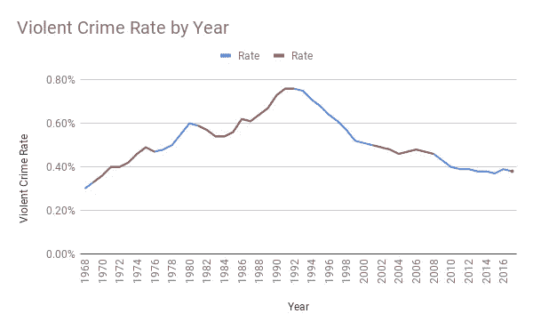
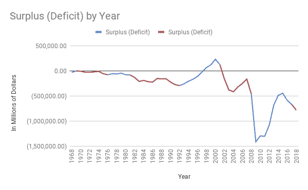
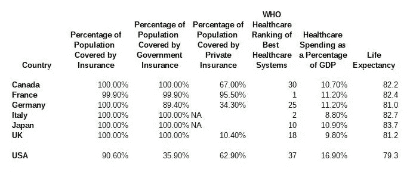

# 共和党传播了几十年的七个谎言

> 原文：<https://medium.datadriveninvestor.com/seven-falsehoods-the-republican-party-has-been-spreading-for-decades-ddf563f215c9?source=collection_archive---------0----------------------->

这些共和党的谎言在唐纳德·特朗普之前就有了。这些谎言为“特朗普主义”奠定了基础。

*免责声明:文章所表达的观点和看法仅属于作者，不一定反映 DDI 的立场。我们建议您通过多种渠道进行自己的独立研究*

Photo by [Brandon Mowinkel](https://unsplash.com/@bmowinkel?utm_source=medium&utm_medium=referral) on [Unsplash](https://unsplash.com?utm_source=medium&utm_medium=referral)

如果这个故事是关于 Trump 所说的谎言，它将是 Mueller 报告的几倍长，没有人会有时间阅读它。这个故事是关于共和党人围绕他们自己和民主党人创造的神话。几十年来，共和党一直在构建这个神话。这些神话是共和党品牌的精髓。问题是，共和党宣传的这种形象与现实不符。一点常识和一点数据的混合将证明这些共和党断言的虚假性。

 [## 保护主义、政治和经济动荡|数据驱动的投资者

### 美国股市昨日出现 400 多点的大幅反转，为未来的事情发出了警告信号。市场…

www.datadriveninvestor.com](https://www.datadriveninvestor.com/2018/06/28/protectionism-politics-economic-turmoil/) 

# 共和党人更擅长管理我们的经济

**事实是，自 1947 年以来的 11 次衰退中，有 9 次始于共和党政府。**见下图:

An interactive version of this graph is available on the Federal Reserve Economic Database (FRED) at [this link](https://fred.stlouisfed.org/series/GDP).

图表上的灰色区域是衰退。第一次民主党衰退是在 1949 年杜鲁门总统执政期间，最后一次是在 1980 年卡特总统执政期间。卡特总统的衰退是 1947 年以来所有衰退中持续时间最短的一次。

1960 年，肯尼迪总统上任第一个季度后，带领我们走出了共和党的衰退。2009 年，奥巴马总统需要两个季度才能让我们的国家走出乔治·w·布什政府时期开始的大衰退。

1953 年，艾森豪威尔总统上任不到两个季度就把我们带入了衰退。1981 年，里根总统在执政两个季度后将我们带入了衰退。2001 年，乔治·w·布什执政一个季度后就把我们带入了衰退。

# 民主党对犯罪手软

我不赞成任何一方对刑事司法或监狱系统的处理。我非常有信心，一个全面的打击犯罪的政策将会比两党在过去几十年里所使用的“严厉打击犯罪”的立法要好得多。也就是说，下面的图表清楚地表明，民主党在打击犯罪方面比共和党成功得多。

The interactive version of this graph can be found at [this link](https://docs.google.com/spreadsheets/d/1Pdo-WBMkuwli8OMsol42n2eFQKNcGv0SnDcOwfpTAD8/edit?usp=sharing).

上图的数据可以在 1968 年至 2014 年的 FBI 的[链接](https://www.ucrdatatool.gov/Search/Crime/State/RunCrimeOneYearofData.cfm)中找到，在 2015 年的[链接](https://www.fbi.gov/news/pressrel/press-releases/fbi-releases-2015-crime-statistics)中找到，在 2016 年的[链接](https://www.fbi.gov/news/pressrel/press-releases/fbi-releases-2016-crime-statistics)中找到，在 2017 年的[链接](https://www.fbi.gov/news/pressrel/press-releases/fbi-releases-2017-crime-statistics)中找到。人口普查局可通过[此链接获得 2015 年至 2017 年的人口数据。这些统计数据是特定年份的暴力犯罪总数除以全国人口。](https://factfinder.census.gov/faces/tableservices/jsf/pages/productview.xhtml?src=bkmk)

。这个图表在民主党执政时期是蓝色的，在共和党执政时期是红色的。很明显，共和党执政期间暴力犯罪的上升和民主党执政期间的下降之间存在关联。数据并不支持民主党“对犯罪手软”的结论。如果有什么不同的话，这些数据很可能表明共和党在犯罪问题上态度软弱。

# 共和党是“林肯的政党”

今天的共和党绝不是林肯的政党。林肯是美国第 16 任总统。现任总统是美国第 45 任总统。用家庭来类比，从林肯到现在有 29 代人。正如一个家族被稀释超过 29 代所预期的那样，今天的共和党和林肯的共和党没有任何相似之处。19 世纪 60 年代，林肯的政党为保护我们当中最弱势群体的权利而战；非裔美国奴隶。今天的共和党把寻求避难的外国人关进笼子。今天的共和党与林肯的政党完全相反。

20 世纪 60 年代初，民主党为所有人争取民权和投票权，成为林肯的政党。民主党不必为少数民族的权利而努力。那时民主党已经统治了几十年。民主党在南方争取投票权和民权时失去了许多支持者。共和党人很乐意接纳这些新成员。

# 民主党人只想获得 51%的选票

我第一次听到这个谎言是在 2000 年代中期的一个早间广播节目中。这不是一场政治秀。这是一对陶醉于成为南方乡下人并标榜自己为最性感的胖子的家伙。这部剧原本应该是一部喜剧，但随着时间的推移，它逐渐变得更加政治化。像大多数南方白人一样，电台主持人有着极端右翼的意识形态。当我第一次听到这个的时候，我心想这是我很久以前就注意到的关于人的一些事情。第一个指责别人犯了错误的人通常是首先犯了错误的人。我当时不知道这个术语，但我们现在知道这种策略是转移和投射。

这个共和党的谈话要点是一个明显的例子，说明共和党人把自己投射到了民主党人身上。这些谈话要点的创造者知道这一点，但他们希望，因为是他们先说的，所以它会留在不知情的选民的脑海中。

2012 年总统竞选期间，米特罗姆尼在一次私人会议上发表了类似的观点。罗姆尼说，民主党人向 47%的选民赠送了礼物。请看来自 YouTube 的视频。罗姆尼的声明并非基于现实，但这真的重要吗？我认为这清楚地表明了哪个政党只想要 51%的选票。

1976 年，裘德·瓦尼斯基在[写了一篇文章](https://www.cnbc.com/id/45768718)，题为《税收和双圣诞老人理论》 **Wanniski 建议共和党人用他们自己的“赠送”项目来对抗民主党的权利项目。共和党的“让步”将是减税。这些减税措施极大地惠及了最富有的美国人。这些减税措施导致了美国历史上最大的财富再分配。这种再分配将财富从穷人和中产阶级转移到最富有的美国人手中。为了继续掌权，这些减税措施必须让足够多的选民受益，以获得多数席位。请看下图，这种“两个圣诞老人”的策略自 20 世纪 70 年代末以来对普通美国工人产生了怎样的效果:**

上面的图表来自经济政策研究所的工作经济学博客[的文章，Top 1.0 达到有史以来最高工资——自 1979 年以来上涨了 157%。](https://www.epi.org/blog/top-1-0-percent-reaches-highest-wages-ever-up-157-percent-since-1979/?source=post_page---------------------------)

民主党的福利项目惠及所有美国人，即医疗保险和社会保障。共和党的减税政策需要惠及 51%，才能让共和党继续执政。因此，共和党人只想获得 51%的选票。如果共和党获得 55%的选票，这意味着他们对中产阶级的减税圣诞老人超出了必要的 4%。因此，共和党人会认为这是为他们的胜利付出了过多。

民主党人只是试图获得 51%的选票的神话是共和党人错误地将他们自己的计划投射到民主党人身上的一个例子。

# 共和党在预算方面更负责任

下图似乎说明了一切；共和党是花钱大手大脚的政党，民主党是精打细算的政党。

An interactive version of this graph can be found at [this link.](https://docs.google.com/spreadsheets/d/1zczq8gMiJcq6oQLk7DhbkbbmySapWxLp0ALzhhNWyF8/edit#gid=0)

上图的数据是在[链接](https://fred.stlouisfed.org/series/FYFSD)处从 FRED 处获取的。

这条线的红色部分是共和党担任总统的时期。这条线的蓝色部分是民主党担任总统的时期。显然，赤字最大的时期是共和党人担任总统的时期。这个普遍规律的唯一例外是奥巴马总统的第一个任期。过度的奥巴马赤字是奥巴马政府不得不支付乔治·w·布什政府累积的账单的结果。布什总统认为同时进行两次减税和两场战争是非常明智的。共和党人在金融方面的不负责任为大衰退创造了条件。一开始，奥巴马总统就不得不支付 7000 亿美元的银行救助、汽车行业救助，并使用另外 8000 亿美元刺激经济。

特朗普政府继承了繁荣的经济。那么，特朗普政府如何证明其需要运行万亿美元赤字的合理性？答案涉及到“两个圣诞老人理论”多年来的演变。请看来自 Salon.com 的这篇文章[。它完美地解释了现代的‘两个圣诞老人理论’:](https://www.salon.com/2018/02/12/thom-hartmann-how-the-gop-used-a-two-santa-clauses-tactic-to-con-america-for-nearly-40-years_partner/)

> 首先，当共和党人控制了联邦政府，尤其是白宫，他们像喝醉的水手一样花钱，尽可能快地增加美国债务。这产生了三个结果——它刺激了经济，从而让人们认为共和党可以创造一个良好的经济，它大幅增加了债务，它让人们认为共和党是“减税的圣诞老人”。
> 
> 第二，当民主党人入主白宫时，尽可能大声、疯狂地抱怨国家债务，大声疾呼“我们的孩子将不得不为此付出代价！”以及“我们必须削减开支来解决危机！”这将迫使当权的民主党人削减他们自己的社会安全网项目，从而射杀他们的美国人民福利圣诞老人。

任何不经意的晚间新闻观察者都会知道，这个关于“两个圣诞老人理论”的引述正是共和党在过去几十年里一直使用的策略。

# 民主派是社会主义者和共产主义者

当然，这不是真的。少数使用“社会主义”一词的民主党人是在“社会民主主义”的语境中使用这个词的差别巨大。社会主义被韦氏词典定义为

> 1:主张集体或政府拥有和管理生产资料和商品分配的各种经济和政治理论
> 
> 2a:没有私有财产的社会或群体生活体系
> 
> b:生产资料由国家拥有和控制的社会制度或状况
> 
> 3:马克思主义理论中的一个社会阶段，介于资本主义和共产主义之间，以商品和按劳付酬的不平等分配为特征

这个社会主义的定义只适用于当今世界的少数几个国家。朝鲜是我唯一能想到的例子。公开的共产主义国家，如中国，有一定程度的资本主义，如 Alibaba.com。

一些民主党人主张社会民主。韦氏词典对[社会民主主义](https://www.merriam-webster.com/dictionary/social%20democracy)的定义如下:

> 1:主张通过民主手段从资本主义逐步和平过渡到社会主义的政治运动
> 
> 2:一个融合资本主义和社会主义实践的民主福利国家

自称为“社会民主党”的民主党人属于上述第二项的定义范围。几个世纪以来，美国一直是一个“社会民主”国家。我们的政府一直拥有一些与私人企业竞争的企业，即公共教育与私人教育。那些自称为社会民主党的人主要是倡导社会化医疗和降低高等教育成本。美国已经通过退伍军人管理局、奥巴马医保、医疗补助和医疗保险实现了医疗社会化。这些危险的“社会主义者”只是想扩大我们的社会化医疗体系，这样我们就能实现全民覆盖。所有其他民主发达经济体都有全民医疗保险。

这些危险的“社会主义者”的另一个例子是自 2014 年以来提供免费社区大学的田纳西州共和党人。参见[这篇来自政治的文章](https://www.politico.com/agenda/story/2019/01/16/tennessee-free-college-000867)了解更多关于田纳西州免费社区大学学费计划的信息。

我最喜欢的共和党关于社会主义虚伪的例子是一个被称为莫·布鲁克斯的危险的“社会主义者”。莫·布鲁克斯是一位来自亚拉巴马州亨茨维尔的鲜为人知的国会议员。**这就是那个投票反对 9/11 受害者赔偿基金更新的“莫·布鲁克斯”。**参见[这篇文章](https://www.hstoday.us/subject-matter-areas/law-enforcement-and-public-safety/house-passes-9-11-victim-compensation-fund-renewal-402-12-senate-up-next/)摘自《今日国土安全》关于投票反对资助“9/11 受害者赔偿基金”的国会议员名单当我们所谓的“社会主义总统奥巴马”想要出售联邦政府所有的电力公司田纳西流域管理局(TVA)时，莫·布鲁克斯表示反对。更多关于莫布鲁克斯对 TVA 的防守，请看这篇来自 AL.com 的文章。这不是让莫布鲁克斯成为社会主义者，让奥巴马总统成为资本主义者吗？

共和党人想给民主党贴上邪恶的苏联式社会主义者/共产主义者的标签，试图将民主党描绘成“反对美国方式”然而，从上面第 5 项可以看出，共和党人非常乐意花钱进行减税，将钱重新分配给最富有的美国人。劫贫济富是“美国方式”吗？

社会主义刚刚成为共和党人用来妖魔化民主党人的一个词。民主党需要号召这些共和党的社会主义冒险。当共和党人称民主党人为“社会主义者”时，民主党人需要迫使共和党人做出解释。许多选民可能会认为“社会主义”听起来没那么糟糕。

# 社会化医疗将摧毁我们的医疗体系

共和党最大的敌人不是民主党。共和党最大的敌人是[公费医疗](https://en.wikipedia.org/wiki/Socialized_medicine)。共和党人会不择手段地散布谣言，说“政府医疗保健”会把我们的医疗保健系统变成一个可怕的烂摊子。事实是，我们的医疗系统是一个可怕的烂摊子。下表将我们的医疗体系与其他七国集团(G7)国家进行了比较。 [G7 国家](https://en.wikipedia.org/wiki/Group_of_Seven)是被国际货币基金组织(IMF)描述为世界上最大的发达经济体的七个国家。下表显示，美国人为明显减少的医疗保健支付了明显更多的费用。我们美国人也为我们的医疗保健系统买单，我们的预期寿命比其他 G7 国家大约少两年。

上表中第 1-3 栏的数据可以在经济合作与发展组织(OECD)的数据库中找到，网址为[此链接。经合组织由包括美国在内的 36 个成员国组成。在查询左侧选择“社会保障”,查找上表中的信息。专栏 4 是来自世界卫生组织(世卫组织)的](https://stats.oecd.org/index.aspx?DataSetCode=HEALTH_STAT&source=post_page---------------------------)[这个链接。](http://thepatientfactor.com/canadian-health-care-information/world-health-organizations-ranking-of-the-worlds-health-systems/?source=post_page---------------------------)第 5 栏来自经合组织，可在[此链接找到。](https://stats.oecd.org/Index.aspx?DataSetCode=SHA&source=post_page---------------------------)第 6 栏数据来自世卫组织，可通过[链接找到。](https://en.wikipedia.org/wiki/List_of_countries_by_life_expectancy?source=post_page---------------------------)

这是我能创建的最简单准确的表格。不同的国家有非常不同的医疗保健系统。主要来说，这些系统可以分为强制性的全民医疗保健、单一支付者系统的全民医疗保健、两级系统的全民医疗保健以及“其他”这些数字是 2016 年的。当时，美国强制推行全民医疗；今天的情况并非如此。2013 年，即奥巴马医改生效前一年，美国总医疗保险覆盖了 85.5%的人口。到 2016 年，这一覆盖率已上升至 91.2%。最新数据显示，美国覆盖率已经下降到人口的 90.6%。这听起来可能是很小的一滴，但是在一个大约有 330，000，000 人口的国家，这相当于大约 2，000，000 人。值得注意的是，共和党在过去两年一直在攻击患者保护与平价医疗法案(ACA 或奥巴马医改)。请看来自 NPR 的关于这些袭击的报道。在美国，政府以退伍军人管理局、医疗保险、医疗补助和奥巴马医改补贴的形式提供医疗保健。

上表显示，许多你可能认为是单一支付国的国家实际上是两级国家，例如加拿大。在一个两级体系中，一个人可以购买补充或补充政府保险的私人保险。这就是为什么一个国家可以有 100%的政府保险和 67%的私人保险。只有当个人没有其他保险时，上述一些国家才提供政府保险。

目前，共和党反对公费医疗的主要论点是，公费医疗国家的病人必须忍受长时间的医疗等待。参见[这篇文章](https://www.mcclatchydc.com/news/politics-government/election/campaigns/article231762798.html)关于共和党关于公费医疗国家医疗等待时间过长的宣传活动。正如任何善意的谎言一样，这里也包含了一些真相。然而，我最近一直在研究其他国家和我国不同地区的等待时间问题。等待时间的问题超出了本文的范围，但将是我下一篇文章的主要话题。不同国家的等待时间差别很大。说到等待时间，美国不一定是世界上最好的国家。

**当考虑所有的数据时，很明显，我们在 G7 中的同行在为他们的公民提供医疗保健方面做得比美国好得多。**

# 结论

共和党散布大量虚假信息。民主党并不是诚实的完美典范，但与共和党相比，民主党看起来就像被历史理想化的诚实的林肯。共和党散布的虚假信息是必要的，因为他们的政策主要是为了让 15-20%的顶层人口受益。共和党必须迷惑很大一部分人，让他们投票反对自己的利益。

近年来，共和党的大部分人已经走向仇外心理、种族主义者、保护主义者、未受过教育的人(见[这篇文章](https://www.thoughtco.com/meet-the-people-behind-donald-trumps-popularity-4068073)在思想公司的网站上)、宗教狂热分子(见我在[的故事此链接](https://medium.com/swlh/in-my-study-of-the-right-wing-cult-of-trump-i-came-across-a-movie-called-the-trump-prophecy-54623c90bda0))以及实际受益于共和党政策的一小部分人的联盟。为了维持这个联盟，共和党必须误导大多数选民。共和党人使用“原话”，如“民主党人是社会主义者”(见 YouTube 上的[视频](https://youtu.be/tbdJjQG81ps))，民主党人“对犯罪手软”(见 YouTube 上的[视频](https://youtu.be/MhwBo9_8Qn8))，民主党人是“挥金如土的政党”，如果民主党赢得选举，他们将摧毁经济(见 YouTube 上的[视频](https://youtu.be/45-5la9CxqA))。这些只是共和党为了制造足够的恐惧和混乱，让足够多的人投票支持共和党，从而违背他们的利益而撒下的几个谎言。

这个故事反驳了所有这些原话。为了使故事尽可能简短，我没有提到所有共和神话的例子。

 [## 利兹·切尼称特朗普对国会女议员的攻击“与种族无关”

### 众议员利兹·切尼是国会中级别最高的共和党女性，她反驳了特朗普总统…

www.cbsnews.com](https://www.cbsnews.com/news/liz-cheney-on-face-the-nation-says-trumps-attack-on-congresswomen-isnt-about-race/) 

上周日，2019 年 7 月 21 日，利兹·切尼出现在哥伦比亚广播公司的“面对全国”节目中。看上面的视频。那天，切尼是共和党宣传机器的代言人。她反复要求“看问题的实质”这是偏转和投影的另一个例子。切尼想让共和党投票联盟内部的人相信，那些选民是在“思考”的人，而民主党人是对“原声广告”或“狗叫声”做出反应的人。事实上，切尼女士是在向民主党人宣传她正在做的事情和她的选民们的看法。切尼女士的声明没有实质内容。切尼女士回避了一个关于种族主义的问题，并把“社会主义”等问题推给了民主党。她不打算对提出的问题给予实质性的回答。

这个故事以真实数据的形式提供了实质内容。共和党无法反驳这篇报道中的数据。希望共和党选民不再屈从于同样的谎言，并对这些问题进行深入的思考。如果这种“批判性推理”的奇迹发生，2020 年的选举将对民主党非常有利。

只有巨大的政治失败才会让共和党改变方式。一个负责任和诚实的共和党会给美国选民一个合法的替代民主党的选择。在我们的两党制中，保守主义有一席之地。目前，共和党不代表保守主义，而是代表右翼极端主义。共和党需要新的领导层来重振旗鼓。共和党需要采取更温和的立场。如果共和党做出这些改变，那么像我这样的独立人士可以再次考虑投票给共和党。