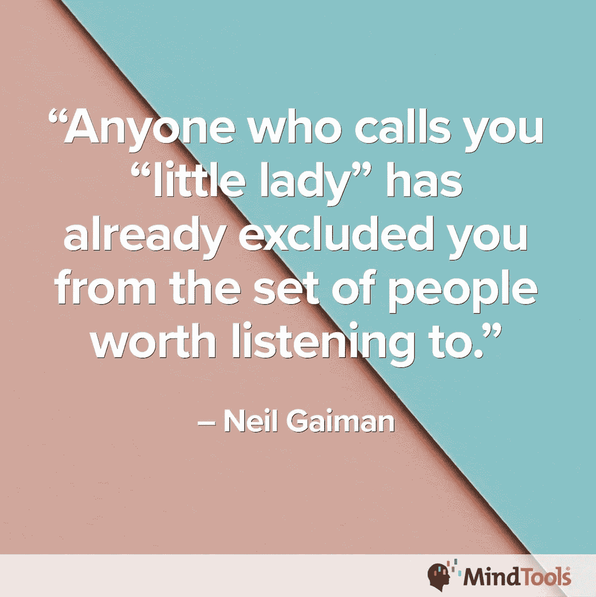
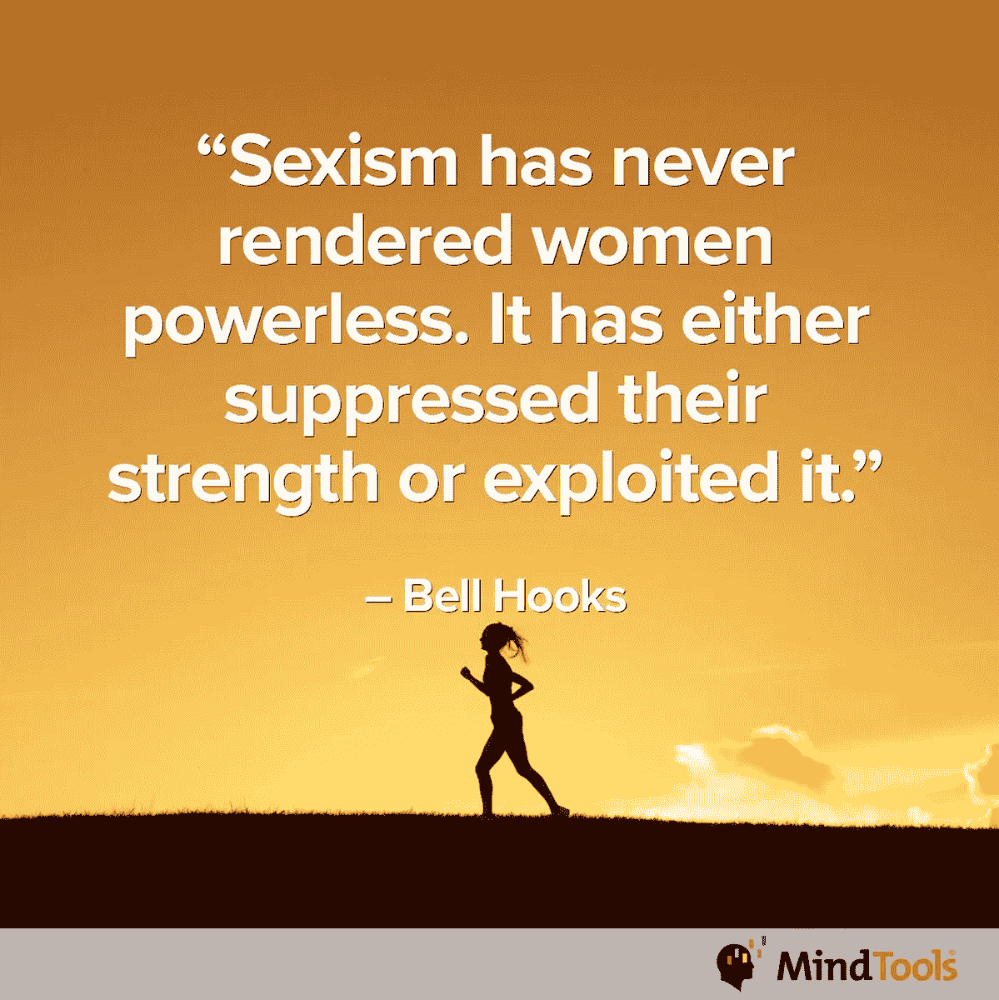
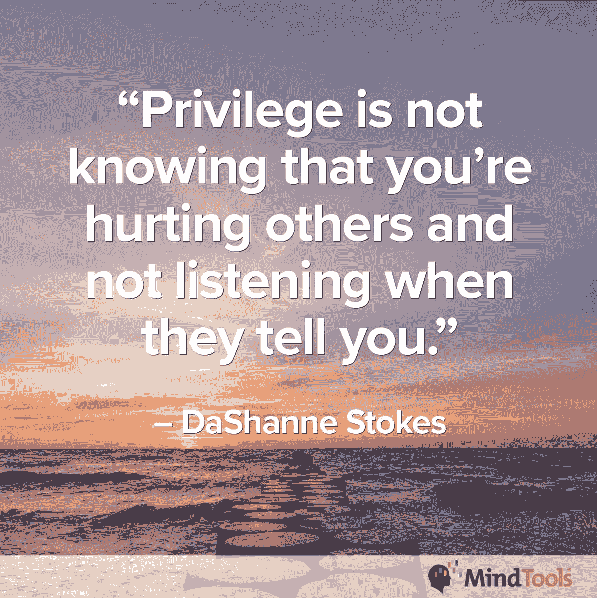
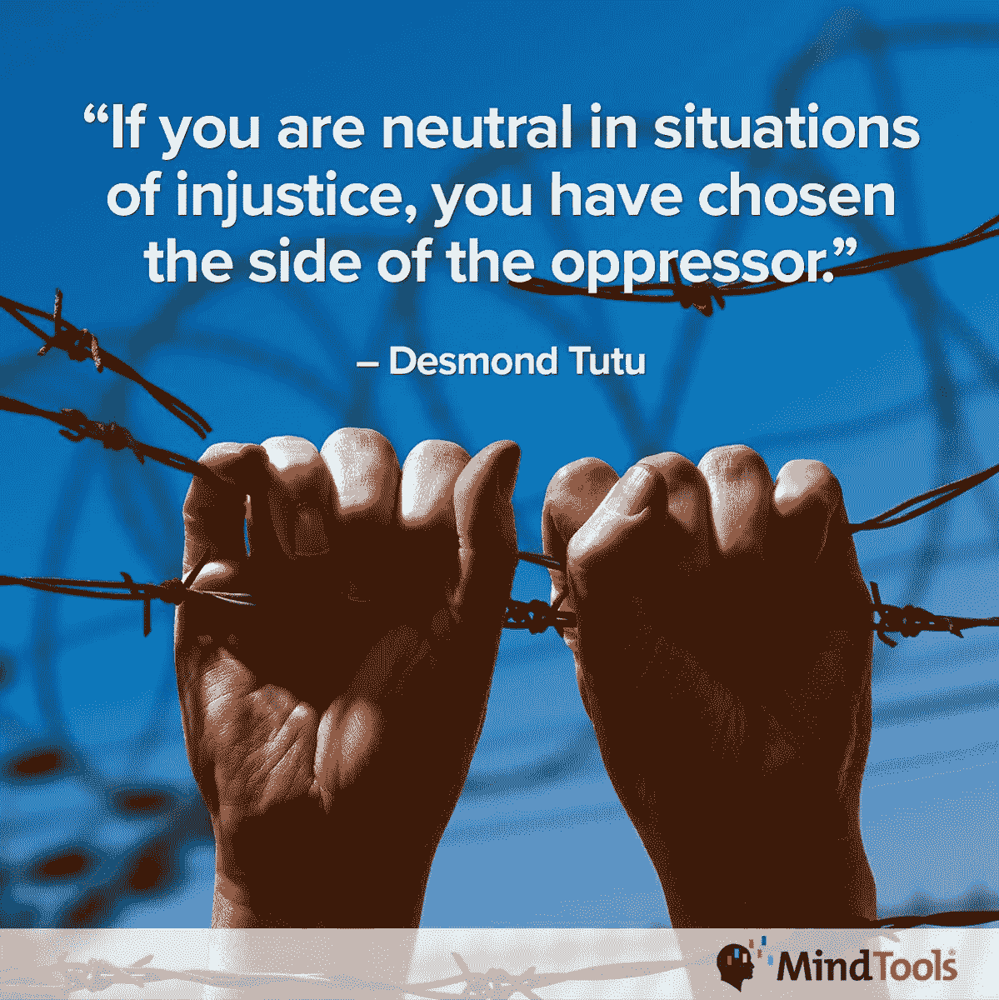

# 性别歧视攻击了人际关系的核心

> 原文：<https://medium.datadriveninvestor.com/sexism-assaults-the-core-of-relationships-65b818e7f9d9?source=collection_archive---------1----------------------->

## 领导者应该知道这种行为如何破坏企业文化

exism 对不同的人有不同的含义。无论是显而易见还是潜移默化，它都会侵蚀和破坏企业文化。

项目经理 [Chrissa Dockendorf](https://twitter.com/ChrissaDock) 和 [Midgie Thompson](https://twitter.com/Midgie_MT) 谈论了性别歧视及其在工作场所的影响。

汤普森是全球最受欢迎的按需职业和管理学习解决方案之一 [Mind Tools](https://twitter.com/Mind_Tools) 的社区参与主持人。

多肯多夫说:“性别歧视看起来就像因为我是女性而叫我亲爱的，或者为当着我的面说脏话而道歉。”"假设我有自己的观点时很积极，并且总是给我行政工作."

从某种意义上说，性别歧视是变形。

汤普森说:“性别歧视可以采取多种形式，从公开的贬损性评论到更微妙的形式，如被排除在会议和信息之外。”

 [## 一个声音打破了骚扰者的束缚

### 拒绝保持沉默打破了一长串的虐待

medium.datadriveninvestor.com](/one-voice-breaks-harassers-stranglehold-1f4680c6053d) 

认为性别歧视是显而易见的是不明智的。

“假设是一件危险的事情，”汤普森说。"它们会导致很多问题，比如剥夺人们的机会."

心智工具专家着眼于险恶的方面。

“性别歧视包括女性不得不忍受性别歧视的笑话，她们的想法被驳回，她们的意见不被听取，以及根据她们的体重或外表来评判，”专家指出。

# 无礼

性别歧视很重要，因为它意味着对他人缺乏尊重，是有辱人格的。

多肯多夫说:“通过不谈论它或承认它的存在，我们将继续生活在一个对待那些与我们不同的人是可以的世界里。”

无论以何种形式，性别歧视都会损害生产力。

“这很重要，因为我们应该平等对待每个人，”汤普森说。“例如，晋升是基于表现、优点和能力，而不是性别。

“拥有不同的意见和想法有很多好处，就像来自所有不同国家、背景和经历的人分享想法一样，”她说。

 [## 骚扰撕裂了你的内心

### 遭受精神和身体上的虐待

medium.datadriveninvestor.com](/harassment-tears-away-at-your-core-2932634e5839) 

在最好的世界里，人与人是互补的，并不优越。

“这正是我们——以及企业——成长的方式，”汤普森说。“通过补充人员、想法和方法，所有这些都会带来更大的成就。”

女性必须被认为是她们本来的样子。

“性别歧视很重要，因为对待女性就好像她们不能独立思考或者只是为男性服务一样是不对的，”思维工具专家说。“不公平的薪酬差距依然存在。女性在公司高层的代表性仍然很低。

性别歧视会让工作场所四分五裂，如果有掠夺者参与，情况会更糟。

汤普森说:“它会阻碍个人进步，让人们不敢说出来。”。"所谓的“笑话”实际上是对特定群体的贬低。"

# 职业生涯停止

至少，性别歧视扼杀了职业生涯。

多肯多夫说:“这导致缺乏晋升机会、缺乏尊重、充满敌意的工作环境——所有这些都导致女性退出职场。”。“这导致工作场所缺乏多样性，这对每个人都不利。”

距离更大的罪行还有一小段路程。

“性别歧视加剧了性骚扰，”Mind Tools 说。“受害者感到没有发言权，因为他们不得不面对一堵保护其他男性的男性墙。犯罪者觉得自己无所不能，因为他们知道自己受到特权和性别歧视文化规范的保护。

“在‘男孩俱乐部’文化可以接受的公司里，重要的讨论通常在被认为是传统男性领地的地方举行:高尔夫球场和酒吧，”专家说。女性经常受到排斥，感到格格不入。"

也有不公正的期望。

专家说:“工作场所的性别歧视可能会导致无意识的偏见，比如如果接待员不在，男性会自动认为接电话、买咖啡或会后打扫卫生是女性的工作。”

性别歧视的经历因性别、种族、年龄和资历而异。“男孩就是男孩”和“更衣室谈话”是一种控诉，而不是一张免费通行证。

“老一辈人可能更难看清性别歧视是什么，因为这是他们一生都在经历的，”思维工具专家说。“我们今天所看到的男性和女性性别偏见，在早些年是正常的，也是可以接受的。

“不同的人群对性别歧视有不同的经历和看法，”专家说。“他们拥有不同级别的权力，这些权力以复杂的方式结合在一起。例如，一个年长的少数民族女性可能比一个年轻的白人男性权力小。

# 公共属性

虽然多种多样，但各种场合的性别歧视都有相似的特征。

“有微妙的差异，但有一个共同的线索；“贬低一群人，让他们——发表评论的人——自我感觉更好，”汤普森说。

她说:“年轻时觉得自己是群体的一员时，曾经可能被认为是一个笑话，但随着一个人的发展和成长，这可能会变得令人反感。”"一个人需要勇气站出来说这是不对的."

 [## 粉碎性骚扰——梦想还是现实？

### 没有任何借口可以忽视或不去谈论不当行为

medium.datadriveninvestor.com](/crushing-sexual-harassment-a-dream-or-reality-60bd46428faf) 

性别歧视的例子似乎层出不穷。

多肯多夫说:“这份清单令人疲惫不堪。“这种差异最终会结束，包括性别、年龄和种族。

“这对我们产生了影响，因为我们不善于承认交叉性，这最终导致我们分裂，而这本来应该让我们走到一起，”她说。

多年来，许多工作场所对性别歧视的态度已经发生了变化。

“尽管性别歧视在今天可能更加微妙，但它仍然存在，”思维工具专家说。“这可能更难处理，因为它不太明显。对性别歧视意识的增强导致了一些公司政策的改变，在一些国家甚至导致了劳动法的改变。

“尽管知道你有更大的潜力，但你所在的组织对‘像你这样的人’有限制吗？”专家们问道。

Mind Tools 有一个关于如何突破“玻璃天花板”的博客

汤普森说:“在我开始职业生涯的时候，性别歧视的笑话在那种环境下是正常的——随着时间的推移和员工范围的培训——它变得不那么公开了。”"它让人们意识到他们的话语和笑话可能产生的影响。"

# 年轻一代的希望

多肯多夫看到了更好的变化。

“随着年轻一代的到来，你会看到更多人接受女性及其在职场中的角色，”她说。"这一代人看到他们的女性在工作，也更容易接受。"

反对性别歧视的零容忍政策必须明确、广为宣传并得到执行。

“一个公司的第一道防线是一个明确的、适当制定的非歧视政策，”Mind Tools 专家说。“它将包括适当和全面的定义，并将为确定性别歧视行为是否发生提供一个良好的起点。

专家说:“所有的人力资源团队都要接受适当的培训，以敏感和紧急的方式处理性别歧视行为的投诉，这一点至关重要。”“他们需要能够在没有恐惧、偏袒或偏见的情况下工作，即使犯罪者在人才管道中处于高位。”

“员工可以去人力资源部，”汤普森说。"此外，有一种员工援助计划可以帮助支持个人."

小进步不是答案。

“这还不够，”多肯多夫说。“我们需要让人们对自己的行为负责，教导人们拥有更强健的[情商](https://medium.com/@JKatzaman/emotional-intelligence-rolls-back-baggage-20021e1960fb)，并能够承认自己的偏见。”

 [## 在董事会中敞开心胸接受偏见

### 警惕坐在桌旁的隐藏的偏执狂

medium.datadriveninvestor.com](/open-your-mind-to-bias-in-the-boardroom-9f77924bca7d) 

如果谈论解决性别歧视的政策和价值观没有贯彻到行动中，不要犹豫。

“大声说，”多肯多夫说。“鼓励问责的环境。如果其他方法都失败了，就采取法律行动。”

白纸黑字，行动更响亮。

“以书面形式让你的雇主知道你受到了性别歧视，并且你很重视这件事，”思维工具专家说。

“员工资源小组是自愿的，”他们说。“这包括员工领导的团体，他们参与一系列商业活动，如支持工作场所的多样性和包容性。”

一个头脑工具博客[谈到了这些群体](https://www.mindtools.com/pages/article/employee-resource-groups.htm?utm_source=social&utm_medium=organic&utm_campaign=tweetchat)。

# 找到你的声音

“一旦你用尽了内部途径，根据你公司的不作为和你的合法权利，评估你可以采取什么行动，”专家说。

汤普森说，性别歧视的受害者必须找到自己的声音。

她说:“和他们的经理和人力资源部谈谈不一致的地方，看看如何解决这些问题。”

“政策到位是一回事，”汤普森说。“确保它们得到实施和可操作是另一个问题。政策总是需要执行、尊重和维护。”

 [## 如果你使用数据，它会穿透偏见

### 雇主不了解他们手边的数字

becominghuman.ai](https://becominghuman.ai/data-cuts-through-bias-if-you-use-it-d1deaab8a01d) 

男人和女人天生不同。如果男人能像女人一样思考，反之亦然，许多问题可能就不会出现了。

心智工具专家们同时研究了男性和女性的观点。

“如果我是一个女人，我不会保持沉默，利用我可以利用的适当渠道。，”他们说。“如果我是男人，我会让其他男人意识到他们的性别歧视语言或行为。”

多肯多夫希望合作。

“如果我是一个男人，我会努力成为一个盟友，倾听那些有经验的人，并利用我的特权畅所欲言，”她说。

不管男女，自满解决不了任何问题。

“当听到任何性别歧视的评论或戏谑时，大声说出来，”汤普森说。"请注意这是不对的."

伟大的领导者会积极倾听并意识到团队的动机和敏感性。领导者还与团队沟通，陈述明确的标准和价值观——为遇到任何问题的任何人提供资源。

“根据公司价值观来管理你的团队，”思维工具专家说。“把你所做的一切建立在尊重的基础上。告诉他们团队中多样性的价值。

“学会如何识别他们对彼此的行为是不可接受的，”专家说。"提供[支持人们说出](https://www.mindtools.com/pages/article/tolerance-workplace.htm?utm_source=social&utm_medium=organic&utm_campaign=tweetchat)这件事的方法."

多肯多夫言简意赅:“再培训。如果那不起作用，就切断诱饵，重建。”

支持文化变革也是一个强化过程。

汤普森说:“经常谈论这个话题，可以帮助人们在对待事情的态度上变得更加清醒和一致。”"[团队章程](https://www.mindtools.com/pages/article/newTMM_95.htm)也是确保所有团队行为一致的好方法。"

领导者应该以尊重和礼貌的态度对待自己的团队、同事和上级，并履行自己的职责。如果这是他们日常生活的一部分，他们就不必表现得特别来避免问题。

“拒绝接受性别歧视的评论、语言、行为——无论是暗示还是明示，”思维工具专家说。“叫它出来是什么。

“树立尊重、包容和接纳所有人的榜样，”他们说。"确保在会议和讨论小组中每个人都能被听到."

“有相等的发言时间，”多肯多夫说。“承认所有想法。确保问责制。有意让你的团队多元化。”

平等对待对汤普森来说也是至关重要的。

“确保平等对待所有员工，”她说。"立即指出任何性别歧视的评论或行为是不可接受的."

**关于作者**

吉姆·卡扎曼是[拉戈金融服务公司](http://largofinancialservices.com)的经理，曾在空军和联邦政府的公共事务部门工作。你可以在[推特](https://twitter.com/JKatzaman)、[脸书](https://www.facebook.com/jim.katzaman)和 [LinkedIn](https://www.linkedin.com/in/jim-katzaman-33641b21/) 上和他联系。