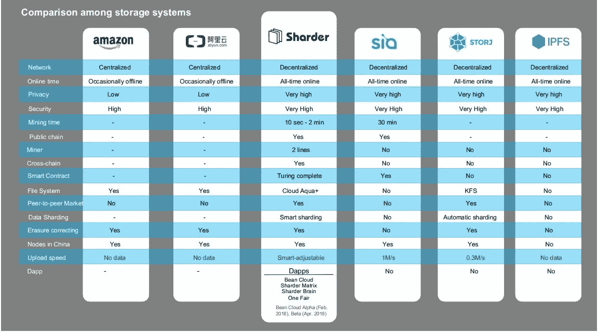
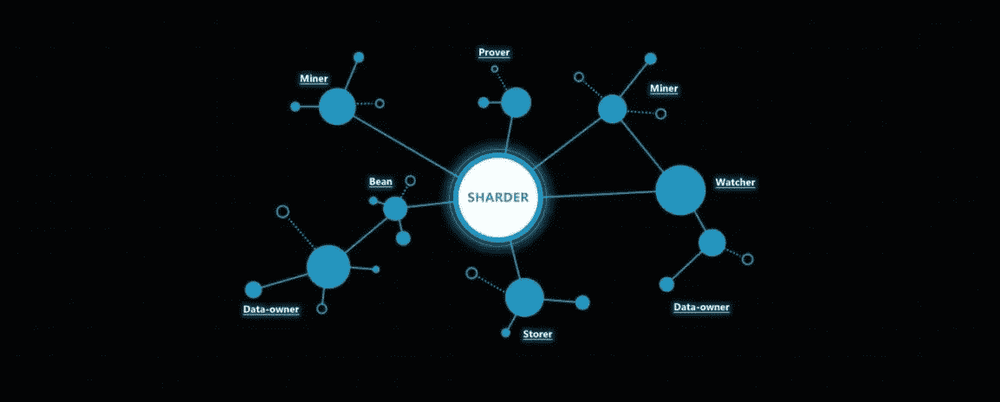
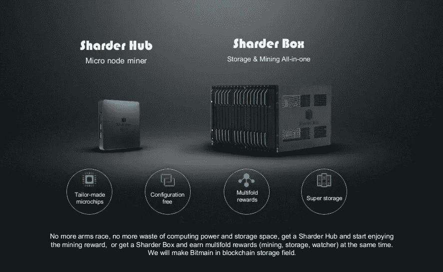
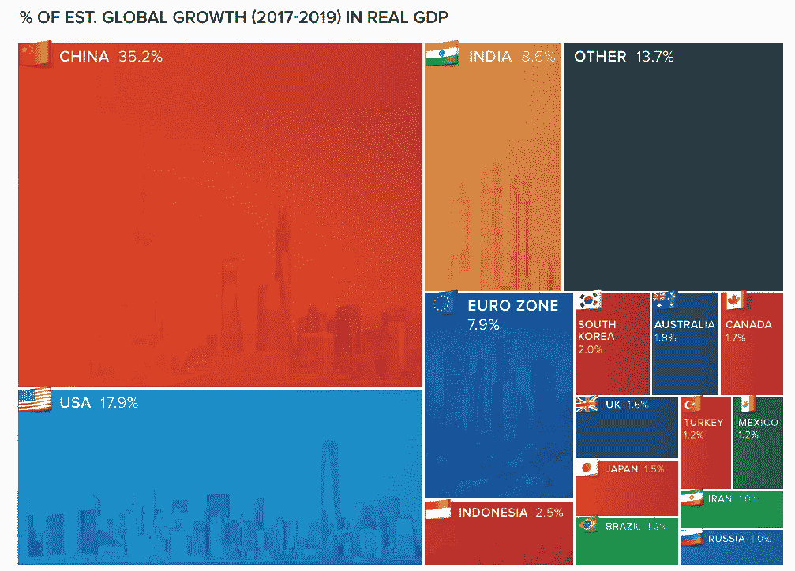
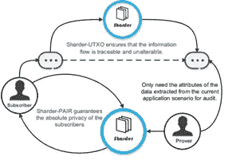

# Sharder-领先于竞争对手:存储解决方案的空前创新

> 原文：<https://medium.datadriveninvestor.com/sharder-ahead-of-the-competition-an-unprecedented-innovation-of-storage-solutions-b4edbbd59ffa?source=collection_archive---------33----------------------->

Sharder: The Most Efficient Data Storage Solution!

Sharder:他们的竞争对手是谁？

自从有了文明的概念，竞争就以多种形式存在，从相互交战的国家，试图变得比对手更具创新性的公司，为领土而争吵的部落，到追求其生存领域影响力的帝国国家。在加密货币网络中，Sharder 协议存在各种不同的竞争对手，但是，尽管如此，从上面的图表中可以明显看出，最高效和最具生产力的数据存储解决方案确实是 Sharder 协议。加密货币是自由市场的体现，在自由市场中，创造最佳产品的创新者会胜出，并在经济达尔文主义的自然选择中生存下来；由于自由放任资本主义的经济范式一直存在，这种模式一直是旧的竞争秩序。讨论 Sharder 协议的竞争对手，证明它与 Siacoin 和 Storj 等其他存储解决方案项目的不同之处，这一点很重要。Siacoin 和 Storj 是 Sharder 协议在加密货币领域的主要竞争对手，正如我们从图表中看到的，亚马逊和 IPFS 也是这个存储解决方案行业沉睡巨人的竞争对手。就像 Sharder 协议一样，Siacoin、Storj 和 IPFS 是分散的存储解决方案系统，而亚马逊的网络是一个集中的实体。虽然与 Siacoin、Storj、IPFS 和亚马逊相比，Sharder 协议相对较新，但这并不妨碍它成为现有的最强大、最高效和最有利可图的存储解决方案:这是 Sharder 协议的一个战术优势，它是在它的前身的基础上构思的；后来者可以通过前来者公司的错误、失败和缺点，从中学习和获得知识。2018 年的发布使 Sharder 协议拥有独特的地位，从整体上区别于 Siacoin、Storj、Filecoin、IPFS 和亚马逊的数据存储解决方案。相比较而言，在数据存储解决方案领域只有一个胜利者，而这个胜利者，在其所有的荣耀中，数据存储解决方案的冠军不是别人，正是 Sharder 协议！

**Sharder 协议:Sharder 如何以及为什么优于它的竞争对手？**

The Champion Of Data Storage Solutions!

Sharder 协议优于我们世界中存在的其他数据云存储解决方案，原因有很多。首先，与 Amazon 不同，Sharder 协议是一个分散的实体！我们这个时代的政治和经济时代精神将被归类为权力下放和自由放任的解决方案；这就是为什么亚马逊，尽管它现在是一个发电站，但可能会因为强大的权力下放而陷入未来！Sharder 协议的独特性和创新性在于它是一个分散的数据存储解决方案，没有第三方的参与。在 Sharder 协议中，老大哥并没有监视你；信息通过分散的实体存储，无需第三方参与。在我们不断发展、互联、计算机化的社会中，隐私是一个至关重要的话题；身份盗窃猖獗，加密货币投资者的资产不断被黑客窃取；几乎每个街角都有摄像头，很明显，随着互联网概念的提出，对隐私的需求变得越来越重要。相对于 Sharder 协议和 Amazon 而言，使用 Amazon 时数据存储的隐私级别比个人使用 Sharder 协议时要低得多！美国宪法第九修正案讨论了宪法中没有包括的权利，其中之一是隐私权。第九修正案指出，我们作为人类有某些不可侵犯的隐含权利，可悲的是，隐私是一项公共权利，每天都在受到威胁。从社会的角度来看，个人隐私是最重要的，随着互联网和技术继续在我们的文明中肆虐，隐私正受到越来越多的威胁。在隐私保护方面，Sharder 协议和基于区块链的存储解决方案是最可靠、最安全的数据存储方式，无需第三方参与。

**Sharder 协议:挖掘时间及其独特的跨链数据存储解决方案**

The Sharder Protocol’s Mining Time Is Exponentially Faster Than It’s Competitors!

为了比较 Siacoin 和 Sharder 协议，Sharder 协议的挖掘时间比 Siacoin 的挖掘时间快一倍。区块链的一个根本缺陷是，它无法在此时此刻进行扩展，导致交易时间极其缓慢，可能需要一个多小时，有时甚至几天才能进行身份认证。Sharder 协议的挖掘时间仅为 2 分钟，比 Siacoin 的半小时挖掘时间快了一倍。可以说，Sharder 协议可以利用的最重要、最关键的创新是它是跨链的，这是一个更可靠、更高效、更快速的存储解决方案。Sharder 协议的跨链互操作性培育了一个生态系统，其中不同的区块链，无论区块链是比特币、以太坊、莱特币、Dash、Monero、Verge、Tron、Icon 等，都将能够利用 Sharder 协议的技术，而 Siacoin 不是跨链解决方案。正如我们之前所讨论的，在一个充满竞争的社会中，遵循人类竞争的本能，最具创新性的想法和技术会像凤凰涅槃一样蓬勃发展，尽管 Siacoin 是最知名的数据存储解决方案之一，但它可能不是最有效的，因为它的挖掘时间比 Sharder Protocol 慢很多，并且不像 Sharder Protocol 那样是跨链的。

**Sharder 协议:Sharder Box 和 Sharder Hub:完善比特币和以太坊的技术**

The Sharder Box and the Sharder Hub Enable Individuals to Create Passive Income!

想象一下，如果你愿意，这是一项创新，个人可以通过使用一小块硬件来赚钱，将他们计算机上多余的闲置存储直接从家里捐赠给特定的网络，你猜怎么着，Sharder 协议提供了一种通过购买 Sharder Hub 或 Sharder Box 来赚取被动收入的方法。购买 Sharder Hub 的用户将有资格获得 Sharder 网络上的采矿交易的采矿奖励，同时，使用 Sharder Hub 和 Box 的用户将能够获得奖励，为网络上寻求利用 Sharder 协议存储数据的用户提供闲置存储。Sharder Protcol 为存储提供商和存储购买者创造了一个开源的自由市场环境。如前所述，Sharder 协议改进了现有的数据存储解决方案；这就是 Sharder 协议如何获得超越其竞争对手的独特优势；他们从竞争对手的错误中吸取了教训。补充一下，Sharder Hub 和 Sharder Box 是采矿设备的一部分，在这里，个人计算机所有者可以成为矿工，并在存储数据的同时向块添加数据事务，从而获得奖励！Sharder 协议在利用比特币和以太坊技术的方式上非常独特和创新。Sharder 协议利用称为 UTXO 或“未用完的事务输出”的东西来管理平台上发生的记账；UTXO 是比特币独有的概念，同时，Sharder 协议部署了以太坊-图灵完全智能合约，而 Storj 和 IPFS 没有；虽然 Siacoin 使用智能合同，但 Sharder 协议使用完整的图灵智能合同来有效地设定协议和谈判的条款，以设定存储的要求。那些购买碎片盒的人将能够同时扮演储存者、守望者或矿工的角色，为他们赢得多重奖励！Sharder 协议利用“观察者”进程，该进程本质上被设计成通过数据分发减少数据冗余来保持网络同步和高效。Sharder 协议正在培育一个前所未有的数据生态系统；Sharder 协议正在构思一个多用途区块链和数据生态系统，用于除数据存储之外的各种用例，这可以从 Sharder 协议对 Dapps 的独特使用中看出。

**Sharder:我现在已经成为 Dapp，集中化的破坏者，集中化是一个为各种用例培养数据存储的生态系统:当代数据存储领域存在的巨头的崩溃**

Dapps are what set The Sharder Protocol apart from it’s competitors!

正是 Sharder 协议使 Dapps 能够在其平台上构建，从而形成了多种形式的数据存储生态系统。Sharder 协议是加密货币网络中唯一一个允许 dapp 建立在其平台上的协议！Dapp 是分散的应用程序，其代码运行在分散的对等网络上，没有第三方的参与。对等网络促进了去中心化，根据定义，对等网络是两台或多台计算机无需连接到中央服务器就可以相互共享信息、文件和数据！Sharder 协议再次将自己与泰坦亚马逊区分开来，甚至泰坦在希腊神话中也被推翻了！正如克洛诺斯推翻了他的父亲乌拉诺斯一样，克洛诺斯的孩子们宙斯、哈迪斯、波塞冬和赫拉在“泰坦之战”中推翻了泰坦。Sharder Protocol 在数据存储领域处于独特的地位，是克洛诺斯的孩子之一，是一个推翻数据存储解决方案巨头的实体，这些解决方案在我们的世界中留下了集中化的痕迹，并使一个没有隐私的社会永久化，因为集中化和无法建立 Dapps。与 Siacoin 和 Storj 不同，Sharder 协议本身就是一场革命，因为 Sharder 协议使 Dapps 能够在其平台上构建，促进了体现自由市场的不断增长的生态系统，同时利用自由市场获得数据存储解决方案的最佳体验！One Fair 是建立在 Sharder 协议基础上的四个 Dapps 之一，它培育了一个点对点的开放市场，在这个市场中，个人可以参与更多用例中存储空间、数字资产和验证数据的透明传输！未来人类超越我们自己的意识存在将归功于人工智能，一种 Sharder 协议利用的技术！Sharder Brain 实现了人工智能的进一步增长，可以服务于数据安全和数据分发；如前所述，隐私在 21 世纪至关重要，乔治·奥威尔(George Orwell)的小说《1984》本不打算成为国家治理人口众多的手册，但它似乎越来越成为一本手册。利用 Sharder Brain 可以保护数据安全，还可以用于数据分析和数据警报！Sharder Matrix 可以安全地存储关于个人生物数据和 DNA 记录的数据，而不需要集中式数据库，集中式数据库容易涉及第三方并侵犯隐私。Bean Cloud 是基于 Sharder 协议构建的另一个 Dapp，Sharder 协议是一个安全平台和数据存储应用程序，它利用了区块链的可追溯性和不可更改性特性，使 Sharder 协议成为全世界最安全的数据存储解决方案！

**中国与数据存储:东方雄狮挑战西方猛虎**

According to the World Economic Forum: China is set to surpass the United States in Global Growth In Real GDP Percentage

根据世界经济论坛的说法，“美国经济的庞大规模让其他国家也能看到这一点。它比上面列表中第四至第十位的经济总量还要大。总体而言，全球经济价值约为 79.98 万亿美元，这意味着美国占世界经济总量的四分之一以上。然而，它的主导地位似乎正在减弱。根据来自世界银行的[数据](http://www.visualcapitalist.com/chart-global-growth-happening/)(由 visual capitalist 图解)，全球经济将在 2017 年至 2019 年间扩张 6.5 万亿美元。美国的 GDP 预计将占这一增长的 17.9%。然而，中国预计将占这一比例的近两倍，达到 35.2%。“随着未来十年实际国内生产总值的指数增长，中国将挑战美国作为世界主导经济体的地位。随着全球经济的发展，对数据的需求也在增长，这意味着对高效数据存储解决方案的需求将呈指数级增长！这就是 Sharder 协议发挥作用的地方；Sharder Protocol 位于中国，地位独特，是中国区块链数据存储解决方案的首选公司！根据维基百科，“中国的互联网用户达到 746，662，194 人！“这大约占全世界所有互联网用户的 50%。随着中国经济超过其潜在产出，数据将在未来几十年呈指数级增长。1990 年，中国的制造业产值仅占全球产值的 3%，而现在，这个数字接近全球制造业产值的四分之一。随着行业发展、创新繁荣和数据生成变得越来越丰富，组织、国家、企业和公司将义不容辞地需要高效、可靠、安全的数据存储解决方案；这就是 Sharder 协议将成为分散数据存储解决方案冠军的地方！

**结论:Sharder 协议在数据存储解决方案中是无与伦比的**

China is an epicenter of Data Production!

由于中国乃至全世界对数据存储解决方案的迫切需求，Sharder Protocol 在成为分散存储解决方案的冠军方面处于独一无二的地位。Sharder 协议的独特之处在于，它能够在其平台上创建 Dapps，其挖掘时间比任何其他存储解决方案都要快，包括众所周知的 Siacoin 和 Storj 平台，并且它是当今唯一的跨链互操作数据存储解决方案！Sharder 协议独特的数据分割方式使其数据能够被分割成更小、可扩展和更快的部分，这也使其成为现有最先进的数据存储解决方案，同时利用了比特币和以太坊的技术！分片是提高现有区块链可扩展性的一种方式，分片协议利用了这一令人难以置信的技术，最终将使区块链能够大规模采用这一技术；随着可扩展性成为区块链过去的遗迹，分片是一种创新技术，将允许区块链适应更高的网络拥塞，因此得名“分片协议！”Sharder 协议将永远是传输和存储数据的最有效、最可靠和最安全的方式！！沙尔德民族！

*有兴趣了解加密货币和区块链技术吗？报名参加我在 Udemy 上的课程吧！*[*https://www . udemy . com/cryptocurrency-investment-a-初学者-指南/学习/v4/*](https://www.udemy.com/cryptocurrency-investment-a-beginners-guide/learn/v4/)

*免责声明:加密货币投资需要大量的风险，不要投资超过你能承受的损失！我不是金融顾问，也不对你的任何交易负责。我是 Sharder Token 的投资者，本文中的信息代表我自己的想法和观点。在投资任何东西之前，你都要做好自己的研究，这是义不容辞的责任！*

来源:[https://www.economist.com/leaders/2015/03/12/made-in-china](https://www.economist.com/leaders/2015/03/12/made-in-china)[https://www . weforum . org/agenda/2018/04/the-worlds-maximum-economies-in-2018/](https://www.weforum.org/agenda/2018/04/the-worlds-biggest-economies-in-2018/)[https://en . Wikipedia . org/wiki/List _ of _ countries _ by _ number _ of _ Internet _ users](https://en.wikipedia.org/wiki/List_of_countries_by_number_of_Internet_users)

