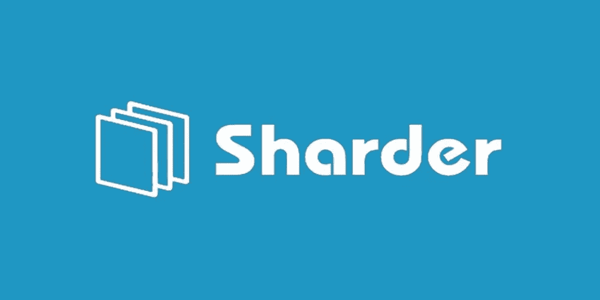
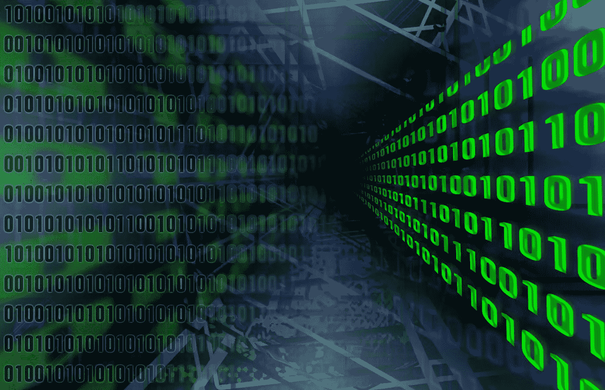
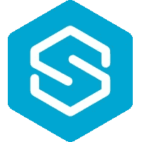

# sharder-新黄金、数据的存储中心

> 原文：<https://medium.datadriveninvestor.com/sharder-the-storage-center-for-the-new-gold-data-a81cf009adf2?source=collection_archive---------34----------------------->

**黄金储备的重要性:简史**

**The Storage Center For The New Gold: Thy Name Is Sharder**

在历史上，不同的商品改变了经济以及商业主义和重商主义的理想。19 世纪 50 年代早期的加利福尼亚淘金热带来了一股机会主义的经济思潮。事实上，在约翰·W·马歇尔在萨特的磨坊发现黄金后，30 多万人从美国各地涌向加利福尼亚，以获得这种珍贵商品的一部分。在 20 世纪初，由于富兰克林·罗斯福总统在 1933 年发布了一项有争议的行政命令，规定美国人必须出售他们的硬币以换取银行券，黄金储备出现了指数级增长。由于这一行政命令，美国需要更大的金库来储存大量的黄金储备，因此，通常被称为诺克斯堡的美国金条仓库诞生了；诺克斯堡拥有大约 2%的人类历史上提炼的黄金。

**数据:黄金的伟大继承者**

**Data Is A Precious Commodity Indeed**

在 21 世纪，黄金仍然是一种受投资者、企业家和家庭追捧的贵重商品，是一种可靠的价值储存手段，也是一种用途广泛的贵金属。随着互联网的兴起，我们这个世纪最珍贵的商品将不会以贵金属来分类，而是以比黄金更有价值的东西来分类，那就是数据。每天创建的数据超过 2.5 万亿字节，随着物联网的加速增长，这一数字将呈指数级增长。从 2016 年开始，全球超过 90%的数据都是由它产生的；每两天，我们创造的信息量就相当于我们整个文明史到 2003 年创造的信息量。2008 年，随着中本聪创造了比特币，区块链诞生了，这是一项旨在存储金融交易、身份记录、土地登记、政府数据和教育记录的创新。现在，在 2018 年，一种革命性的数据存储方式已经在中国诞生，这种工业数据存储领域的创新被称为 Sharder 协议。

**什么是 Sharder 协议，数据存储解决方案的革命？**

Sharder 协议是一种跨链分布式存储协议；这是一项创新，独立的区块链可以利用 Sharder 协议的技术高效地存储他们的数据。同时，Sharder 协议提供了在其平台上构建 Dapps 的能力，这是 Siacoin 和 Storj 等其他竞争对手尚未利用的巨大实用工具。Sharder 协议的挖掘时间约为 10 秒至 2 分钟，而 Siacoin(目前加密货币领域最知名的数据存储解决方案)的挖掘时间为半小时。Sharder 协议不仅在所有不同的存储协议中具有最快的挖掘时间，而且是唯一的跨链数据存储解决方案，其中不同的区块链(如 Qtum、以太坊、比特币、莱特币、Dash 等)都可以使用 Sharder 作为辅助数据存储的方式。为了连接 Sharder 和 Fort Knox，随着黄金储备的持续增加，从而产生了更大的黄金金库，区块链的繁荣发展需要一个更高效和“更大”的数据存储解决方案；Sharder 协议是解决这一难题的答案。Sharder 协议不仅有助于数据存储，而且是数据存储解决方案领域中唯一支持在其平台上构建 dapp 的实体，并且已经有四种不同的 dapp 在其平台上运行！诸如 One Fair 之类的 Dapps 是基于 Sharder Chain & Sharder 协议的对等自由市场，它使得使用网络的个人能够因允许 Sharder 网络利用个人计算机上的空闲存储空间而被奖励以 Sharder 令牌。然后，这些 Sharder 令牌可以在一个交易会上用来购买数据，还可以让用户交易数字资产并相互发送信息！Bean Cloud 是基于 Sharder 协议构建的另一个 Dapp，它将存储支付记录和电子合同等数据，并且可以在包括银行和电子商务服务在内的各个行业中利用！基于 Sharder 协议构建的第三个应用程序是 Sharder Matrix，这是一个 Dapp，能够存储生物数据、DNA 记录、医疗记录、诊断和生长日志等个人数据。最后，但肯定不是最不重要的，是鲨鱼的大脑；Sharder Protocol 不仅是区块链的数据存储解决方案，也是它自己的区块链(我提到过 Sharder 在 github 上是开源的吗)，Sharder 还是一个人工智能平台！Sharder Brain 是一种智能数据服务协议，面向希望为自己的组织利用数据安全、数据分布调整、数据分析、数据搜索和数据警报服务的各种不同企业。显而易见，Sharder 作为中国和世界区块链的数据存储解决方案，在未来必将大放异彩！

**Sharder 加密货币:代币的巨大效用**

**The SS Token Has Multiple Functions Within The Sharder Ecosystem**

当个人投资加密货币时，他们必须问自己，我投资的代币或硬币的效用是什么？与其他区块链数据存储解决方案加密货币相比，这种令牌的巨大效用是前所未有的。Sharder 还允许消费者购买 Sharder Boxes 或 Sharder Hubs，这是一种硬件设备，用于奖励与 Sharder network 共享数据的个人，这种奖励以 Sharder Tokens(跨链存储数据解决方案原生令牌)的形式支付。Sharder Boxes 和 hub 为任何购买硬件的个人提供了被动收入！！！！！Sharder 多链协议将使个人能够使用 Sharder 令牌作为区块链之间的交换媒介，与其他区块链交换价值。自我利益是推动大多数人的杠杆，Sharder Token 是 Sharder 生态系统中的一种激励，用于奖励对网络做出贡献的节点。Sharder 令牌还用于惩罚恶意节点，此外，Sharder 令牌是 Sharder 生态系统中的锚定令牌。Sharder 令牌还用于购买存储空间，以及奖励那些向 Sharder 网络提供自己的存储空间的人。Sharder Token 是一种加密货币，将用于在 Dapp One Fair 上进行购买，一个 Fair 上的可交易项目包括数据存储、数字资产和有价值的信息。为网络提供存储空间的人将获得 Sharder Tokens 作为奖励。当 Sharder 市场变得活跃时，节点可以因提供自己的服务而获得奖励，例如独立的数据索引服务，例如，猜猜这些奖励将会以什么形式支付，Sharder Tokens！与 Siacoin 近 360 亿的供应量相比，其最大供应量仅为 5 亿个令牌，很明显，随着越来越多的企业、个人和组织使用 Sharder 协议作为他们的首选数据存储解决方案，这些 Sharder 令牌的稀有性将变得越来越明显。Siacoin 的市值曾一度达到约 30 亿美元的峰值，但没有能力在该平台上构建跨链互操作性和 dapps。如果 Sharder 协议成功实现了他们的愿景和目标，创造了 21 世纪最具创新性的技术之一——区块链——的全球数据存储解决方案，我们可以推测这种加密货币的总市值在未来会达到什么样的水平！

**中国:数据强国**

中国是全球最大的数据中心之一。此外，中国是世界上最大的经济体之一，并有可能在 21 世纪中叶成为最大的经济体。由于中国和更广泛的世界实际产出的增加，数据产出将出现激增，并将持续快速增长，因为不断变化的文明和完全计算机化的人类将因互联网不可避免的冲击而需要更多的数据存储。随着这种冲击的发生，Sharder 将成为区块链和企业的存储解决方案。数据是新的黄金，Sharder 是即将到来的数据存储解决方案革命的先驱！

*有兴趣了解加密货币和区块链技术吗？报名参加我在 Udemy 上的课程吧！*[*https://www . udemy . com/cryptocurrency-investment-a-初学者-指南/学习/v4/*](https://www.udemy.com/cryptocurrency-investment-a-beginners-guide/learn/v4/)

*免责声明:加密货币投资需要大量的风险，不要投资超过你能承受的损失！我不是金融顾问，也不对你的任何交易负责。我是 Sharder Token 的投资者，本文中的信息代表我自己的想法和观点。在投资任何东西之前，你都要做好自己的研究，这是义不容辞的责任！*