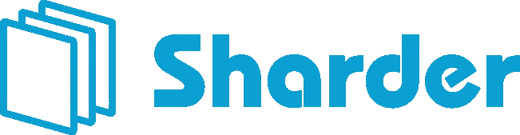
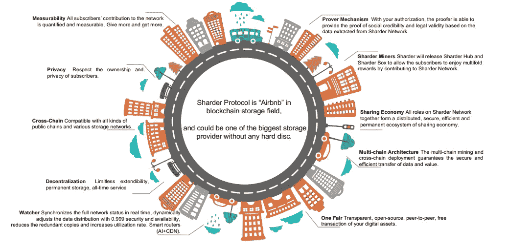
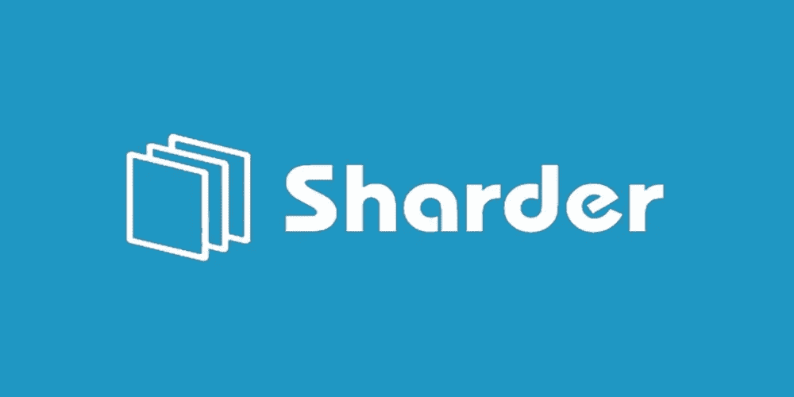
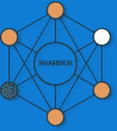

# 沙德尔聚会游戏攻略！

> 原文：<https://medium.datadriveninvestor.com/shardicles-the-sharder-conference-introduction-bb439d785f34?source=collection_archive---------22----------------------->

**The Sharder Conference Is Upon Us**

**区块链大会:Sharder 法令**

自从比特币的概念和整个加密货币空间以来，各种不同的项目已经举行了各种会议，以促进关于加密货币、区块链和举办大会的特定项目本身的开放讨论。Sharder 协议及其管理员已经构想了一个将于 2019 年 3 月举行的会议，该会议将概述区块链技术、加密货币的用例，更重要的是，Sharder 协议必须向世界提供的各种用例。Sharder Convention 将于 2019 年 3 月 8 日在阿姆斯特丹举行:关于整个会议的确切地点，将会有更多的细节。我们还将为客人提供饮料和食物！根据 Sharder 团队的报告，还将向我们的客人发放赠品，此外，对于那些参加会议并希望购买我们的微节点硬件设备的人，Sharder Hub 将提供折扣！

聚会的规格:聚会的大纲

**A Passionate Speech Regarding Blockchain And Its Bridge To Sharder Will Be Outlined At The Conference!**

首先欢迎阿姆斯特丹允许我们举办这样的会议，我们的会议将从特别感谢阿姆斯特丹市开始。John Vic、Andrea Trevisan 和 Ripplesteel 等管理员将出席并讨论从区块链技术到 Sharder 协议的桥梁。同时，在大会期间，我们将包括一个授权演讲，用于激励我们的观众像 Sharder 社区的所有人一样追求对区块链技术的热情。我们杰出的团队成员之一 Ben 将向所有与会者致欢迎词/视频。

**Amsterdam Here We Come!**

Sharder 演示将概述该协议的许多复杂性及其在各种商业、组织、企业、政府机构和公司中的各种用例。Sharder 演示将讨论该协议实际上是什么以及它的作用。与此同时，Sharder 团队将概述我们在 2019 年及以后的旅程中目前的整体研发情况。Sharder 演示将包括协议的未来路线图，该路线图将深入概述我们在 2019 年及以后的目标。然后，Sharder 团队将讨论投资者投资 Sharder 令牌/硬件技术的总体动机。在加密货币和区块链技术的网络中，理解一个特定的网络如何运行和发挥作用可能是极其困难的:Sharder 团队将在本次大会期间非常详细地概述网络如何工作。在此之后，我们将转而讨论 Sharder Hub 和我们的一体化盒子 Sharder Box。在大会结束时，我们将举行问答会，回答与会者可能提出的有关协议的任何问题！

答:你有问题，我们有答案。

**It Is Incumbent That We Hold A Q&A To Garner A Better Understanding Of Our Community And To Enable Them To Obtain Immense Amount’s of Knowledge Regarding Our Protocol**

获取知识是我们最大的优势；Sharder 协议理解这一理念，这就是为什么在大会结束时，我们将为观众举行问答活动。在我们的问答中，我们将讨论协议的技术规范和我们的硬件设备！Sharder 团队将向我们的观众详细讨论采矿是如何工作的；区块链技术和加密货币挖掘可能会让新人感到困惑，因此我们认为有必要帮助我们的与会者了解什么是挖掘以及它如何在我们的协议中工作。在我们的问答环节中，Sharder 团队将讨论 Sharder 为我们采矿硬件的投资者和购买者带来的创新和颠覆性技术！

**闭幕词:大会结束**

对于任何有关会议日期、会议上讨论和提供的内容(赠品、衬衫、集线器等)的变更的询问，请务必联系 Sharder 协议的任何电报管理员；他们将很乐意帮助您解决任何问题！在我们的闭幕词中，我们将感谢我们的嘉宾和与会者以及本次 Sharder 活动的组织者！大会结束时，我们也会准备好食物和饮料！Sharder 团队希望这是我们有史以来最大的聚会，在您的帮助下，这一前景将会实现！

*有兴趣了解加密货币和区块链技术吗？报名参加我在 Udemy 上的课程吧！*[*https://www . udemy . com/cryptocurrency-investment-a-初学者-guide/learn/v4/*](https://www.udemy.com/cryptocurrency-investment-a-beginners-guide/learn/v4/)

*免责声明:加密货币投资需要大量的风险，不要投资超过你能承受的损失！我不是金融顾问，也不对你的任何交易负责。我是 Sharder Token 的投资者，本文中的信息代表我自己的想法和观点。在投资任何东西之前，你都要做好自己的研究，这是义不容辞的责任！*