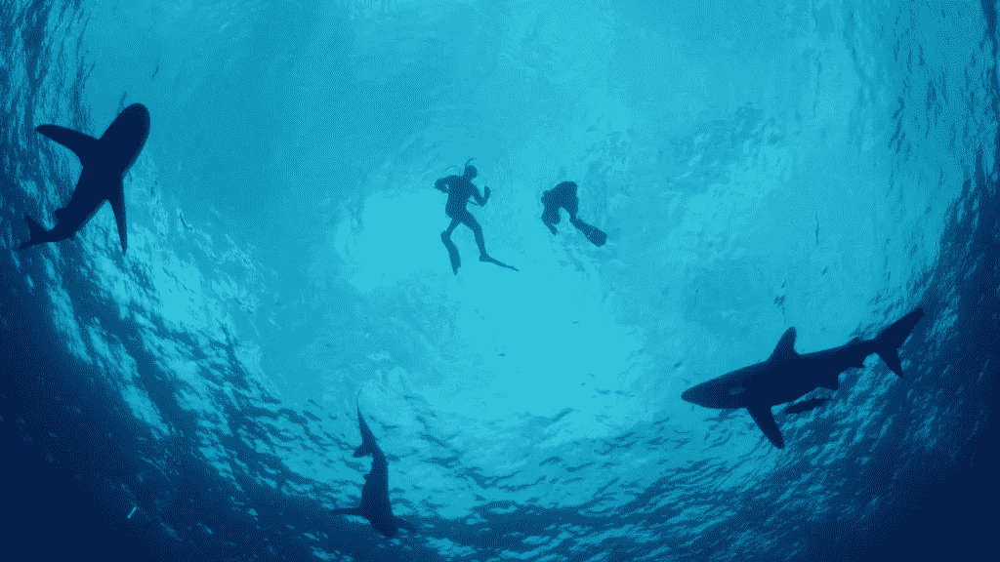

# 鲨鱼&合并、收购 IV:“海洋”条件&把它们绑在一起

> 原文：<https://medium.datadriveninvestor.com/sharks-mergers-acquisitions-iv-marine-conditions-tying-it-together-faa6839d7d88?source=collection_archive---------15----------------------->

正如我在另外三篇[帖子](http://agilitygrowth.com/sharks-bora-bora-engaging-ma-markets-i-markets-speak/)中提到的，在科技生态系统中，活跃起来对(许多)买家来说是[好事，就像大量的鲨鱼标志着健康的海洋生态系统一样。然而，作为一名销售人员，还是要警惕“虎口”和其他可能导致“攻击”你的并购结果的情况。](http://agilitygrowth.com/sharks-bora-bora-engaging-ma-markets-ii-types-of-sharks-buyers/)

除了买方(即鲨鱼)之外，在与买方(鲨鱼)接洽之前，游泳者(卖方)还应考虑许多其他因素:

 [## 在创业之旅中，拥抱学习数据驱动的投资者

### 好像建立一个数百万美元的公司还不够困难，企业家必须额外照顾他们的…

www.datadriveninvestor.com](https://www.datadriveninvestor.com/2018/10/16/on-the-entrepreneurial-trek-embrace-the-learning/) 

*环境:*在鲨鱼的比喻中，环境包括水温(你会不会体温过低)、位置(该地区的鲨鱼是否具有攻击性/更像“大白鲨”？)、一天中的时间(光线是否很暗/即鲨鱼是否容易混淆)、进食习惯(该区域是否是喂食区以及食物类型是否可能导致人/食物混淆)等。在销售者的情况下，这些相当于 M & A 流程架构以及以下问题:

*   您正在与多少买家洽谈，他们来自哪个类别(即 PE、战略、混合)？
*   尽职调查环境的建立方式是否能让每一类买家以及每一个不同的买家都尽可能看到业务的良好表现？你回答的问题比你创造的多吗？
*   谁是你的顾问？在这个过程的后期，顾问可能会让你看起来更可信还是更不可信？例如，我们经常与一家公司竞争，我们知道该公司将流程失误归咎于其客户，而不是为错误承担责任。这就像从安全的船上把血滴在游泳者(客户)周围。

到陆地/船只的距离:这很简单。如果你在开放水域，在一个你不习惯的环境中，你希望能够很快到达陆地或船。在 M &类比中，“靠近陆地/船只”可以通过对以下问题的有利回答来解决:

*   你从你的顾问那里得到了多少筹码？
*   你的导师是否已经安排好了流程和他们的努力，让你在必要时可以喘口气？
*   工作做得够早了吗，让你在过程中达到目标？
*   你是否通过利用非排他性优势保持了强势、安全和可信的地位？

不幸的是，大多数顾问没有及早(或根本没有)做应该做的工作，以确保这个过程本身不会伤害游泳者，从而吸引鲨鱼…甚至导致公司在这个过程中“淹死”。虽然你可能不会被“吃掉”，但你也可能会灭亡。我的实践围绕着一系列与数据分析、会计、首席财务官级别的财务分析、尽职调查材料作者、法律相关的运营服务进行分层，本质上是提供一整套服务，这些服务对于资金雄厚的大型企业内部来说很常见，但对于创业者来说却是流程中非常常见的问题领域。这就是我们如何让我们的客户始终“靠近陆地”，并维持一个可信的环境，在这个环境中，鲨鱼极不可能制造任何麻烦，而是必须按照我们的条件进行交易。

天气:这是一个快速的。如果海浪是波涛汹涌的，那就是风大、寒冷等。和鲨鱼一起游泳的环境不太可能产生预期的结果。即使他们不攻击你，游泳者也极不可能以期望的方式与鲨鱼接触。在并购过程中也是如此。如果没有在业务没有面临象征性逆风/恶劣天气的时候进行管理，那么以一种能够产生预期结果的方式与买家互动将会变得更加困难。因此，考虑时机变得很重要。什么时候企业有可能以最少的摩擦实现强劲的运营业绩？员工什么时候最渴望负重？创始人什么时候最不可能把注意力转移到非商业活动上，比如度假、家庭婚礼、搬家等等。？你明白了。确保在水变得“透明”、天空变得“清澈”、地平线上没有乌云的时候运行您的过程。

Image: Discovery Channel

*健身/其他:*如前所述，业务的健康非常重要，这样我们就不会出现[认错人的情况](http://agilitygrowth.com/sharks-bora-bora-engaging-ma-markets-iii-jaws-vs-mistaken-identity/) /鲨鱼几乎被迫做出恶劣的行为(他们的目标是获得高回报，支付“低”价格可能是合理的一部分)。确保企业最大程度地“适应”游泳非常重要，可以通过以下方式实现:

*   在主要销售人员之间进行详细的对话，以确保所有关系都是健康的，没有挥之不去的紧张。在创始人中尤其如此。如果有问题，和一个善于思考的顾问一起工作，帮助双方了解对方的观点，等等。如果说在糟糕的经营业绩之外，还有什么东西会在买家的心目中类似于“水中的血”，那就是卖家之间不断恶化的关系；这通常被视为一个绝望的信号，表明交易“必须发生”，因此也是卖方接受低于市场价格的理由。
*   确保公司财务报表是“干净的”,并且在将财务报表与核心运营数据、来自支付合作伙伴的信息等进行比较时没有重大差异。这也包括使公司账簿和记录符合公认会计原则(“GAAP”)。
*   当您知道很有可能实现您的运营目标(包括财务结果、运营 KPI 和产品开发计划)时，运行流程。
*   确保你的顾问/培训师是一个好的“观察者”,当公司需要帮助保持健康、达到目标等时，他会自然地发现。只和一个强有力的(有能力的)顾问一起工作，如果需要的话，他会为你做好准备，而不是看着你挣扎，指责你是鲨鱼圈。
*   努力在个人层面达到“禅”的状态，并在此过程中保持它。这将是一个充满压力的时期，如果你想要达到你想要的结果，积极地寻找时间保持身体和精神健康是很重要的。

**结论**

综上所述，值得注意的是，非常活跃的(主动联系你的)投资者和收购者是科技健康生态的[标志](http://agilitygrowth.com/sharks-bora-bora-engaging-ma-markets-i-markets-speak/)；作为未来的卖家，你应该希望他们在你身边。这些安全的买家愿意竞争，吸引他们的目标更多的是寻找合适的合作伙伴，而不是保护自己免受“鲨鱼攻击”作为卖家，需要警惕的地方是，当你发现自己在与买家进行“一次性”谈判时，要么是在没有合理建议的情况下对内部兴趣做出回应，要么是当你与单一买家达成“排他性协议”，从而避免了你吸引更多买家的能力。在这种情况下，很难逃脱买家的掠夺本能，他们通过以尽可能低的价格投资来赚钱。毕竟，在这种情况下，你可能是他们一年中看到的热量最高(最便宜/最高回报)的交易(因为这是专有的/不是顾问策划过程的一部分)。本系列的其他要点包括:

*   随着时间的推移，市场会以多种方式与你交流，包括通过买家的“转圈”，在你的市场上完成的其他交易，通过行业变化等。当它说话的时候，你应该倾听，记笔记，并且深思熟虑。市场发言并不意味着你应该是一个卖家，但它意味着你应该对你的举动深思熟虑。当鲨鱼离开的时候，有时你获得高价交易的机会也会离开一段时间。
*   像鲨鱼一样，买家和投资者非常善于“嗅出”优质目标。这是他们的基因，也是他们生存的方式。通常是获奖、强大的压力、增长的迹象(如 LinkedIn 人数增长)等。可以作为商业质量的水中“密友”,将买家吸引到你的公司。
*   “理想”伴侣可能找不到你的原因有很多，因此，采取措施吸引、接触、确定和完成与你选择的伴侣的交易是有好处的。如果你不这样做，你很可能会错过一个潜在的千载难逢的机会。
*   [在并购](http://agilitygrowth.com/sharks-bora-bora-engaging-ma-markets-iii-jaws-vs-mistaken-identity/)中确实存在不良行为者，因此保护你的企业以及你的并购过程免受类似于“大白鲨”的并购/投资的影响非常重要
*   有了正确的专业知识，你可以根据他们在流程中的行为，从掠夺者或“价值”买家中识别出“公平/溢价价值交换”的鲨鱼
*   在你不熟悉的环境中，其他事情也很重要(类似于海洋和陆地)，使用顾问可以让你安全地讲述故事。

…我们比较海洋、鲨鱼和并购的系列节目就这样做了。去和一家已经游了一段时间、现在正在考虑交易的很酷的公司谈谈。

一如既往，我很乐意讨论这些概念以及任何您感兴趣的其他概念。

*注:我喜欢与志同道合的金融人士、企业家和其他人交流。如果你愿意，请随时和我联系。*

*原载于*[*http://agilitygrowth.com*](http://agilitygrowth.com/sharks-mergers-acquisitions-iv-marine-conditions-tying-it-together/)*。*