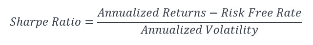
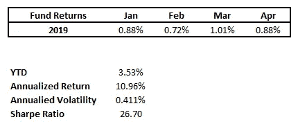
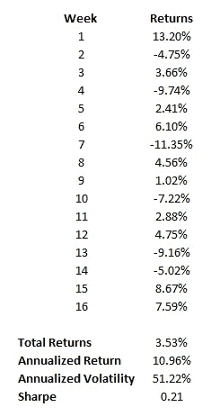
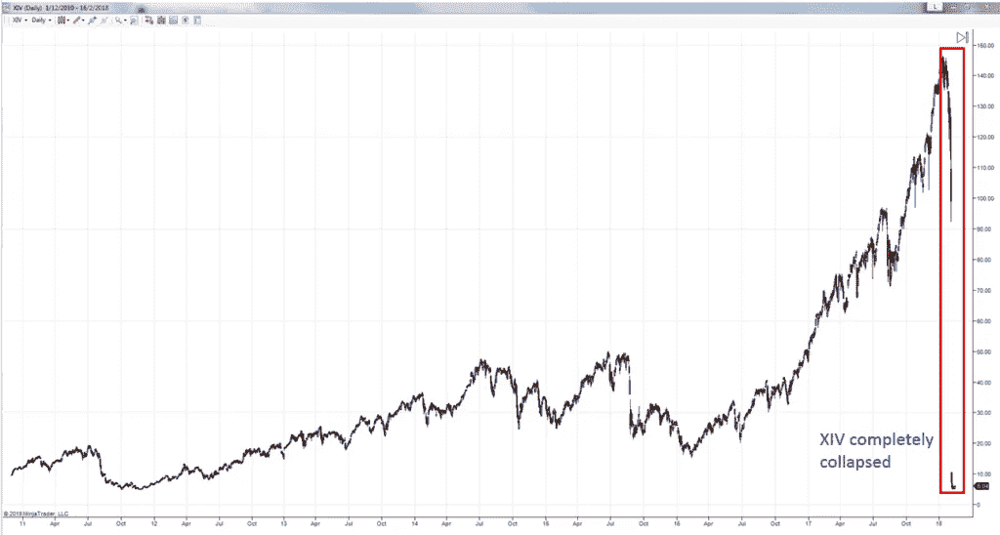

# 夏普比率——越大不一定越好

> 原文：<https://medium.datadriveninvestor.com/sharpe-ratio-bigger-isnt-necessarily-better-4d45dd064530?source=collection_archive---------2----------------------->

将一家对冲基金与另一家进行比较是复杂的。我想大多数人都同意这一点。然而，一次又一次，我们发现人们使用简单但不客观的标准进行比较。举个例子，有人可能只根据一只对冲基金的回报来比较另一只对冲基金，而不考虑它们的投资或风险。也许是因为这样更容易，更方便。

好吧，这种对简单的偏好，不管是对是错，都不会改变。为了在某种程度上解决这个问题，基金行业引入了一系列风险调整措施。这些措施试图通过为我们提供基金的单位风险回报来进行更公平的比较，从而为我们提供公平的竞争环境。毫无疑问，最广泛使用的风险调整指标是由[威廉·夏普](https://en.wikipedia.org/wiki/William_F._Sharpe)开发的[夏普比率](https://investmentcache.com/risk-adjusted-returns/)。

 [## 算法交易的机器学习-数据驱动的投资者

### 当你的一个朋友在脸书上传你的新海滩照，平台建议给你的脸加上标签，这是…

www.datadriveninvestor.com](https://www.datadriveninvestor.com/2019/01/30/machine-learning-for-stock-market-investing/) 

夏普比率非常受欢迎。在某种程度上，我感觉到了“你的夏普是什么？”变得像卫生纸一样普遍和被严重依赖。就在最近，我还收到了一些关于夏普比率的询问，例如，夏普比率是否可能很高，是否可以捏造，等等。但实事求是地说，一个数字就能告诉我们一切吗？稍微有点常识的人都知道这是不可能的。夏普比率和任何其他指标一样，只是整体情况的一小部分，并不意味着要取代全面的尽职调查。

# 夏普比率是什么？

夏普比率是当今业界采用的事实上的风险调整指标。它衡量的是基金在无风险利率上的超额回报除以回报的波动性。这实际上给了你基金的每单位波动率的回报。

如您所见，通过应用共同的风险分母，它使比较更加公平。因此，为了获得高夏普比率，你需要相对于波动性的良好超额回报。如果两个基金除了夏普之外，其他都一样，那么我们可以说夏普越高的基金越优秀。但事情从来没有这么简单，因为基金很难一成不变，尤其是对冲基金。

# 夏普比率高=好？

既然夏普比率衡量的是一只基金挤出单位风险回报的效率，那么这是否意味着高夏普比率就一定是好的呢？不一定。我们需要更多地了解这个数字背后的含义。因此，在你对任何一家夏普比率高的对冲基金印象深刻之前，你可能需要再问几个问题。

**1。基金运作多久了？**

夏普比率只是另一项统计数据。如果我们想认真对待它，它必须建立在一个良好的样本量上。对于运营历史较短的基金来说，比如几个月，夏普指数达到 2 或更高是相当容易的。你需要的只是连续几个月相对接近的正回报。参见下面的示例。

这只成立仅 4 个月的新基金取得了良好的业绩。为了得到夏普的分子，我们将年化回报率计算为 10.96%。接下来，我们需要计算分母的波动率。如果你注意到，这些月回报率波动不大。波动性衡量这些回报之间的差异程度。因此，毫不奇怪，我们得到了非常小的 0.41%的波动率。假设无风险利率为 0%，该基金的夏普比率将达到令人瞠目结舌的 26.72！如果我们没有意识到一切都只是基于 4 个月的数据，我们可能都会大吃一惊。但是这有多可持续呢？运营历史短的基金不会给我们一个有代表性的画面。

**2。用来计算夏普比率的粒度是多少？**

大多数对冲基金按月报告业绩。这意味着我们不知道该基金月内表现如何。无论是不是巧合，月与月之间的平静走势完全有可能掩盖了月内的剧烈波动，这种波动会大幅推高波动性。让我们回到之前的同一个例子，该基金基于月度回报给出了 26.72 的超高夏普指数。现在，如果我们把分辨率提高到每周，回报序列看起来像这样。

在此图中，我假设每个月正好有 4 周。从技术上讲，一年有 52 周，每个月比 4 周略长。但是让我们把这个放在一边，转而关注波动率的变化。它从微不足道的 0.41%膨胀到巨大的 51.22%。不用说，夏普指数最高值现在跌至可怜的 0.21。为了传达这个想法，我举了一个极端的例子。但话虽如此，月内的几次大幅波动足以导致夏普比率出现实质性差异。所以用来计算夏普的数据的粒度很重要。

**3。运营期是否与有利于基金的市场状态相一致？**

对冲基金是专门的投资工具。每家公司都有自己的战略，在特定的市场条件下发展壮大。因此，与许多人的想法相反，对冲基金并不是每次都能跑赢你的“市场”。这还不包括这样一个事实，即大多数人几乎只是把标准普尔 500 作为衡量其他一切事物的市场，不管这些事物是否合适。如果你不同意也没关系。就我而言，一只好的对冲基金就是一只言出必行的基金。

当对冲基金在有利的市场状态时期开始运作时，会发生什么？很明显，它出类拔萃。如果没有，那么它就不应该营业。例如，如果你在 2017 年推出了一只只做多的股票基金，你会做得很好。事实上，一只除了复制标准普尔 500 指数之外什么都不做的基金在那一年会获得超过 5 的惊人夏普。从更长期的角度来看，2012 年至 2017 年，标准普尔 500 的夏普比率将徘徊在 1.5 以上。对于那些熟悉对冲基金的人来说，你会知道这被认为是高的。但在我们看到该基金如何度过低迷期之前，所有这些都不算什么。因为如果基金所做的只是跟随标准普尔 500，那么我们所需要的就是一个熊市来让夏普回归现实。

**4。基本策略是什么？**

夏普是一个成果。它不会告诉你任何关于基金策略的信息，比如是什么驱动了它的回报，它的陷阱是什么。每种策略都容易受到其自身尾部事件的影响，有些策略比其他策略更糟糕。例如，趋势策略极易受波动市场的影响。另一方面，均值回归策略害怕站在强势市场的错误一边。当多头和空头都背离时，即使是市场中性策略也可能出错。杠杆和专注的使用进一步放大了压力时期的损失。

最近的一个例子是基于现已退市的逆 VIX ETN-XIV 的短期波动策略。从 2011 年 1 月到 2018 年 1 月，XIV 的年化回报率为 39.4%。特别是，在 2016 年 1 月至 2018 年 1 月的最后 2 年中，XIV 表现出色，在此期间翻了两番，夏普指数超过 2。不幸的是，一切都在 2018 年 2 月 5 日戛然而止。VIX 飙升超过 100%，引发了前所未有的市场紧缩，因为短期波动 etn 竞相回补他们的空头。最后的结果呢？XIV 暴跌，交易价格比之前的收盘价低 90%以上。

[*Source: Dancing With The Swans — Tail Risks*](https://investmentcache.com/dancing-with-the-swans/)

尽管夏普指数很高，但对这种策略的理解会提醒你，这种策略带来灾难性损失的可能性更高。他们本质上是在出售此类事件的保险。当什么都没发生时，他们会把保费收入囊中。但是当事情发生的时候，他们的口袋会烧得很厉害。

# 使用 Sharpe 来补充而不是取代全面的尽职调查

夏普不是一个独立的绩效指标。除此之外，你需要考虑我们如何得出基金的夏普比率的背景。如果认为一个数字就足够了，那就太天真了。相反，它应该用来补充更广泛的分析。你可以用更多的方式来剖析和观察一只基金。如果不研究基金的投资理念、目标、策略、投资组合经理、风险管理方法、同行和其他绩效分析，如多空分离、因素、周期、alpha 等，全面的尽职调查永远不会完整。

*原载于 2019 年 5 月 16 日*[*【https://investmentcache.com】*](https://investmentcache.com/sharpe-ratio-bigger-isnt-necessarily-better/)*。*