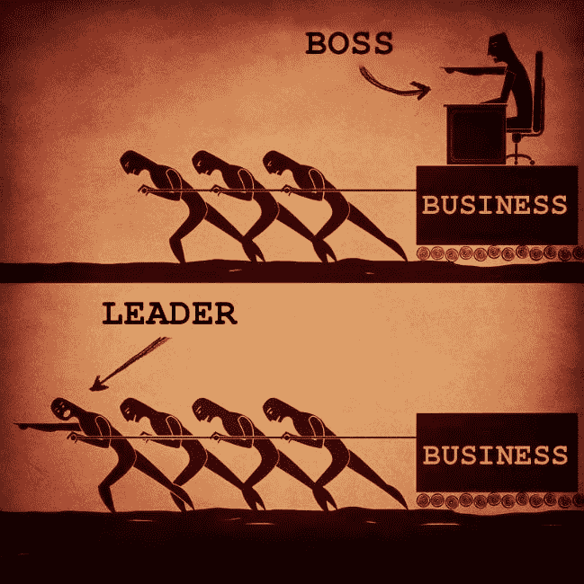
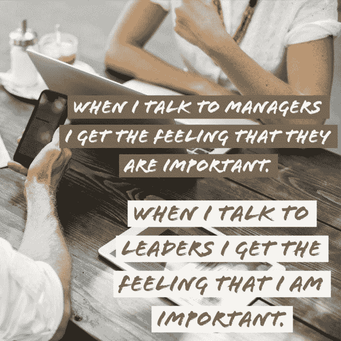

# 用行动和态度提高技能

> 原文：<https://medium.datadriveninvestor.com/sharpen-skills-with-action-and-attitude-6bc2fef20e1a?source=collection_archive---------11----------------------->

## 领导者需要强大的团队，这样每个人才能齐心协力

领导能力更多地体现在行动和态度上，而不是口头上。欣赏努力、谦逊和同理心。在他们的核心，[关系驱动领导者](https://medium.com/@JKatzaman/drive-the-relationships-workers-crave-56083c8f5af)和追随者。

来自不同但相关的领域， [Winnie Sun](https://twitter.com/winniesun) 、 [Sonya Smith-Valentine](https://twitter.com/SonyaValentine) 和 [Deirdre Breakenridge](https://twitter.com/dbreakenridge) 讨论了他们对领导力和如何成功的看法。

作为一个“财富耳语者”，孙是、福布斯、好日子啦的定期撰稿人，并创办了[孙集团财富合伙人](https://twitter.com/sungroupwp)。

史密斯-瓦伦丁是个人和商业金融专家和励志演说家。她创立了[财务激烈](https://www.financiallyfierce.com/)，通过减轻财务压力帮助员工提高生产力。

 [## 想知道领导是谁？请他决定。数据驱动的投资者

### 一个有效的领导者能为组织提供的最有价值的东西之一是决策能力…

www.datadriveninvestor.com](https://www.datadriveninvestor.com/2019/01/25/want-to-know-who-the-leader-is-ask-him-to-decide/) 

企业家转向 Breakenridge 寻找最新词汇。作为一名传播策略师、公关和营销说书人，她帮助高管们“找到他们的声音，充实他们的故事，并与重要的人建立关系”

随着行业和需求的变化，领导力并不是一种适合所有人的风格。

“我以沟通为主导，”孙说。“当你努力、快速并与团队合作时，事情很快就会被误解。把事情写下来，把事情说出来，参与意见和讨论。没有强大的团队，领导者就是零。”

# 永远在教室里

Breakenridge 的方法更具学术性。

“作为一名教授，在过去的 15 年里，在大学课堂上——这不是我的日常工作——我的领导风格是包容的，反映了一种沉浸式的学习环境，”她说。“我公司的文化反映出我们都是一起学习的‘永远的学生’。

“倾听、参与和共同创造是我 DNA 的一部分，”Breakenridge 说。“这表现在与客户的互动中，无论是一对一还是集体培训。”

史密斯-瓦伦丁尽可能地伸展身体。

“我的领导风格是包容的，”她说。“我寻求团队成员的意见，并给他们领导的机会。”

伟大的领导者学习他们的职业。国王和王子是天生的领导者，在君主拥有实权的时代，这往往不会有好结果。

"我肯定有些人是天生的领袖，但我可以肯定地说，我不是，"孙说。“这些年来，我从我以前的经理那里学到了很多，也从阅读大量关于领导力的书籍中学到了很多。”

史密斯-瓦伦丁考虑到了天生和创造出来的领导者的可能性。

“我认为两者都会发生，”她说。“一些杰出的领导者是天生的。大部分是培养出来的。我们都认识一些人，他们早年不是领导者，但通过学习、阅读和学习成长为领导者。”

 [## 如何管理优秀的团队和你自己

### 将合适的人放在合适的岗位上才能成功

medium.com](https://medium.com/datadriveninvestor/how-to-manage-great-teams-and-yourself-8e00bd56abb6) 

周围的文化极大地影响着领导者的形成。

Breakenridge 说:“人可以天生具有领导素质。“同时，领导力可以通过你多年的经验来培养。

“领导力随着每次新的经历和不同的视角而发展，”她说。"犯错误、失败和克服困难都有助于领导者学习、发展和成长."

# 在家上课

孙认为，现代教育在培养领导力方面做得很好。

“我的孩子从幼儿园开始就被教导要公开讲话，并友好地对待彼此，这建立在同理心的基础上，”她说。“但冒险、脱颖而出和领导能力是我们需要在家教授的东西。”

随着高中毕业生走向社会，这种互动变得更加重要。

“教授和同龄人可以成为很好的领导榜样，”Breakenridge 说。“领导力可以在课堂上培养。领导力也是在工作环境中从主管、导师和领导力培训项目中学到的。

“在社交媒体上和所有的导师在一起，”她说。"社区成员也教授领导力."

虽然学校提供领导潜力，但现实是另一回事。

“这取决于你住在哪里，”史密斯-瓦伦丁说。“有些学校系统在这方面做得很好，有些则做得不够。

“一些老师鼓励学生的领导力，并帮助他们腾飞，”她说。"不幸的是，并不是所有的学校都这样。"

成功的领导者花大量时间研究或向他人学习。

“我的工作还在进行中，”孙说。“我用更少的时间阅读、浏览电子书和观看视频。我现在从别人那里学到的东西比和其他领导人呆在一起的时间还要多。我在节目中采访了很多人。这是无价的教育。”

# 日常教育

史密斯-瓦伦丁花在研究、阅读和学习上的时间比她花在领导上的时间还多，这是她自己承认的缺点。

“你对领导力研究得越多，你花在实际领导力上的时间就越少，”她说。“人们会自动跟随你的领导。”

Breakenridge 发现界限变得模糊，但通过各种形式的指导进行整合。

 [## 商务攀登者拥抱他们的夏尔巴人

### 教练让人们和团队更上一层楼

medium.com](https://medium.com/datadriveninvestor/business-climbers-hug-their-sherpas-ab2f431041e) 

“对于一个领导人来说，每天都有不同的东西，”她说。“当你在领导和学习时，很难分解成具体的部分或桶。

Breakenridge 说:“大多数时候，当你处于领先地位时，反向指导正在进行。“当你领导你的团队时，你也在倾听并向他们学习。反向指导是向年轻专业人士学习的好方法，他们能给你不同的视角。”

孙的目标之一是让她的团队感到更有力量和被欣赏。

“大多数领导——包括我自己——都有控制问题，”她说。“我们喜欢以某种方式做事。我认为我们需要培养有才华的个人，并给他们机会领导项目、任务，最终领导我们。”

Breakenridge 强调，当团队获得信任时，他们会感到被赋予了力量。

“当你让你的团队更多地参与谈话，并按照他们的建议行动时，他们会感到被欣赏，”她说。“向你的团队展示你关心他们分享的东西的最佳方式是利用他们的反馈。”

# 边做边交流

领导[提高沟通技巧](https://medium.com/datadriveninvestor/confident-communicators-have-their-say-9cf2905ec1eb)更有效。这包括激发更具挑战性的讨论或较少响应的团队成员的技巧。

“领导沟通是一项训练有素的活动，”孙说。"当一个团队知道对领导者有什么期望时，他们的工作效率最高。"

当团队成员寻找自己的声音时，这一点尤为重要。

Breakenridge 说:“倾听是一项重要的技能——不仅仅是倾听以形成你的回应，还有需要你全神贯注的积极倾听(T2)。“领导者必须更多地参与互动。当你心不在焉的时候，你无法与你的团队进行对话。”

 [## 给没有被提及的企业家的建议

### 良好的沟通能增进工作内外的关系

medium.com](https://medium.com/datadriveninvestor/tips-for-entrepreneurs-not-spoken-for-9de87df8653) 

同样，史密斯-瓦伦丁敦促每个人“多听少说。我们需要尽量少用情绪化的词语。

“我学会了把员工——不管他们的职位如何——当作人来对待，”她说。“对每个人都讲。打个招呼。搞搞。”

孙和 Breakenridge 呼应了他们在职业生涯中所学到的对他们的风格产生了最深远影响的领导经验。

“我在学校里学到了很多关于领导力的知识，”孙说。“然而，要真正成功地领导，我从无数的创业经历中学习。我在美邦的前任经理给我上了最好的一课。他是一个出色的沟通者。”

# 在失败中前进

Breakenridge 喜欢亲自动手的方法。

“实践是我学习最多的方式——尤其是通过犯错，”她说。“大错误是推动你前进的学习时刻。

“我也喜欢阅读，”Breakenridge 说。“我有一长串商业和励志书籍，大部分是我播客上的作者写的。”

一个强有力的领导者是好的，但是多个领导者会不会变得过犹不及呢？

“这是一个非常有趣的问题，”孙说。“我认为，只要信息一致，有多少领导人并不重要，不管你和谁说话。团队需要一致性来繁荣和信任领导者。”

 [## 掌握领导的技巧和诀窍

### 科技的作用越来越大，创造了一个工人社区

medium.com](https://medium.com/datadriveninvestor/master-the-tips-and-tricks-of-leadership-7d74754832a3) 

合作是关键。

史密斯-瓦伦丁说:“两个以上的领导人会带来问题。”。“如果他们两个能够很好地合作，这真的可以帮助一个团队前进。

“不过，大多数时候，一个领导人是最好的，”她说。“如果那个人是一个伟大的领导者，团队的方向就会很明确。”

这又回到了[有效沟通](https://medium.com/datadriveninvestor/tips-for-entrepreneurs-not-spoken-for-9de87df8653)。

“当涉及到你的表现和反馈时，让不同的专业人士作为领导团队的一部分参与进来会很有帮助，”Breakenridge 说。“那么你正在接受评估，向最优秀的人学习。

她说:“在接受指示和采取行动时，有太多意见不一致的领导或厨师可能会带来挑战。”。

# 磨练团队第一的心态

孙以活跃在网络上的领导为榜样。

“我在社交媒体上关注我的公司领导，”她说。“我喜欢重视团队、善待客户和社区、重视所有人的企业家和领导者。”

[领袖的旅程没有终点](https://medium.com/datadriveninvestor/keep-leadership-on-the-right-track-b3889886fa9e)。

“领导力发展应该是持续的，”Breakenridge 说。“当你成为领导者时，你不会停止学习。如果你停止学习，你就过时了。

“领导者需要通过[用情感、同情和包容来平衡他们的力量、勇气和愿景，从而提高他们的技能，”她说。“影响者博客帖子、商业书籍、](https://medium.com/datadriveninvestor/keep-leadership-on-the-right-track-b3889886fa9e)[学习 LinkedIn](https://twitter.com/LinkedInLearn/) 、视频和 [TEDx](https://twitter.com/TEDx) 演讲都是通过他人学习来增强领导力的好方法。”

 [## 一次，两次，三次一个领导

### 伟大的领导者有同理心和善良——并倾听

medium.com](https://medium.com/datadriveninvestor/once-twice-three-times-a-leader-ab554765231c) 

虽然成为领导者可能会有压力，但并不是所有人都适合这个角色。

“有些人更适合做追随者，而不是领导者，这没有什么错，”孙说。“然而，我相信，如果有机会展示自己，每个人都有一些领导素质。”

行动比团队成员扮演的角色更重要。

“无论你是领导者还是追随者，你都在一起学习和成长，”Breakenridge 说。"在人们磨练个人技能的过程中，每个人都有机会脱颖而出。"

在孙看来，领导力需要坚韧、慷慨、同情心以及大量的努力工作。与此同时，史密斯-瓦伦丁敦促领导者培养新的领导者。

Breakenridge 说:“领导者必须倾听并接受不同的观点。“他们必须花时间照顾自己。如果你不关心自己，你将无法领导任何人。

“这是最难学的课程之一，”她说。“作为一名年轻的领导者，我曾经完全耗尽了自己的精力。现在，我明白了为什么睡眠和健康如此重要。作为领导，每天都要表现出感激之情。不要把任何事情想当然。”

**关于作者**

吉姆·卡扎曼是[拉戈金融服务公司](http://largofinancialservices.com/)的经理，曾在空军和联邦政府的公共事务部门工作。你可以在[推特](https://twitter.com/JKatzaman)、[脸书](https://www.facebook.com/jim.katzaman)和 [LinkedIn](https://www.linkedin.com/in/jim-katzaman-33641b21/) 上和他联系。

*原载于 2019 年 7 月 10 日*[*https://www.datadriveninvestor.com*](https://www.datadriveninvestor.com/2019/07/10/sharpen-skills-with-action-and-attitude/)*。*