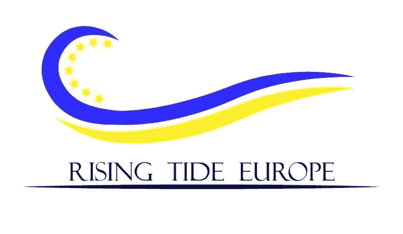

# 她是天使。

> 原文：<https://medium.datadriveninvestor.com/she-angels-256053e0b7d0?source=collection_archive---------6----------------------->

## 以及为什么我决定成为一名肩负使命的天使投资人*

我最近在 Linkedin 上发现了一篇关于企业家的有趣文章，作者是盖伊·川崎。这篇文章的标题是“女性投资与男性不同，获得更好的结果”。川崎在他的帖子中引用了副标题:“**女性在未来几十年将变得更加富有。他们如何投资将影响市场。这篇文章的作者，天使投资人 [Pip Wilson](https://twitter.com/pipwilson0) ，指出*有一个缺口正在稳步缩小。女人越来越有钱了。威尔逊认识到，女性将会有越来越多的钱用于投资，并对投资决策有更大的影响力。*继续回答这个百万美元的问题，即女性的投资方式是否不同。是的，他们有。出于各种原因，你可以在这里阅读全文。**

重要的是*是*不同的，而且**女性越来越有意愿和欲望去冒险投资，包括被认为是高风险资产类别的早期天使投资。**

> 天使投资是说起来容易做起来难吗？

对于我们以前没有尝试过的任何事情，都有很多神话和恐惧。这些是神话，真相和我决定要做的事情。

## 神话 1:你需要几百万才能成为天使。

这个要看你想成为什么类型的投资人，但是不，你不需要几百万。即使你有，我也不会建议你把它们都放在一个资产类别中。你需要对冲，而不是赌房子。

但是你完全可以开始建立一个投资组合，金额低至 1 万英镑。

你可以一个人做，但如果没有上面提到的几百万，那就没什么价值了。如果你不完全赌运气，你需要一个投资组合。投资毕竟是一场数字游戏。

## **误区二:很难。**

嗯，在地球上没有什么是容易的，但是困难不是不可能的。可以自学。有很多方法可以做到这一点，读书，学习课程，但是没有什么比教育更好的了，那就是和愿意帮助和支持的同龄人一起做。请继续阅读。

## 误解 3:我住在…(插入小国名称)不是硅谷，找不到交易

我住在塞浦路斯。对于国际友人来说，塞浦路斯是地中海东南角的一个令人敬畏的岛屿。尽管塞浦路斯确实有一个充满活力的创业生态系统，但它是一个小岛。因此，建立一个由 8-10 家公司组成的投资组合可能具有挑战性(而且需要的金额超过 1 万英镑)。

## 我也有同样的担心。

特别是上面的 1 和 3。我在创业界摸爬滚打了近 20 年，知道在欧洲(更不用说在塞浦路斯了)这个被称为天使投资(angel investing)的地理倾斜数字游戏中到处进行小额投资是不会成功的。很明显，我必须联合起来。

有许多天使投资的在线平台开放了公司池(如 Seeders)和其他做联合投资的平台(如 AngelList 等)。虽然不是我想要的。

# 涨潮欧洲 3

在欧洲和全球范围内深入参与创业世界的一大好处是结识优秀的人，了解新的机会。2018 年 2 月，我在布鲁塞尔担任欧洲创新委员会中小企业工具评审团成员，并有幸会见了涨潮欧洲 3 投资委员会令人惊叹和充满活力的负责人，我现在亲爱的朋友 [Victoria Hernandez](https://www.linkedin.com/in/victoriahernandez/) 。

## 什么是涨潮欧洲 3？

涨潮欧洲 3 (RTE3)计划是全球运动的一部分，旨在增加女性作为一种资产类别参与天使投资。该计划结合了学习、投资和网络。涨潮计划是欧洲商业天使网络(EBAN)、超越投资和下一波基金会之间的合作。
每个参与者将从€承诺 10 000 英镑用于该计划。
节目期间你:
1。在 12 到 18 个月的时间内，开发 8 到 12 家欧洲早期公司的多元化投资组合。
2。与主要投资者一起观察、学习并参与投资决策。
3。参加为期一年的教育计划，包括投资流程各方面的网络研讨会、视频和现场培训
4。迄今为止，与来自 39 个国家和 5 大洲的 160 多名妇女一起建立了网络。

RTE3 不仅面向经验丰富的投资者，更重要的是，面向希望与经验丰富的投资者一起“边做边学”的女性。(RTE3 计划传单[此处](http://goo.gl/2DcCmi))

## 答对了。我找到了适合我的。

> 这是一个投资于欧洲伟大初创企业的联合倡议，其使命是赋予女性成为天使投资人的权利。

从两个方面改变世界的倡议？只是我的事情。所以我们在这里。我现在是 RTE3 投资委员会的一名交易负责人，非常高兴能和了不起的女性一起在欧洲投资伟大的创业公司。

哦，所以不存在误解，我们也欢迎男性作为共同投资者。

*免责声明:天使投资高风险*。

*这大概是你可以毫无畏惧地称我为“天使”的唯一背景；-)