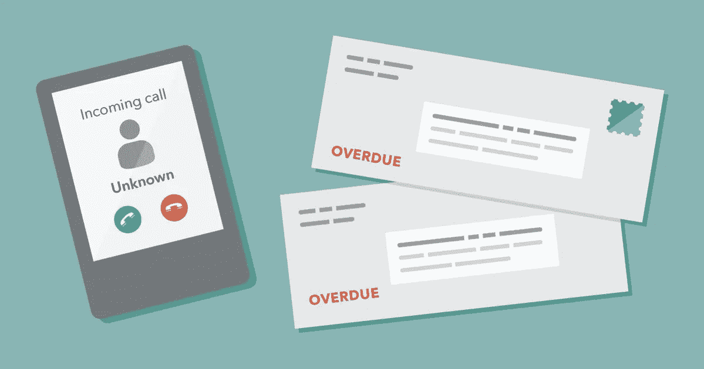

# 她欠了一屁股债

> 原文：<https://medium.datadriveninvestor.com/she-owes-a-debt-to-debt-f088ac40fa5e?source=collection_archive---------1----------------------->

## 摆脱账单意味着克服不良的财务习惯

To get out and stay out of debt, first you need a debt mindset reset.

艾姬·贝克(ackie Beck)艰难地成为了一名个人理财专家，她深陷债务之中，却没有摆脱困境。现在，她把自己的故事告诉其他人，帮助他们避免同样的财务困境。

“如果你想无债一身轻，你必须愿意做出改变——很多改变都是心态上的改变，”她说。“我和我丈夫已经偿还了 147，000 美元，否则我们不可能做到这一点。我坚信你*能*征服债务，无债一身轻的生活棒极了。”

当债务成为一项巨大的事业时，很难知道从哪里开始征服它。

“准备还债的第一步是要有足够的勇气去偿还，”贝克说。“在此基础上，你可以制定细节，建立应急基金等。重要的是开始行动。要上进，不要找借口。”

## **债务决策**

有多种类型的债务，你必须决定先拿哪种债务。

“如果你有发薪日贷款或类似的贷款，先把它们当作紧急情况来处理——因为它们就是紧急情况，”贝克说。“否则，研究表明‘从小做起’的策略是最有效的。所以，选择你最小的债务，不管是什么类型的。”

还有许多债务策略，挑选一个合适的可能会让人望而生畏。然而，贝克说这并不难。

“最有效的债务策略是你会坚持的策略，”她说。“这通常意味着债务滚雪球。如果你想知道在你的具体情况下，你可能会支付多少利息，那么就用我的[还清债务](https://www.jackiebeck.com/pay-off-debt-app-info/?utm_content=buffer08eee&utm_medium=social&utm_source=twitter.com&utm_campaign=buffer)应用程序这样的计算器来找出答案。”

解决债务问题很重要，因为它直接影响信贷。事实上，贝克说没有区别。

“信用是债务，你使用债务的方式——加上你持有的债务数量和类型——会影响你的信用评分，”她说。“有趣的事实:按时付款以减少债务是帮助你提高信用评分的一个好方法。”

 [## 迈出一小步:提高你的信用评分

### 随着新年的婴儿刚刚离开婴儿床，这是一个很好的时间让你的信用有一个健康的开始。Rod…

medium.com](https://medium.com/datadriveninvestor/take-a-baby-step-improve-your-credit-score-f1457b10b249) 

## **真的欠吗？**

人在催收中负债怎么办？

“如果你收到催收欠款的通知，首先要确定你真的欠了，”贝克说。“如果是这样的话，你们或许可以谈判。获得任何书面协议，并永远保留付款凭证。这个复杂的话题有很多要考虑的，幸运的是[消费者金融保护局](https://www.consumerfinance.gov/consumer-tools/debt-collection/?utm_content=buffer640c5&utm_medium=social&utm_source=twitter.com&utm_campaign=buffer)有很好的信息。”

她还指出了债务合并和债务清偿之间的区别。

“债务合并基本上是移动你的债务，合并债务以减少贷款数量，但不是所欠金额，”贝克说。"债务清偿是试图让债权人接受少于你所欠的全额付款."

在这个过程中，人们在试图偿还债务时会犯一些常见的错误。

“我看到的最大的债务偿还错误是用房屋净值信贷额度等担保债务取代信用卡等无担保债务，承担额外的新债务，在不改变行为的情况下合并债务——这导致债务增加——以及没有应急基金，”贝克说。

## **你不能着急**

她说，债务人在支付账单时应该避免气馁或分心。回报不是一蹴而就的。

“还清债务需要时间，所以知道这很正常会有所帮助，”贝克说。“和支持你的人谈论你的目标。一旦你无债一身轻，关注那些你可以用额外的钱做的了不起的事情。用你已经有的钱犒劳一下自己。”

一旦无债一身轻，就有可能重蹈覆辙。对此，贝克提出了简单而合理的解决方案。

“为了避免债务，你绝对需要一个好的[应急基金](https://medium.com/@JKatzaman/have-an-emergency-fund-handy-just-in-case-f4ef32664dce)和医疗保险，”她说。"除此之外，坚持只花你已经有的钱的习惯."

她还提到了一些想让收支平衡的人可以去的地方。

“有这么多的资源可供人们工作来摆脱债务，”贝克说。“最重要的是寻找正确的事情:摆脱债务或偿还债务。我有一个[免费课程](https://www.jackiebeck.com/get-a-debt-mindset-reset/?utm_content=buffer65b64&utm_medium=social&utm_source=twitter.com&utm_campaign=buffer)，可以让你马上开始。”

**关于作者**

吉姆·卡扎曼是拉戈金融服务公司的经理，曾在空军和联邦政府的公共事务部门工作。你可以在[推特](https://twitter.com/JKatzaman)、[脸书](https://www.facebook.com/jim.katzaman)和[领英](https://www.linkedin.com/in/jim-katzaman-33641b21/)上和他联系。