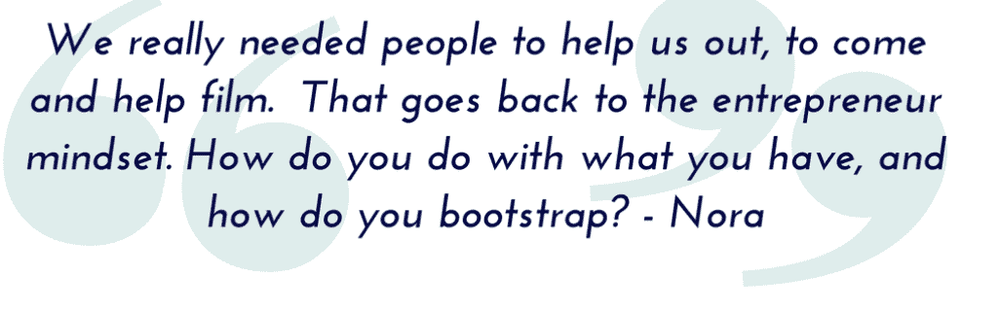

# 她开创了这部纪录片——一部关于商界女性的鼓舞人心的纪录片

> 原文：<https://medium.datadriveninvestor.com/she-started-it-inspiring-documentary-about-women-in-business-3de3fdfdcfbe?source=collection_archive---------41----------------------->

女性创业者、商界女性、IT、科技和风险投资领域的女性。现在，这已经成为媒体和日常生活讨论中的一个常见话题，无论男女都是如此。事实上，作为一名女性，看着成功的女性创始人冲击商界对我来说是非常鼓舞人心的。《她开创了事业》讲述了 5 个年轻女性不择手段追求创业梦想的故事。这部电影于 2013 年推出，是一部关于女性科技企业家的纪录片，在硅谷、纽约、欧洲、越南、密西西比等地拍摄，旨在突出年轻女性的成功榜样。这是第一部展现年轻女性经营一家科技初创企业的幕后故事的电影。

[https://www.youtube.com/watch?v=hcGGrUx666s](https://www.youtube.com/watch?v=hcGGrUx666s)

[https://twitter.com/shestartedit](https://twitter.com/shestartedit)

[https://www.facebook.com/SheStartedIt/](https://www.facebook.com/SheStartedIt/)

我们都需要**的榜样**，我们分享非凡成功故事的例子真是太棒了。

这不是为了变得更好，无论是男人还是女人。我们是不同的，但我们都有同样的可能性和机会采取主动，实现似乎遥不可及的目标。我们有相同的工具，略微不同的思维方式，但我们可以学习相同的东西，出现在公司层级的同一级别，并在任何领域建立极其成功的企业。我很高兴看到这么多新的倡议，支持和鼓励女性去争取，去争取她们想要创造和生活的未来。这些尝试会带来很多好处。在我们当地的环境中会听到越来越多的成功故事，我真的相信这是年轻一代的导火索。被女性创始人包围着，成立自己的公司，在市场上创造新的价值，活出自己的激情，会变得越来越自然。

**我推荐看《看简投资》第 20 集，其中简采访了电影的创始人:**
[第 20 集:《看简与诺拉·波吉制作电影& INSIYAH SAEED](https://www.seejaneinvest.com/podcast-episodes/see-jane-produce-a-film) 。

她开创了这一事业 是一个很好的例子，说明女性只是简单地开创了这一事业，开创了自己的事业**并鼓舞了他人。我强烈建议看这部电影，从中获得一些智慧。敞开你的心扉，相信你自己，不要为你没有尝试过你想要的生活而后悔！**

**我们与[瑞士金融科技女性](https://investinginpassion.com/2018/10/09/swiss-fintech-ladies/) ( [#SFTL](https://investinginpassion.com/2018/10/09/swiss-fintech-ladies/) )一起支持女性，鼓励她们举起双手，发出声音，超越既定的标准。让我们看看 SFTL 在做什么，加入我们吧！**

****

**[https://www.facebook.com/groups/235316663851804/](https://www.facebook.com/groups/235316663851804/)**

****

**[https://investinginpassion.com/2018/10/09/swiss-fintech-ladies/](https://investinginpassion.com/2018/10/09/swiss-fintech-ladies/)**

**【www.investinginpassion.com 帖子原载**