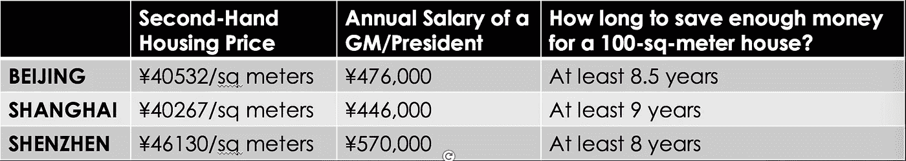

# 深圳的焦虑

> 原文：<https://medium.datadriveninvestor.com/shenzhens-anxieties-7394ba85ec9?source=collection_archive---------0----------------------->

深圳政府今年 3 月宣布的填海造地计划在全国范围内引发了担忧。深圳是一个面积约为 2000 平方公里的城市，拥有约 2200 万人口，其中 1000 万居民居住在深圳。深圳将填海造地 55 平方公里，推平 50 平方公里的山区。

> [“深圳将有超过 100 平方公里的土地。人们可以对城市未来的发展有更多的期待。”](http://www.chinadaily.com.cn/china/2016-03/04/content_23738729.htm)

但是真的吗？

中国国家统计局今年 2 月发布的报告显示了 2015 年房地产市场的价格波动。深圳以超过 50%的房价涨幅超过其他城市，其次是上海(25.1%)和北京(14.2%)。

让我们做一个计算，让我们了解一下对于大多数中国人来说，房子有多“奢侈”。

Not including the tax and commission fee from buying a house; Or the necessary living expense and personal tax from the salary

哇，对于那些一线城市的顶尖人才来说，如果没有其他收入，买一套二手房差不多要 10 年。

焦虑伴随着高涨的房价而来:个人觉得他们的未来不可预见；在这个城市，随着成本飙升，公司感到难以生存。

这座城市本身也有自己的焦虑:它的制造业和科技业将如何发展？

# ***初创企业的好莱坞***

除了[华为](http://www.huawei.com/us/)、 [BGI](http://www.genomics.cn/en/index) 、[腾讯](http://www.tencent.com/en-us/index.shtml)之外，深圳还造就了更多的创新型科技公司，如 [DJI](http://store.dji.com/) 、 [Seeed](http://seeed.cc/) 、 [Royole](http://www.royole.com/) 等。与空气质量恶化、户籍制度取消种族隔离的北京，以及创业环境不那么有利的上海相比，深圳正日益成为那些渴望在大都市谋职的人的首选。

如果下一个机会出现在硬件和软件的融合，深圳已经以压倒性的优势做好了准备。

首先，作为电子产品的圣地，深圳开发和制造的个人电脑数量超过了世界其他城市。 [华强北](https://en.wikipedia.org/wiki/Huaqiangbei)是硬件集散地的标志，在这里你可以找到任何种类的电子产品，大到 PC 控制面板，小到电阻器或电容器。最近[中国电子集团](http://www.cec.com.cn/En/about_us/Company_Profile/2760.aspx)，一家中央政府直属的大型国有企业集团，刚刚将总部从北京迁至深圳。

其次，深圳政府对创业的支持和开放态度是出了名的。在过去的两年里，随着国家政府鼓励初创企业创新的政策，各种投资实体、创客空间、孵化器都在深圳留下了自己的足迹。例如，中国最大的母基金(约 35 亿美元)，钱海 FOF(基金的基金)，于 2016 年 1 月新成立，深圳政府高度参与。这一史无前例的多方举措将为这座充满活力的城市带来更多积极影响。

第三，深圳有着深厚的软件基础，舒适的环境和美好的生活环境。三大互联网公司之一的腾讯在这个城市开展业务，吸引了许多程序员和工程师。此外，正是充满自由和宽容的新鲜“空气”使这座城市能够以开放的态度拥抱新技术时代的快速变化。

**在沿海，深圳在国际贸易、进口和出口方面具有先天优势。**这对于海外市场的拓展以及投资和时尚技术的信息获取更为重要。

# ***科技公司&厂商何去何从？***

但与此同时，有一个问题困扰着我们所有人:飞涨的房价是否阻碍了深圳的科技产业？

满腹辛酸。

深圳正在经历一场暴风雨。

华为将把 Ascend 智能手机部门搬到远离深圳的东莞，也可能不会把新办公室设在深圳。

中兴通讯正在将其制造中心转移到河源。

高通正把办公室和实验室搬到广州和东莞。

这不是一个积极的迹象。如果我们仔细观察一下[龙岗](https://en.wikipedia.org/wiki/Longgang_District,_Shenzhen)，也许会发现一些线索。

龙岗是深圳的一个区，被定位为未来 30 年工业改革的主战场。猜猜谁在龙岗？华为。龙岗政府希望像华为这样的顶级公司能够引领技术创新，从而优化当地的制造基础设施，并在全球范围内引领中国制造。

但是 2015 年对龙岗来说是一个冬天。一些统计数据:

*   2015 年 1-9 月，如果排除华为的贡献，龙岗工业总产值大幅下降，利润总额下降 16%。
*   2015 年有 392 家公司亏损，金额较 2014 年增长 16%。
*   截至 2015 年 9 月底，共有 66 家行业公司(非第三产业)搬迁、转型、停产或清算。但只有 15 家新公司迁入龙岗。

华为似乎是唯一的救命稻草。2015 年，它为龙岗贡献了 50%的 GDP 增长，而 2012 年仅贡献了 40%。涵盖了龙岗制造业衰落的警示。

此外，华为可能会离开深圳，因为其他城市的政策更优惠，与深圳更高的租金形成鲜明对比。

**运营成本增加是主要原因(房租、工资、资金成本、员工社会保险、营销费用、物流……)，利润空间越来越小，企业生存越来越困难。**国内市场萎缩是另一个原因，这导致制造商扩大生产规模的意愿下降。但是龙岗区政府[正在积极为海外市场和当地制造商牵线搭桥。](http://www.foundersspace.com/event/1st-innovation-competition-of-international-talents/)

# 一个城市的演变

基础设施、公共服务、政府资助政策……所有这些都为初创企业营造了良好的氛围。广东省的省会广州总是被拿来和深圳相比，因为它们是如此的接近。深圳的工资比广州高 10%，但住房成本却比广州高 220%。

互联网+是一个同时发生和改变世界的趋势。它通过使信息共享更容易和更容易，革新了传统行业。话虽如此，随着人才在考虑职业生涯的同时寻求移民的地区障碍减少，初创企业的门槛逐渐消失。

深圳是一个移民城市，它一直被认为是你可以实现梦想的地方。很多故事，关于起起落落，事业巅峰与深渊，爱情与仇恨，商业信任与欺诈，平凡与传奇……讲述这些故事的正是移民。随着移民涌入其他城市，房价持续上涨，这座城市将走向何方？

我相信每个城市都有一个自我完善和进化的过程。这篇文章中的观点可能是危言耸听，但我希望你会喜欢带着一些反思阅读。