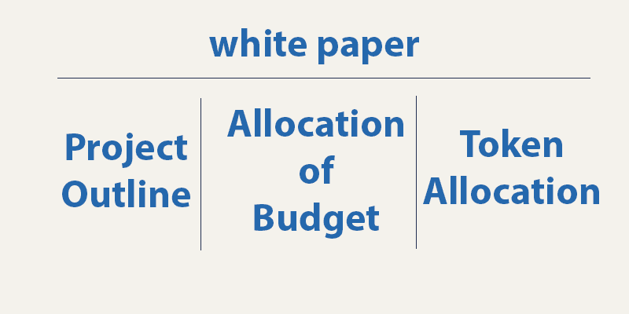

# 转变区块链融资生态系统

> 原文：<https://medium.datadriveninvestor.com/shifting-blockchain-funding-ecosystem-d3f26edd6cd9?source=collection_archive---------27----------------------->

在过去的两年里，随着成功和不成功的首次硬币发行(ICO)的涌入，其中许多都被视为骗局，而“合法”的 ICO 正在努力保持知名度。如果他们失败了，采纳者将很难通过一个失败的项目来弥补他们的损失，尤其是对风险投资家(VC)来说。

# 到目前为止的区块链路线图

我们都读过区块链项目的白皮书和路线图。类似这样的东西看起来很熟悉。

在过去的 2 年里，投资者和采纳者在投资前被白皮书中提供的任何信息所左右，同时对他们的团队充满信心，以便让所述项目启动。

# 进退两难

上述项目的问题在于，对投资者来说，风险水平要高得多，对风投来说尤其如此。

在 2018 年新加坡创新与技术周(SwitchSG)上，风投和企业家们都开始超越炒作，质疑融资的方式，或者说，融资的顺序。

在一个讨论公司如何在亚洲使用区块链技术的小组中，人们一致认为更传统的融资模式将是首选。意思是说，先证明产品/服务的概念，再筹资。

或许是通过“传统”的经营视角，风投们在过去十年里承认了这种颠覆性技术。

有了 ico，大众就有权力决定他们想在世界上看到的产品类型。资金现在可以从国际上感兴趣的方面获得。

这让风投们感到沮丧，因为他们的利益和议程在谈判中的分量已经不如以前了。这很可能是风投对区块链公司感到不舒服的原因之一。

# 这是否意味着风投会对区块链公司趋之若鹜？

肯定不是！有许多区块链公司正在开发不使用 ico 或令牌产品的产品和服务。相反，他们专注于传统的融资方式，同时使用区块链技术和共识算法作为他们的内部平台。

如果你正在考虑用区块链创业，也许这种模式是正确的。

# 区块链融资生态系统现在

目前，最初的区块链“淘金热”的炒作和快速融资似乎正在消退。或许未来几个月将出现一种不同的融资模式，让更多的投资者满意。

只有时间能证明一切。

*原载于 2018 年 10 月 16 日*[*【www.datadriveninvestor.com】*](http://www.datadriveninvestor.com/2018/10/16/shifting-blockchain-funding-ecosystem/)*。*