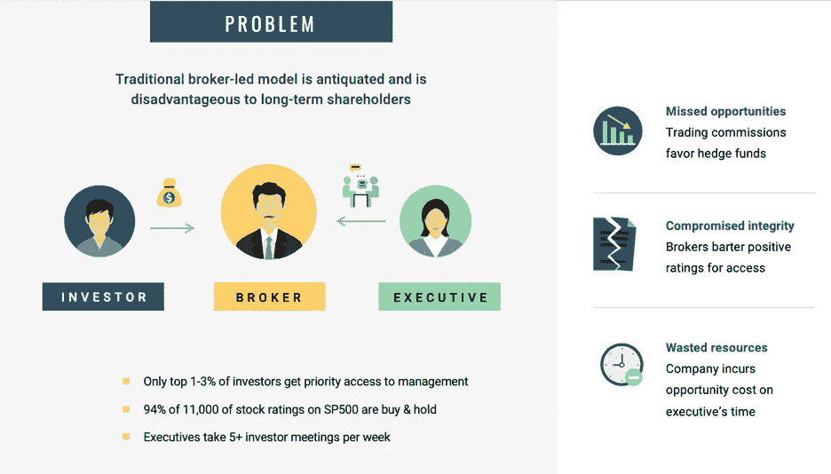
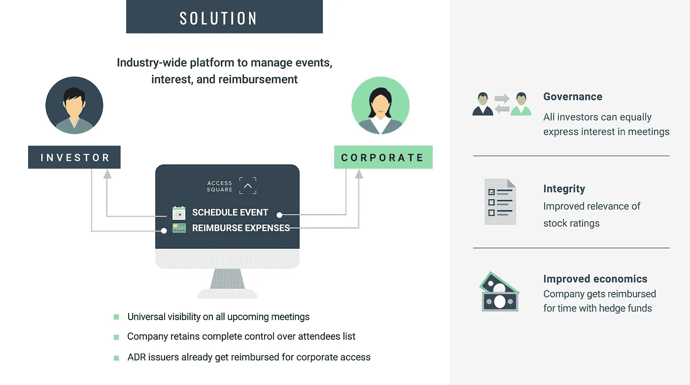
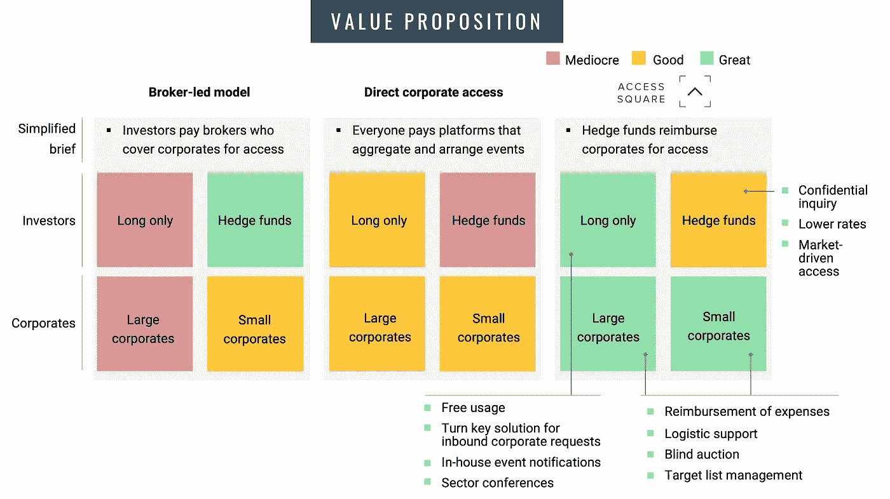
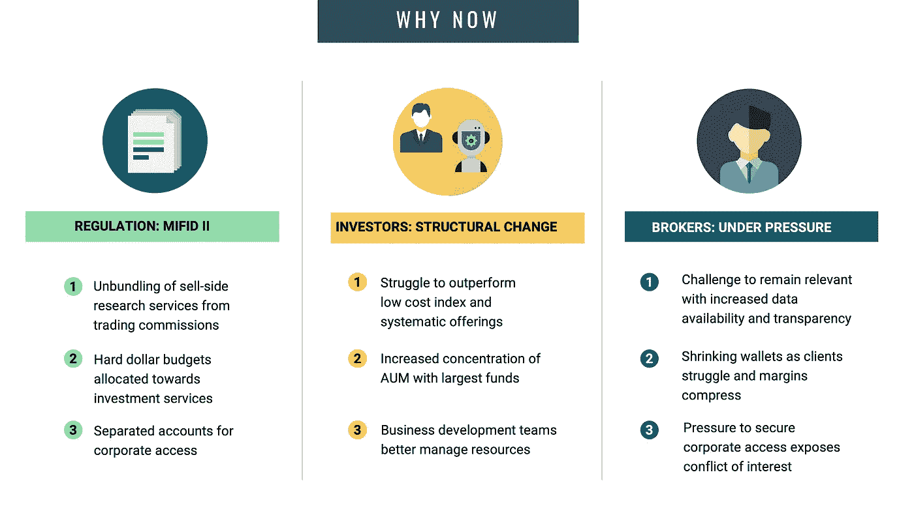

# 投资研究风向的转变

> 原文：<https://medium.datadriveninvestor.com/shifting-winds-in-investment-research-2c8392d2e37a?source=collection_archive---------29----------------------->

自从一千年前贸易开始以来，作出买卖投资决定的信息就一直支配着市场，从初级商品到香料和商品，再到现代市场中各种资产类别的大量奇异衍生品。投资者总是因其精明的决策、幸运的时机和彻底的尽职调查而获得回报。本文(以及作为初创公司的 Access Square)主要关注最后一项:投资者尽职调查，特别是面对面的调查。

**正如在任何双边市场一样，经纪人的存在是为了促成机构投资者与这些投资者所投资的上市公司管理层之间的会面。这种做法被称为企业访问，尽管它主要是行政性质的-**协调时间表-这项服务占 2017 年美国经纪佣金支出 84 亿美元的 30-50%份额。****

如今，坐在摩根大通(JPMorgan)和高盛(Goldman Sachs)等公司办公室里的经纪人不仅仅向投资者提供会议服务:服务包括市场情报、投资者反馈、行业观点、收益预测以及价格建议。鉴于企业访问和安排会议的管理任务所占的钱包份额不成比例，一批新的创业公司涌现出来，以更低的成本和更好的技术完成这项工作。由于 2018 年只有 5%的企业报告使用第三方(即初创公司、咨询公司)，市场对初创公司开放，以占据更大的份额。

Problems with traditional corporate access practice. Source: Access Square

不管华尔街对当前做法的接受程度有多高，当前体制的问题依然根深蒂固。核心是经纪人在安排这些投资者会议中扮演的角色。我们看到以下三个问题:

1.  由于收取交易佣金的经纪人青睐高周转率的对冲基金，小投资者错过了机会。1-3%的投资者一直通过经纪人优先参加这些公司会议。
2.  **在公共股票市场中，由于经纪人暗中用股票评级换取高级管理人员的时间，激励结构造成了有偏见的投资研究**。这种偏见可以从 11，000 份对 SP500 公司的股票评级中看出，94%的评级要么是买入，要么是持有，总体而言很难做到客观。
3.  **让公司高管分心**远离经营业务。美国一家中型大型上市公司的高管平均每周参加 5 次以上的投资者会议，这些会议可以用来发展业务。此外，高管们的时间价格大约是每次会议 11，000 美元——12，000 美元。每次会议 5000 美元的差旅费用加起来相当于 2017 年北美平均 65.8 万美元的高管专用差旅预算的 24%。

Proposed solution to address inefficiencies in broker-led corporate access. Source: Access Square

S **解决这些低效率问题的可持续的长期方案必须来自增加透明度和更大的激励企业探索替代方案。**我们的方法是创建一个在线全行业平台来管理活动、利益和报销。该解决方案提供了一些关键优势:

1.  **更强的治理**这样任何人都可以看到任何即将召开的会议并直接表达兴趣。
2.  **通过消除有利的股票覆盖范围以获得管理层的隐性交换，为无偏见的投资研究提供更多激励**。企业保留对与会者名单的完全控制权。
3.  **通过补偿高管与短期投资者(即对冲基金)相处的时间，为企业带来更好的经济效益**。目前，ADR 发行人已经建立了一种类似的做法，即由他们的服务提供商为企业访问提供补偿。

Improving value proposition in a direct corporate access model. Source: Access Square

**在过去的 5 年里，许多初创企业(主要在欧洲)都专注于收集信息和安排会议。**然而，在完全避开经纪人的直接模式中，没有一个是成功的。我们认为成功的关键在于通过对企业更大的激励来改善等式的供应方。此外，直接交易允许不依赖交易佣金的可扩展商业模式。**在 Access Square，我们鼓励长期思维，为只做长线的投资者提供使用平台的优惠条件。**

Timing is conducive for direct corporate access platforms. Source: Access Square

在投资中，模仿就像在喜剧中一样重要。企业接入的创新也取决于良好的时机。多年来，风向一直在朝着有利于企业直接参与的方向转变。三个结构性变化汇集在一起，使得当前的时机比以往任何时候都更有吸引力:

1.  首先在欧洲建立的 MiFid II 在美国被跨国投资公司广泛采用。该法规不仅带来了更大的透明度，将投资研究从交易佣金中剥离出来，还对经纪商提供的服务价值进行了更多审查。
2.  鉴于被动低成本替代品和成功量化策略的激增，基本面投资者面临结构性保证金压力。
3.  **经纪商很难在数据丰富的环境中保持相关性**,这种环境暴露出固有的利益冲突，需要更多地依赖公司访问等利润率较高的服务。

O 总的来说，随着企业访问领域最近(姗姗来迟)的创新，人们很容易忽视这种做法仍然是一种关系业务。养成新习惯和改变既得利益需要多年时间。经纪商将继续安排企业访问会议，但随着时间的推移，投资者和企业将意识到，通过直接的企业访问平台，他们都能获得更好的交易。