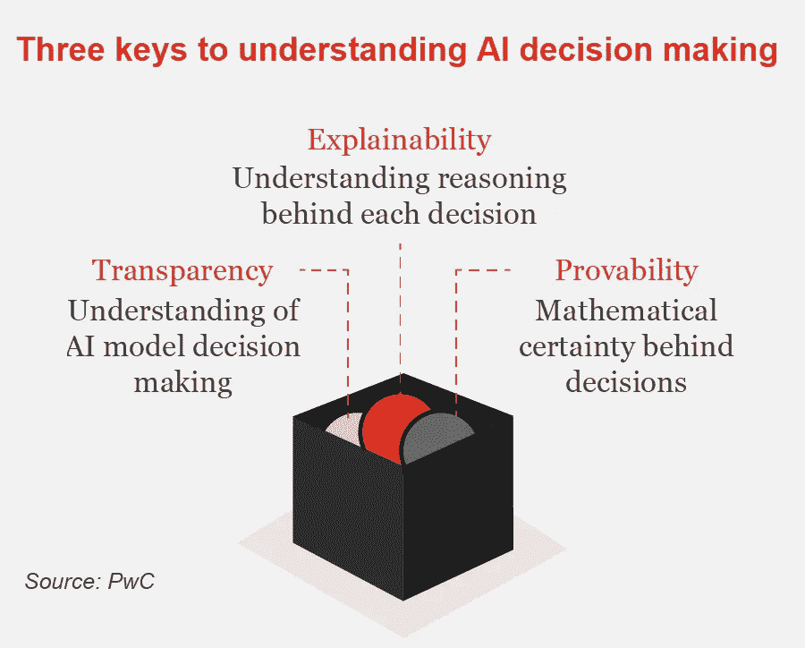
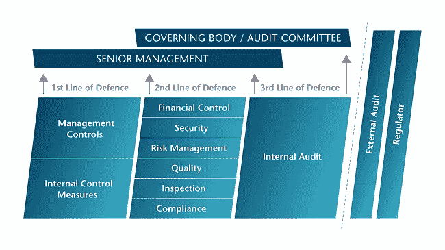
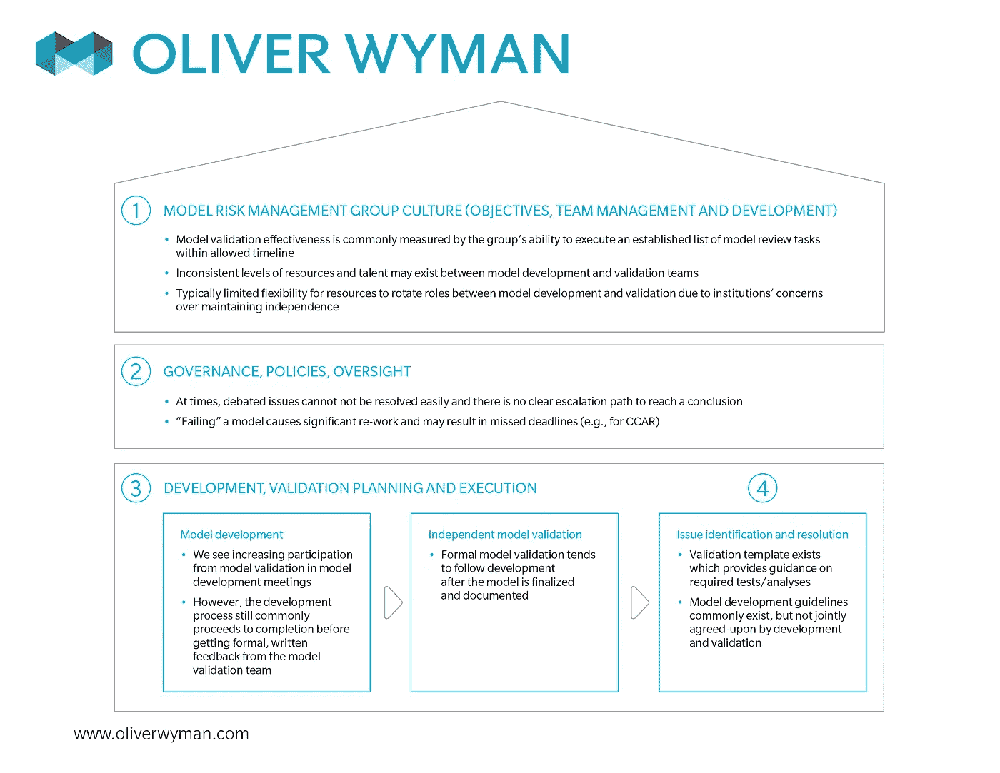
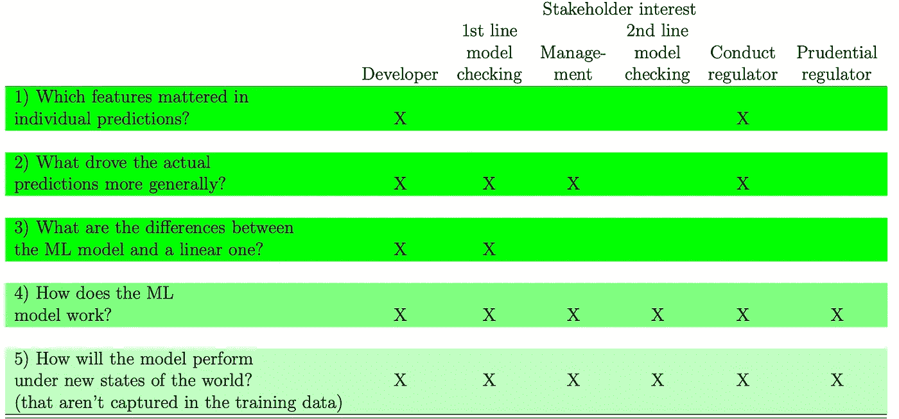
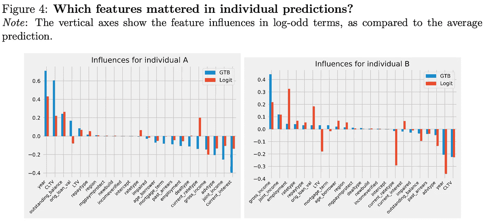
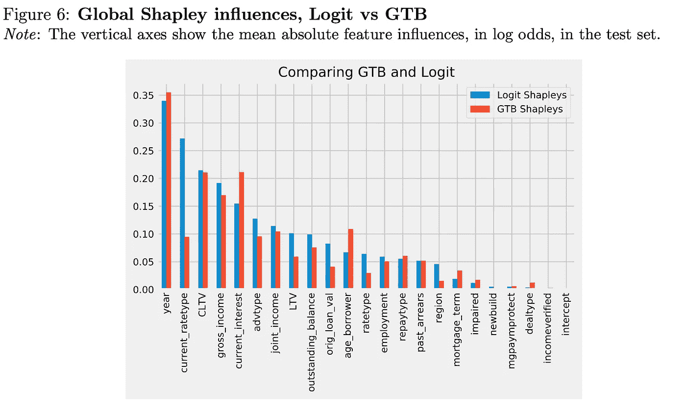
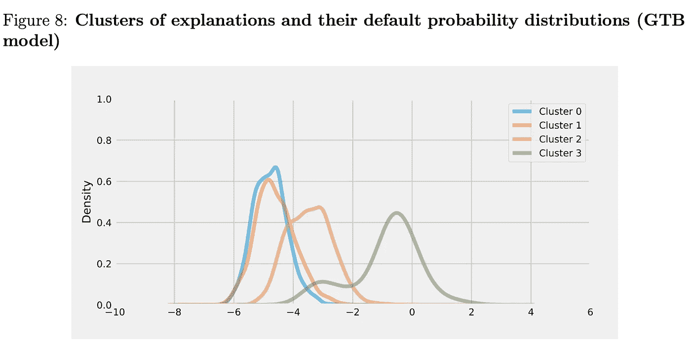
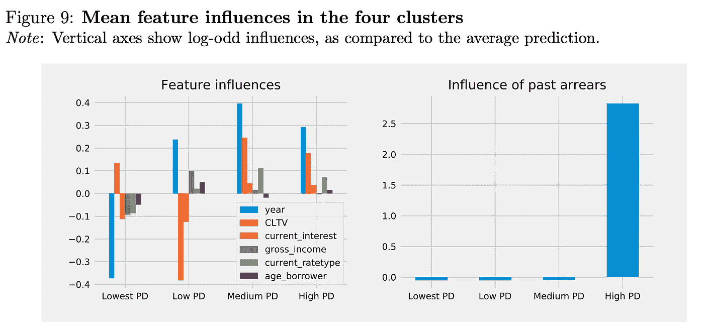
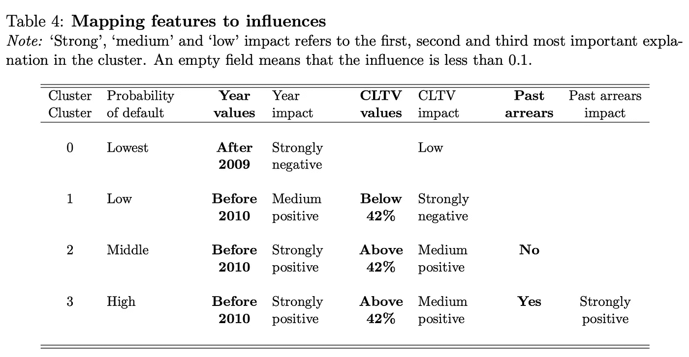

# 在黑盒子里放一盏灯

> 原文：<https://medium.datadriveninvestor.com/shining-a-light-inside-the-black-box-d36e8d00259c?source=collection_archive---------4----------------------->

**关于在现实世界中使用“黑盒”机器学习模型，金融监管指导和研究告诉了我们什么**

How do we open the model’s black box? [Image credit PwC blog](http://usblogs.pwc.com/emerging-technology/to-open-ai-black-box/).

作为一个在金融行业创建风险模型并向高层领导解释模型背后的假设的人，我对人工智能和机器学习在现实生活中的应用感到担忧。建模最重要的步骤之一是解释它是如何工作的。当我们打算使用该模型做出现实世界的决策时，尤其如此，这些决策会影响公司的生死——我们应该允许交易员承担多大的风险，我们应该投资什么产品，以及我们应该为我们销售的产品提供什么价格。

虽然金融机构、监管机构和央行长期以来一直在使用和审查模型，但人工智能(更具体地说是机器学习)的使用仍然是金融的一个新领域。对英格兰银行出版物的搜索显示，第一篇关于机器学习的工作论文仅在 2 年前的 2017 年 9 月 1 日发表。尽管美联储(美联储)早在 2016 年就在研究新闻报道中的股价可预测性，但美联储在 2018 年的一次演讲中公开提到了人工智能的使用，称这仍是“人工智能(AI)在金融服务中的应用”的“早期阶段”

 [## 机器学习的外汇交易挑战|数据驱动的投资者

### 机器学习是人工智能的一个分支，之前占据了很多头条。人们是…

www.datadriveninvestor.com](https://www.datadriveninvestor.com/2019/02/18/the-challenge-of-forex-trading-for-machine-learning/) 

这就是为什么我想了解金融业打算如何使用机器学习。本文试图找出是否有可能照亮黑盒，以便这些模型不仅可以用于理论或学术设置，还可以用于现实世界的应用，在现实世界中，法规和组织结构要求我们对我们的模型正在做什么有一个工作知识。

# 金融行业中的模型验证

In the Finance Industry, there are three lines of defense to protect the organizations from risk. (This is even before external audit and the regulator come into play.) Model Validation (usually sitting within Risk Management) is one piece of the large puzzle. [Image credit Chartered Institute of Internal Auditors](https://www.iia.org.uk/resources/audit-committees/governance-of-risk-three-lines-of-defence/).

如果您目前或以前在金融行业工作，您可能听说过 SR-11–17。这是一封由美联储发出的美国监管信函，为银行和其他金融机构提供关于模型风险管理的指导。人们过度依赖模型，对风险模型的准确性过于自信。例如，长期金融管理公司(LTFM)是由两位诺贝尔经济学奖获得者领导的对冲基金，他们损失了*比他们的诺贝尔奖获奖模型预测的对冲基金要多得多的钱*。该行业的这一失误和其他模型失误迫使美联储(美联储)和其他监管机构决定如何控制模型风险。

美联储将模型风险定义为由于两个主要的模型失误而导致的模型使用的不利后果(主要是金钱损失):

1.  在不适当的情况下使用正确的模型(例如，模型不适用的情况)
2.  使用输入不正确的模型或产生不正确结果的不正确方法/计算

美联储提出的防范模型风险的最重要原则之一是“有效挑战”。基本上，一个独立公正的第三方——通常是一个称为模型验证团队的团体——应该从整体上审查模型，确定可能的模型限制，并提出改进模型的建议。模型验证团队甚至可以建议将模型*而不是*投入使用，直到发现的模型缺陷得到解决。

虽然不是所有的模型都受到同等程度的严格审查，但是模型越是被认为会影响业务决策，整个组织就应该对该模型进行更多的审查。

How Model Risk is managed within financial institutions, and where the Independent Model Validation team fits in. [Image source courtesy of Deloitte](https://www2.deloitte.com/us/en/insights/topics/risk-management/global-risk-management-survey-financial-services.html).

> “但是，如果模型和模型输出对业务决策有重大影响，包括与风险管理、资本和流动性规划相关的决策，并且模型失败会对银行的财务状况产生特别有害的影响，则银行的模型风险管理框架应该更加广泛和严格。”—SR-11–17 模型风险管理监管指南

因此，当一位前风险经理和有抱负的数据科学家看到这份监管指南时，我不禁认为，机器学习模型等固有的黑箱模型不能用于像金融业这样高度监管的行业。那么，监管者如何看待这种不透明的黑箱模型的即将涌入？

# 监管机构有什么要说的

几年前，美联储才真正开始谈论人工智能(AI)和机器学习(ML)。关于人工智能使用的最尖锐的讨论是美国联邦储备委员会理事莱尔·布雷纳德的一次演讲，题为“我们从金融服务中的人工智能中学到了什么？”布雷纳德行长承认，目前美联储没有专门针对人工智能使用的指导意见，她(毫不奇怪)指出了现有的指导意见，包括 SR-11-17。她警告金融机构不要使用不完全透明的模型，并主张在模型不透明的情况下进行补偿控制。充分说明:

> 如果评审者不能完整地评估一个模型，或者如果他们发现了问题，他们可能会建议更谨慎地使用该模型或者使用补偿控制。类似地，当我们自己的审查员评估模型风险时，他们通常首先评估公司开发和审查模型的过程，以及对模型中任何缺点的反应或审查模型的能力。— [“关于金融服务中的人工智能，我们学到了什么？”莱尔·布雷纳德州长的演讲](https://www.federalreserve.gov/newsevents/speech/brainard20181113a.htm)

但是，以机器学习算法的形式实现一种新的、昂贵的模型，如果不能用于制定商业决策，就没有财务或商业意义。因此，下一个问题是，我们如何才能在一定程度上揭示黑盒模型，从而可以解释模型的内部工作方式，并针对公正的第三方进行辩护——从模型验证团队到高级管理层，到内部和外部审计，甚至到监管机构本身？

# 英格兰银行有一个答案

英格兰银行，英格兰中央银行，最近(2019 年 8 月)就这个话题发表了一篇工作论文。他们通过一个抵押贷款违约风险分析的例子进行了一个关于金融领域机器学习可解释性的[思维实验](https://www.bankofengland.co.uk/-/media/boe/files/working-paper/2019/machine-learning-explainability-in-finance-an-application-to-default-risk-analysis.pdf)。我想简要回顾一下英格兰银行概述的流程，它可以帮助我们了解机器学习黑匣子的内部情况:

(注:所有进一步的引用和图表都引用了上一段中链接的英格兰银行文件。)

A list of the different questions that need to be answered to explain a machine learning model, and what stakeholders are interested in which question.

## 1.确定个体效应的定量输入影响(QII)方法

定量输入影响方法是一种调查机器学习模型的输出如何基于变化的输入而变化的方法。这样，我们可以推断每个变量对模型预测的影响有多大。

> “QII 方法用于我们观察机器学习模型的输入和输出的情况，但是检查模型本身的内部工作是不切实际的”

Two models were used to predict two models to predict arrears (aka a loan in default): a linear logistic regression (Logit) and gradient tree boosting model (GTB). The charts are an example of QII’s for individual mortgages, showing what variables had the largest (positive or negative) effect on the prediction.

## 2.比较黑盒模型和更透明的模型(即“代理模型”)之间的关键驱动因素

研究人员在本文中所做的是创建一个简单的“代理模型”，可以近似更复杂的模型。通过这样做，他们可以比较两个模型(一个复杂模型和另一个简单模型)的 Shapley 值，并查看复杂模型的内部工作有何不同。

在这种情况下，研究人员选择了两种模型来预测欠款:线性逻辑回归(Logit)和梯度树推进模型(GTB)。研究人员以如下方式描述了他们使用这两个模型的决定:

> “使用 Logit 这样的线性模型可以作为基准，并有助于围绕我们提出的一些可解释性度量标准建立直觉。与此同时，拥有一个更“黑箱”的模型，如 GTB，有助于我们突出我们的方法的好处。此外，我们提出的方法有助于在一般模型之间进行区分，我们在这里展示了如何使用该方法深入了解为什么一些模型表现得比其他模型更好”

## 3.使用匀称的价值观识别全球驱动因素

研究人员可以辨别变量之间的相互作用，并确定单个变量的真实边际效应，“通过获取两个 QII 集之间的差异:一个是通过仅改变贷款规模获得的，另一个是通过改变收入和贷款规模获得的。”最后，通过计算“Shapley 值”来汇总每个变量的边际影响(数学计算超出了本文的范围，但是可以随意阅读[原文](https://www.bankofengland.co.uk/-/media/boe/files/working-paper/2019/machine-learning-explainability-in-finance-an-application-to-default-risk-analysis.pdf)以了解计算的详细信息)。

这样做有助于我们了解哪些变量不仅对单个决策(由 QII 给出)而且对整个投资组合(在这种情况下是抵押贷款申请)的决策最有影响。

Global Shapley values that compare how input variables influence the calculated probability of default by both the simple Logit model and the more complex, black-box GTB model.

## 4.使用聚类方法对输入空间的不同区域进行解释

虽然输入通过 Shapely 值产生的全局影响可以提供信息，但对于不同的输入聚类来说，这种影响是不透明的。输入对个人抵押贷款申请的影响是不同的，那么我们如何以简明易懂的方式解释这些差异呢？一种方法是创建聚类，并查看每个聚类的输入影响如何不同。

Image of clusters for mortgage applications. As you go to the right, the probability of default increases by cluster, with Cluster 3 having a probability distribution with the highest rates of default.

接下来，研究人员发现每个聚类的特征影响，这表明模型认为在基于客户类型确定违约率时最重要的是什么。在下图中，您可以看到“过去的欠款”的影响，这是一个布尔变量，用于标识抵押贷款以前是否有过欠款，对于所有聚类来说都是可以忽略的，除了聚类 3，即违约概率最高的聚类。

Input variables that have the largest (positive or negative) impact on the calculated probability of default by the GTB model.

研究人员用以下方式解释了“过去欠款”的相互作用:

> 事实上，我们发现高 PD 群集中的所有人都有过去的欠款。这具有经济意义。[之前的一项研究]使用调查证据显示，近一半的欠款借款人报告称，收入损失是他们无法继续还款的主要原因。鉴于收入波动持续存在，特别是在某些家庭群体中，过去经历过欠款的借款人很可能在未来也会经历欠款。英国贷款人倾向于对这些债务人实行延期偿付……这使得拖欠事件更有可能重演，因为这一循环很少被止赎权打断。

下表简要说明了变量对 GTB 模型违约概率预测的影响:

A succinct explanation of the impact of variables on the GTB model predictions of probably of default.

# 金融业可以使用黑箱模型吗？

基于英国央行进行的研究，我们能够可视化 GTB(梯度树推进)等机器学习模型的内部工作原理。虽然这需要模型开发和模型验证团队花更多的时间来仔细研究模型输入对输出的影响，但这并不排除在高度监管的行业中使用 AI 或 ML。

我很高兴看到还有什么其他方法可以更好地理解黑盒模型，以便我们可以就如何以及在哪里应用这些模型做出明智的决定，如果我们决定这样做的话。

Illuminating what the black-box is doing is like shining a light in the dark