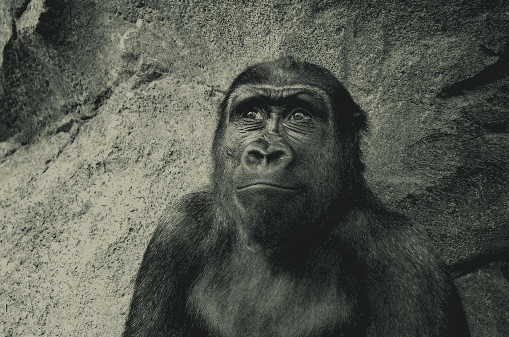
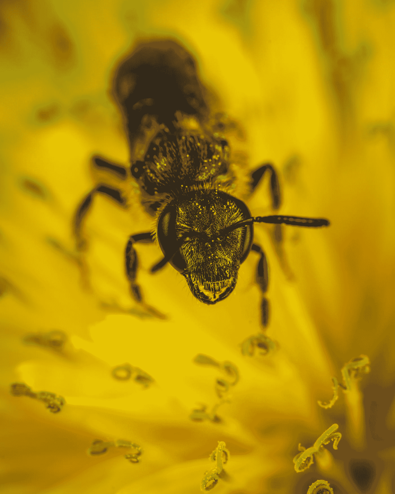

# 猿猴/人脑的缺点

> 原文：<https://medium.datadriveninvestor.com/shortcomings-of-the-simian-human-brain-2d21d5e603c8?source=collection_archive---------5----------------------->

Photo credits: Kelli Sikkema @ unsplash.com

我们做了几百万年的猴子。对遗留软件的错误进行重新编程需要很多时间，尤其是在环境崩溃的时候。

我是愚蠢的。你是愚蠢的。我们都很笨。如果你不这么想，那你是在自欺欺人。重要时刻。让我告诉你为什么，然后也许我们可以看看我们能做些什么。或者，你可以在评论中发布你的 GPA、净资产、头衔或智商分数，并对自己的遗憾感到满意。

首先，我们对大脑知之甚少。正式学术界或专业领域的脑科学家可能是神经外科医生、心理学家或心理医生，令人担忧的是，他们似乎对自己的领域知之甚少，更不用说这些虚拟学术边界之外的东西了。谁这么说的？查理(达尔文)这么说的。另一位亿万富翁[查理](https://en.wikipedia.org/wiki/Poor_Charlie%27s_Almanack)(芒格)对此表示赞同。另一个查理在他的畅销书《T5》中展示了[是如何做到的。尤瓦尔(一位历史学家)和雷(另一位亿万富翁)对此也有一些看法。但在我们接触这些家伙之前，让我向你请教一下。](https://charlesduhigg.com/books/the-power-of-habit/)

现在，当心脏忙于输送血液，并为生活中的“哇”时刻吸引所有的注意力时；当它出现在所有浪漫的时刻，大发脾气，疼痛，崩溃，并在莎士比亚的诗歌和詹姆斯的散文中找到一些不动产时，大脑正在做许多繁重的工作。它能让灯一直亮着(当你睡觉的时候会把灯调暗)。或者不是；原来我们也不太了解睡眠。让我们改天再讨论吧。

如果你想一想，心脏接受了不适当的信任。我们归因于心脏的大多数行为实际上是由我们的猴脑驱动的。发脾气的是猴脑。是猴脑向往或厌恶。心与你对冰淇淋、鞋子、喜欢、尊重、爱抚或宠物的渴望无关。这都是猴子的大脑。也容易产生羡慕、嫉妒、愤怒和骄傲。

人类大脑的平均重量约为体重的 2%,消耗约 20%的氧气。在解剖学上，人类和黑猩猩(或者更确切地说是大多数哺乳动物)之间的主要区别是*新皮层*(不严格地翻译为新大脑)的*前额叶皮层*(读作前额)。把人脑想象成一个洋葱，最外层是最近添加的，也是最脆弱的。所有的内层都经过了数百万年的进化，这些仍然主导着我们的思维。每当你说“这就是感觉不对”，大概是你的猴脑接管了。

**那么，大脑的功能是什么？**

在这之前。想想蜜蜂。假设你是一只蜜蜂，你发现了一束很好的、配得上蜂蜜的花。你回到你的梳子前，跳一会儿舞，告诉你的朋友长生不老药的确切位置。然后你的同伴加入你，你们去收集蜜蜂啤酒的原料(蜂蜜，废话)。当你为冬天的节日酿造啤酒后，当地的村民来了，闯入你的社区(蜂巢),掠夺所有的啤酒。挺难过的。除了对蜜蜂不公正的悲伤，想想你刚才跳的舞，它是遗传编码在你的身体里，而不是认知储存在你的蜜蜂大脑里。一位狡猾的科学家通过在蜜蜂头顶放一些蜂蜜证明了这一点。花朵永远不会垂直位于蜂窝之上。蜜蜂的举动虽然很酷，但却拒绝了所有的女士，因为没有任何迹象表明会有花。没有花，意味着你没有约会，即使是在蜜蜂世界。其他生物能够**沟通**略胜一筹，这种优雅归功于大脑。

“closed-up photo of bee” by [Егор Камелев](https://unsplash.com/@ekamelev?utm_source=medium&utm_medium=referral) on [Unsplash](https://unsplash.com?utm_source=medium&utm_medium=referral)

然而，情况并非总是如此。在大脑发育的早期(百万年)，主要功能包括**触发** **无意识反射**，“太热了！汗。”“狮子，快跑！”“食物！能吃多少就吃多少！”。所有这些都深深地、下意识地归因于你今天的行为。想想你坏掉的空调，一个高中恶霸或者一桶冰淇淋。一天中，不由自主的情况会多次接管你的行动，饼干面团冰淇淋罐很快就会空了。

大脑的另一个关键功能是处理来自不同刺激的输入。如果闪电之后是雷声，你不会被它吓到两次。这对于在森林里喝水的瞪羚来说非常重要，因为瀑布的声音加上水中温柔的波纹，与拥挤的噪音加上眼角的轻微移动是不同的。这种区别可能意味着生或死。对于一个被输入淹没的现代人来说，在嘟嘟手机和哭闹的婴儿之间做出选择可能是一个小小的认知挑战。

大脑(和神经系统)的已知功能的列表非常长(并且还在增长)，但是除了上面阐述的几个例子之外，大脑还控制内部环境(心率、温度、pH 值)，帮助选择有利的外部环境(免费 wifi、食物、水、住所)，并对自愿和非自愿行为进行编程(通过社交媒体上每个喜欢和心脏的多巴胺剂量)。

**什么是猴脑来着？**

抛开所有哺乳动物执行的操作不谈，你归因于你的“直觉”的所有事情或者每次你说*某事“感觉”不对*都归因于你的猴脑。你所有的欲望、情感和驱力都由这个大脑管理。当我们还是黑猩猩的时候，这是必要的。阿尔法黑猩猩渴望爬上社交圈，当他不能时会嫉妒，当他失败时会生气。我上面提到的一位作者称之为*‘体验大脑’*。实现这一点的方式是通过混合一些生物化学物质，如多巴胺(负责快乐，特别是奖励机制)、皮质醇(负责压力)、肾上腺素(负责触发行动)和许多其他物质，如血清素和催产素。

这是一个遗留下来的软件，有着几百万年来的缺陷和特性。完美吗？不，不是为了那些暴饮暴食、囤积收藏品、发垃圾邮件、容易肥胖、缺乏安全感的现代人。

**人脑有什么不同？**

人类大脑的三个主要优势包括语言的力量、模拟现实生活中“如果-那么-否则”情景的能力以及创造集体社会小说(国家、公司、邪教、体育俱乐部、宗教)的能力。等等。).我们可以称之为*叙事大脑*。动物做不到这些事情，而计算机很快就能比我们做得更好。

为了说明这一点，让我们看看一位研究人员在蚂蚁身上做的这个卑鄙的实验。他从一个蚁群(A)中取出一只蚂蚁，用画笔让它闻起来像另一个蚁群(B)中的蚂蚁，然后回去把这只蚂蚁放回蚁群(A)的蚁丘中。他的兄弟们没有意识到这种气味，捡起这只可怜的蚂蚁，几次把它扔出蚁丘，直到它因试图逃脱兄弟们的控制而筋疲力尽而死去。

也许如果他能说话，或者模拟科学家的实验，或者组建一个蚂蚁流行乐队，他就能活下来。

对此我们能做些什么？

只要你不断提醒自己，你更多的是一只黑猩猩，而不是你同族中无知的人让你相信的天才，你就有了一个好的开始。

接下来，你可以识别和研究人类思维中的常见错误，具体来说就是你的思维。在哈佛的著名演讲中查找查理芒格的 25 个偏见，人类误判的心理学和习惯循环，找出你的软件中常见的错误。(除非你看到或读到关于误判的心理学和习惯循环，这一块的增值有限。)

当你带着新发现的虫子离开时，照照镜子，问问自己，是什么把我们带到了第六次大灭绝，是人的大脑还是猴子的大脑？

“monkey looking at mirror” by [Andre Mouton](https://unsplash.com/@andremouton?utm_source=medium&utm_medium=referral) on [Unsplash](https://unsplash.com?utm_source=medium&utm_medium=referral)

点击阅读 bubbykin [的更多内容。](https://medium.com/@bubbykin)[阅读作者](https://medium.com/p/380d4a5f8c3c)关于解决问题的可行方法的更多信息。

你可能还会喜欢一些即将到来的批评家们认为可以接受的帖子:

[什么造就了艺术家？](https://medium.com/@bubbykin/what-makes-an-artist-48752ae7699)

[妖孽司机。](https://medium.com/@bubbykin/the-uber-driver-2f4f2902faf0)

家在哪里？