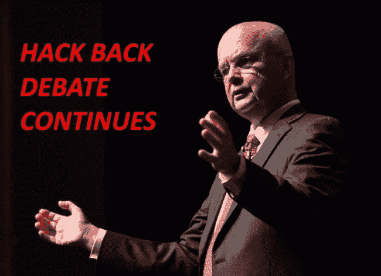
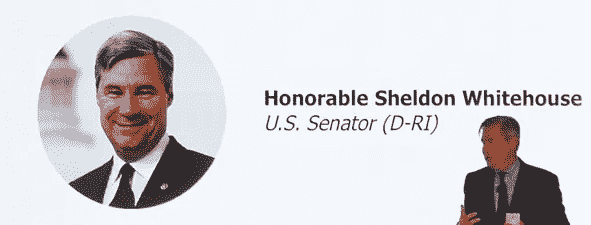

# 公司应该被允许在网络攻击后“黑回去”吗

> 原文：<https://medium.datadriveninvestor.com/should-companies-be-allowed-to-hack-back-after-a-cyberattack-bd6fd709d0d5?source=collection_archive---------4----------------------->

Ret. General Hayden

# 潜在的反黑客立法

政府官员和专家正在权衡“黑客反击”的概念，这种做法可能会让美国公司追踪网络攻击者并进行报复。

美国中央情报局和国家安全局的前负责人向第五领域概述了他对目前国会正在辩论的黑客入侵问题的想法。他很谨慎，但也表达了对允许私人组织进行某种程度报复的开放态度。

海登将军是一个非常敏锐的人，他带来了前所未有的国家情报经验，但我必须反对他的立场，即允许企业“黑客攻击”的风险。

我有幸与他就民族国家对数字领域的长期威胁进行了一对一的深入讨论，他的见解一直给我留下深刻印象。然而，这是一个完全不同的野兽。

允许美国公司自由反击网络攻击者是非常危险的。我认为，当企业管理层发现自己受到攻击时，他低估了他们不可预测的本质。与美国政府机构不同，美国政府机构坚定地遵循行政部门的明确指导，企业的护栏高度可变，可能不稳定。在激情的驱使下，你可以很快做出决定。

普通的美国企业不理解积极防御、适度破坏的原则，也不知道如何在特定的交战规则下建立和运作。他们当然没有能力确定正确的归属，收集必要的敌对情报，甚至不了解他们可能使用的武器的潜在附带损害。

相反，我们可以期待对感知攻击者的轻率且可能不稳定的反应。不幸的是，网络对手会很快抓住这种行为，使他们的攻击看起来好像是来自其他人。它将成为恶棍、无政府主义者、社会激进分子和民族国家操纵其目标攻击无辜政党的新运动。正如模因所说，“在互联网上，没有人知道你是一只狗”。

# 削减后果

当威胁冒充医院、关键基础设施或其他敏感组织进行攻击时，会发生什么情况。黑客的回应可能会导致不可想象的和不必要的损害。

[国会也在考虑允许公司“黑回去”。参议员谢尔登·怀特豪斯(Sheldon Whitehouse)最近表示，他正在考虑一项允许公司“反击”数字攻击者的提案。](http://thehill.com/policy/cybersecurity/402807-dem-senator-to-propose-congress-should-consider-allowing-companies-to)

# 武器化企业

我认为整个“黑回去”运动完全是被误导了。

许多人把它比作“坚守阵地”的情况，因为他们试图说服其他人加入公共支持。但是这样的语言形象是不适用的。一个更好的类比是，如果有人闯入你的房子，你应该有权闯入他们的家或者你认为是谁干的(因为你真的不会知道)。大多数人都会同意，这样设计不是一个好主意。

现在考虑你将授权谁来做这样的决定。那些一开始就没有能力或没有足够责任感来管理环境防御的企业，将被赋予反击的权力。然而，他们不太可能真正了解真正的攻击来自哪里。他们会出于愤怒、恐惧而行动，对于武器，他们没有潜在的附带影响和可能造成的连锁伤害的概念。

每次我听到一位高管希望能够“反击”，都是因为他不了解网络安全的细微差别，也不知道让无辜的第三方看起来像是他们在实施攻击是多么容易。当我提到让别人看起来像是罢工的幕后黑手很容易，比如竞争对手、政府机构或医院时，语气发生了根本的变化。网络攻击的归属可能需要专家数月甚至数年的时间。当企业想要实施报复时，它们既没有专业知识，也没有耐心等待。

# 简单的误导

如果允许的话，黑客攻击将成为恶棍、无政府主义者、社会激进分子和民族国家的新运动，来操纵他们的对手犯这样的错误，或者被那些被愚弄而认为他们是源头的人所攻击。

允许公司进行黑客攻击不会阻止网络攻击，相反，它将成为威胁对受害者使用的新武器。

对更多见解、言论、行业新闻和经验感兴趣？在 [Medium](https://medium.com/@matthew.rosenquist) 、 [Steemit](https://www.steemit.com/@mrosenquist) 和 [LinkedIn](https://www.linkedin.com/today/author/matthewrosenquist) 上关注我，了解网络安全方面的见解和进展。

原发表[此处。](https://trybe.one/should-companies-be-allowed-to-hack-back-after-a-cyberattack/)