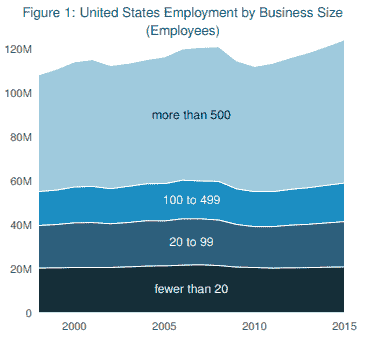

# 我应该把我的想法作为一个非盈利还是盈利的？

> 原文：<https://medium.datadriveninvestor.com/should-i-incorporate-my-idea-as-a-non-profit-or-for-profit-7bcc047e44e5?source=collection_archive---------18----------------------->

根据美国小企业管理局(US Small Business Administration)的数据，2018 年美国有 3020 万营利性企业，为大型(> =500 名员工)和小型(<500 employees) companies.

Meanwhile the National Center for Charitable Statistics reported there being 1.5M non-profits registered with the IRS in 2015\. These non-profits contributed just shy of a trillion dollars (5.4% of GDP) to the economy with 1 in 4 American adults volunteering in 2017.

Big numbers on both sides for sure. With all this context — if you are an entrepreneur trying to decide whether to make your idea into a for-profit or non-profit, there are four key things to consider.

 [## On the Entrepreneurial Trek, Embrace the Learning | Data Driven Investor

### As if building a multimillion-dollar company wasn't hard enough, entrepreneurs have to take extra care of their…

www.datadriveninvestor.com](https://www.datadriveninvestor.com/2018/10/16/on-the-entrepreneurial-trek-embrace-the-learning/) 

**税**工作的人几乎各占一半

营利组织显然要纳税，尽管如果有一些优化，比如初创公司的创始人可以通过[选择 83b](https://www.investopedia.com/terms/1/83b-election.asp) 来推迟资本收益。另一边的非营利组织完全免交销售税和财产税。非营利组织的收入也不需要缴纳联邦税，但是他们必须像其他公司一样缴纳员工税(社会保障和医疗保险)。

赢家:非营利组织

**筹款**

非营利组织依靠拨款和捐赠生活，许多人会告诉你，他们花多达 50%的时间只是筹款，其余时间用于管理和实际工作。具有社会目标的营利性企业确实拥有社会风险资本，这是一种新兴的资金来源。当谈到纯盈利的世界，特别是初创公司，大多数人也花大量时间融资，事实上，一轮典型的融资需要首席执行官在 3-6 个月内将它作为首要任务。但受利润驱动的投资者的范围要大得多，数百万乃至数十亿的数量对非营利组织来说基本上是白日梦。

赢家:营利性

**商业模式**

非营利组织可能非常有利可图——宜家实际上就是这样组建的，[一种仍有争议的结构](https://www.fastcompany.com/3035734/ikea-is-a-nonprofit-and-yes-thats-every-bit-as-fishy-as-it-sounds)。非营利组织的定义是，它将它可能拥有的任何利润回馈给实体。另一方面，营利性组织没有这种限制，这意味着投资者等利益相关者可以获得不成比例的回报。这也给了他们更多尝试商业模式的自由，因为他们对风险回报的文化接受度更高。想象一下，作为一个非营利组织，你告诉一个潜在的捐赠者，你在一个具有挑战性的项目上失去了一切。

赢家:营利性

**善意**

根据 LinkedIn 2018 年的工作场所文化报告，近十分之九的千禧一代会考虑在使命和价值观与自己一致的公司工作。考虑到婴儿潮时期出生的人，这个数字几乎少了十分之一。因此，肯定的是，用非营利的精神来经营你的营利性组织的格言永远是正确的。

赢家:非营利组织

那么这对作为企业家的你来说意味着什么呢？从根本上来说，根据你想要优化的内容，将你的想法整合为盈利或非盈利。很多时候，一旦你的想法足够成熟，你可以评估结果，你可能不得不把这个问题搁置到未来。如果利弊真正得到平衡，那么就创建一个相互关联的营利性和非营利性实体。 [L3Cs](https://en.wikipedia.org/wiki/Low-profit_limited_liability_company) 和[混合组织](https://www.legalzoom.com/articles/can-a-nonprofit-also-have-a-for-profit-division)更复杂，但提供了利用两个世界的最佳选择。

*这篇帖子的灵感来自与*[*Abe Elmahrek*](https://www.linkedin.com/in/abeaamase/)*的一次对话；20 多年来，我一直在创建和经营营利性和非营利性组织。这些都是专注于实践见解的有目的的短文(我称之为 GL；dr —良好的长度；确实读过)。如果它们能让人们对某个话题产生足够的兴趣，从而进行更深入的探索，我会感到非常兴奋。这里表达的所有观点都是我自己的。如果这篇文章有对你有用的见解，请给个赞，任何想法请留言。*