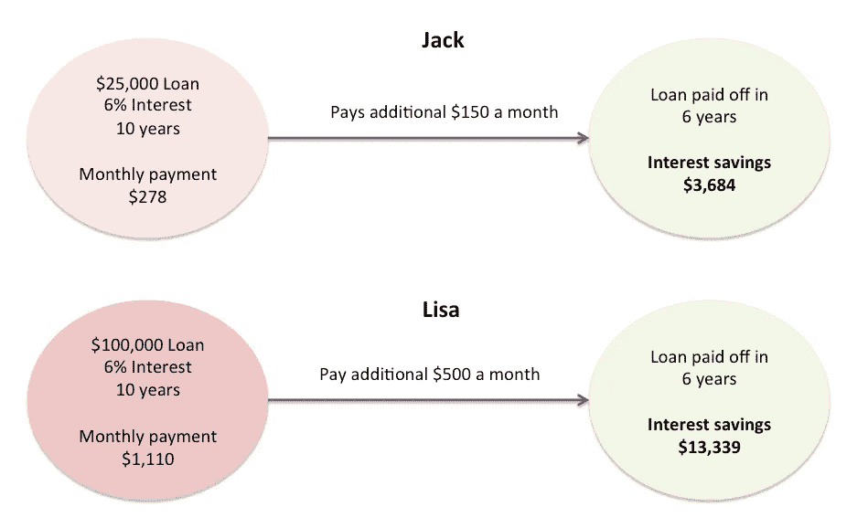
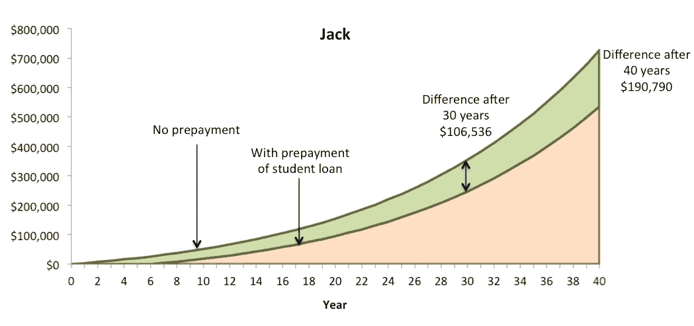
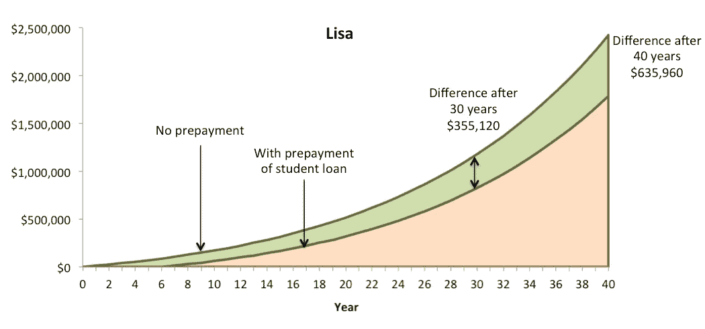

# 我应该提前还清学生贷款还是缴纳 401k 养老金？

> 原文：<https://medium.datadriveninvestor.com/should-i-pay-off-that-student-loan-early-or-contribute-to-the-401k-85da25cbee6d?source=collection_archive---------8----------------------->

Photo by [Alexander Mils](https://unsplash.com/photos/lCPhGxs7pww?utm_source=unsplash&utm_medium=referral&utm_content=creditCopyText) on [Unsplash](https://unsplash.com/search/photos/loans?utm_source=unsplash&utm_medium=referral&utm_content=creditCopyText)

这是我从千禧一代(甚至一些 x 世代)那里得到的一个常见问题，我在个人理财专栏上见过很多次。

但在我开始之前，我想强调一件事:如果你有高利率的学生贷款(比如说超过 6%左右)，你应该首先考虑重新融资到一个较低的利率。我遇到过毕业生以 10%的利息贷款 10 万美元的情况。

那就是每年 10，000 美元的利息！

在这种情况下，你应该把精力集中在贷款再融资上。这里有一篇最近关于学生贷款再融资和整合的美国新闻，或者和财务顾问讨论选择。

好吧，现在来谈谈手头的问题。我将用几个例子来说明这一点。一个是杰克，他刚刚带着 25，000 美元的学生贷款完成了本科学业，最近找到了一份年薪 60，000 美元的工作。

 [## 幸福的算法？-数据驱动型投资者

### 从一开始，我们就认为技术正在使我们的生活变得更好、更快、更容易和更实用。社交媒体…

www.datadriveninvestor.com](https://www.datadriveninvestor.com/2019/03/08/an-algorithm-for-happiness/) 

然后我们有丽莎，她刚刚完成医学院的实习，带着 10 万美元的学生贷款。她开始了一份年薪 20 万美元的工作。

他们的每笔学生贷款利率为 6%，必须在 10 年内偿还。这相当于杰克每月支付 278 美元，丽莎每月支付 1110 美元。

两人都想尽早摆脱学生贷款，比如说在 6 年内。杰克想每月多付 150 美元(一年 1800 美元)，这相当于她 60000 美元收入的 3%。

丽莎想每月多付 500 美元(每年 6000 美元)，这也相当于她 20 万美元年薪的 3%。

*重要提示:他们每个月都会支付最低还款额。我在这里讨论的远不止这些。*

支付比最低要求更多的钱可以确保他们在 6 年内免于贷款。如下图所示，它们也节省了相当多的利息。

**复利初期的魔力**

现在，杰克和丽莎也可以向他们公司的 401k 计划缴款，但他们没有这样做，因为他们想早点还清学生贷款。

此外，他们的公司给他们 3%的匹配——这意味着，如果他们为自己的 401k 计划贡献至少 3%的收入，公司也会做出相当于 3%的贡献。

我们还假设他们每人每年都获得 2%的加薪。

以美元计算，这一切意味着什么？

杰克在最初的 6 年里没有向他的 401k 计划缴纳 1800 美元的年度缴款(同时他还额外支付了学生贷款)。尽管每年 2%的加薪意味着第一年后他实际上跳过了投入超过 1800 美元。到第 6 年，他可能会为自己的 401k 计划增加近 2000 美元。

下一张图表显示了他的退休账户余额在 40 年间的差异——提前偿还学生贷款与将额外资金投入 401k 计划并获得雇主匹配。我假设 40 年的平均回报率为 6%。

差别是巨大的。在头六年向 401k 计划缴款(而不是提前偿还学生贷款)将为他 40 年后的退休多赚近 200，000 美元！即使过了 30 年，差别也很大:大约 10.6 万美元。回想一下，如果他早点还清学生贷款，就能省下大约 3700 美元。

这个故事和 Lisa 很相似，只不过数字更大，因为她收入更高。在前 6 年，她没有为自己的 401k 计划每年缴纳 6000 美元。由于每年 2%的加薪，到第 6 年，她将放弃约 6600 美元的退休计划缴款。我假设 40 年来平均回报率都是 6%。她的图表如下所示。

如果 Lisa 向她的 401k 计划贡献了 3%的收入(并因此获得了雇主匹配)，而不是提前四年还清学生贷款，她的退休账户将增加近 636，000 美元！如果她等了六年才开始缴纳退休金，那么她的余额将是 242 万美元，而不是 179 万美元。

即使过了 30 年，差距也扩大到了 35.5 万美元。

同时，提前还贷为她节省了 13，000 多美元的利息。

你可以看到复利是如何产生影响的，尤其是当你开始得很早的时候。即使只等六年就开始为 401k 计划缴款，其机会成本也是巨大的。

另一件我没有提到的事情是，401k 计划缴款是*延税的*。换句话说，你对 401k 计划的任何贡献都不需要缴纳年度税——你只需要在退休后最终取钱时纳税。这是 401k 计划缴款的额外好处，我将在另一篇文章中讨论。

显然，杰克和丽莎的例子是虚构的，但这个想法是为了说明早期复利投资的想法。

我在这里做的一个很大的假设是，两个人都有一个非此即彼的选择，即要么使用 ***额外储蓄*** 提前还清学生贷款，要么缴纳退休金。额外的节省是这里的关键。我已经假定杰克和丽莎在为他们的学生贷款支付最低还款额。

在现实生活中，你也许可以节省更多，这样你就可以两者兼得。对很多人来说，尽早还清贷款能给他们一种情感上的平静，这胜过数学。

你需要弄清楚，同样重要的是，在被告知你的选择的同时，找到一条适合你的道路。

最后几点:

1.  调查你的学生贷款，看看你能否通过再融资来降低利率。请注意，与私人贷款机构合作可能会让你获得有竞争力的利率，但灵活性不如联邦政府。例如，你将不能参加基于收入的还款计划或贷款豁免计划。
2.  如果你有高息信用卡(大多数信用卡都是这样)，先还清这些，同时为你的学生贷款支付最低还款额。
3.  与你的雇主核实他们是否有 401k 计划，你如何贡献(如果你还没有这样做)以及是否有雇主匹配。
4.  制定一个你可以实际执行的计划，或者和一个顾问谈谈来帮你解决这个问题。