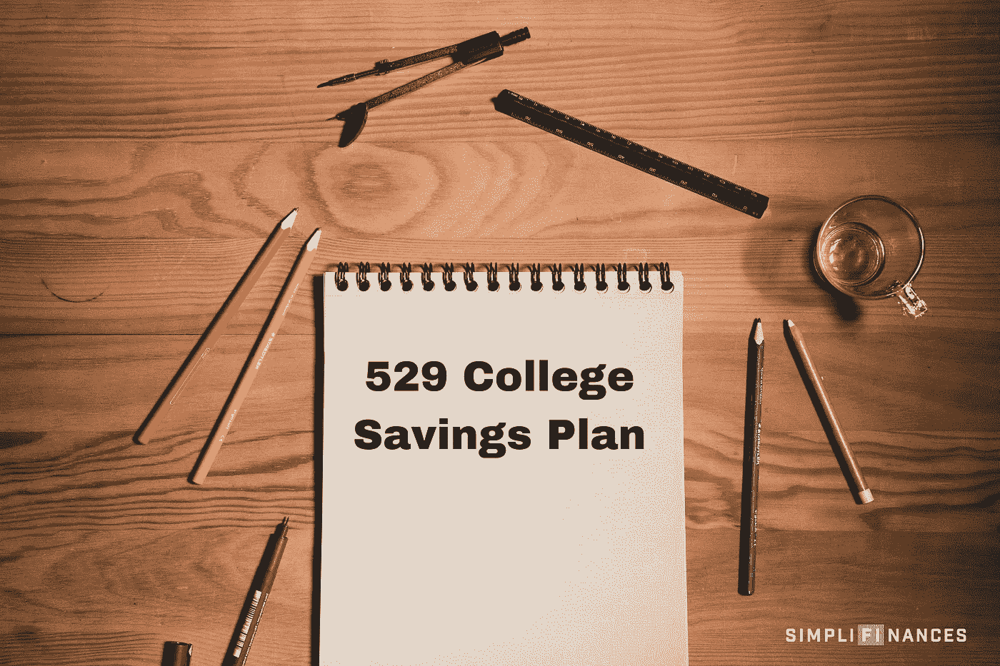

# 该不该给孩子设立 529 大学储蓄计划？

> 原文：<https://medium.datadriveninvestor.com/should-i-set-up-a-529-college-savings-plan-for-my-child-ab72274cb280?source=collection_archive---------16----------------------->

那是一个星期二的清晨。6 月 21 日。我的生日。

我妻子给我准备了一份礼物，告诉我必须在上班前打开它。我告诉她没关系，我下班回家就和其他礼物一起打开。她看着我说:“不，斯科特，现在就打开礼物！”所以我说好吧。当我打开礼物时，里面似乎是一件运动衫，但当我把它拿出来时，却是一件给小婴儿穿的长袖衬衫。

这就是我妻子去年让我知道她怀孕了的方式！

我很兴奋，但同时也完全吓坏了。

当我发现我妻子怀孕时，我决定每周多工作 3 个小时，直到我儿子出生，这样我就可以为他未来的教育投资。到他出生时，我们已经攒了大约 1200 美元。

我在 [Wealthsimple](https://wealthsimple.com/invite/VCCCFG) 开了一个投资账户，资金投资于一只低成本的指数基金。我想把它存在一个我可以取用这笔钱的账户里，因为我不知道我的儿子是否想上大学。如果他对大学说不，只想当企业家呢？我不想把我所有的钱都绑在 529 大学储蓄上，因为我听说一旦你把钱放进去，你就不能取出来，除非是为了孩子合格的高等教育费用。

这可能是大多数父母不为孩子设立大学基金的最大原因。因为未来不可预知。

# 税收优惠的 529 大学储蓄计划的好处

几个月前，当我开始深入了解 529 大学储蓄计划的好处时，我意识到这是父母为孩子的教育储蓄的一个极好的选择。所以我决定创建一个账户并转移资金，原因如下:

*   你贡献的钱免税增长。所以你可以在缴税前把钱捐给基金会。
*   当您使用这些资金支付合格的高等教育费用时，您可以免税提取所有资金。高等教育费用包括学费、书籍和用品、食宿，甚至笔记本电脑。
*   你得到双倍的节税！
*   大多数计划允许你“设置它，然后忘记它”,自动投资链接到你的银行账户或工资扣除计划。
*   529 个计划没有收入限制、年龄限制或年度缴款限制。

# 我如何预测未来？

如果你的孩子不想上大学怎么办？对于很多父母来说，这是一个完全正常的担忧。以下是几个选项:

*   把钱转给另一个孩子。第一个孩子没有用完的资金可以用于下一个孩子
*   你可以把那些钱转给另一个亲戚。甚至是遥远未来的孙子
*   如果你决定继续深造，你可以自己使用这笔资金
*   最后，(这一点改变了我的想法)如果您决定不将资金用于教育，您可以随时以任何理由撤回您的原始捐款。但是，如果你撤回*投资收益*，那么你将受到 10%的罚款。例如，如果我存入 5000 美元，18 年后增长到 7000 美元，我可以以任何理由提取这 5000 美元，但我必须支付 2000 美元的罚金。

# 如何申请:

看看你所在的州能提供什么，但是要记住，你不仅仅局限于你所在的州。

我对税收优惠的最好的州 [529 大学储蓄计划](https://my529.org/)做了一些研究，了解到我的家乡所在的州是全国收费最低的州之一。尽管我现在住在德克萨斯州，但我决定通过犹他州开放我的矿区。

我决定通过我的家乡州开放 529 计划的另一个原因是，我发现这些资金可以投资于 Vanguard 低成本指数基金。所以对我来说，税收优势和超低的投资成本让我和我的孩子的财务未来物有所值。

为了孩子的未来，你决定开始 529 计划了吗？为什么或为什么不？