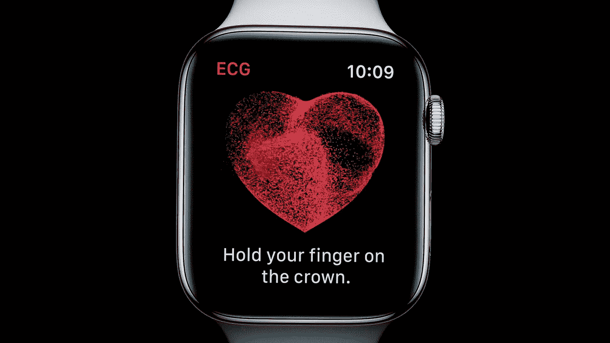
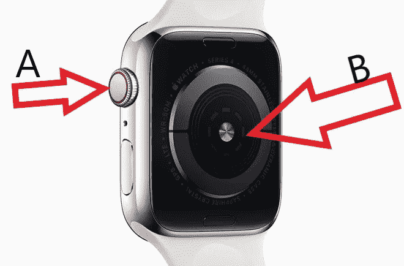
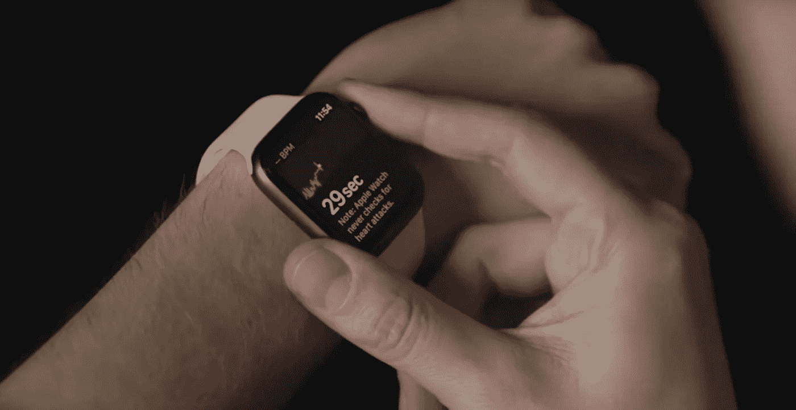
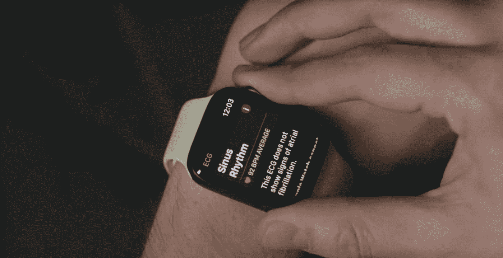
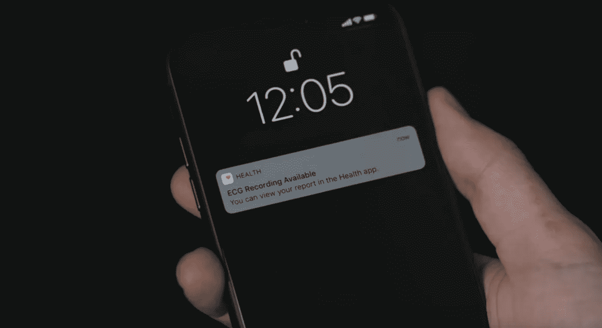

# 我们应该对 Apple Watch EKG 持怀疑态度吗

> 原文：<https://medium.datadriveninvestor.com/should-we-be-skeptical-about-apple-watch-ekg-2f443316c23a?source=collection_archive---------7----------------------->

如果你拥有较新的苹果手表，series 4，它有一个休眠的功能，这个功能在去年被打开了。这款手表现在可以进行心电图测试或 EKG。它测量心脏用来调节心跳的电信号。重点是检测房颤的迹象，这是一种不规则心跳的形式，可能导致中风或心力衰竭。这是苹果迈出的一大步。通常情况下，我们认为智能手表只不过是健身爱好者的通知机器，他们希望痴迷地跟踪他们采取的每一步，但 EKG 试图有所不同。不仅仅是健身追踪器，现在是健康监测器，但这种变化带来了许多新问题。“医生们认为这是个好主意吗？”，“人们会以正确的方式使用它吗？”“最终用户能否正确理解这些信息？”。许多人已经问过同样的问题，并且已经进行了与此相关的广泛研究。在我们开始之前，让我们先来看一看幕后的情况，并理解它实际上是如何工作的。

EKG 过程本身非常简单。手表上有两个传感器，一个在表背，另一个在表冠

A- Sensor on the crown B- Sensor on the back

当你将手指放在牙冠上时，你完成了从手指到心脏再回到手腕的一个循环，过程如下图所示。

这样手表就可以测量你心脏的电脉冲。30 秒后，它会告诉你心脏的上下腔室是否不同步，如果是，是时候去看医生了。在正常情况下，结果将是“*窦性心律*”。

这项新功能已经遭到了一些反对，一些批评者认为它可能会导致假阳性或变得像自我诊断机器，苹果手表无法取代医院里的 EKG 机器，基本上 EKG 机器会给你更多的数据，帮助你根据手表的读数确定你可能怀疑的问题。这是一个分两步走的过程。手表将标记问题，医生将进一步调查。这两个步骤在实践中如何运作？现在还不清楚。该功能太新。从医生的角度来看，他们可能仍然不能完全信任手表来检测心脏异常，并信任它提供的读数。但作为一名研究人员，不可否认 Apple watch 目前显示出的潜力。

**c . Seth lande feld**博士是美国预防服务工作组的成员。他们评估各种筛选测试，看看是否利大于弊。最近，他们研究了 EKG 筛查是否对健康和其他低风险人群有帮助。他们研究了心血管疾病，如心脏病发作或中风。

> 研究称，“没有证据表明利大于弊，因此，我们建议不要对心血管疾病低风险人群进行心电图筛查”

对于房颤，苹果手表筛选的条件，可悲的是在类似的情况下。没有太多的证据表明，如果你还没有这些其他症状，EKG 氏症是值得的，但为什么不为了安全起见就这么做呢？因为有假阳性的风险。EKG 本身是安全的，但在绝对最坏的情况下，可能会出现假阳性，导致不必要和不安全的治疗。还有用户的问题。房颤研究关注 65 岁以上的人，因为他们是最有可能有心脏问题的人，他们不是最有可能拥有苹果手表的人。

那么，下次我们收到这样的弹出通知时，我们应该做什么？是忽略这个还是什么

> 根据心律失常专家格雷戈里·马库斯博士的说法，“如果你小于 65 岁，没有糖尿病、高血压，从未中风、心力衰竭或任何其他动脉问题，我会说在没有症状的情况下忽略它。”

解决这个话题的最简单的方法应该是，预防胜于治疗毫无疑问，但 Apple Watch 不是疫苗。当涉及到人类心脏时，仍然有太多未知的变量。有一天我们可能能够完全依赖 Apple Watch 来检测心脏状况，但那不是今天，但也许很快就会有一天，我希望这是通向未来的正确道路，而不是一个噱头

*参考文献*

 [## 为什么最新 Apple Watch 上的心脏监测应用程序让一些医生感到紧张

### 科技巨头苹果公司 9 月份高调宣布，它已经获得了美国食品和药物管理局的批准，可以销售苹果手表…

www.mmm-online.com](https://www.mmm-online.com/home/channel/technology/why-heart-monitoring-apps-on-new-apple-watch-make-some-physicians-nervous/)  [## 医生:苹果手表 EKG 可能会加重医疗系统的负担

### 去年，苹果公司透露其 Apple Watch Series 4 将配备内置心率监测器，即所谓的 EKG…

futurism.com](https://futurism.com/doctor-apple-watch-ekg-healthcare)  [## 为什么医生担心苹果手表 EKG

### 最新的苹果手表具有先进的心脏监测技术，称为心电图(EKG)，可以告诉你…

www.theverge.com](https://www.theverge.com/2019/1/8/18172132/apple-watch-ekg-electrocardiogram-health-science)