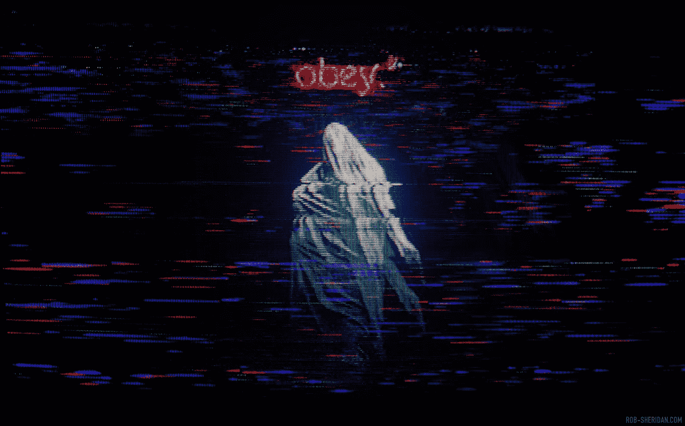

# 我们应该担心我们的过去吗？

> 原文：<https://medium.datadriveninvestor.com/should-we-be-worried-about-our-past-adc81979e908?source=collection_archive---------50----------------------->

## 留下数字面包屑。

[Image Credits: Rob Sheridan / Digital Glitch.](https://rob-sheridan.com/design/analog-glitch/13/thumbs)

在他揭示和潜意识的商业战略著作中， ***只有偏执狂才能生存的*** ，英特尔公司的 C . e . o .**安德鲁 s .格罗夫** *(上帝让他的灵魂安息)* 写下了一句最诡异的话；

> “在技术上，能做的都会做。”

在当时，甚至可能是今天，对这句话最流行、最广为接受的解释是动机之一。

如果不是这样，如果安德鲁·s·格罗夫暗示了更邪恶的东西，又会怎样呢？对未来用户的一个警告，要小心，要偏执。

这并不奇怪，我们生活在一个你说的、做的、甚至不做的任何事情都有可能并会产生后果的时代。

我们发明了术语*“媒体审判”*，并在**“无罪”之前推定**“有罪”**。**

相反，当有人因为很久以前说过的话或做过的事而放弃时，我们会一笑置之，因为那时他们可能是完全不同的一个人，因为我们从来不认为我们会像他们一样。

退一步说，我们很容易对此不屑一顾，不去寻找真相，让过去的成为过去，因为我们喜欢“正义”这个词。直到它发生在我们身上。

> 但是当然，
> 
> “这永远不会发生在我身上”
> 
> “我一直过着美好的生活”
> 
> “我从未做过任何不恰当的事情”，

通常是脑海中的第一反应。

*“好吧我没那个人坏”，*当感知是我们的全部依靠，叙事可以错综复杂地控制——**再想想。**

你可能是 ***那个*** 的人。

在数字取证和数据审计的世界里，有一个更黑暗的秘密——一个公众通常不知道的秘密。

你倾向于交朋友，你不一定想交朋友。

这些角色会崇拜你，经常给你礼物和恩惠。

不料有一天收到一个看似无关痛痒的请求，*“我需要你帮我找点东西”。*

从表面上看，这个请求似乎相当善意——你没把它放在心上。

为什么，我当然要看一看…

才意识到，这个要求并不那么单纯。

这已经从一个简单的请求*“审查一个潜在客户”*演变为*“向媒体透露这个”。*

你现在觉得自己有责任，我怎么会如此天真，没有意识到我被要求做什么？

另一方面，我怎么会如此天真地认为如此无辜的东西有一天会回来纠缠我呢？

你发送或转发的一条推文，你在帖子上留下的一条巨魔评论，你开的一个无伤大雅的玩笑，一次酒后短信交流，你曾经的一段风流韵事，你曾经对公众隐瞒的一场疾病，**你生活的每一寸现在都在显微镜下。**

如果你有幸成为一个公众人物，一个有影响力的人，这个故事可能会毁了你。

有时候，信息本身并不构成直接威胁，而是一种诡异的交换条件；*“为我做这件事，否则……”。*

因此留下一个问题，**我们应该担心我们的过去吗？**

不要太天真，以为永远不会是你。

如果我告诉你，

我之所以如此公开地谈论我的精神疾病，并经常非常公开地写下它，是因为不久前，某个人给我看了我的医疗记录——一个我太熟悉的记录。

不需要问他们是怎么得到的，信息一清二楚；你一生中两次自杀未遂。你认为如果你作证，公众会认为你精神稳定吗？”

是的。事情就是这样。

你知道我做了什么吗？我不干了。

我消失了。

将我的私生活公之于众的想法让我心碎。

不要以为人们会对你仁慈，没有人会把你视为受害者——重要的是叙述，记得吗？

> “这个人是躁郁症患者，法官大人。我们真的能相信他说的话吗？如果这只是他想象中的虚构呢

你认为陪审团会感同身受，但他们不会——记住，他们也喜欢“正义得到伸张”。

想起一个最近的例子…？

克里斯汀·布拉西·福特之一。

> 当她分享自己被虐待的故事时，她的精神健康的合法性是如何被质疑的？
> 
> 职业生涯是如何因为一条六年前的微博而终结的？
> 
> 一张看似无辜的照片，和你一个后来做出错误决定的朋友，现在让你看起来像他们中的一员？

## 它发生了；在这个残酷的世界里，要警惕，要小心——要偏执。

## 最重要的是，三思你留下的数字面包屑。

最初发表于[数据驱动投资者](https://www.datadriveninvestor.com/2018/11/16/should-we-be-worried-about-our-past/)。

