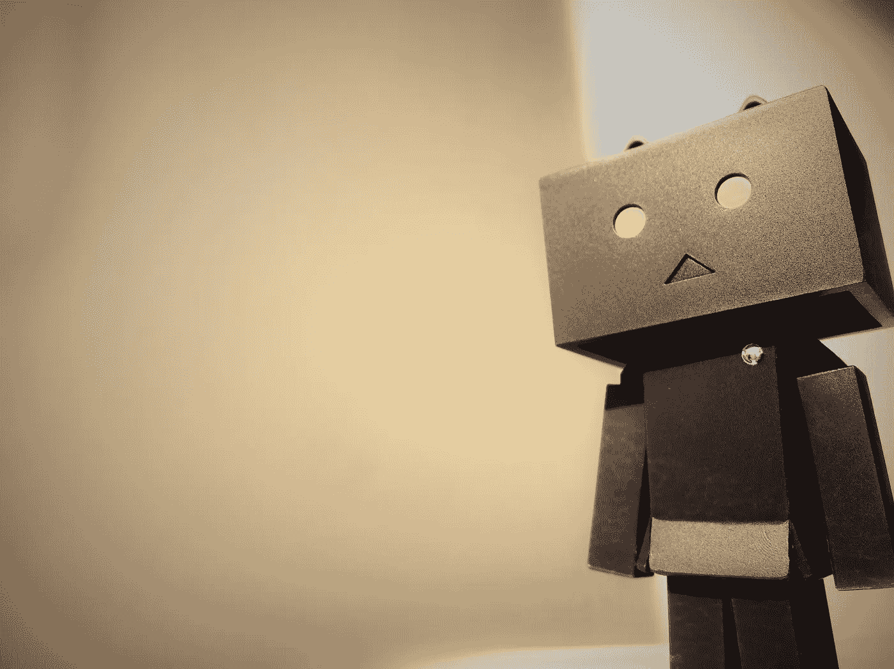

# 我们应该怀疑 AI 吗？一张小纸条

> 原文：<https://medium.datadriveninvestor.com/should-we-doubt-ai-a-small-note-ebd926486e6e?source=collection_archive---------3----------------------->

Are we stepping into a formidable future?

一个酷热的冬天早晨，白雪在地上留下了白色的影子，室内一片寂静。詹姆斯一边听着收音机里他最喜欢的歌手酷玩乐队的歌，一边凝视着窗外美丽的白雪皑皑的山顶。这种感觉如此神秘，以至于他忘记了自己正在驾驶特斯拉。或者我应该说特斯拉在自动驾驶。一个值得信赖的技术奇迹。先进技术和人工智能在我们日常生活中的应用，让像詹姆斯这样的人过上了更加贪婪和平静的生活。

人性中最美好的东西都是好奇的头脑和卓越智慧的产物。因此，将人类智能与人工智能相结合，有可能让文明以前所未有的方式繁荣发展。AI 已经不是一个概念了。AI 是让人类更好地理解、领悟、提升、进化的工具。人工智能最大限度地减少了包括错误、不一致、不规则和古怪在内的人为缺陷。人工智能在现实生活中的一些最好的例子是:

 [## 人工智能预测能力的神话|数据驱动的投资者

### AI(人工智能)最有前途的优势之一似乎是它预测未来的能力…

www.datadriveninvestor.com](https://www.datadriveninvestor.com/2019/03/01/the-myth-of-ais-predictive-power/) 

1.  企业在聊天机器人中实施人工智能，用于客户关系、存储库管理、客户关怀和信息的可访问性。

2.医疗保健、制造业务和智能设备中的人工智能允许更好的健康治疗、解决方案和多任务混合。

3.政府、机场和安全公司使用人工智能来检测和评估国家威胁。

Personalization is the new mainstream.

我们已经见证了没有分支机构的银行、拥有自动驾驶技术的汽车和集中控制的智能家居。这只是对未来的可能性和下一代解决方案的一点小小的了解。但是每个冬天之后都是秋天。

正是这个 AI 让詹姆斯完全依赖于技术。曾经是奢侈品的东西现在变成了必需品，而这种必需品在未来可能会变成生存。如果这种情况发生，人类将没有可挽救的未来。人工智能带来了自动化解决方案。随着这种自动化解决方案的出现，人们有了学位却没有工作。曾经完美平衡的系统现在被我们人类作为现代化、技术进步、更好的生活方式和最重要的自我可持续性的一部分注入的东西所触发。

Are we ready yet?

然后我们再次依靠实现独立。只要我们决定和控制技术，总有一天人工智能将揭开人类创造力的秘密。在目前的世界均势中，有一种大有前途的迹象。在踏入这些未知的水域时，我们必须非常小心。这要么是一个拥有一切的未来，要么是一个没有未来的未来。