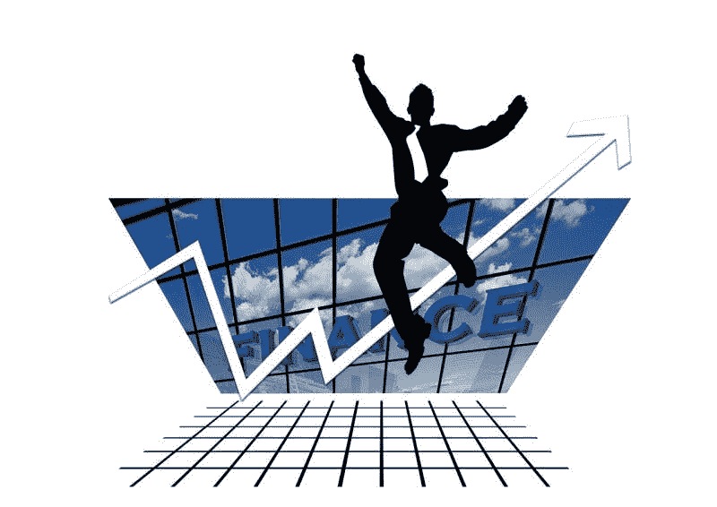
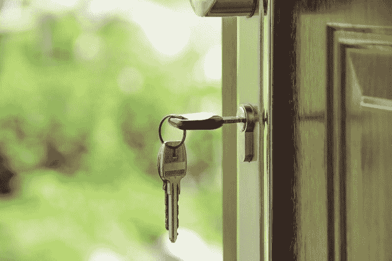

# 你应该害怕债券市场吗？—市场疯人院

> 原文：<https://medium.datadriveninvestor.com/should-you-be-afraid-of-the-bond-market-market-mad-house-3b64784e2df1?source=collection_archive---------3----------------------->

“大空头”投资者史蒂夫·艾斯曼害怕债券市场，但对美国经济保持信心。此外，艾斯曼告诉彭博，他正在做空美国房地产、**特斯拉(纳斯达克股票代码:特斯拉)**和 **Zillow(纳斯达克股票代码:ZG)** ，但回避**优步(纽约证券交易所股票代码:优步)**和 **Lyft(纽约证券交易所股票代码:LYFT)** 。

“公司债务不会导致下一次衰退，它将是下一次衰退的痛苦所在，”艾斯曼总结道。“这是一个微妙的区别，但却是重要的一点。”

 [## 投资算法快速指南-数据驱动投资者

### 让我们想象一下 30 年前的股票市场:让我们想象一下现在:像现在的许多其他领域一样，投资市场已经…

www.datadriveninvestor.com](https://www.datadriveninvestor.com/2019/01/31/a-quick-guide-to-investment-algorithms/) 

值得注意的是，艾斯曼认为美国金融体系是安全的，但他认为将会出现衰退。然而，艾斯曼认为，加拿大房地产泡沫将崩溃，并拖累加拿大银行。

“让我非常明确地说，没有金融危机，”艾斯曼澄清说。“在衰退中，人们会赔钱，我认为他们会赔钱的地方将是债券市场，因为流动性太强，很难明确定价。”

“你会看到 AAA 级企业债券、高收益债券等出现巨额亏损。，”艾斯曼预测道。“但你首先需要一场衰退。”

# 大空头投机者认为美国金融股是安全的

“这么多年来，我第一次关注金融；我可以诚实地说，我认为美国的金融体系是安全的，”艾斯曼在彭博亚洲的一段视频中说。“这并不意味着我们不会陷入衰退，在衰退中，我认为债券市场将会出现巨大损失，因为缺乏流动性。”

“但这将是投资债券市场的人的问题，”艾斯曼指出。“这不是系统性问题，也不是银行问题。”

为了澄清，艾斯曼认为美国经济和金融是健康的，但他认为一些美国公司积累了太多的债务。例如，圣路易斯美联储[估计](https://fred.stlouisfed.org/series/NCBDBIQ027S)美国非金融企业在 2018 年拥有 6.24 万亿美元的债务证券。

值得注意的是，2019 年第四季度，美国非金融企业的债务水平为 3.964 万亿美元。因此，美国非金融企业债务在这十年中增长了 2.276 万亿美元。

# 艾斯曼认为美国银行是安全的

因此，美国企业债务很高，但美国银行是安全的。银行是安全的，因为企业债务存在于零售和科技等其他零售领域。

比如优步；艾斯曼告诉投资者远离它，在 2018 年 10 月发行了 20 亿美元的债券，*商业内幕* [透露](https://www.businessinsider.com/uber-bond-offering-raises-2-billion-popular-offering-2018-10)。很能说明问题的是，*商业内幕*声称内部人士通过秘密私募隐瞒了优步债券交易。此外，Gizmodo 声称优步有近 250 亿美元的公司债务。

比如优步；艾斯曼告诉投资者远离的公司，在 2018 年 10 月发行了 20 亿美元的债券，*商业内幕* [揭示](https://www.businessinsider.com/uber-bond-offering-raises-2-billion-popular-offering-2018-10)。很能说明问题的是， *Business Insider* 声称内部人士通过秘密私募隐瞒了优步债券交易。此外，Gizmodo 声称优步有近 250 亿美元的公司债务。

具体来说，优步在 2019 年 5 月 10 日开盘时市值为 760 亿美元，股价为 45 美元。优步以 760.73 亿美元的市值和 41.57 美元的股价收盘。

# 美国企业债务的危险

不可思议的是，美国零售业的公司债务可能比科技业还要糟糕。

例如，2018 年 11 月，贷方在破产法庭的走廊上竞标向垂死的零售商西尔斯提供贷款的机会，*市场疯人院* [索赔](https://marketmadhouse.com/desperate-sears-holdings-is-auctioning-debt-in-the-hallway/) *。注意这篇报道是可疑的，因为我基于一篇芝加哥论坛报的文章，这篇文章已经不在报纸的网站上了。*

具体来说，对冲基金 Cyrus Capital Partners 和 American Capital Partners 都在争取向西尔斯提供足够的贷款，以避免破产清算。为了澄清美国破产法官罗伯特·德勒准备清算西尔斯支付其债权人。

拥有百货商店和凯马特折扣连锁店的西尔斯(Sears)于 2018 年 10 月宣布破产，因为它无法偿还债务。然而，西尔斯(T21)在筹集资金方面没有问题，但它可能无法偿还这笔钱来维持经营。

澄清一下，艾斯曼认为像西尔斯和优步这样的公司赚的钱刚好够偿还债务。因此，即使是轻微的衰退也会让这些企业无力偿还债务。

# 艾斯曼不害怕贸易战

有趣的是，艾斯曼并不害怕美国和中国之间的贸易战。

“会有很大的波动，但我的猜测是，最终会达成某种协议，”艾斯曼在谈到美中贸易紧张局势时表示。事实上，艾斯曼认为美国总统唐纳德·j·特朗普(纽约州共和党)和中国领导人将达成一项“保全面子的协议”。

[艾斯曼](https://en.wikipedia.org/wiki/Steve_Eisman)；是美国对冲基金 Neuberger Berman 的董事总经理兼投资组合经理。艾斯曼因通过做空债务抵押债券预测 2007-2008 年美国次贷危机而闻名。

特别是，作者迈克尔·刘易斯在《大空头:世界末日机器内部》的 [*中戏剧化了艾斯曼在次贷危机中的角色。有趣的是，美国演员史蒂夫·卡瑞尔饰演马克·鲍姆；电影*](https://www.amazon.com/Big-Short-Inside-Doomsday-Machine/dp/0393338827) *[*中的虚构版艾斯曼《大短*](https://www.theguardian.com/film/2016/jan/27/the-big-short-financially-accurate-adam-mckay-subprime-money-bale-gosling-pitt) *。**

# 艾斯曼再次做空美国房地产

“我最大的空头是一家名为 Zillow 的公司，”艾斯曼说。详细来说， **Zillow(纳斯达克股票代码:ZG)** 运营着美国最受欢迎的在线房地产市场。

“我之所以认为这是一个有趣的短片，是因为他们进入了一个新的业务领域，他们的基本业务是互联网平台公司，”艾斯曼解释道。“他们要去哪里，买房子，然后转手。”

“具有讽刺意味的是，为什么人们喜欢互联网平台公司，他们喜欢它们，因为它们能产生大量收入，”艾斯曼指出。“它们产生大量自由现金流，它们不是周期性的，而且它们有利润率扩张。”

“现在 Zillow 进入了一个资本密集型、周期性、低利润的行业，在衰退中他们会被杀死，”Eisman 说。

因此，艾斯曼正在做空另一只美国房地产相关股票。值得注意的是，美国房价再次大幅上涨，*《今日美国》* [报道](https://medium.com/datadriveninvestor/why-you-should-invest-in-platforms-not-companies-or-cryptocurrencies-market-mad-house-dc61b8c0f0b5)。例如，丹佛郊区科罗拉多州商业城的一栋房子最近卖到了 284，000 美元。相比之下，同样的房子在 2012 年卖到了 18.8 万美元。

# 艾斯曼建议远离优步和 Lyft

很能说明问题的是，艾斯曼警告投资者远离 T4、Lyft 和优步的股票。

“你知道优步和 Lyft 这两家公司并没有按照传统的估值标准进行估值，”艾斯曼解释道。"因此，试图做空它们就像做空一个幽灵."

在一个相关的举动中，艾斯曼承认在埃隆·马斯克定价过高的汽车制造商**特斯拉汽车公司(纳斯达克股票代码:TSLA)** 持有少量空头头寸。艾斯曼对特斯拉持怀疑态度，因为这家电动汽车企业也缺乏传统的估值标准。

# 艾斯曼预测加拿大房市调整

艾斯曼认为，加拿大房地产泡沫将破裂，并压低加拿大银行股。然而，他认为加拿大的房地产泡沫不会是像 2008 年美国金融危机那样的危机。

“从加拿大将坠入海洋的意义上来说，这不是大空头加拿大，”艾斯曼澄清道。“这将使信贷正常化，因为我们已经 30 年没有信贷周期了。加拿大没有一家银行的首席执行官知道亏损是什么样的。这将是一段时间的丑陋，但它不是一场灾难。”

*原载于 2019 年 5 月 11 日*[*https://marketmadhouse.com*](https://marketmadhouse.com/should-you-be-afraid-of-the-bond-market/)*。*