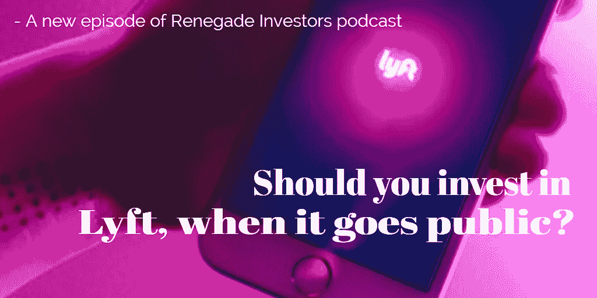

# Lyft 上市的时候该不该投资？

> 原文：<https://medium.datadriveninvestor.com/should-you-invest-in-lyft-when-it-goes-public-31f5531e3594?source=collection_archive---------16----------------------->

Lyft，Inc .刚刚向美国证券交易委员会提交了 S1 文件，将于 2019 年在纳斯达克证券交易所上市。Lyft 司机，假设他们至少完成了 Lyft 的 10K 之旅，他们的净资产将略有增加，因为正如你将在我们最新一集的 Renegade Investors 播客节目中听到的那样，Lyft 司机有权获得一笔不错的上市奖金，并有机会在我们其余人之前使用这笔奖金投资 Lyft 的股票。虽然 Lyft 司机正在考虑成为 Lyft 的投资者，但另一方面，你和我将无法在短期内完成 10K 驱动器。但是，当 Lyft 很快上市时，我们仍可能决定成为它的投资者。问题是，我们应该吗？

请听最新一集的[叛离投资者播客](https://www.podbean.com/media/player/hye4k-aa4de6?from=yiiadmin&download=1&version=1)以获得答案: