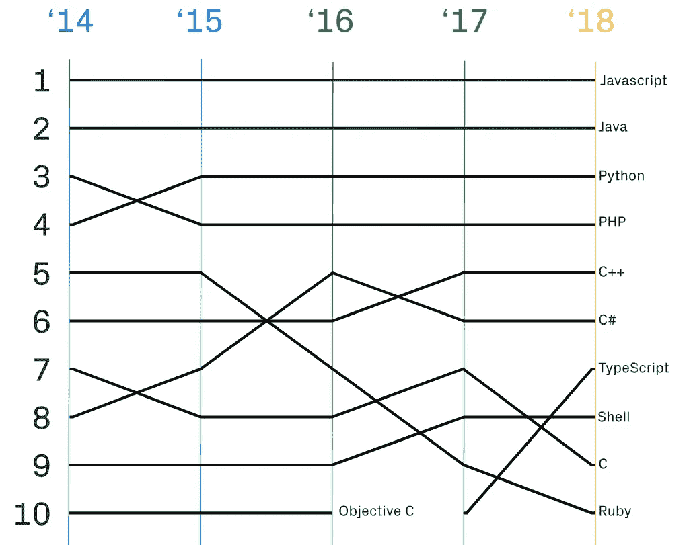
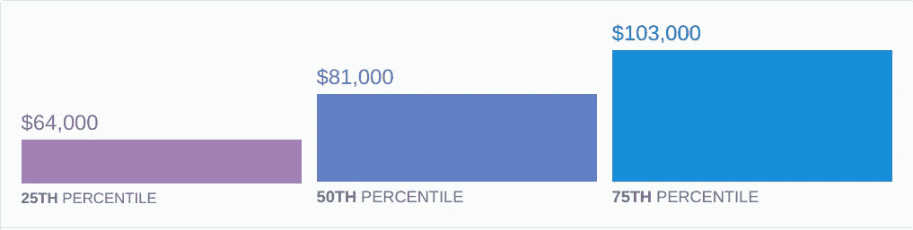

# 该不该学 JavaScript？

> 原文：<https://medium.datadriveninvestor.com/should-you-learn-javascript-1f07ba11c70d?source=collection_archive---------5----------------------->

Short introduction to what is JavaScript

编程的好处是有很多工具可以满足每个人的需求。这些工具都是为完成特定任务而设计的。

和现实生活类似，你需要知道你可以用什么工具来解决一个问题。例如，你可能不会用锤子敲螺丝。最后，你可以完成这项任务，但与使用螺丝刀相比，你的效率会非常低。

有了这个想法，让我们看看 JavaScript 最适合什么，以及应该在什么时候学习它。

在过去的 5 个月里，我一直在学习和使用 JavaScript，关于这种编程语言最引人注目的事实是:

JavaScript 很简单。我不是第一个也不是最后一个指出这一点的人，因为这个事实在整个行业都是众所周知的。这就是为什么**对于那些对学习编码感兴趣的人来说是一个非常好的起点。**

JavaScript 不关心变量的类型。使用关键字 [**let**](https://www.w3schools.com/js/js_let.asp) 可以声明 int、string、bool 等(let 是 ECMAScript 2015 中引入的)。如果你认为这是一个异常，你应该检查一下[类型脚本](https://www.typescriptlang.org/)，它允许你声明你的函数和变量类型。

但是 JavaScript 到底是锤子还是螺丝刀？

JavaScript is a sword without a hilt.

JavaScript 为 web 开发者所熟知，因为它的主要目的就是这个领域。如果你想创建网站，JavaScript 被广泛使用，因为它可以与 HTML 和 CSS 一起工作。为此存在许多[框架](https://en.wikipedia.org/wiki/Software_framework)，例如 [ReactJs](https://reactjs.org/) 、 [Angular](https://angular.io/) 等。

JavaScript 的另一个应用领域是移动开发，例如使用 [Ionic](https://ionicframework.com/) 或 [React Native](https://facebook.github.io/react-native/) 。这个最后的[框架](https://en.wikipedia.org/wiki/Software_framework)让你可以开发 Android 和 iOS，只用 JavaScript 编码。React Native 将为 Android (Java)和 iOS (Objective-C | Swift)创建本机代码，因此您甚至不必了解 Java 或 Swift 就可以开发移动应用程序。

根据 GitHub 的 2018 年 10 月 1 日报道，“JavaScript 在公共和私人存储库、各种规模的组织以及世界上的每个地区仍然拥有最多的贡献者。”如下图所示

Most used programming languages used in GitHub repositories

因此，您可以在网上找到许多文档、示例和帮助。

因此，它很容易，很好地记录，你可以在网络和移动开发。现在，让我们来谈谈钱。

根据 Stack Overflow jobs，这些是在美国工作的拥有 1 年 JavaScript 经验和学士学位的全栈开发人员的平均年薪。

Average annual salaries for a JavaScript developer

如你所见，大多数人的年薪是 81000 美元。考虑到这些数字是基于拥有 1 年 JavaScript 经验的人，这是一个不错的数字。

## 我个人推荐

如果你有兴趣赚点钱，并且你喜欢软件开发，JavaScript 是最适合你的。我使用 JavaScript 已经有一段时间了，学习和寻求帮助非常容易。如果你熟悉 Python 和 C 语言，你会发现 JavaScript 非常简单，因为它的语法非常类似于 C 语言，而且和 Python 一样灵活。

是的，你应该学习 JavaScript！

快乐编码:)

# 参考

1 — [ECMAScript](https://en.wikipedia.org/wiki/ECMAScript)

2 — [JavaScript](https://www.javascript.com/)

3 — [堆栈溢出作业](https://stackoverflow.com/jobs)

4 — [十进制](https://octoverse.github.com/)