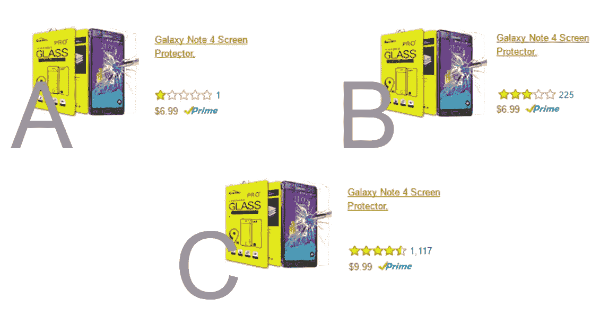
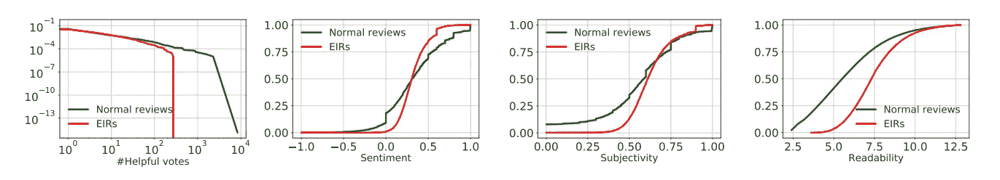
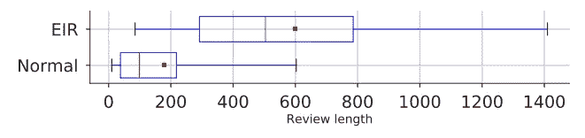
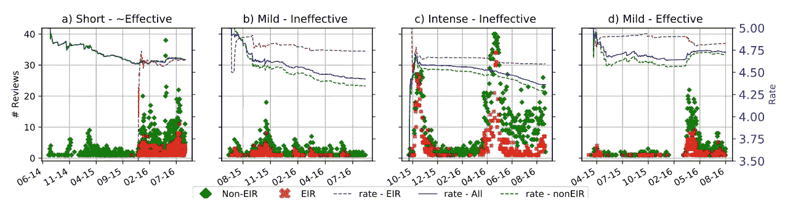
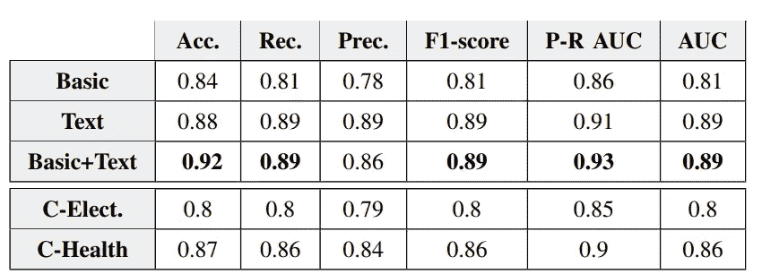
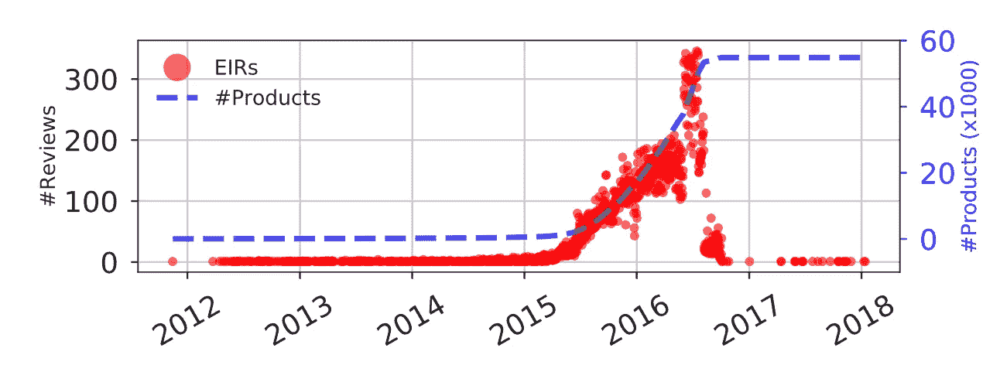

# 你应该相信亚马逊的评论吗？机器学习模型可能知道

> 原文：<https://medium.datadriveninvestor.com/should-you-trust-amazons-reviews-machine-learning-models-might-know-9ecff8c67c2d?source=collection_archive---------0----------------------->

理解亚马逊上的**激励性在线评论**

W 当你在亚马逊购物时，你如何缩小产品范围？你所依赖的因素是什么？产品品牌、价格、卖家信誉和产品评论是购物者考虑的首要因素。聪明的购物者，像你一样，也会看一下顾客评论来了解产品的利弊。

在我们继续之前，在这三个选项中，你会买哪一个？

Different type of choices when you want to buy a product: **A:** risky but good price, **B:** tested before by more customers and less expensive than C , **C:** higher price but sounds more reliable

我想你的选择不是 B 就是 C，因为你不想浪费时间和金钱。如果是这样，你就会明白为什么亚马逊上的卖家总是在寻找新的策略来获得更多评论，尤其是积极的评论。

在过去几年中，卖家越来越多地向电子商务平台的选定评论者提供折扣或免费产品，以换取他们的评论。我们把这样的评论称之为**，奖励式的。**

问题是:

> 这些激励性评论与我们平常的日常评论不同吗？

当您收到免费产品时，有两个主要方面可能会影响您的看法:

*   你可能会觉得你有义务感谢卖家提供给你的免费商品，因为你很善良！
*   **机会:**你可能认为，如果你分享积极的反馈，卖家(或看到你评论的其他卖家)可能会给你更多免费商品！
*   **不一样的体验:**当你免费收到一个产品，如果能用，太棒了！如果没有，你就不会打电话给客户服务部，排队等几分钟，或者你不在乎他们是否没有回复你的邮件。这与那些为产品付费的人不同，他们与产品和/或客户服务没有长期关系。

因此，我们假设这种激励性评论不同于普通评论。但是

> 我们如何评估激励性评论偏离正常行为？

为了回答上述问题，我们分析了亚马逊产品的两个主要类别，电子产品和医疗保健和美容的评论。
有趣的是，我们发现大量的评论都有一个共同的特征，虽然差异很大，但背景相同:

*…。这是我的(诚实的|无偏见的|个人的)评论(作为交换|回报),价格是(免费|打折|促销)。*

我们称这样的评论为明确激励的评论(EIR)。但是为什么人们会这么说，你可能会问。答案是，他们分享它有两个主要原因，一个乐观的猜测是，他们希望遵循亚马逊的评论提交指南，以表达他们与卖家的关系。另一方面，这个签名可以为其他卖家提供一个强烈的信号:*嘿！我喜欢免费的东西！靠我正面评价！*

我们对大量评论的分析显示，大约 60，000 种产品至少有一个 EIR。将 EIRs 作为一个积极类，我们需要找到一组消极类记录，正常评论，以便我们可以比较两组。

在没有标签的情况下，我们依赖于对正常评论的一个相当保守的定义，以确保它们显然没有被激励。(I)与 Amazon 验证的购买相关联，(ii)在收到 eir 的同一组产品上提交，以及(iii)由没有提交任何 eir 的用户提交。

这两个群体的特征清楚地表明了 eir 是如何偏离正常行为的:

Comparing the distribution of helpful vote, sentiment, subjectivity, and readability of EIRs vs. Normal reviews

甚至 eir 的长度也不同于正常的评论。很可能，他们想让你相信这就是你要找的产品，同时向卖家表明他们投资对了人。

一个有趣的问题是，卖家多久提供一次产品。我们假设销售者在决定提供产品并促销其产品时有促销活动，在下图中，我们显示了每个产品提交的每日 eir 数量:

一些卖家很晚才开始促销活动，但会在短时间内提供产品。考虑到它对产品整体星级的影响(上图中的蓝线)，这是一次成功的活动。
有些公司会在一段时间内提供产品，有些公司会举办多次大型活动。然而，产品质量最终说明了一切，你可以看到在(b)和(c)的情况下，产品评级随着时间的推移而下降。

> **鉴于 eir 和正常评论是不同的，你能帮我抓住它们吗？**

我们也这么认为。这就是为什么我们训练了一个机器学习模型来检查我们能够多准确地标记 eir。为此，我们针对这两组的特征训练了一个全连接的神经网络(多层感知器)。我们利用以下特征:文本和标题长度、星级(1 到 5)、文本和标题情感、有用性、标题和文本主观性以及可读性(模糊指数)。

The evaluation result for our model to catch Explicitly Incentivized Reviews (EIR)

此外，我们使用了前 X 个频繁出现的 N-grams 的评论，以提高准确率。请注意，如果您想要应用相同的方法，您必须首先从文本中删除明确的信号，因此我们删除了 EIR 签名(例如“我收到产品以换取我的诚实评论”)，然后分析 N 元语法。我们的结果表明，我们能够准确地标记 eir。

> **这样的模式有什么好处？只是机器学习的炒作？**

不，之前我们提到只有一小部分评论有“明确的”签名，表明评论者以免费或折扣价获得了产品。那些得到了但没有透露这种关系的人呢？我们称之为隐性激励评论(IIR)。能够准确地模拟 eir 的行为和特征也有助于我们检测 IIR。

截至 2016 年 10 月 3 日，亚马逊[宣布](https://blog.aboutamazon.com/innovation/update-on-customer-reviews)他们禁止奖励性评论。我们的分析显示，在那个日期之后，亚马逊上明确激励的评论数量急剧下降。

Evolution of the Daily Number of EIRs and the Total Related Products

然而，这是否意味着销售者不会想办法推销他们的产品呢？是否意味着评审员将停止接收免费产品？他们会去卧底吗？IIR 的比率会因此增加吗？

我们的建议是，确保考虑更广泛的因素，并知道不是所有的评论和星级评定都是合法的。寻找更多的外部资源。

你怎么想呢?你明智购物的策略是什么？

> **有兴趣了解更多细节吗？**

如果你有兴趣阅读更多关于我们的分析，我们的论文发表在 2018 年 IEEE/ACM 社交网络分析和挖掘进展国际会议(ASONAM)上，你可以在这里找到它:

[https://ieeexplore.ieee.org/abstract/document/8508267](https://ieeexplore.ieee.org/abstract/document/8508267)

如果你没有访问 IEEE 的权限，可以从下面的链接阅读技术报告:
[https://www.cs.uoregon.edu/Reports/TR-2018-001.pdf](https://www.cs.uoregon.edu/Reports/TR-2018-001.pdf)