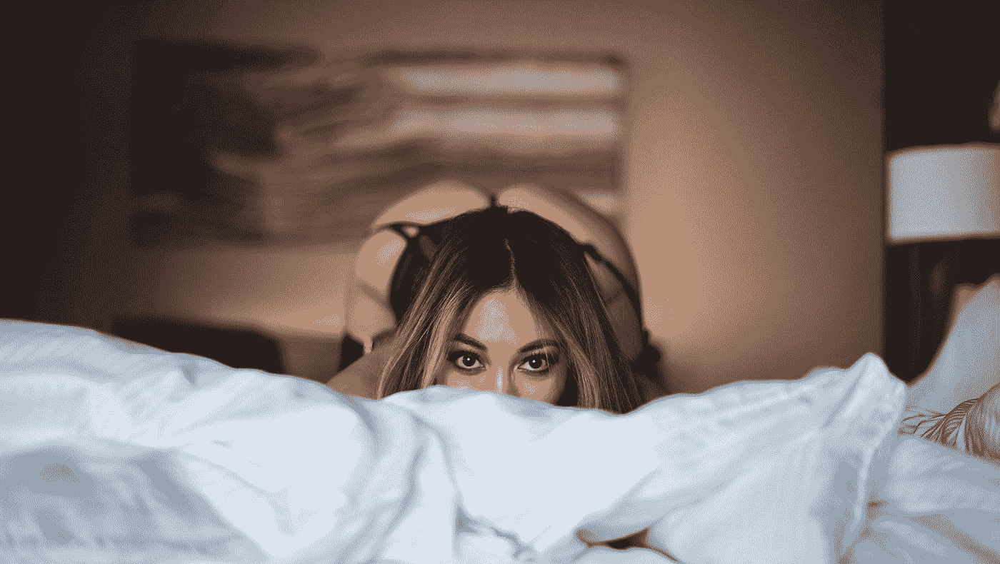
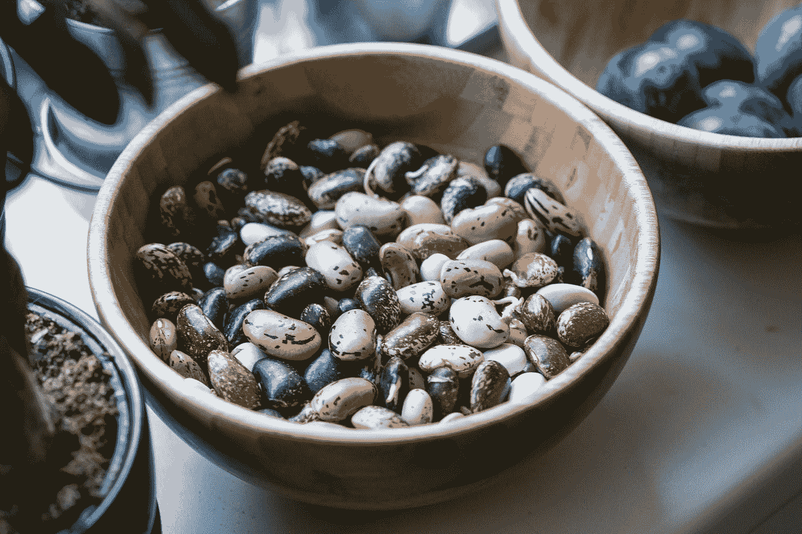

# 闭嘴

> 原文：<https://medium.datadriveninvestor.com/shut-your-mouth-a11c805012f3?source=collection_archive---------1----------------------->

Photo by [DeMorris Byrd](https://unsplash.com/@byrdman85?utm_source=medium&utm_medium=referral) on [Unsplash](https://unsplash.com?utm_source=medium&utm_medium=referral)

## 白痴阶层如何通过说出自己的想法来破坏自己的品牌

在去年接受《Vogue》采访时，维多利亚的秘密当时的 CMO·埃德·拉塞克说，它将继续向一个非常特定的客户进行营销，因为“没有人对看大码模特感兴趣”

不知何故，我第一次错过了那个评论。然而，我非常高兴地注意到，VS 已经取消了全球时装秀。我从没见过。我一点也不在乎。而且，因为也许，也许世界上所有女人中有 1-2%的人有着那样畸形的苗条身材，所以她们都不和我说话。或者就此而言，我们这些购买他们产品的人，或者在与那些在商店里几乎没有工作的傲慢的售货员打交道时努力保持严肃的面孔。他们要关门了，我一点也不难过。普通大众不需要羞耻。

 [## 在创业之旅中，拥抱学习|数据驱动的投资者

### 好像建立一个数百万美元的公司还不够困难，企业家必须额外照顾他们的…

www.datadriveninvestor.com](https://www.datadriveninvestor.com/2018/10/16/on-the-entrepreneurial-trek-embrace-the-learning/) 

如果 VS 只想“继续营销”那些能穿上他们衣服的 1%(或大约 1%)的人，那就去做吧。有很多男人喜欢看到他们的大码女人穿着高筒丝袜和闪亮的红色胸罩。所有男人都喜欢单一体型的惊人假设只是…值得一巴掌。

他们也不再和任何人交谈。因为无论你是否相信肥胖问题是由懒惰引起的(*哦，拜托*)或者这是一个背后有食品化学家的更复杂的问题(谢谢， [*《卫报》*](https://medium.com/the-guardian/were-in-a-new-age-of-obesity-how-did-it-happen-you-d-be-surprised-69d845d66514) )，关键是我们正在变大。美国食物，太多了，坦白地说，是狗屎，没有卡路里和诱人的味道。如果没有一大群高薪的化学家(请参见 [this](https://www.zippia.com/food-chemist-jobs/salary/) )为凯洛格(Kellogg)和联合食品集团(United Food Group)这样的人工作，意志力就已经够艰难了。联合食品集团生产食品粉，包括面粉、糖、盐、干添加剂、干配料、奶粉、[干菜](https://www.sciencedirect.com/topics/agricultural-and-biological-sciences/dried-vegetables)、干果、谷物、面包粉、汤粉、调料粉、果汁粉等，每年能赚 11.7 万美元，确保你我“不能只吃一种”

我重视《卫报》对这个话题的看法，尽管我不确定我是否完全同意。我认为这个问题非常复杂，但事实依然存在。去 T2 肥胖率飙升的发展中国家旅行。这与米奇德、所有百胜餐饮品牌以及可口可乐涉足的任何地方的入侵是并行的。或者卡夫、雀巢或者几乎所有的大型食品品牌。因为随着当地人放弃他们几个世纪以来的健康饮食习惯，包括时令豆类、蔬菜、水果和高纤维食物，他们开始看起来像我们美国人一样。味道好的食物不一定对你有好处，但这并不阻止人们喜欢精心策划的味道，而不是纯粹的燃料，完美地为人体设计的食物。

Photo by [Milada Vigerova](https://unsplash.com/@mili_vigerova?utm_source=medium&utm_medium=referral) on [Unsplash](https://unsplash.com?utm_source=medium&utm_medium=referral)

也就是说，制造我们(过去)喜欢的品牌的首席执行官们有办法公开展示他们的身体羞耻、无知，以及对我们在这个世界上所处位置的极度缺乏了解，这个世界是他们的许多兄弟非常努力创造的。换句话说，数十亿人狼吞虎咽地吃下他们的劣质零食和食物，伴随着你能预料到的所有明显的副作用，然后责怪让它们盈利的公众。

虽然有点过时，这篇 *adweek* [文章](https://www.adweek.com/brand-marketing/7-times-ceos-said-really-dumb-customer-alienating-things-165318/)谈到了某些男人如何习惯于把他们 12 码的意大利懒汉塞进他们口中的馅饼洞。也就是说:

*其中包括(前 Lululemon 首席执行官)丹尼斯“芯片”* [*威尔逊 2013 年的评论*](https://www.adweek.com/adfreak/if-your-thighs-can-touch-lululemon-pants-might-not-be-right-you-153685) *认为* ***“有些女人的身体实际上就是不工作”*** *搭配该品牌的弹力瑜伽裤。他鼓吹第三世界国家童工的***福利。据报道，他还取笑日本血统的人不会念他品牌的名字。* [*(他否认最后一个。)*](http://abcnews.go.com/Business/lululemon-founder-chip-wilsons-outrageous-quotes/story?id=28672323)*

*多么有趣的是，瑜伽裤的销售——以及几乎任何一种裹腿——让这个白痴和像他一样的男人变得异常富有。因为我们这些各种身材的人都可以穿。他们对我们穿那条裤子的看法不仅是不请自来的，而且就像是在顾客脸上吐痰。我们中的许多人需要这些裤子，因为制造商拒绝适应我们饮食变化带来的身体变化。*

*但是等等。让我们把这件事归咎于公众，好吗？*

**

*Photo by [Enrique Fernandez](https://unsplash.com/@dragblack?utm_source=medium&utm_medium=referral) on [Unsplash](https://unsplash.com?utm_source=medium&utm_medium=referral)*

*作为 Abercrombie & Fitch 的首席执行官，迈克·杰弗里斯(Mike Jeffries)对他的品牌发表了这样的声明:*

**(他)只想要* ***【酷、好看的人】*** *到那里购物，又如何* ***【很多人不属于】*** *在品牌的脉络里。**

*粉丝们被激怒了，销量直线下降，杰弗里斯被邀请加入不为 A&F 工作的不酷的人。*

*《广告周刊》的文章很有启发性，但并不充分。因为事实是太多的首席执行官辱骂我们。我们只不过是会走路的钱包。他们生活在超级富豪的镀金世界里(当然他们是)，在那里反响很小。大多数人在其他地方找到一个友好的家，在那里他们的嘴可以得到更好的管理。*

# *一个口套会是一件好东西。监狱可能更好。*

*皇室可以对我们这些对垃圾食品上瘾的人嗤之以鼻，而他们却毫无根据地宣称这些食品(Larabars，BearNaked 和其他所谓的健康产品)有多健康。如果你被酷酷的包装所迷惑，并且无论如何也想不出为什么格兰诺拉麦片会一直堆积在你的臀部，请看[这个](https://www.cheatsheet.com/health-fitness/lies-from-health-food-companies-owned-by-junk-food-brands.html/?a=viewall)。大部分是糖。*

*当一个伟大的小创业公司被通用磨坊、家乐氏或卡夫收购时，你可以打赌，所有这些伟大的原料将被廉价的填料和那些方便的食品化学家专为你的味蕾创造的垃圾所取代。*

*然后他们买通官方人才来揭穿他们的产品是狗屎的事实。*

*我最喜欢的一段来自*卫报*的文章:*

**他们雇佣* [*顺从的科学家*](https://well.blogs.nytimes.com/2015/08/09/coca-cola-funds-scientists-who-shift-blame-for-obesity-away-from-bad-diets/) *和* [*智囊团*](https://insulinresistance.org/index.php/jir/article/view/39/111) *来迷惑我们关于* [*肥胖的原因*](https://jamanetwork.com/journals/jamainternalmedicine/article-abstract/2548255) *。最重要的是，就像烟草公司对待吸烟一样，他们宣传体重是一个* [*【个人责任】*](https://www.theguardian.com/society/2015/nov/18/aseem-malhotra-sugar-campaigner-prevent-obesity-public-pressure-on-government) *的问题。在花费数十亿推翻我们的意志力后，他们指责我们没有锻炼意志力。**

*作为一个与肥胖斗争了很多年，并最终赢得这场生命之战的人，我可以证明这有多难。当我读你的胖朋友和像香农·阿什利这样的作家写的故事时，我经常想起我经常从每个人那里得到的东西，从家庭成员到医生到“善意的”朋友。我的肥胖都是我的错。当然是了。*

*这种主要的态度在我自己的家庭中得到了体现。退休后，我的父亲，一个天才的厨师，学会了如何用蜂蜜制作美味的黑面包。他每天都会做一批新的，然后给我和妈妈端上厚厚的热气腾腾的切片，上面涂上黄油。当不可避免的事情发生时(包括他不断膨胀的肚子，但爸爸从来没有提到过)，他会长篇大论，骚扰和嘲笑我们变胖。他递给我们更多的黄油热面包。*

**屁眼*。没错。*

*我父亲不是首席执行官。但他的行为恰恰反映了这种冲动。*

**

*Photo by [Bruno Nascimento](https://unsplash.com/@bruno_nascimento?utm_source=medium&utm_medium=referral) on [Unsplash](https://unsplash.com?utm_source=medium&utm_medium=referral)*

*今年六月，耐克加大码的人体模特引起了丑陋的混乱。鉴于我的朋友和窥视者中有很多坏蛋大码的女人可以很容易地揍我的屁股，在我看来，这一举动是完美的时间。REI 和许多其他冒险公司都明白了这一点。大人物在外面玩。他们解决了。这是一个不断增长的市场，不管这些混蛋 CEO 们喜不喜欢。仅仅迎合那些瘦瘦的富人和白人是破产的秘诀。*

*事实上，一个势利的服装节，DBennett，就是一个很好的例子。这家实体店/网店在开业后不久就消失了。它以超高的价格为超级富豪提供专业的体育用品。事情发生了有趣的转变，这家公司的老板是一名女子，她最终因涉嫌一起巨大的[庞氏骗局而被捕。她实际上有装满某种材料和调查她的 SEC 律师姓名首字母的梅森瓶。她试图对他们施魔法让他们保持沉默。在我看来，班尼特是个好人。她认为自己凌驾于法律之上，当然也不是肮脏的 T4 大众中的一员。](https://bethesdamagazine.com/bethesda-beat/news/chevy-chase-woman-accused-of-running-ponzi-scheme-through-luxury-sportswear-website/)*

*首席执行官们会嘲笑那些喜欢他们的设备的人，这表明了一种大扫除的迫切需要。杰弗里斯发现，他们的服装和流行系列只应该由瘦、富、酷的人穿(读作:*白*)的信息是一个金融灾难的处方。胖子懒惰无知，而他们的公司每天都在炮制全新的食谱来劫持这种意志力，这种信息是独特的侮辱和不诚实。*

**

*Photo by [Mick De Paola](https://unsplash.com/@themick79i?utm_source=medium&utm_medium=referral) on [Unsplash](https://unsplash.com?utm_source=medium&utm_medium=referral)*

*千禧一代被广泛指责为许多行业和产品的死亡原因。作为一代人，他们经常对已经成为皇族的公司表示厌恶，那些薪酬过高的首席执行官污染、掠夺和盗窃他们继承并希望居住的世界，但这个世界正迅速变得无法居住。*

*这是错误的，到底为什么？我可能会假设他们有一个该死的好点。只有千禧一代并不孤单。许多婴儿潮一代和 x 一代鄙视长期以来形成的白痴阶级，他们瞧不起那些让他们暴富的人。*

*然而，我会邀请更多的白痴阶层继续说出他们的想法。因为当他们这样做时，他们无法形容的傲慢，他们的优越感将继续让他们受到公开嘲笑，并随着他们的品牌崩溃而被扫地出门。*

*很好。因为对于今天的强盗大亨来说，公开羞辱是一个很小的代价，他们很乐意从他们用食品化学家和圆滑的广告操纵的顾客身上吸取血液。他们喜欢辱骂的顾客。我会把马克·扎克伯格包括在内，他对我们隐私权的蔑视与 Razek 或 Jeffries 没有什么不同，他们对那些他们称之为客户的人毫不关心或尊重。*

*去吧，伙计们。告诉我们你*真正*的感受。我们很乐意诋毁你的品牌、你的销售和你的公司形象。*

**

*Photo by [Micah Williams](https://unsplash.com/@mr_williams_photography?utm_source=medium&utm_medium=referral) on [Unsplash](https://unsplash.com?utm_source=medium&utm_medium=referral)*