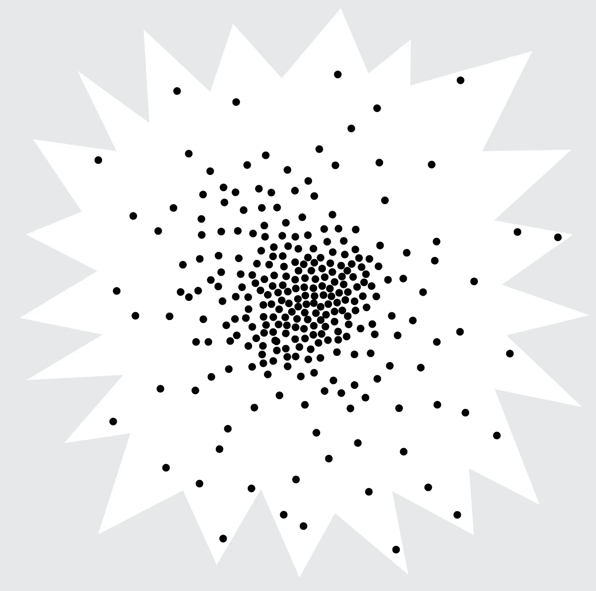
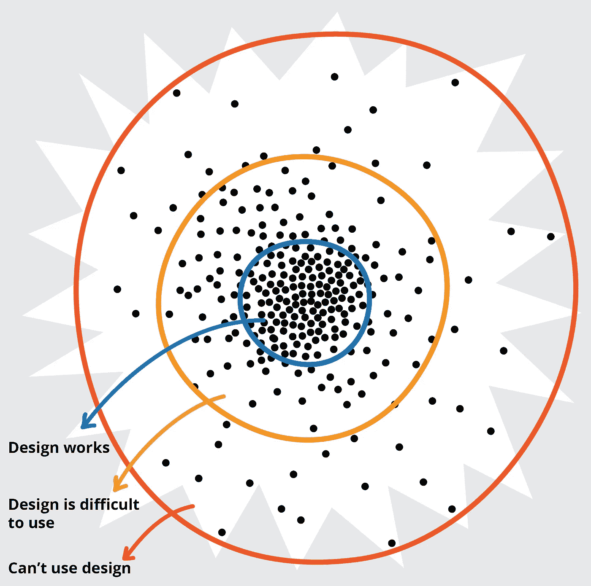
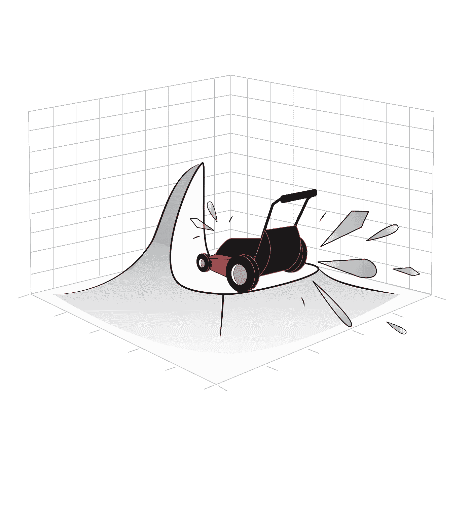

# 多伦多人行道和为什么越聪明越好*

> 原文：<https://medium.datadriveninvestor.com/sidewalk-toronto-and-why-smarter-is-not-better-b233058d01c8?source=collection_archive---------2----------------------->

Toronto waterfront viewed from Tommy Thompson Park on my bicycle ride

# 当你最需要的时候

我的朋友艾丽莎是新技术的热心早期采纳者。她迫不及待地希望所有关于智能设备的承诺都成为现实。她欢迎各种各样的智能设备进入她的家，并努力让它们适应她的需求和愿望。像受过训练的海豹一样，她已经配置了 Echos、Alexas、Siris 和 Google Homes 来执行她的命令。上周二，她中风了，主要结果是语言障碍，使她的讲话含糊不清，除了习惯了的人，如她的家人和朋友，每个人都难以理解。由于一条腿的控制能力下降，她走路也有困难。总是抑制不住，在她离开医院之前，她说这是一件好事，她把她的家装修成了一个智能家居，现在她真的可以利用所有智能功能。

她聪明的小玩意系列出卖了她。它拒绝执行她的命令。每个要求都毫无希望地落空了。艾丽莎总是很有耐心，她预测“他们只需要习惯新的我。”由于她自己正在痛苦地适应“新艾丽莎”，她坚持训练智能设备理解她的请求。她一遍又一遍地重复要求，直到她所要求的东西出现。然后是第二次背叛。她认为她的设备可能需要升级，升级后的软件会比她现在的早期型号设备更智能，更善于理解她的请求。事实恰恰相反，她又回到了起点，无论她如何努力，更智能的设备都无法识别、理解或服务于她，她无法回到起点。更聪明意味着更多的数据，而这些数据会使理解偏向更普通的语言。在她最能利用聪明的东西的时候，她的聪明的东西抛弃了她。

# 指导性失败

这和智慧城市有什么关系？我一直在试验和关注智能系统对偏离正常或平均水平的人做什么。一次重要的经历激发了我越来越强烈的警惕感。在与交通部的合作中，我有机会玩和尝试许多机器学习模型，这些模型将引导自动车辆或无人驾驶汽车通过十字路口。这些人工智能系统会告诉车辆前进、停止或调整以避开障碍物。我想看看，如果这些模型遇到我的一些做事出人意料的朋友和同事，它们会做出什么决定。我带来了我的一个朋友坐在轮椅上向后推的照片。她有强壮的双腿，但她的动作控制不好，虽然她不能站立，但她可以用腿和脚推着轮椅快速移动。许多在十字路口遇到她的人都会被诱惑，而且经常这样做，抓住她的椅子，试图把她推回到人行道上，以为她已经失去了控制。当我把我朋友的一张照片展示给学习模特时，她们都选择撞倒她。有人告诉我，一旦学习模型接触到更多关于人们在十字路口使用轮椅的数据，就要再试一次。我被告知，学习模型是不成熟的模型，还不够聪明，无法识别坐轮椅的人，他们会让他们接触学习数据，包括许多在十字路口使用轮椅的人。当我回来测试更聪明的模型时，他们更有信心地超过了她。我只能推测，根据轮椅的一般行为，他们决定让轮椅朝相反的方向行驶。

# 人类数据的锯齿状星爆

在思考我们如何做出数据驱动的决策或决定时，我应该预料到这一点。如果您在多元散点图(复杂数据的图片，因为人是复杂的)上绘制任何人口或人群的需求和特征，我们会得出一个称为正态分布的循环模式，也称为高斯曲线或钟形曲线(例如，教师用来指导评分)。在一个精确的二维形式中，它看起来像一个钟。如果你在三维空间或者从上面看，你会看到一颗正在爆炸的恒星。在恒星的中间，通常有一个高度密集的数据点群，当你远离中心时，它们会更加分散。爆炸星的边缘非常参差不齐，数据点越来越远。那些锯齿状的边缘代表了我的朋友和同事，他们比大多数人更偏离常规。当我们使用标准数据分析来处理数据散点图以指导我们的决策时，我们的决策将由代表大多数的中间值来决定。锯齿状边缘要么从数据集中消除，使我们的决策更加清晰，要么这些边缘点数量过多，被规范或多数压倒。数据越多，或者系统越智能，优势就越多。

A scatter-plot of human needs and characteristics

从最基本的角度来说，智能城市是由数据引导的城市规划系统。如果我们不改变我们处理数据的方式，那些智能城市将同样忽视和无法认识到我的朋友和同事们偏离常规的需求。

# 数据滥用、误用和偏见

我还意识到，虽然我的朋友们，比如艾丽莎，可以最大程度地使用真正的智能系统，但他们也最容易受到这些智能的滥用和误用。我是在与安大略省处理诈骗的警察部门一起工作时学到这一点的。随着人们想出越来越多邪恶的方法来操纵数据，风险正在成倍增加和变化。这些包括身份盗窃，销售骗局，金融诈骗，仅举几例。

不仅仅是罪犯利用数据做不公平的事情。我们信任的机构，如保险公司、银行、人力资源服务、福利系统、政党、司法系统和安全服务，基于我的朋友的数据歧视他们——拒绝保险、拒绝贷款、拒绝获得某个职位的机会、过度惩罚琐碎的行为，以及不必要地将我的朋友标记为安全风险。([弗吉尼亚·尤班克斯](https://virginia-eubanks.com/books/)、[凯茜·奥尼尔](https://weaponsofmathdestructionbook.com/)和[萨菲娅·诺布尔](https://safiyaunoble.com/role-artificial-intelligence-society-next-human-rights-issue-21st-century/)给出了许多令人心酸的例子。)

# 取消识别和重新识别

对于这种数据滥用和误用，我们加拿大隐私工作和人行道多伦多项目的当前反应是[去识别数据](https://www.theglobeandmail.com/business/article-privacy-expert-ann-cavoukian-resigns-from-sidewalk-toronto-smart-city/)。这个概念是，如果我们从数据中删除我们的身份，它就不能追溯到我们，也不能用来对付我们。假设是，我们将因此保留我们的隐私，同时贡献我们的数据，以做出关于我们城市的设计和功能的更明智的决定。

知道了我唯一的朋友的数据特征，我一直认为虽然我的朋友最容易受到数据滥用和误用，但他们也最容易被重新识别。如果你是一个有欧洲血统的邻居中唯一的土著人，那么追踪你的数据会非常容易。如果您是社区中唯一收到结肠造口袋的人，那么重新识别您的购买数据将非常容易。

# 作为一组数字的人

我对数据和提出的隐私策略感到不安的还有更多。数据分析将人表示为数字。它把人简化成一个数字，或者一串数字。这是为了封闭、减少或去除我们的人性。在我们的历史上，关于人的数据和机器判断经常被用来为不人道的决定开脱。指向数据被用来为我们认为不公平的行为开脱罪责。常见的例子包括政府官员拒绝提供服务或为政策的不合理应用提供借口。我们声称数据不会说谎；我们无力制造例外。我们去除了我们的人性和被编号的人的人性。数据驱动的决策不人道，也不客观。非普通人最好的服务是通过识别其独特需求的个人系统，而不是通过我们从大数据中学到的东西或由使用整个人口数据的数据分析指导的服务。

这种担忧超出了普通人的范围。当我想到让一个城市适合我居住的东西时，它是人性和人类联系的优雅音符。女王街电车上慷慨的小举动，标志着对一个蹒跚学步的孩子在公共场合大胆行为的认可的微笑浪潮，我家附近的小型“拿一个，留一个”图书馆，人们在他们的前院做的令人自豪的事情，为我的散步欢呼，每天早上问候我邻居的暴躁和难闻的老狗，非法街头艺人演奏我最喜欢的歌曲的意想不到的变体，以及一个城市参差不齐的丰富多样性产生的许多令人惊讶的意外时刻。这不是基础设施的效率。事实上，当我们因为基础设施崩溃而需要齐心协力时，会有更多的恩惠。这些优雅的音符不是由数据捕捉的。这并不是说我不欣赏数据驱动的决策。例如，我喜欢通过查看公开数据得出的自行车逆流车道。我很欣赏登打士街的灯光时间，这样我可以更有效率地投入工作。但我担心，当这些数字变得越来越大，离我们的人性越来越远，并被用于越来越多的决策时，会发生什么。我们使用当前的数据分析得出的事实真相或证据缺乏上下文和许多使我们成为人类的复杂事物。我们的数据分析策略与隐私策略相结合，消除了我们的独特性和可变性。最终的计划中会缺少什么？

# 谁来从事设计

那么我们如何做出更好的城市规划决策呢？民意测验和调查在结构上偏向于能够参与的人。多数人统治对我的非普通朋友没有帮助，因为他们每个人都是极少数，即使他们能够参与。(然而，把所有这些微小的少数民族加在一起，你就拥有了我们城市的一大块。)

A scatter-plot showing who can’t or who has difficulty using the design

在我们作为包容性设计师的实践中，我们邀请有困难或不能使用设计的人与我们共同设计。通过这种方式，我们找到了更多创新的方法。最常见的情况是，让边缘人群受益的设计也让拥挤的中间人群受益。这对于人行道来说也是有意义的。处于当前社区边缘的人们从智能社区中面临的风险最大，获益也最多。只有当我们远离平均水平时，我们才最有理由使用智慧。如果我们在最脆弱的时候找到了保护自己免受风险的策略，我们也将有办法保护任何不那么脆弱的人。

# 公平竞争

为了解决多数数据压倒边缘人群需求的问题，我一直在研究高斯曲线或正态分布。我称之为“正义的割草机”对于任何给定的数据点，除了少数重复外，我都删除了。这迫使学习模型为各种需求创造公平的竞争环境，并关注边缘或外围数据。它使正态分布的山丘变平。到目前为止，学习模型需要更长的时间才能做出合理的决定，但一旦做出合理的决定，它就可以满足更多样化的需求，并且更好地应对未预料到的情况或环境中不可避免的变化。

The Lawnmower of Justice trimming the Gaussian curve

# 个人数据偏好

如果取消身份识别不是维护远离平均水平的个人隐私的可靠方法，但数据排除意味着将在不考虑他们需求的情况下做出极具影响力的决定，那么解决这一困境的潜在方法是什么？主要焦点是对隐私的模糊定义。当我们解释这对大多数人意味着什么时，这意味着自决、对我们自己的叙述的所有权、了解我们的数据如何被使用的权利，以及对我们的故事的道德处理。

为了开始解决这一难题，我提出了国际标准化组织个人数据偏好标准，作为监管机构恢复个人数据自主权的工具。我提出这个提议是为了回应要么全有要么全无的服务协议条款，这种协议要求你放弃你的私有数据权，以换取使用服务的特权。这些服务协议条款通常以法律细则的形式表达，大多数人即使有时间阅读也无法理解。这意味着简单地点击“我同意”而不理会我们已经放弃的条款和权利已经成为一种惯例。提议的标准将是我和我在[包容性设计研究中心](https://idrc.ocadu.ca/)的团队以及一个国际工作组共同开发的现有标准的一部分。母标准被称为 AccessForAll 或 [ISO/IEC 24751](https://wiki.fluidproject.org/display/ISO24751/AccessForAll+Working+Group?preview=%2F28345432%2F28573796%2Fc041521_ISO_IEC_+24751-1_2008%28Bil%29.pdf) 。父标准的结构能够将消费者的需求和偏好与资源或服务功能相匹配。它提供了一种通用语言，用机器可读的术语来描述您的需求或偏好，并为服务提供商或生产商提供了一种方法来描述他们的产品和服务所提供的功能。这使得平台能够将各种未满足的消费者需求与最接近的产品或服务相匹配。在标准之上是实用程序，帮助消费者探索、发现和提炼他们对给定环境和给定目标的需求和偏好的理解。该标准的个人数据偏好部分将让消费者声明他们愿意向谁发布哪些个人数据，出于什么目的，在什么条件下发布多长时间。希望使用数据的服务将声明哪些数据对于提供服务是必不可少的，哪些数据是可选的。这将使平台能够支持更合理的服务条款的协商。服务提供商的数据需求声明将是透明的和可审计的。该标准将增加一些实用程序，告知并指导消费者偏好选择的风险和影响。加拿大和欧洲的监管机构计划在该标准完成后指出它。这将有望夺回一些自主使用我们的数据的表象。

# 数据平台合作

我们与新学院和[平台合作联盟](https://platform.coop/)共同探索的另一种自主和数据方法是数据合作的形成。在数据合作社中，数据生产者将管理和分享来自他们自己的数据的利润(知识和资金)。这种方法尤其有助于在以前被忽视的领域积累数据，如罕见疾病、利基消费者需求或特殊爱好。在智能城市中，可能会有多个数据域拥有相关的数据合作。例子包括寻路和交通信息、公用事业使用、废物管理、娱乐、消费者需求等等。然后，这种多重数据合作将协作为更一般的城市规划决策提供输入。

# 我们需要更多的时间

从人类差异的锯齿状散点图中学习需要更多的时间。强加给 T2 人行道设计方案的最后期限是不现实的。在我们[称霸全球](https://www.forbes.com/sites/forbestechcouncil/2018/03/13/heres-why-canada-can-win-the-ai-race/#5508a6c5c9b7)的竞赛中，为了“打败中国”，我们未能保护我们最脆弱的群体。无论我们设计什么计划，都不应该是完美的、完全的或永久的。完美并不意味着订婚。该计划应该是一个包容性的过程，支持我们社区的迭代共同创造。

# 走向更包容的社区

我们如何更好地了解我们的城市？我想说，这是通过寻找其居民和游客的丰富故事，包括被忽视的人的故事——在这个高度复杂的城市中的多种经验和观点——而不去除背景或可变性。这与当前的数据方法相反。我们如何规划一个更好的城市？我想说的是，通过解决那些难以适应或被我们当前的城市设计所排斥的人们的需求，我们创造了一个更加友好和人性化的城市规划。我们如何确保我们的数据不会在未经我们同意的情况下被滥用、误用或利用？去认同不是答案，因为它对最脆弱的人不起作用，因为它去除了我们的可变性和独特性。我们需要创建系统，使我们能够自主决定我们自己的故事，以及谁使用我们的数据，用于什么目的。

我们是独一无二的，我们的背景，我们的目标，我们可变的和多样的叙述与创建热情的，人性化的社区最相关。将我们的数据转化为一个同质的群体，并赋予平均值特权，不会产生一个更宜居的城市。我们失去了人性的棱角。我们需要一个安全的城市，在这里我们可以做完整的、真实的、独特的自己，我们的故事也很重要。我们需要能够对这些高度多样化的需求做出动态响应的智慧，同时帮助我们找到共同的价值观和更深层次的共性。

*注:我是多伦多滨水区数字战略顾问团的成员。

**请注意，本作品是在[署名-非商业性 4.0 国际许可](https://creativecommons.org/licenses/by-nc/4.0/) *下获得许可的