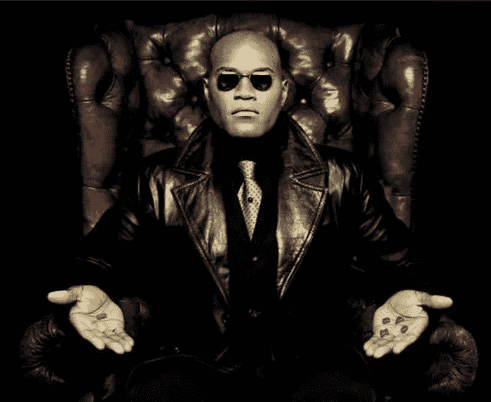

# 硅谷峰会提出关于人工智能的三大问题

> 原文：<https://medium.datadriveninvestor.com/silicon-valley-summit-raises-3-big-questions-about-artificial-intelligence-179779560f78?source=collection_archive---------26----------------------->

## 这可能是历史决定机器会埋葬我们还是为我们服务的基石！

好吧，*不是真的*，但是这么想有点好玩。还记得电影**《黑客帝国》**吗？没错。我们正处于这个阶段，当我们正式生下 ***AI*** 的时候，*惊叹于自己的辉煌。单一的意识。然而，毫无疑问，有异议者，质疑人工智能的安全性和安全性，以及该技术如何在多个层面和垂直领域继续创新。*

# 首先，你喜欢机器人“接管”的想法吗？

老实说，这要看情况。然而，从表面上看，在最近的硅谷峰会上提出的关于人工智能的三个问题确实让一些人感到惊讶，并让人们思考…" *Hmmmmm，技术* ***真的有必要吗？"*让我们来看看关键思想领袖们提出了哪些问题，然后进行了哪些讨论。**

 [## 人工智能与创造力:作为创意引擎的比根——数据驱动的投资者

### 的确，2018 年可以被视为人工智能创造的创造力全盛时期的开始。当然可以…

www.datadriveninvestor.com](https://www.datadriveninvestor.com/2019/02/13/ai-creativity-biggan-as-a-creative-engine/) 

## 制药公司呢？

这是一个目前严重受益于人工智能的行业。但是代价是什么？人们看到了这种不平衡，因为公司希望更多地关注加速，而不是投资于确保药物的安全和非歧视性。那是机器不一定能做得太好的事情。至少在这个时间点上！

## 自动唇读怎么样？

呀。从表面上看，这听起来确实有点可怕。伦理和道德在人工智能实施的讨论中发挥了重要作用，因为政府可以比现在更容易地监视 T21。想起了*鹰眼*那是政府的阴谋。我们都是“微型芯片”我们被“监视”了。这就是恐惧。毫无疑问，自动唇读步骤将恐惧提升了一个档次。

## 然而，面部识别会变得更糟

如果当局不仅可以在任何给定的时间访问你的数据，还可以在你进行像 [*面部识别*](https://vigyaa.com/@pierre/will-apple-be-the-new-mission-impossible-863507f4/) 这样简单的事情时访问你的更多数据，这听起来会有多危险？挺吓人的。我们已经生活在一个被对数据隐私的威胁所激怒的世界里。机器实际上可以模拟我们自己的脸，作为让我们获得商业和个人最重要信息的一种方式，这种想法为犯罪分子提供了一个很好的机会。那只是一个我们不能忽视的事实。

# 不过，不要误解我们的意思:无论如何，这都不是一个反对人工智能的正面论点

当然，峰会只是非常小心地对待我们的技术。理应如此。我们看过**侏罗纪公园**。我们知道，如果我们对一项从未打算自然融入或融入我们文化的创新不负责任，会发生什么。这会被认为是对自然界的掠夺。我们正在尽职调查，确保人工智能不会成为我们噩梦中的那只霸王龙。

婴儿一路走来。我们根本不用催 AI。有一件事是肯定的:当它真正成为主流时，它将会变得很美。你怎么看待 AI？ [**现在就注册一个 VIGYAA 账户**](https://vigyaa.com/accounts/login/) 一定要去 [**和数据驱动投资者核实一下，了解更多关于技术的见解**](http://datadriveninvestor.com) ！