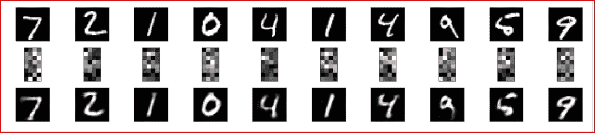
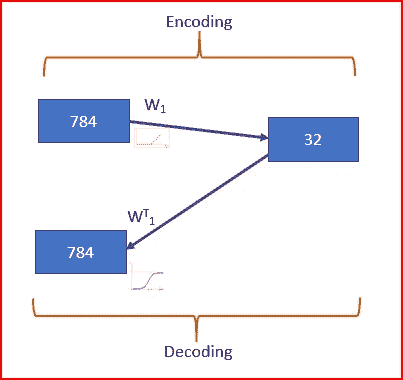
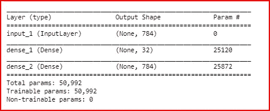
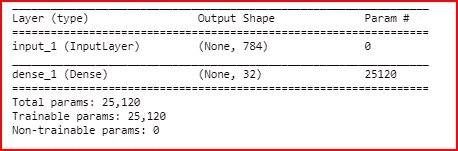
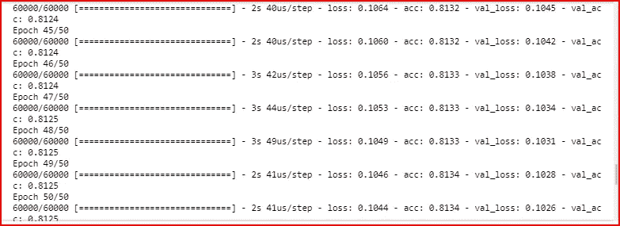

# 使用 Keras 的简单自动编码器

> 原文：<https://medium.datadriveninvestor.com/simple-autoencoders-using-keras-6e67677f5679?source=collection_archive---------2----------------------->

[](http://www.track.datadriveninvestor.com/1B9E)

在这篇文章中，我们将创建一个简单的自动编码器。为此，我们将使用 MNIST 数据集和 keras 库。



First row have the input images from MNIST dataset. Second row is encoded images and third row is the decode images of MNIST dataset using simple autoencoders

## 先决条件:

[B **自动编码器专用集成电路**](https://medium.com/datadriveninvestor/deep-learning-autoencoders-db265359943e)

[**自动编码器的类型**](https://medium.com/datadriveninvestor/deep-learning-different-types-of-autoencoders-41d4fa5f7570)

让我们从一步一步创建一个简单的自动编码器开始

导入所需的库

```
from keras.datasets import mnist
from keras.layers import Input, Dense
from keras.models import Modelimport numpy as np
import pandas as pd
import matplotlib.pyplot as plt

%matplotlib inline
```

加载 MNIST 数据集影像而非其标注。我们希望重建图像作为自动编码器的输出，因此我们不需要标签。

创建训练集和测试集，并规范化数据以进行更好的训练。

```
(X_train, _), (X_test, _) = mnist.load_data() X_train = X_train.astype('float32')/255
X_test = X_test.astype('float32')/255

X_train = X_train.reshape(len(X_train), np.prod(X_train.shape[1:]))
X_test = X_test.reshape(len(X_test), np.prod(X_test.shape[1:]))print(X_train.shape)
print(X_test.shape)
```


Shape of X_train and X_test

我们的输入图像的尺寸为 784，我们将其编码为 32，然后将其解码为 784 的原始尺寸



编码图像的压缩率为 784/32=24.5 %

我们需要把 784 维的输入图像转换成 keras 张量。

```
input_img= Input(shape=(784,))
```

我们现在根据上图创建编码器和解码器。

输入图像将被编码为 32 个单位，激活将是 relu，输入是输入图像的张量

```
encoded = Dense(units=32, activation='relu')(input_img)
```

解码器将有 784 个单元，因为它需要将输入图像重建回其原始尺寸。

由于解码是自动编码器的输出层，我们将使用 sigmoid 激活函数。编码图像将是解码器的输入

```
decoded = Dense(units=784, activation='sigmoid')(encoded)
```

我们现在创建自动编码器，输入作为输入图像，输出作为解码器

```
autoencoder=Model(input_img, decoded)
```

让我们来看看简单的自动编码器模型的不同层次

```
autoencoder.summary()
```



Autoencoder

我们还可以提取编码器，它将输入作为输入图像，输出是编码图像。

```
encoder = Model(input_img, encoded)
```

让我们看看编码模型的结构

```
encoder.summary() 
```



Encoder

我们现在用 adadelta 优化器编译自动编码器模型。由于像素值为 001，我们使用二进制交叉熵作为损失函数，并且模型性能的度量标准是精确度

```
autoencoder.compile(optimizer='adadelta', loss='binary_crossentropy', metrics=['accuracy'])
```

我们现在使用具有 50 个时期和 256 个批量的训练数据来训练自动编码器。我们也混洗训练数据

```
autoencoder.fit(X_train, X_train,
                epochs=50,
                batch_size=256,
                shuffle=True,
                validation_data=(X_test, X_test)) 
```



预测测试集。我们希望查看编码的图像以及重建的图像，因此我们在 autoencoder 和 encoder 上都拟合了测试数据

```
encoded_imgs = encoder.predict(X_test)
predicted = autoencoder.predict(X_test) 
```

让我们使用 matplotlib 绘制原始输入、编码图像和重建图像

```
plt.figure(figsize=(40, 4))
for i in range(10):
    **# display original**
    ax = plt.subplot(3, 20, i + 1)
    plt.imshow(X_test[i].reshape(28, 28))
    plt.gray()
    ax.get_xaxis().set_visible(False)
    ax.get_yaxis().set_visible(False)

   ** # display encoded image**
    ax = plt.subplot(3, 20, i + 1 + 20)
    plt.imshow(encoded_imgs[i].reshape(8,4))
    plt.gray()
    ax.get_xaxis().set_visible(False)
    ax.get_yaxis().set_visible(False) **# display reconstruction**
    ax = plt.subplot(3, 20, 2*20 +i+ 1)
    plt.imshow(predicted[i].reshape(28, 28))
    plt.gray()
    ax.get_xaxis().set_visible(False)
    ax.get_yaxis().set_visible(False)

plt.show()
```


## 阅读关于如何构建深度自动编码器和去噪自动编码器的博客

# 如果你喜欢这个帖子，请鼓掌！

参考资料:

[https://blog.keras.io/building-autoencoders-in-keras.html](https://blog.keras.io/building-autoencoders-in-keras.html)

## 来自 DDI 的相关故事:

[](https://medium.com/datadriveninvestor/which-is-more-promising-data-science-or-software-engineering-7e425e9ec4f4) [## 数据科学和软件工程哪个更有前途？

### 大约一个月前，当我坐在咖啡馆里为一个客户开发网站时，我发现了这个女人…

medium.com](https://medium.com/datadriveninvestor/which-is-more-promising-data-science-or-software-engineering-7e425e9ec4f4) [](https://medium.com/datadriveninvestor/deep-learning-explained-in-7-steps-9ae09471721a) [## 用 7 个步骤解释深度学习

### 和猫一起

medium.com](https://medium.com/datadriveninvestor/deep-learning-explained-in-7-steps-9ae09471721a)