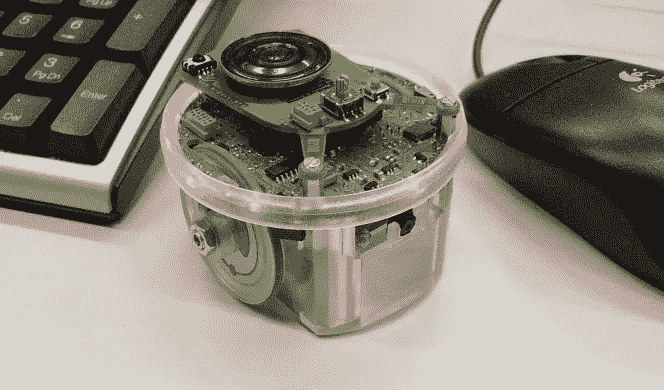
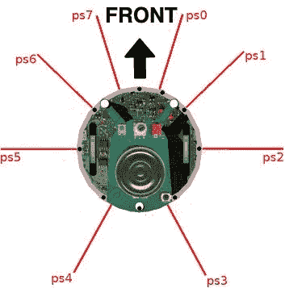
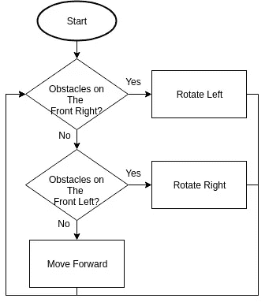
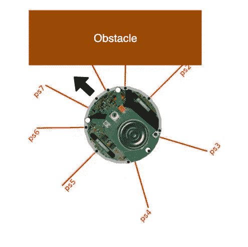
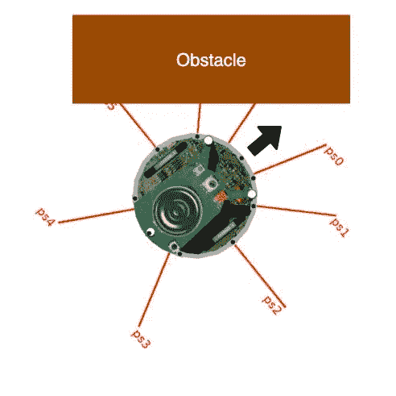
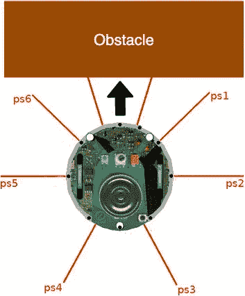
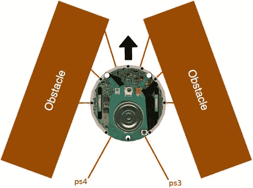
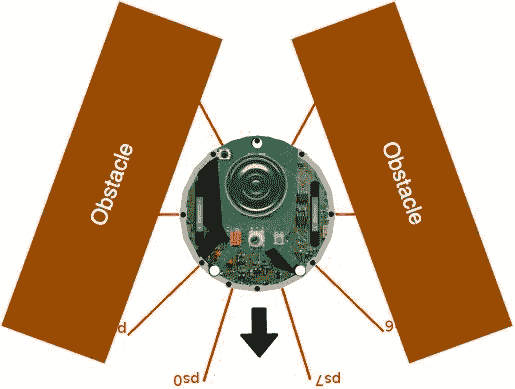
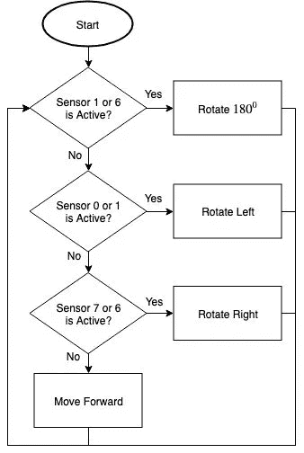

# 简单回避算法，在 e-puck 机器人上实现并在 Webots 机器人模拟器上仿真

> 原文：<https://medium.datadriveninvestor.com/simple-avoidance-algorithm-implemented-on-e-puck-robot-and-simulated-on-webots-robot-simulator-3143c096d285?source=collection_archive---------1----------------------->

这个故事是 Webots 教程系列的第二部分。以下是该系列的链接:

1.  [使用 Webots 机器人模拟器](https://medium.com/@albert.brucelee/8a2e2b5d22a9)轻松创建并运行您的第一个机器人程序
2.  当前故事
3.  [移动你的机器人到特定的坐标](https://medium.com/@albert.brucelee/ecf50cb4244b)
4.  [适应性运动](https://medium.com/@albert.brucelee/103ed0a76f49)

更多系列敬请期待。稍后我们将讨论如何在网络机器人中实现粒子群优化算法。PSO 在现实生活中用于搜索和救援行动。

# 鼓励

> “你想学机器人，但是你没钱买机器人？”

Webots 模拟器是解决方案！

> Webots 是一个开源机器人模拟器，它提供了一个完整的开发环境来建模、编程和模拟机器人。世界上成千上万的机构将它用于 R&D 和教学。自 1996 年以来，Webots 由位于洛桑的瑞士联邦理工学院共同开发，经过全面测试，记录完善，并得到持续维护。是快速获得专业结果的最高效解决方案。[ [参考](https://cyberbotics.com/#webots)

官方网站:[https://cyberbotics.com](https://cyberbotics.com)

# 介绍

这里我们想实现一个简单的机器人回避算法。我们使用了 e-puck 机器人，并在 Webots 机器人模拟器上对其进行了模拟。

 [## 模式和机器人:复杂的现实|数据驱动的投资者

### 哈耶克的名著《复杂现象理论》(哈耶克，1964)深入探讨了复杂性的话题，并断言…

www.datadriveninvestor.com](https://www.datadriveninvestor.com/2019/03/04/patterns-and-robotics-a-complex-reality/) 

如果你不了解 Webots，请在这里看我写的[关于 Webots 的介绍，或者在这里](https://medium.com/@albert.brucelee/introduction-to-webots-robot-simulator-and-e-puck-robot-8a2e2b5d22a9)看官方教程[。官方教程非常干净易懂。](https://cyberbotics.com/doc/guide/tutorials)

# 源代码

你可以从我的 github [ [这里](https://github.com/albertbrucelee/webots-e-puck_robot-tutorial/tree/master/2%20-%20Simple%20Obstacle%20Avoidance) ]查看并下载源代码。

也可以从我的 github [ [这里](https://github.com/albertbrucelee/webots-e-puck_robot-tutorial) ]查看其他源代码教程。

# 机器人和距离传感器

在我们创建算法之前，我们必须了解我们使用的机器人和传感器。关于 e-puck 机器人的更多细节，请阅读维基[这里](https://www.gctronic.com/doc/index.php/e-puck2)或者简单地阅读我以前的博客[这里](https://medium.com/@albert.brucelee/introduction-to-webots-robot-simulator-and-e-puck-robot-8a2e2b5d22a9)。

e-puck Robot

下面是距离传感器。e-puck 有 8 个红外传感器，可以测量周围的光线和 4 厘米范围内的障碍物。传感器不仅仅是检测障碍物，而是检测障碍物的距离。ps0 是传感器 0，ps1 是传感器 1，依此类推。

e-puck Distance Sensor

# 该算法

现在我们将讨论简单的回避算法。下面是算法流程。算法非常简单，只需要两个条件和三个状态。

Simple Obstacle Avoidance Algorithm

这三种状态是:

1.  如果机器人检测到右前方有障碍物，则机器人原地向左旋转。我们使用传感器 0 和传感器 1 来检测右前方的障碍物。如果其中一个传感器处于活动状态，则右前方有障碍物。

Robot Detect Obstacle on The Front Right

2.如果右前方没有障碍物，那么机器人检测到左前方有障碍物。如果有的话，那么机器人就在原地旋转。我们使用传感器 7 和传感器 6 来检测左前方的障碍物。如果其中一个传感器处于活动状态，则左前方有障碍物。

Robot Detect Obstacle on The Front Left

3.如果右前方或左前方没有障碍物，那么机器人正在向前移动。

如果机器人前面有障碍物呢？如果机器人前方有障碍物，则传感器 0 或传感器 1 处于活动状态。所以障碍物右前检测条件为真。

Obstacles in Front of The Robot

# 算法扩展

算法有瑕疵。如果机器人之间有障碍物，那么机器人就被困住了(见下图)。机器人检测到右前方有障碍物，因此它将转向左侧。向左旋转后，机器人检测到左前方有障碍物，因此机器人将向右旋转。机器人将持续面对这种情况，因此机器人将被困在障碍物之间。

Robot is Trapped Between Obstacles

为了克服这个问题，我们必须增加陷获条件。如果传感器 1 和传感器 6 激活，机器人被困在障碍物之间。如果这两个传感器都处于活动状态，那么机器人将在适当的位置进行 180⁰旋转，如下所示。

Robot Rotate 180⁰

所以最终的算法流程如下。记得条件“传感器 0 或 1 是活跃的？”检测右前方的障碍物，条件是“传感器 7 或 6 处于活动状态？”是探测左前方的障碍物。

Simple Obstacle Avoidance Final Algorithm

# 该计划

现在我们讨论程序实现。完整的源代码，你可以从我的 github [这里](https://github.com/albertbrucelee/webots-e-puck_robot/tree/master/2%20-%20Simple%20Obstacle%20Avoidance)查看和下载。请下载模拟器环境设置的代码(在 webots 中，我们称之为“world”)。下面是世界。

Simulation World

我们在这里详细讨论代码。可能和我 Github 上的源代码[ [这里](https://github.com/albertbrucelee/webots-e-puck_robot-tutorial/tree/master/2%20-%20Simple%20Obstacle%20Avoidance) ]不一样，但区别只是针对代码结构/放置。

## 包括必要的库

*   #include <stdio.h>用于将消息打印到控制台。我们用它来调试程序和打印传感器值。</stdio.h>

## 传感器

这个代码需要处理机器人传感器。

*   get_sensors_condition 函数是获取所有传感器的状态。如果传感器检测到障碍物，则条件为真。传感器有噪音。因此，即使没有障碍物，传感器值也不为零。因此，为了检测障碍物，我们必须使用由传感器值检测阈值定义的阈值。根据我的实验，好的阈值是 140。如果传感器值大于该阈值，则障碍物检测条件为真
*   print_sensor_values 功能是打印所有的传感器值。如果你想知道/调试传感器值，那么你可以调用这个函数。

## 发动机

这段代码需要处理机器人马达(轮子)

*   e-puck 的最大速度是 6.28 弧度/秒(12.874 厘米/秒)。我们将它存储在 MAX_SPEED 变量中。
*   电机 _ 停止功能是停止机器人电机。但是我们不用这个功能
*   电机 _ 移动 _ 前进是以最大速度向前移动机器人
*   马达 _ 旋转 _ 向右是以最大速度向右旋转机器人。机器人会原地旋转
*   马达 _ 旋转 _ 左转是以最大速度向左旋转机器人。机器人会原地向左旋转
*   马达 _ 旋转 _ 左 _ 进 _ 度是将机器人以最大速度向左旋转 90 度.例如，180⁰.如果被困在障碍物之间，我们需要这个来离开机器人

## 初始化机器人

这段代码需要初始化机器人，获取电机处理器，获取传感器值。Webots 有模拟器时间步长。*基本时间步长*是 Webots 用来推进*虚拟时间*并进行物理模拟[【参考】](https://www.cyberbotics.com/doc/reference/glossary)的时间步长增量。

## 主要功能

这是我们的主要功能。当程序启动时，该功能将被执行。

*   wb_robot_step(TIME_STEP)是执行模拟步骤。这是控制器时间步长所需要的。*控制器时间步长*是在*控制器*的控制循环的每次迭代中执行的时间增量。我们必须调用这个来同步我们的程序和模拟器条件。如果模拟停止，它将返回-1。所以我们在这个控制器时间步上循环。
*   is_sensors_active 表示传感器的活动状态。is_sensors_active[0]是传感器 0 条件，is_sensors_active[1]是传感器 1 条件，依此类推。
*   如果您想要打印(调试)传感器值，只需取消注释“print_sensor_values()”
*   需要 wb_robot_cleanup 来清理 webots 资源
*   成功退出需要返回 0

# 模拟演示

这是模拟演示。

# 谢谢你

希望你能按照这个教程，并成功地实现算法。并且希望大家可以自己搭建实现自己的避障算法版本:)

请继续关注更多教程。可以关注我的 Medium 或者我的 [Gihub](https://github.com/albertbrucelee/webots-e-puck_robot-tutorial) 。

如果你喜欢这个教程，请鼓掌。如果您有任何建议或问题，请回复。

如果您有任何问题，请通过我的 [LinkedIn](https://www.linkedin.com/in/albert-alfrianta/) 联系我，分享我们的经验:)

谢谢大家！