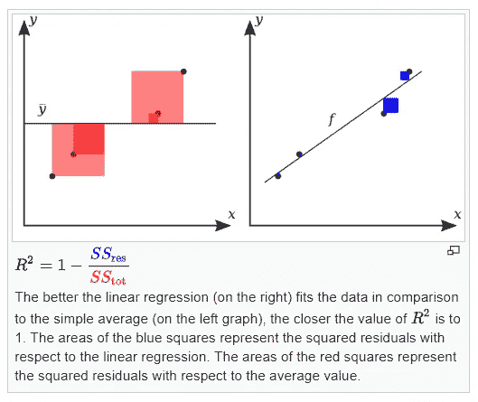

# 使用 Kotlin 从头开始简单的线性回归

> 原文：<https://medium.datadriveninvestor.com/simple-linear-regression-from-scratch-using-kotlin-42673dd59932?source=collection_archive---------0----------------------->


Artificial Intelligence Illustration

在本教程中，我们将学习如何使用 Kotlin 在没有任何外部库的情况下训练和测试一个简单的线性回归模型。简单的线性回归是机器学习中最简单的模型，因此首先是一个很好的候选模型。

本文不使用任何外部库，目标是从头开始写下一切，以便更好地理解幕后的机制。

[](https://www.datadriveninvestor.com/2019/02/19/artificial-intelligence-trends-to-watch-this-year/) [## 今年值得关注的人工智能趋势|数据驱动的投资者

### 预计 2019 年人工智能将取得广泛的重大进展。从谷歌搜索到处理复杂的工作，如…

www.datadriveninvestor.com](https://www.datadriveninvestor.com/2019/02/19/artificial-intelligence-trends-to-watch-this-year/) 

这篇文章的部分灵感来自于[这篇](https://mubaris.com/posts/linear-regression/)文章。

# 简单线性回归

根据[维基百科](https://en.wikipedia.org/wiki/Simple_linear_regression)，简单线性回归是

> *一个以* ***单解释变量*** *的线性回归模型。也就是说，它关注具有一个* ***自变量*** *和一个* ***因变量*** *(传统上，笛卡尔坐标系中的 x 和 y 坐标)的二维样本点，并找到一个线性函数(非垂直直线)，该线性函数尽可能精确地将因变量值预测为自变量* *的函数。形容词 single 指的是结果变量与单个预测因子相关的事实。*

换句话说，给定一个变量，简单线性回归模型能够或多或少有效地预测与输入变量相关的变量值。

有许多例子可以说明如何使用简单的线性回归

*   家庭中的儿童数量->消耗的牛奶升数
*   工作年限->工资
*   智商->工作表现
*   等等。

# 数据

## **数据集**

我们将要使用的数据集是在 Kaggle 上找到的数据集。多个数据集在线可用，这只是一个任意的选择，你可以使用你选择的任何其他数据集或生成你自己的数据集。

[链接到数据集](https://www.kaggle.com/venjktry/simple-linear-regression/data)

## **自变量&因变量**

正如我们前面看到的维基百科的定义，自变量(也称为解释变量)将帮助我们定义因变量的值是什么。

在下面的模式中，自变量为`x`，因变量为`y`。


Simple Linear Regression

练习的目标当然是获得简单线性回归公式中 *β₀* & *β₁* 的最佳值的近似值:

> y = β₀ + β₁*x

在这个公式中， **y** 为因变量， **x** 为自变量， ***β₀*** 为常数(改变我们的直线在 y 轴上的位置)*为自变量的系数(改变我们直线的斜率)。*

# *构建和培训*

## *读取文件*

*让我们从阅读 train.csv 和 test.csv 文件开始。我们还将把它们分成独立变量和因变量，以便以后更容易为我们的模型提供信息。*

```
*val xTrain = *mutableListOf*<Double>()
val yTrain = *mutableListOf*<Double>()
val trainFileName = "train.csv"

File(trainFileName).*forEachLine* **{** val split = **it**.*split*(",")
    xTrain.add(split[0].*toDouble*())
    yTrain.add(split[1].*toDouble*())
**}**val xTest = *mutableListOf*<Double>()
val yTest = *mutableListOf*<Double>()
val testFileName = "test.csv"

File(testFileName).*forEachLine* **{** val split = **it**.*split*(",")
    xTest.add(split[0].*toDouble*())
    yTest.add(split[1].*toDouble*())
**}***
```

## *模型*

*现在让我们创建我们的模型，并用训练数据填充它。我们模型的目标是直接处理训练数据。*

```
*val model = SimpleLinearRegressionModel(independentVariables = xTrain, dependentVariables = yTrain)*
```

*我故意省略了`SimpleLinearRegressionModel`的代码，因为我们将逐个方法、逐个字段地发现它。现在，我们只需要明白我们已经填充了两个字段`independentVariables` & `dependentVariables`。*

## *平均 X 和平均 Y*

*为了在我们的模型中进行内部计算，我们需要自变量的平均值和因变量的平均值。使用`Collections.kt` `sum`方法并对结果进行除法运算，很容易做到这一点。*

```
*private val meanX: Double = independentVariables.*sum*().div(independentVariables.*count*())
private val meanY: Double = dependentVariables.*sum*().div(dependentVariables.*count*())*
```

## *方差和协方差*

*我们可以看到β₁的公式如下*

> *β₁ =协方差/方差*

*为了得到 *β₁* 的值，我们必须计算这两者。*

*方差可以定义为每个独立变量的平方差之和减去它们的平均值。*

```
*private val variance: Double = independentVariables.stream().mapToDouble **{** (**it** - meanX).*pow*(2) **}**.sum()*
```

*计算*协方差*的方法需要更多一点的代码，但仍然很容易管理。它可以描述为图中每个点的 x-meanX 值和 y-mean y 值的乘积之和。*

*希望代码更容易理解…*

```
*private fun covariance(): Double {
    var covariance = 0.0
    for (i in 0 *until* independentVariables.size) {
        val xPart = independentVariables[i] - meanX
        val yPart = dependentVariables[i] - meanY
        covariance += xPart * yPart
    }
    return covariance
}*
```

## ***β**₀&t33】β₁*

*现在我们已经计算出了`variance`和`covariance`，我们可以进一步计算 *β₁* 和 *β₀* 的值。*

*提醒一下，它们各自的公式如下*

> *β₁ =协方差/方差*
> 
> *β₀ = meanY — (meanX * β₁)*

```
*private val b1 = covariance.div(variance)
private val b0 = meanY - b1 * meanX*
```

# *试验*

*为了测试我们的模型，我们将使用之前提取的 test.csv 数据集，并使用一种名为 [**均方根误差的方法来计算我们的误差。**](https://en.wikipedia.org/wiki/Root-mean-square_deviation)*

*我们还将计算 [**R**](https://en.wikipedia.org/wiki/Coefficient_of_determination) 来评估我们模型的精度。*

```
*fun test(xTest: List<Double>, yTest: List<Double>) {
    var errorSum = 0.0
    var sst = 0.0
    var ssr = 0.0
    for (i in 0 *until* xTest.*count*()) {
        val x = xTest[i]
        val y = yTest[i]
        val yPred = predict(x)
        errorSum += (yPred - y).*pow*(2)
        sst += (y - meanY).*pow*(2)
        ssr += (y - yPred).*pow*(2)
    }
    *println*("RMSE = " + Math.sqrt(errorSum.div(xTest.size)))
    *println*("R² = " + (1 - (ssr / sst)))
}

fun predict(independantVariable: Double) = b0 + b1 * independantVariable*
```

*现在我们已经设置好了一切，我们的模型为`RMSE` & `R²`打印出以下结果*

```
*RMSE = 3.07130626802983
R² = 0.9888226846629965*
```

*这对于我们的模型来说是一个很好的结果，因为`R²`越接近 1，越好，在这种情况下`3.071`的`RMSE`更好。*

**

*From Wikipedia*

# *结论*

*这种算法是机器学习中最简单的一种，为训练这样的模型而编写的代码接近于零。即使没有太多的数据科学知识，这种实现的复杂性也是可以理解的，而且它仍然有助于理解未来更复杂的模型。*

*在接下来的文章中，我们将看到 [**多元线性回归**](https://en.wikipedia.org/wiki/Regression_analysis#General_linear_model) 如何工作，并引入 [**梯度下降**](https://en.wikipedia.org/wiki/Gradient_descent) 的概念来最小化我们模型的误差。*