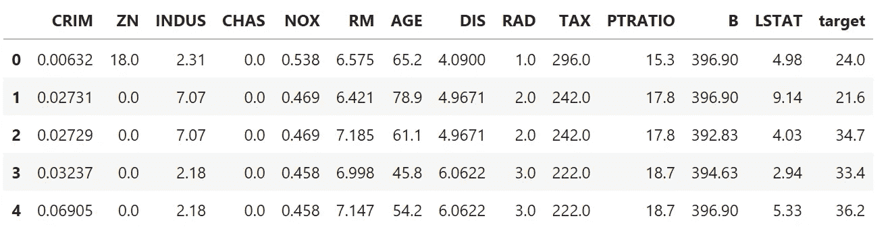
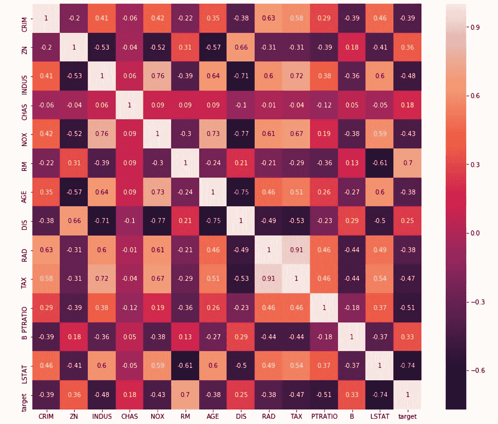
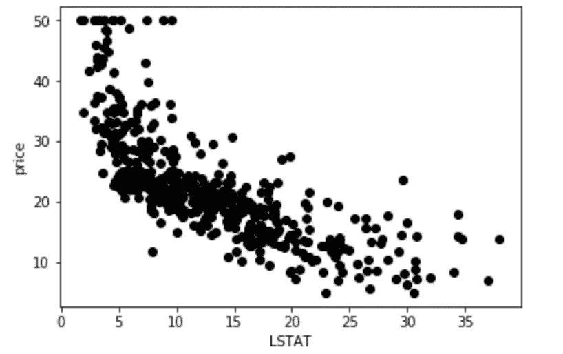
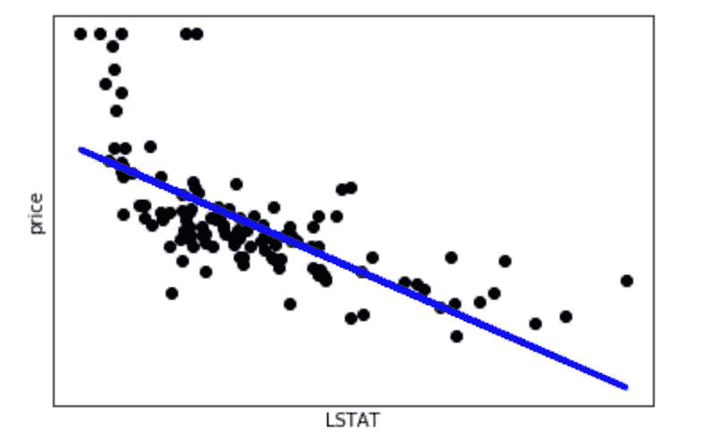
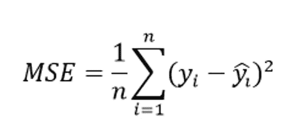
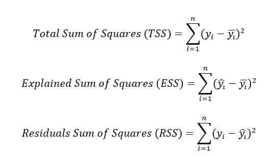
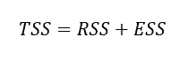
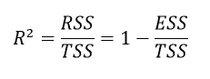
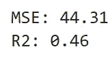
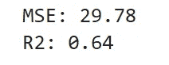

# 用 Python 实现简单的线性回归

> 原文：<https://medium.datadriveninvestor.com/simple-linear-regression-with-python-1b028386e5cd?source=collection_archive---------2----------------------->


在我之前的[文章](https://towardsdatascience.com/understanding-the-ols-method-for-simple-linear-regression-e0a4e8f692cc)中，我谈到了简单线性回归作为预测连续目标值的统计模型。我还展示了算法用来计算回归系数α和β的优化策略。

在这里，我将对我一直在谈论的内容提供一个实用的解释，我将通过使用 Python 和它的一个可用数据集来做到这一点。出于这个目的，由于这是一个回归任务，我将使用波士顿房价数据集(你可以在 UCI ML [这里](https://archive.ics.uci.edu/ml/machine-learning-databases/housing/)看到副本)。它包含了 14 个变量:1000 美元的自住房屋的中值(第 14 个变量)是我们要预测的目标(也就是房子的价格)，而剩下的 13 个变量将是我们的预测因子或特征或自变量。

[](https://www.datadriveninvestor.com/2019/02/08/machine-learning-in-finance/) [## 金融中的机器学习|数据驱动的投资者

### 在我们讲述一些机器学习金融应用之前，我们先来了解一下什么是机器学习。机器…

www.datadriveninvestor.com](https://www.datadriveninvestor.com/2019/02/08/machine-learning-in-finance/) 

让我们先来看看我们的数据集:

```
import pandas as pd
from sklearn import datasetsboston=datasets.load_boston()  
boston_df=pd.DataFrame(boston.data, columns=boston.feature_names)  
boston_df['target']=boston.target  
boston_df.head()
```



为了清楚起见，我在这里附上每个特性的含义(你可以在[官方文档](https://scikit-learn.org/stable/datasets/index.html#boston-house-prices-dataset)的 *scikit-learn* 中找到这个和更多信息):

*   按城镇分列的人均犯罪率
*   ZN 面积超过 25，000 平方英尺的住宅用地比例
*   每个城镇非零售商业英亩数的比例
*   CHAS Charles River 虚拟变量(= 1，如果区域边界为河流；否则为 0)
*   氮氧化物浓度(百万分之一)
*   RM 每个住宅的平均房间数
*   1940 年以前建造的自有住房的年龄比例
*   到五个波士顿就业中心的 DIS 加权距离
*   放射状公路可达性指数
*   每 10，000 美元征收全价值财产税
*   按城镇分列的师生比例
*   B 1000(Bk — 0.63)，其中 Bk 是按城镇划分的黑人比例
*   LSTAT %较低的人口地位
*   以千美元为单位的 MEDV 自有住房中值

由于我们要解释简单的线性回归，我们将只使用其中一个特征，这样我们就可以在 2D 图中直观地显示我们的结果。但是，我们如何确定哪个特征包含的信息量最大呢？

一种可能的方法是主成分分析(你可以在这里阅读更多关于这种技术的内容)，它创建新的变量(作为原始变量的组合)，以便第一个变量包含尽可能多的信息。

然而，这里我将使用一个原始变量，但我想选择最有代表性的一个。因此，我将检查每个特征和目标之间的相关性，然后选择相关性最高的特征:

```
import seaborn as sns
import matplotlib.pyplot as plt
correlation_matrix = boston_df.corr().round(2)
plt.figure(figsize=(14, 12))  
sns.heatmap(data=correlation_matrix, annot=True)
```



嗯，好像主要影响价格的特征是 LSTAT(人口中较低地位的百分比)，皮尔逊系数为-0.74。

让我们形象地描述这种关系:

```
plt.scatter(boston_df['LSTAT'], boston_df['target'], color='black')
plt.xlabel('LSTAT')  
plt.ylabel('price')
```



正如你所看到的，在特征和目标之间有一个明显的负相关。

现在是时候训练我们的模型了。为此，我们将使用嵌入在 Python 中的 ML 库。请记住，该模型所遵循的优化过程将与统计简单线性回归相同，即普通最小二乘法。

```
from sklearn.model_selection import train_test_split  
X_train, X_test, y_train, y_test = train_test_split(boston_df[['LSTAT']], boston_df['target'], random_state=0)from sklearn.linear_model import LinearRegression  
lm = LinearRegression()  
lm.fit(X_train,y_train)  
y_pred = lm.predict(X_test)
```

我们可以用图形显示我们的结果:

```
plt.scatter(X_test, y_test,  color='black')  
plt.plot(X_test, y_pred, color='blue', linewidth=3)  
plt.xticks(())  
plt.yticks(())  
plt.xlabel('LSTAT')  
plt.ylabel('price')   
plt.show()
```



现在是时候评估我们算法的性能了。为此，我们将使用均方误差评估指标，其定义如下:



基本上，它计算模型边界(即上面绘制的蓝色直线)和每个数据点之间的距离，然后将其提升到 2 的幂(这样负误差就不会被正误差补偿，反之亦然)。

此外，我们还将计算 R 平方度量:它提供了一组预测对实际值的拟合优度的指示。在统计文献中，这个度量被称为决定系数。

这是一个介于 0 和 1 之间的值，分别表示不适合和完全适合。它显示了从自变量中可预测的因变量方差的比例。

如果我们考虑以下值:



并且知道下面的关系是真实的:



我们可以计算 R 的平方，如下所示:



让我们来计算这两个指标:

```
from sklearn.metrics import mean_squared_error, r2_score  
print("MSE: {:.2f}".format(mean_squared_error(y_test, y_pred)))  
print("R2: {:.2f}".format(r2_score(y_test, y_pred)))
```



由于我们计算系数的方式，我们知道 MSE 已经被最小化。此外，R 平方系数也不是那么糟糕:它告诉我们，我们的模型解释了几乎一半的总方差(知道我们只考虑 13 个特征中的一个，这是令人惊讶的好。此外，请记住，在真实场景中，很难找到 R 平方高于 50%的模型)。

正如您所看到的，我们用线性回归来近似一个特性和我们的目标之间的关系，尽管这是最简单的回归模型，但还是给出了一个不错的结果。

为了完整起见，我在这里附上我们任务的多元线性回归版本，其中我将考虑我们问题的所有 13 个特征:

```
X_train, X_test, y_train, y_test= train_test_split(boston_df[['CRIM','ZN','INDUS','CHAS','NOX','RM','AGE', 'DIS','RAD','TAX','PTRATIO','B','LSTAT']], boston_df['target'],random_state=0)  
from sklearn.linear_model import LinearRegression  
lm = LinearRegression()  
lm.fit(X_train,y_train)  
y_pred = lm.predict(X_test) #let's evaluate our resultsfrom sklearn.metrics import mean_squared_error, r2_score  
print("MSE: {:.2f}".format(mean_squared_error(y_test, y_pred)))  
print("R2: {:.2f}".format(r2_score(y_test, y_pred)))
```



如您所见，通过多元线性回归，我们提高了 MSE 和 R 平方。然而，请记住，使您的模型过于复杂(这意味着，用太多的变量构建它)可能会适得其反，导致过度拟合:因此，必须在预测的简单性和准确性之间找到良好的平衡。