# 改进营销策略的简单机器学习技术:揭开提升模型的神秘面纱

> 原文：<https://medium.datadriveninvestor.com/simple-machine-learning-techniques-to-improve-your-marketing-strategy-demystifying-uplift-models-dc4fb3f927a2?source=collection_archive---------0----------------------->

*在本文中，我们将展示如何使用简单的提升模型来大幅改善您的目标营销策略*


你最近有没有收到一个你从未尝试过的新洗衣液品牌的折扣券？或者，在浏览了 H&M 的最新秋装系列后，你是否注意到你的脸书页面上出现了更多的服装广告？如果你对这些问题中的任何一个回答是肯定的，你很可能是一个有针对性的营销活动的接收者。

你可能想知道这些营销活动如何确定合适的个人发送折扣券或个性化广告？当然，开展这些活动是有成本的，给全国每个人发优惠券是不可行的。打印这些优惠券的成本以及由于提供折扣而造成的潜在收入损失可能会超过新客户带来的额外收入。

此外，如果顾客在收到优惠券之前就已经计划购买新的洗衣液，那该怎么办？在这种情况下，零售商将产生更少的利润，因为消费者将支付比他或她已经打算支付的少。

那么，你如何识别那些只有在收到你的促销优惠券后才可能购买你的产品，否则就不会购买的人呢？

这个问题的解决方案是**隆起建模。**


那么什么是**隆起建模**？维基百科对其进行了精彩的描述，“**提升建模**，也称为**增量建模**、**真实提升建模**或**净建模**是一种预测建模技术，直接对治疗(如直接营销行为)对个人行为的增量影响进行建模”

换句话说，提升建模可以帮助您识别那些仅在收到折扣券或个性化广告后才会购买您产品的个人。利用这些模型可以帮助您的公司通过将广告成本保持在最低来实现利润最大化。

此外，它有助于你的公司避免失去“睡狗”客户的业务。“睡狗”是购买你的产品的人，但如果他们被包括在你的营销活动中，他们会停止这样做。

举个例子，想象一下你正在经营一家百货商店，产妇业务对你来说是一项利润丰厚的业务。您的商店可能希望预测您的哪些客户可能怀孕，以便您可以向她发送婴儿用品的促销优惠券。然而，目标客户总有可能感觉到缺乏隐私，并对你的营销活动做出负面反应。那样的话，你会失去另一个有价值的客户。

虽然提升模型确实非常有益，但它们有时很难实现。值得注意的是，最大的挑战是找到最佳方法来模拟治疗对个体反应的增量影响。谢天谢地，有一些相对简单的模型可以马上帮助你。

阐述了提升模型的好处之后，让我们来探讨一些常见的提升模型，它们可以帮助您提高营销策略的有效性。所以请保持关注！

*注:本文附带的代码可以在这里* *查看* [*。*](https://github.com/joshxinjie/Data_Scientist_Nanodegree/tree/master/starbucks_portfolio_exercise)

# 你需要什么样的数据


在我们执行任何建模之前，我们需要获取一个精确的数据集来跟踪以下特征:

1.  一个人是否接受了治疗。这些待遇可以是优惠券或邮寄广告等..
2.  一个人是否购买了产品。
3.  您认为对建模过程有益的任何其他信息。这些可以是年龄、收入、职业等..

当然，获取这些数据并不容易，但假设你有这些数据，有一些简单的提升模型，你可以用来增强你的营销策略。

*注意:提升模型也可以扩展到多个治疗组，但这是一个更复杂的场景，我们今天不讨论。*

# 例如:星巴克

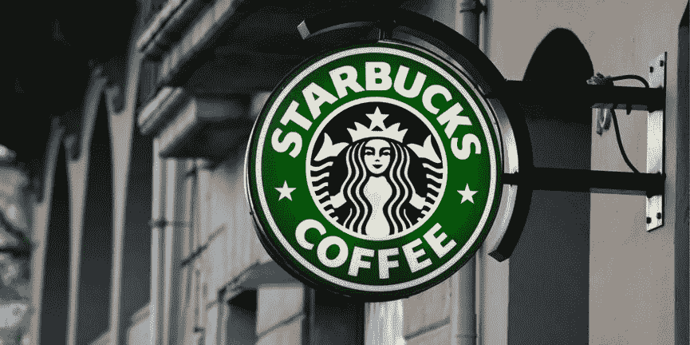

在这篇文章中，我们将使用星巴克发给求职者的旧的带回家的作业数据。这是一个相对简单的例子，但是非常适合我们的目的。

这个数据集涉及一个促销活动的实验。作为实验的一部分，一些顾客被给予促销来吸引他们购买产品。每个产品的购买价格为 10 美元，每次促销的成本为 0.15 美元。理想情况下，最好将促销仅限于最容易接受促销的人。

任何接受促销的客户将被归类为属于该治疗组。请注意，术语“治疗”和“实验”经常互换使用。

被称为控制组的第二组顾客没有得到促销。在两组中，数据集还追踪了顾客最终是否购买了该产品。

此外，还提供了与每个数据点相关的另外七个未命名特征，V1 … V7。

这个数据集中总共有 120，000 个数据点。尽管单个个体可能由多个数据点表示，但为了简单起见，让我们假设每个数据点表示单个个体。

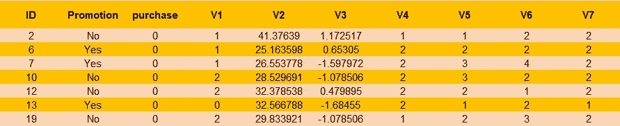

A small sample of the dataset

大约 2/3 的数据将被分配用于训练，其余的将被留出用于测试模型。

对于这个例子，需要注意的一件重要事情是，这些类是高度不平衡的。没有购买的数据点的数量比有购买的数据点的数量高大约 80 倍。因此，你需要运用技巧来处理这种不平衡。如果你选择不这样做，机器学习模型很可能会预测每个人都不会购买。

如果你喜欢阅读这些技术，这里有一些很棒的文章: [*处理不平衡数据的 7 种技术*](https://www.kdnuggets.com/2017/06/7-techniques-handle-imbalanced-data.html) 和[*SMOTE 为 noobs 解释——逐行合成少数过采样技术*](http://rikunert.com/SMOTE_explained) 。

为了简单起见，我们将使用 SMOTE 对训练数据中的少数类进行上采样。这将导致每个类别的数据点数量相等。理想情况下，应该只对训练数据执行上采样，因为最好让验证数据模拟测试数据。在现实世界中，很可能只有少数被研究的人会真正购买。

SMOTE 允许我们创建新的观测值，其特征值与原始观测值略有不同。这通常是比仅重新采样原始数据更好的方法，这将创建太多重复的数据点，并导致机器学习模型中的过拟合。如果你对 SMOTE 是如何工作的感兴趣，这篇[文章](http://rikunert.com/SMOTE_explained)精彩地描述了它。

*注意:如果您有兴趣了解该数据集的来源，它是由 Udacity 作为其数据科学家 Nanodegree 的一部分提供的。数据集也可以在我的* [*GitHub 资源库、*](https://github.com/joshxinjie/Data_Scientist_Nanodegree/tree/master/starbucks_portfolio_exercise) *中找到，所以放心尝试吧！*

# 优化指标

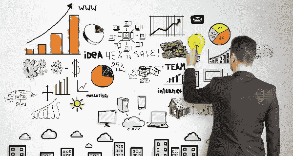

我们将使用 2 个关键指标来跟踪我们模型的性能:

**增量响应率(IRR):**

*   IRR 衡量的是与没有得到促销相比，有多少更多的客户购买了有促销的产品。
*   数学上就是促销组购买人数占购买人数组客户总数的比例(*处理*)减去非促销组购买人数占非促销组客户总数的比例(*控制*)。

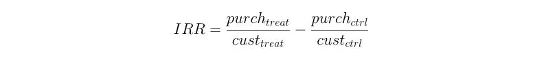

**净增量收入(NIR):**

*   NIR 通过发送促销信息来衡量盈利(或亏损)的多少。
*   从数学上来说，这是收到促销的购买者总数的 10 倍减去发出的促销的数量的 0.15 倍，再减去没有得到促销的购买者数量的 10 倍。

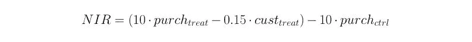

为了证明简单地向每个人发送促销信息不是一个可行的策略，让我们在 Starbuck 的数据集上测试这种方法，并使用结果分数作为我们的基线模型。事实证明，采用这样的策略将产生 0.96%的 IRR，但 NIR 为-1，132.20 美元！现在，这是糟糕的营销！

对于这个任务，星巴克声称有一个模型实现了 1.88%的 IRR 和 189.45 美元的 NLR(尽管这个任务已经过时，很可能星巴克现在会有一个更好的模型)。这些数字将作为要达到的基准，所以不再多说，让我们开始建模吧！

# 模式 1:传统方法

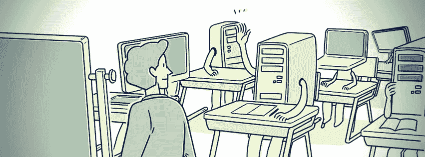

提升建模的传统方法是仅在治疗组(在我们的例子中，那些获得提升的人)上训练预测模型。该模型将把那些可能响应(购买产品)的人与那些不太可能响应(没有购买产品)的人分开。

因为只有被治疗的顾客会被建模，这种方法似乎避开了潜在有用的数据。毕竟，我们并没有为对照组(那些没有得到提升的人)收集数据，只是为了在建模阶段将他们抛在一边。

因此，让我们稍微修改一下这种方法。我们将在整个数据集上训练模型，但保留最初的任务，即识别只有在获得促销后才会购买的客户。

我们可以这样做，将标签 1 分配给收到促销并进行购买的个人，将标签 0 分配给其他所有人。很简单对吧！

下面是一个简单的方法。这可能不是最有效的方法，但它是可读的，并且符合目的。

```
# only those who made a purchase after receiving a promotion will be # assigned a label of 1, while the other individuals will be given a # label of 0response = []for index, row in train_data.iterrows():
    if (row['purchase'] == 1) and (row['Promotion']=='Yes'):
        response.append(1.0)
    else:
        response.append(0.0)

train_data['response'] = response
```

接下来，我们将从原始训练数据集创建一个验证数据集。提醒一下，新的训练数据集不应该包含验证数据中的任何数据。您可以使用验证数据集通过参数网格搜索来微调您的模型，这是一个称为交叉验证的概念。

如前所述，我们将仅对训练数据进行上采样，而不是对验证和测试数据集进行上采样。这将有助于平衡每个类别的数据点数量。

```
# up sample only the train dataset with SMOTEsm = SMOTE(random_state=42, ratio = 1.0)
X_train_upsamp, Y_train_upsamp = sm.fit_sample(X_train, Y_train)

X_train_upsamp = pd.DataFrame(X_train_upsamp, columns=features)Y_train_upsamp = pd.Series(Y_train_upsamp)
```

现在，我们准备将数据输入到机器学习模型中。这个例子使用的模型是 XGBoost 分类器，这是一个相对流行的模型，经常在机器学习竞赛中使用。当然，你也应该尝试其他的机器学习模型，看看哪个最合适。

万一，你想知道，该模型的功能是未命名的 V1，V2，…，V7 功能。

```
# X_train_upsamp contains features V1, ... , V7
# Y_train_upsamp are the labelseval_set = [(X_train_upsamp, Y_train_upsamp), (X_valid, Y_valid)]model = xgb.XGBClassifier(learning_rate = 0.1,\
                          max_depth = 7,\
                          min_child_weight = 5,\
                          objective = 'binary:logistic',\
                          seed = 42,\
                          gamma = 0.1,\
                          silent = True)model.fit(X_train_upsamp, Y_train_upsamp, eval_set=eval_set,\
          eval_metric="auc", verbose=True, early_stopping_rounds=30)
```

那么，我们如何预测一个新人是否应该获得晋升呢？

如果模型预测该人的标签为 1，那么该人很可能会对促销活动做出积极回应，我们应该给他/她发送促销信息。否则，我们不应该发送促销。

这个简单模型的结果是显著的！该模型在测试数据上实现了 2.19%的 IRR 和 332.70 美元的 NIR。这些数字实际上超过了星巴克的模型(内部收益率为 1.88%，近红外光谱为 189.45 美元)。我们永远不应该低估简单模型的能力。

所获得的结果作为一个完美的例子，说明了与启发式方法相比，如何在您的营销策略中应用提升模型，无论它可能多么简单，都可以极大地提高您的底线。

*注:本文附带的代码可以在这里* *查看* [*。*](https://github.com/joshxinjie/Data_Scientist_Nanodegree/tree/master/starbucks_portfolio_exercise)

# 模型#2:两种模型方法

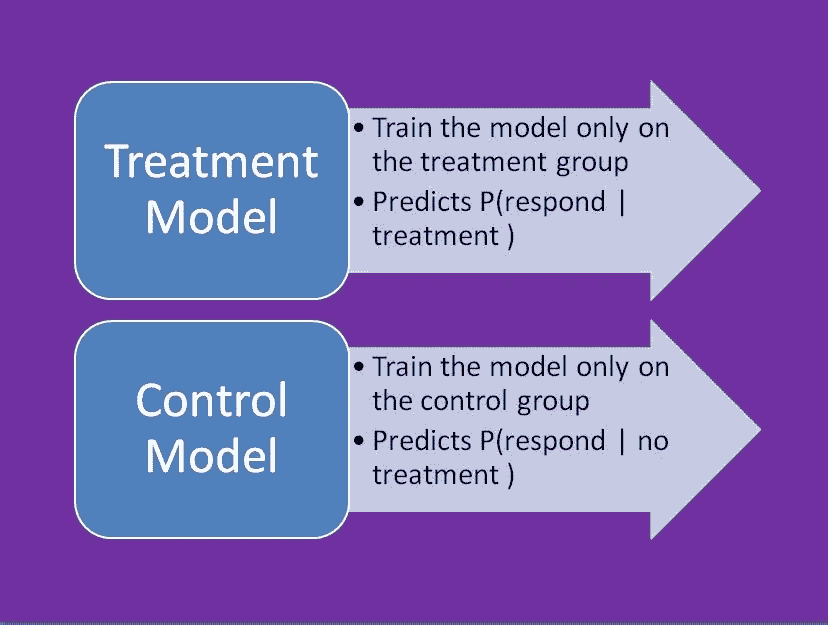

Steps taken during the training process

两种模型方法通常在隆起建模文献中描述。这是一种简单而直观的方法。训练两个独立的模型:控制模型和处理模型。

仅在控制数据(未接受促销的个体)上训练的控制模型将预测个体在没有治疗影响的情况下(未接受促销)进行购买的可能性。

仅根据治疗数据(接受促销的个人)训练的治疗模型将预测个人在治疗的影响下(接受促销)进行购买的可能性。

理想情况下，两个模型预测概率的差异将表明发送促销信息是否会增加个人购买的可能性。我们将这种概率差异称为抬升，这是抬升建模文献中常见的术语。

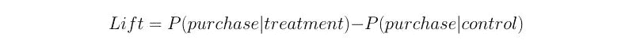

然后，我们可以通过网格搜索或手动选择来选择提升值的截止百分比，以确定我们应该向哪些人发送促销。例如，我们可以选择只将促销信息发送给 lift 值在前 5 个百分点的个人。

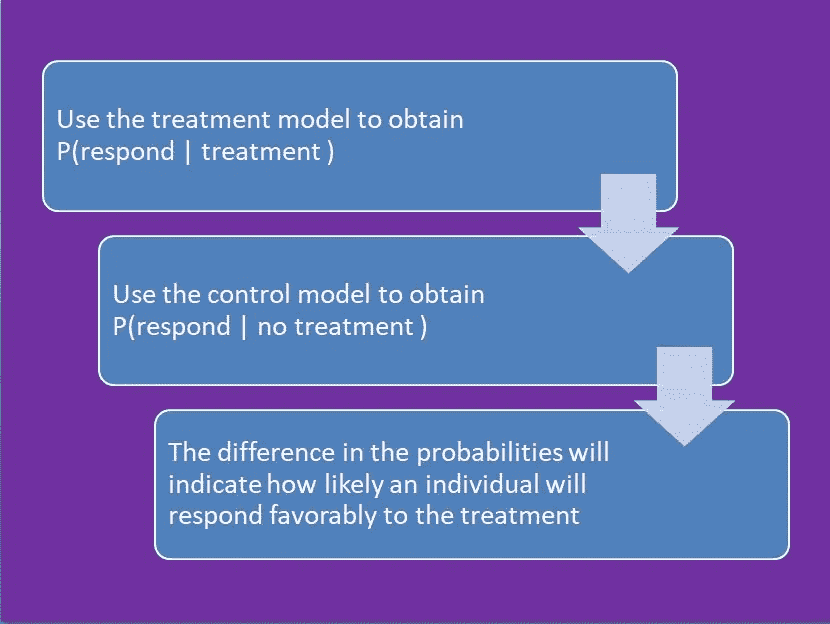

Steps taken to predict whether an individual is likely to make a purchase only after receiving a promotion

这个模型的代码相对类似于第一个模型，除了我们将在不同的数据集上训练两个模型:一个用于对照组，另一个用于治疗组。记住分别对处理和控制训练数据进行上采样，因为两组可能具有不同的特征。

使用 XGBoost 模型，这种方法在测试数据集上的性能并不显著。如果我们只向 lift 值在前 3 个百分点的个人发送促销，我们将实现 1.76%的 IRR 和 12.70 美元的 NIR。然而，这些数字远远好于如果促销活动发送给每一个客户我们会取得的成绩。如前所述，这种方法会使我们得出-1，132.20 美元的国家清单报告。

两个模型方法有一些缺点。Victor Lo 在隆起建模领域发表了大量出版物，[清楚地解决了](https://www.researchgate.net/publication/270217235_Identifying_Individuals_Who_Are_Truly_Impacted_by_Treatment_Introduction_to_Recent_Advances_in_Uplift_Modeling)这些缺点。这两种模型都是间接升力模型。虽然这两个模型可能准确地模拟了治疗组或对照组的反应概率，但这两个模型的概率差异可能无法精确地反映疗效。

这两种模型在尺度上的差异可能是造成这种现象的原因。此外，由于治疗模型和对照模型都会产生误差，因此误差量会加倍。

# 模型#3:使用具有治疗指标变量的单一模型

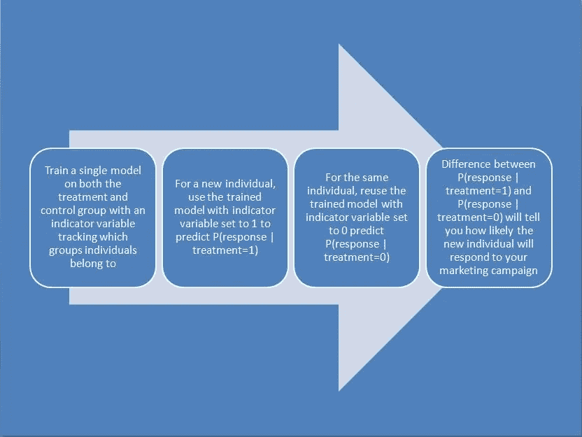

Overview of the single model approach with treatment indicator variable

为了减轻使用两个模型带来的问题，我们将回到单一模型方法。但这也带来了另一个问题。我们如何利用单一模型有效捕捉促销活动的影响？

答案很简单。为了用单一模型对治疗(获得晋升)的影响进行建模，我们可以创建一个新的指标变量来跟踪个人在培训期间是否接受了治疗。毕竟不太复杂！

对于训练集中的个人，如果个人获得晋升，则治疗指示符变量将被设置为 1，如果个人没有获得晋升，则被设置为 0。然后，XGBoost 模型在原始 V1-V7 特征和指示器变量上被训练。

那么，我们如何预测一个新人是否会对晋升做出积极的反应呢？我们是否将治疗指标变量设置为 0？还是 1？毕竟，我们的任务是预测那个人是属于治疗组(我们应该给那个人发晋升)还是对照组(我们不应该给那个人发晋升)。这个问题的答案是 0 和 1 都有。

通过将个人的治疗指标变量设置为 1，我们可以预测他或她响应促销进行购买的概率。接下来，我们应该将指标变量设置为 0，并预测他或她在没有收到促销的情况下进行购买的概率。

```
# To predict whether a new individual should receive a promotion# Fit a model with treatment = 1 for all data points
test['treatment'] = 1.0
preds_treat = model.predict_proba(test,\
		ntree_limit=model.best_ntree_limit)

# Fit a model with treatment = 0 for all data points
test['treatment'] = 0.0
preds_cont = model.predict_proba(test,\ 					ntree_limit=model.best_ntree_limit)

lift = preds_treat[:,1] - preds_cont[:,1]
```

这两个概率的差异，也称为提升值，将告诉我们，通过发送促销信息，我们可以在多大程度上提高个人的购买概率。

这种方法本质上抓住了两种模型方法的精髓，但是使用了单一模型。因此，我们可以避免比例不匹配和误差放大的问题。

使用这种方法，如果我们向测试数据集中提升值为正的每个人发送促销，我们将观察到 1.54%的 IRR 和 42.60 美元的 NIR。虽然这比 Starbuck 的模型所取得的成绩要低，但仍然代表了对双模式方法的重大改进。

与双模型方法一样，您可以选择仅向提升值高于临界值的个人发送促销信息。这可能导致 IRR 和 NIR 值的一些改进。

# 模型#4:四象限方法

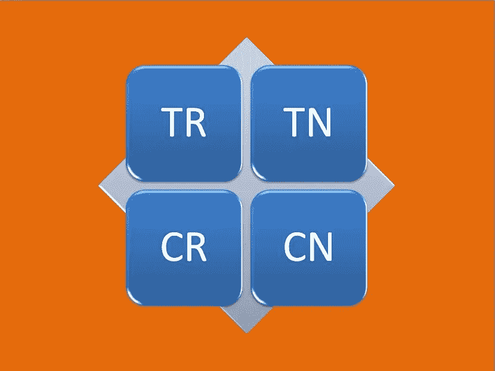

The four quadrant approach predicts the probability that an individual will belong to each of the 4 classes

这将是我们讨论的最后一种方法。不要让这个名字吓倒你。这也很简单。这种方法利用一个单一的模型来预测一个人属于 4 个类别(象限)之一的概率，因此它的名字。这些类别是:

1.  TR:治疗和反应小组。这一组中的个体接受治疗(促销)并作出反应(购买)
2.  CR:控制和反应组。这一组中的人没有接受任何治疗(没有晋升)，但仍然做出了反应(进行了购买)
3.  TN:治疗组和无反应组。这一组中的个人接受了治疗(促销)，但没有反应(没有购买)
4.  CN:对照组和无反应组。这一组中的人没有接受治疗(没有晋升)，也没有反应(没有购买)

换句话说，这只是一个有四个类的多类分类模型。幸运的是，XGBoost 可以开箱即用地处理多类分类，因此只需要对代码做相对较少的修改。可以处理多个类别的其他分类模型也足够了。

这种方法的唯一问题是，我们需要将训练数据分成适当的组，并分配正确的标签。下面显示了一种为 XGBoost 模型生成标签的方法。

```
target = []
for index, row in train_data.iterrows():
    if (row['Promotion'] == "Yes") & (row['purchase'] == 1):
        # TR group
        target.append(0)
    elif (row['Promotion'] == "No") & (row['purchase'] == 1):
        # CR group
        target.append(1)
    elif (row['Promotion'] == "Yes") & (row['purchase'] == 0):
        # TN group
        target.append(2)
    else: #CN group
        target.append(3)train_data['target'] = target
```

该过程的其余部分与先前的方法相对类似。

接下来，让我们讨论如何进行预测。如果模型预测某个人属于 TR 类，那么他或她很可能会对促销做出有利的反应，我们应该向该个人发送促销信息。如果预测的是其他类，就不要发晋级了。

这种方法产生了 1.55%的内部收益率，但国家报告是 5.90 美元。虽然这些数字是 4 种方法中最低的，但仍然比我们的基线方法有所改进。由于 Starbucks 的数据集绝不是所有真实世界数据的代表，您仍然应该在其他数据集上尝试这个模型。也许，它可能会产生更有利的结果。

# 结论


到目前为止，我们已经看到了如何使用提升建模来更好地识别对您的营销活动做出积极响应的个人。有了这些模型，你可以降低营销成本，提高营销活动的价值。

重复一下，我们已经在本文中介绍了这些提升模型:

1.  传统提升方法
2.  双模型方法
3.  具有治疗指标变量的单一模型
4.  四象限法

您应该尝试所有这些方法，看看哪种方法最适合您的需求。这里给出的提升模型列表绝不是确定的，还有许多其他方法。如果你有兴趣，可以在这里找到该题目的一些附加阅读材料:[链接 1](http://stochasticsolutions.com/papers.html) 、[链接 2](https://medium.com/@abhayspawar/uplift-models-for-better-marketing-campaigns-part-1-b491292e4c80) 、[链接 3](https://medium.com/touchpoints-ai/uplift-modelling-is-hard-but-worth-it-37a9e9dc5015) 。

对于本文，既没有进行特性选择，也没有进行特性工程。此外，很少强调微调机器学习模型的选择，因为我们希望标准化模型，以更好地比较不同的方法。这些抬升模型的性能当然有可能通过纳入这些步骤而得到改善。

真实世界的数据也可能比这里给出的例子复杂得多。可能存在不完整的数据、多个治疗组、不稳定的产品价格、产品退货案例等..所有这些都需要修改建模过程。

提升建模可能相当复杂，但它们可以为您的业务带来巨大的价值。幸运的是，有一些预先实现的库和服务可供您使用。请注意，其中一些是有偿服务。

1.  [R 的提升包](https://cran.r-project.org/web/packages/uplift/index.html)
2.  [SAS 企业矿工](https://www.sas.com/en_sg/software/enterprise-miner.html)
3.  皮特尼·鲍斯的[频谱提升](https://www.pitneybowes.com/us/customer-information-management/customer-analytics/spectrum-uplift.html)
4.  [用于 KNIME 的 DYMATRIX 隆起建模节点](https://www.knime.com/book/dymatrix-uplift-modeling-nodes-for-knime-trusted-extension)

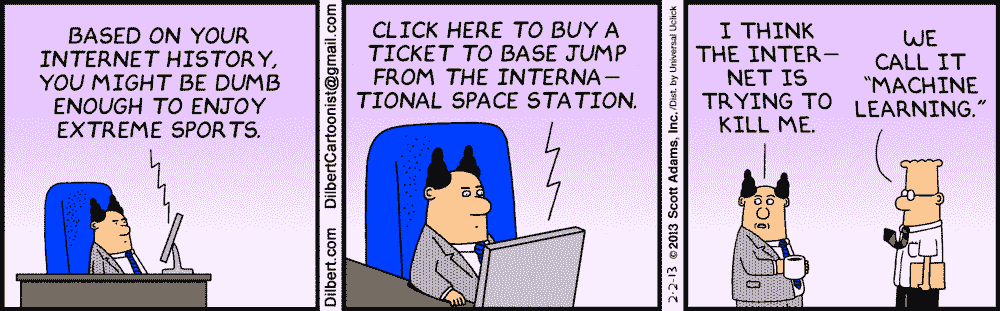

**这篇文章的代码可以在这里找到**[](https://github.com/joshxinjie/Data_Scientist_Nanodegree/tree/master/starbucks_portfolio_exercise)****。****

***谢谢！我希望你喜欢这篇文章，并学到一些新的东西。我不自称是这个主题的大师，所以如果你发现任何错误，让我知道。如果你想分享其他的提升建模方法和技巧，请在下面留言！我总是乐于学习新技术。***